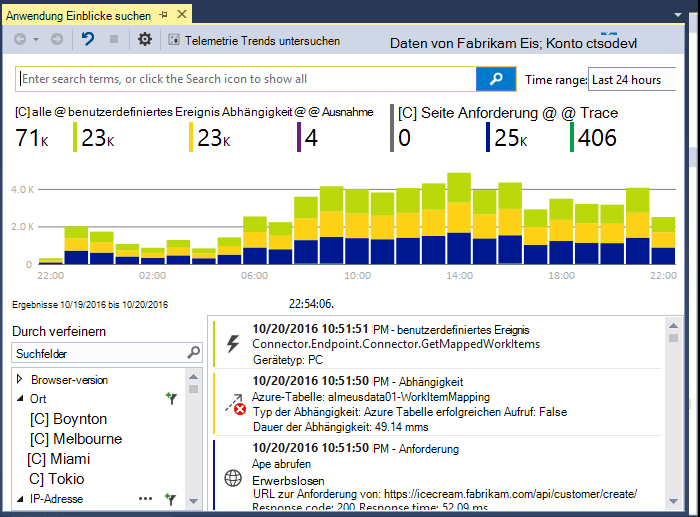
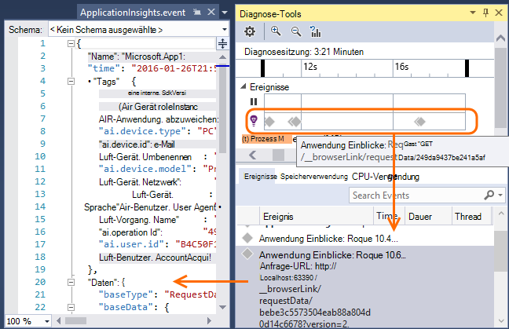
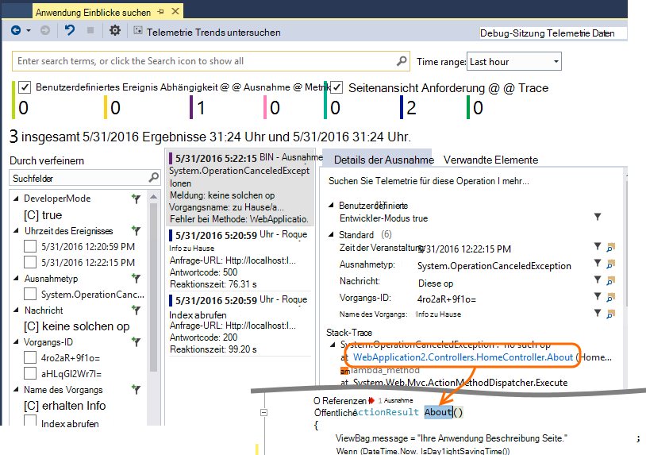
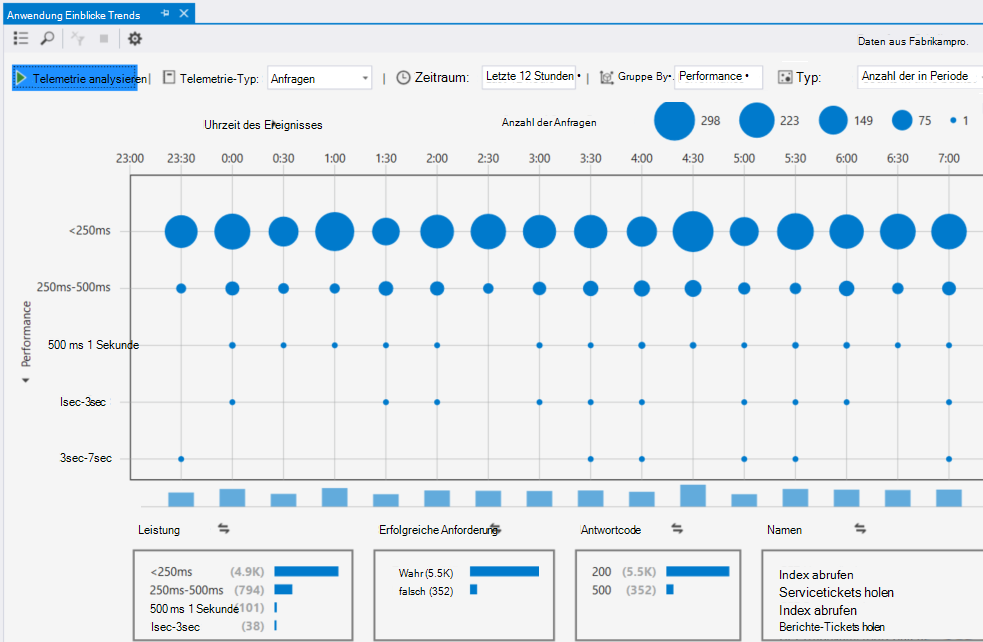

<properties 
    pageTitle="Arbeiten mit Anwendung Einblicke in Visual Studio" 
    description="Performance-Analyse und Diagnose beim Debuggen und Produktion." 
    services="application-insights" 
    documentationCenter=".net"
    authors="alancameronwills" 
    manager="douge"/>

<tags 
    ms.service="application-insights" 
    ms.workload="tbd" 
    ms.tgt_pltfrm="ibiza" 
    ms.devlang="na" 
    ms.topic="get-started-article" 
    ms.date="06/21/2016" 
    ms.author="awills"/>

# Arbeiten mit Anwendung Einblicke in Visual Studio

In Visual Studio (2015 und höher) können Analysieren der Leistung und diagnose Probleme Debuggen und in Produktion mithilfe von [Visual Studio Anwendung](app-insights-overview.md)Telemetrie.

Wenn Sie noch nicht [Installierte Anwendung Einblicke in Ihrer Anwendung](app-insights-asp-net.md), das jetzt.

## Projekt debuggen

Führen Sie die Anwendung mit F5 und ausprobieren: unterschiedliche Seiten um einige Telemetriedaten zu generieren.

In Visual Studio sehen Sie die Anzahl der Ereignisse, die protokolliert wurden.

Klicken Sie hier um Diagnose suchen zu öffnen. 

## Diagnose suchen

Das Suchfenster zeigt Ereignisse, die protokolliert wurden. (Wenn Sie in Azure Anwendung Einblicke einrichten angemeldet, können die gleichen Ereignisse im Portal werden Sie.)

Die Freitextsuche kann auf alle Felder der Ereignisse. Suchen Sie beispielsweise Teil der URL der Seite; oder den Wert einer Eigenschaft z.B. Client; oder bestimmte Wörter eines Protokolls.

Klicken Sie auf ein Ereignis um detaillierten Eigenschaften anzuzeigen.

Sie können auch die Registerkarte verwandte Elemente, um Diagnose von fehlgeschlagenen Anfragen oder Ausnahmen öffnen.

## Diagnose-hub

Diagnose-Hub (Visual Studio 2015 oder später) zeigt Telemetrie Server Application Insights generiert wird. Dies funktioniert auch dann, wenn Sie sich, nur das SDK installieren entschieden, ohne eine Verbindung mit einer Ressource im Azure-Portal.

## Ausnahmen

Wenn Sie [ausnahmeüberwachung eingerichtet](app-insights-asp-net-exceptions.md)haben, werden ausnahmeberichte im Suchfenster angezeigt. 

Klicken Sie auf eine Ausnahme zu einem Stack Trace. Wenn der Code der Anwendung in Visual Studio geöffnet ist, können Sie durch von Stapelrahmen entsprechenden Codezeile klicken.

Darüber hinaus wird in der Zeile Code objektiv über jede Methode Anzahl von Anwendung Einblicke in den letzten 24 Stunden protokolliert Ausnahmen angezeigt.

## Lokale Überwachung

(Von Visual Studio 2015 Update 2) Wenn Sie das SDK Telemetrie an Application Insights-Portal senden (deshalb keine instrumentationsschlüssel in ApplicationInsights.config) konfiguriert haben zeigt das Diagnosefenster Telemetriedaten aus der aktuellen Debugsitzung. 

Dies empfiehlt sich, wenn bereits eine frühere Version Ihrer Anwendung veröffentlicht haben. Nicht Telemetriedaten aus Ihrem Debugsitzungen mit Telemetrie Anwendung Insights-Portal aus der veröffentlichten Anwendung gemischt werden sollen.

Es ist auch nützlich, haben Sie einige [benutzerdefinierte Telemetrie](app-insights-api-custom-events-metrics.md) , die zu debuggende bevor Telemetrie an das Portal.

* *Zuerst konfiguriert ich vollständig Anwendung Einblicke Telemetrie zum Portal senden. Aber ich möchte jetzt Telemetrie in Visual Studio.*

 * In das Suchfenster Einstellungen ist eine Option zum lokalen Diagnose suchen, auch wenn Ihre app Telemetrie Portal sendet.
 * Stoppen Sie Telemetrie an das Portal kommentieren Sie die Zeile `<instrumentationkey>...` von ApplicationInsights.config. Wenn Sie das Portal Telemetrie erneut senden möchten, kommentieren Sie es aus.

## Trends

Trends ist ein Tool für das Verhalten Ihrer Anwendung mit der Zeit darstellen. 

Wählen Sie Application Insights Symbolleistenschaltfläche oder Anwendung Einblicke Suchfenster **Telemetrie Trends untersuchen** . Wählen Sie eine der fünf allgemeine Abfragen zu beginnen. Sie können unterschiedlichen Datasets anhand von Telemetriedaten Typen, Zeiträume und andere Eigenschaften analysieren. 

Um Anomalien in den Daten zu suchen, wählen Sie eine Anomalie Optionen unter "Ansichtstyp" Dropdown. Filteroptionen am unteren Fensterrand erleichtern die bestimmte Teilmengen der Telemetrie weiter.

[Weitere Informationen über Trends](app-insights-visual-studio-trends.md).

## Was kommt als nächstes?

||
|---|---
|**[Weitere Daten hinzufügen](app-insights-asp-net-more.md)** Verwendung Verfügbarkeit abhängig, Ausnahmen zu überwachen. Integrieren Sie Spuren von Protokollierung Frameworks. Schreiben Sie benutzerdefinierter Telemetrie. | 
|**[Arbeiten mit Application Insights-portal](app-insights-dashboards.md)** Exportieren von Dashboards, Diagnose- und analytische Werkzeuge, Alarme live Abhängigkeit Übersicht Ihrer Anwendung und Telemetrie. |

 
