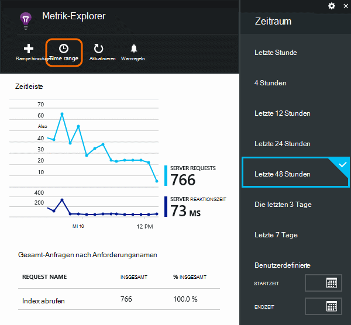
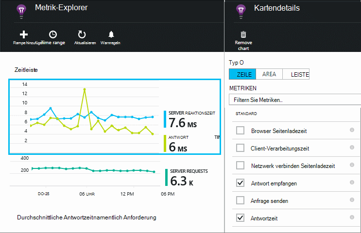
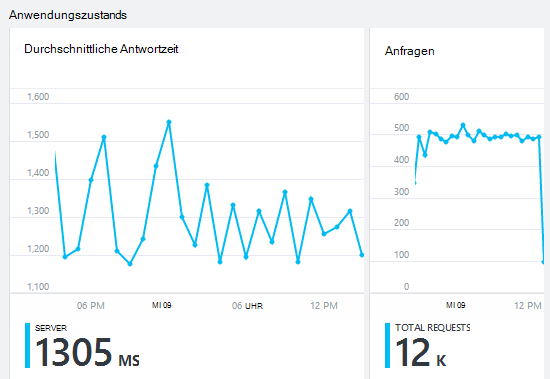
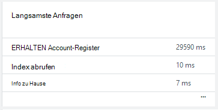
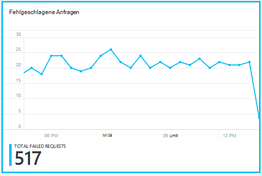
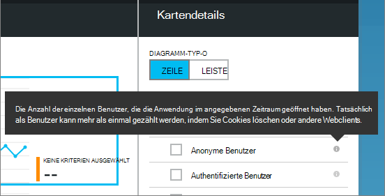
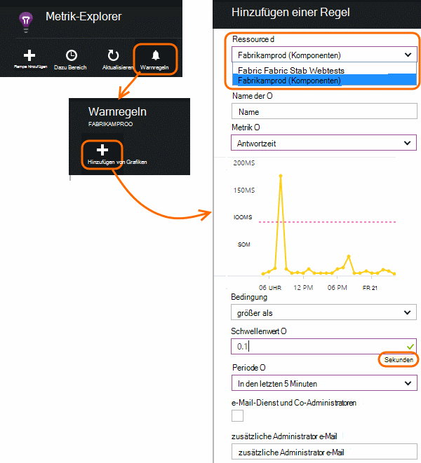

<properties 
    pageTitle="Überwachung des Zustands und Anwendung Einblicke mit Ihrer Anwendung" 
    description="Erste Schritte mit Application Insights. Analysieren Sie Auslastung, Verfügbarkeit und Leistung Ihres lokalen oder Microsoft Azure Applications." 
    services="application-insights" 
    documentationCenter=""
    authors="alancameronwills" 
    manager="douge"/>

<tags 
    ms.service="application-insights" 
    ms.workload="tbd" 
    ms.tgt_pltfrm="ibiza" 
    ms.devlang="na" 
    ms.topic="article" 
    ms.date="11/25/2015" 
    ms.author="awills"/>
 
# Überwachen der Leistung in ASP.NET-Webanwendungen

*Anwendung Informationen ist in der Vorschau.*

Stellen Sie sicher, dass die Anwendung ordnungsgemäß arbeitet und herausfinden Sie schnell, zu Fehlern. [Application Insights] [ start] informieren Sie über alle Performance-Probleme und Ausnahmen, und suchen und Analysieren der Hauptursachen.

Anwendung Einblicke können überwachen, Java und ASP.NET Web Applications Services und WCF-Dienste. Sie kann lokal gehostet, auf virtuellen Computern und Microsoft Azure Websites. 

Auf der Clientseite nehmen Application Insights Telemetriedaten aus Webseiten und eine Vielzahl von Geräten einschließlich iOS, Android und Windows Store-apps.

## Überwachung einrichten

Wenn Sie noch Anwendung Erkenntnisse zu Ihrem Projekt hinzugefügt haben (wenn ApplicationInsights.config ist), wählen Sie folgendermaßen beginnen:

* [ASP.NET webapps](app-insights-asp-net.md)
 * [Überwachen der Ausnahme hinzufügen](app-insights-asp-net-exceptions.md)
 * [Überwachen der Abhängigkeit hinzufügen](app-insights-monitor-performance-live-website-now.md)
* [J2EE webapps](app-insights-java-get-started.md)
 * [Überwachen der Abhängigkeit hinzufügen](app-insights-java-agent.md)

## Leistungsindikatoren durchsuchen

Suchen Sie in [Azure-Portal](https://portal.azure.com)Application Insights-Ressource, die für die Anwendung eingerichtet. Übersicht über Blade zeigt grundlegende Leistungsdaten:

Klicken Sie auf Diagramme Weitere Details und Ergebnisse für einen längeren Zeitraum anzuzeigen. Klicken Sie fordert beispielsweise und dann einen Zeitraum:

Klicken Sie auf ein Diagramm zum Auswählen der Kriterien angezeigt wird, oder ein neues Diagramm hinzufügen und wählen Sie die:

> [AZURE.NOTE] **Deaktivieren Sie alle Vorgaben** die vollständige Auswahl anzeigen verfügbar. Die Metriken fallen in Gruppen; Wenn alle Mitglieder einer Gruppe ausgewählt ist, werden die anderen Mitglieder der Gruppe angezeigt.

## Was bedeutet das alles? Leistung Kacheln und Berichte

Es gibt eine Vielzahl von Leistungsindikatoren erhalten Sie. Beginnen wir mit den standardmäßig auf der Anwendung angezeigt.

### Anfragen

Die Anzahl der HTTP-Anfragen innerhalb eines bestimmten Zeitraums. Vergleichen Sie dies mit den Ergebnissen auf andere Berichte Verhalten Ihrer Anwendung die Auslastung variiert.

HTTP-Anfragen enthalten alle GET oder POST-Anfragen für Seiten, Daten und Bilder.

Klicken Sie auf die Kachel für bestimmte URLs zu Zahlen.

### Durchschnittliche Antwortzeit

Misst die Zeit zwischen einer Web-Anforderung in der Anwendung und der Antwort.

Punkte anzeigen einen gleitenden Durchschnitt Wenn viele Anfragen sind möglicherweise einige, die durchschnittliche ohne eine offensichtliche Spitze abweichen oder Übergang im Diagramm.

Außergewöhnliche Spitzen suchen. Im Allgemeinen erwarten Sie Antwortzeit mit Anfragen zu. Wenn die unverhältnismäßig ist, kann Ihre app treffen eine Ressourcengrenze CPU oder die Kapazität eines Dienstes verwendet.

Klicken Sie auf die Kachel zu Zeiten für bestimmte URLs.

### Langsamste Anfragen

Zeigt die Anfragen Leistungstuning benötigen.

### Fehlgeschlagene Anfragen

Anzahl der Anfragen, die nicht abgefangene Ausnahmen ausgelöst hat.

Klicken Sie zum Anzeigen von bestimmten Fehlern, und wählen Sie eine einzelne Anforderung, um dessen Details anzuzeigen. 

Eine repräsentative Stichprobe von Fehlern bleibt für einzelne Überprüfung.

### Andere

Legen welche Metriken anzuzeigen, klicken Sie auf ein Diagramm und deaktivieren Sie alle Vorgaben der vollständiges verfügbar. Klicken Sie (i) jede Metrik Definition.

Auswählen einer Metrik deaktiviert der anderen, die in demselben Diagramm erscheinen können.

## Alarme

Um per ungewöhnliche Werte einer Metrik benachrichtigt werden, fügen Sie eine Warnung. Sie können entweder das e-Mail Konto-Administratoren oder bestimmte e-Mail-Adresse.

Legen Sie die Ressource vor anderen Eigenschaften. Wählen Sie keine Ressourcen Webtest Alerts für Leistung oder Nutzung Metriken festgelegt werden soll.

Achten Sie darauf die Einheiten, in denen Sie aufgefordert werden, geben Sie den Schwellenwert.

*Warnung hinzufügen Schaltfläche wird nicht angezeigt.* -Ist dies eine Gruppe Konto auf den schreibgeschützten Zugriff haben? Konto-Administrator wenden.

## Diagnose von Problemen

Hier sind einige Tipps zum Suchen und Diagnostizieren von Leistungsproblemen:

* Einrichten von [Webtests] [ availability] benachrichtigt werden, wenn Ihre Website ausfällt oder langsam oder fehlerhaft reagiert. 
* Vergleichen Sie die Anzahl mit anderen Metriken auf Fehler oder langsam geladen zusammenhängen.
* [Einfügen und suchen Trace Statements] [ diagnostic] zu helfen, Probleme zu identifizieren.

## Nächste Schritte

[Webtests] [ availability] -Webanfragen für die Anwendung regelmäßig aus der ganzen Welt haben.

[Erfassen und Diagnose Spuren suchen] [ diagnostic] - Trace-Aufrufe einfügen und Sichten Probleme aufzeigen Ergebnisse.

[Verwendung] [ usage] -, wie Benutzer die Anwendung verwenden.

[Problembehandlung bei] [ qna] -Q & A

## Video

[AZURE.VIDEO performance-monitoring-application-insights]

<!--Link references-->

[availability]: app-insights-monitor-web-app-availability.md
[diagnostic]: app-insights-diagnostic-search.md
[greenbrown]: app-insights-asp-net.md
[qna]: app-insights-troubleshoot-faq.md
[redfield]: app-insights-monitor-performance-live-website-now.md
[start]: app-insights-overview.md
[usage]: app-insights-web-track-usage.md

 
