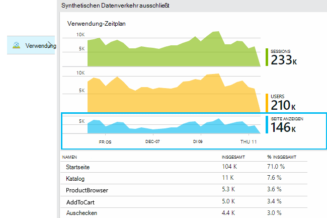
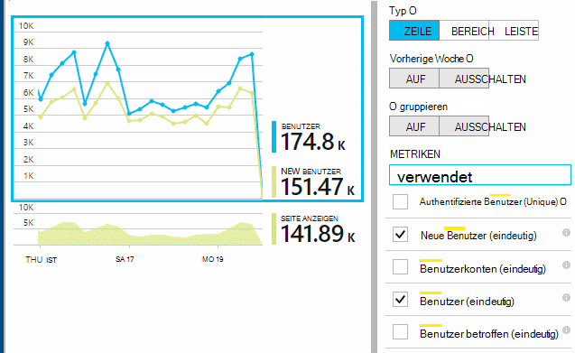
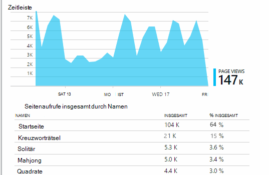
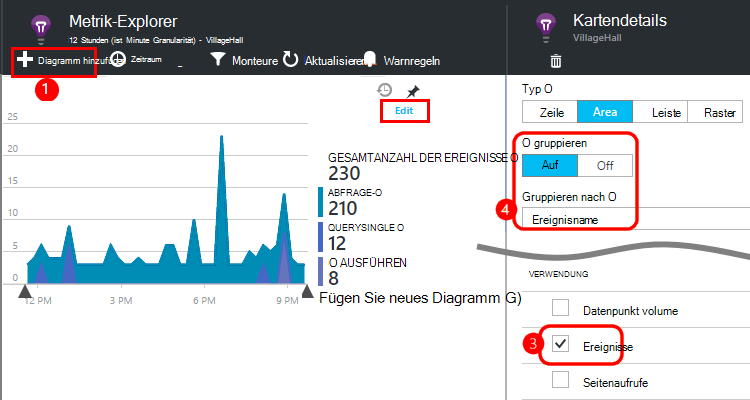
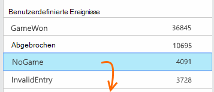
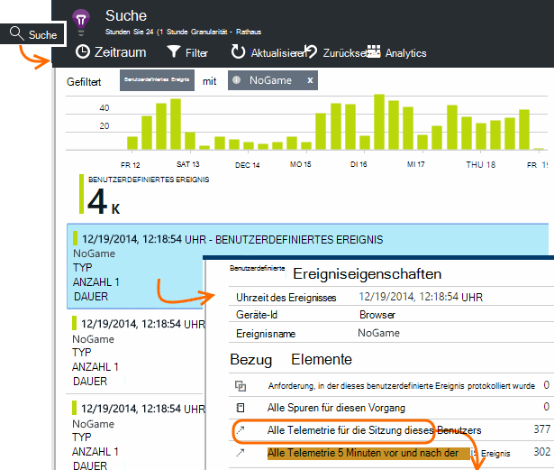
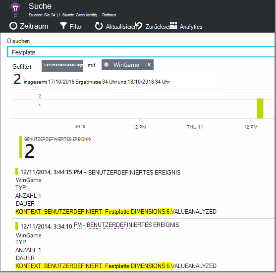

<properties 
    pageTitle="Verwendungsanalyse für ASP.NET-Webanwendungen Anwendung Einblicke" 
    description="Übersicht über Verwendungsanalysen Web Apps Anwendung Einblicke" 
    services="application-insights" 
    documentationCenter=""
    authors="alancameronwills" 
    manager="douge"/>

<tags 
    ms.service="application-insights" 
    ms.workload="tbd" 
    ms.tgt_pltfrm="ibiza" 
    ms.devlang="na" 
    ms.topic="article" 
    ms.date="06/12/2016" 
    ms.author="awills"/>
 
# <a name="usage-analysis-for-web-applications-with-application-insights"></a>Verwendungsanalyse für ASP.NET-Webanwendungen Anwendung Einblicke

Wissen, wie Menschen Ihre Anwendung können Sie die Szenarien, die für sie am wichtigsten sind Ihre Entwicklungsarbeit konzentrieren und Einblicke in die Ziele, die sie einfacher oder schwieriger zu finden. 

Visual Studio Application Insights bietet zwei Ebenen der Verwendung:

* **Benutzer und Sitzung Seite zeigen Daten** - einsatzbereiten.  
* **Benutzerdefinierte Telemetrie** - [Code schreiben] [ api] der Benutzer durch die Benutzeroberfläche Ihrer Anwendung zu verfolgen. 

## <a name="setting-up"></a>Einrichten

Öffnen Sie eine Anwendung Insights-Ressource in [Azure-Portal](https://portal.azure.com)und gehen Sie Setup auf leere Browser Seite lädt Diagramm.

[Weitere Informationen](app-insights-javascript.md) 


## <a name="how-popular-is-my-web-application"></a>Wie beliebt ist meine Webanwendung?

[Azure-Portal]anmelden[portal], wechseln Sie zu der Anwendungsressource und auf Verwendung:



* **Benutzer:** Die Anzahl der verschiedenen aktiven Benutzer über den Zeitbereich des Diagramms. 
* **Sessions:** Die Anzahl der aktiven Clientsitzungen
* **Seitenaufrufe** Zählt die Anzahl der Aufrufe von trackPageView() in der Regel einmal in jede Webseite aufgerufen.

Klicken Sie auf Diagramme, um weitere Details anzuzeigen. Beachten Sie, dass Sie den Zeitraum der Diagramme ändern können.

### <a name="where-do-my-users-live"></a>Wo Leben Benutzer?

Das Blade Verwendung klicken Sie auf Benutzerdiagramm Weitere Details:


 
### <a name="what-browsers-or-operating-systems-do-they-use"></a>Welche Browser oder Betriebssystem verwenden sie?

(Segment) Gruppendaten von einer Eigenschaft oder Browser, Betriebssystem, Stadt:


## <a name="sessions"></a>Sessions

Sitzung ist ein fundamentales Anwendung Einblicke, die versucht, alle Telemetrie - Anfragen Seitenaufrufe, Ausnahmen oder benutzerdefinierte Ereignisse, Code-mit einem bestimmten Benutzer zuordnen. 

Rich wird Kontext über jede Sitzung z. B. Geräteeigenschaften GeoLocation, Betriebssystem, und Informationen.

Wenn Client und Server Instrumentieren ([ASP.NET] [ greenbrown] oder [J2EE][java]), SDKs werden Sitzungsbezeichner zwischen Client und Server übertragen, damit Ereignisse auf beiden Seiten korreliert werden.

Beim [Diagnostizieren von Problemen][diagnostic], finden Sie alle Telemetriedaten Bezug auf die Sitzung, in der ein Problem aufgetreten ist, einschließlich aller Anfragen und Ereignisse, Ausnahmen, oder Spuren, die protokolliert wurden.

Sessions bieten ein gutes Maß für die Popularität wie Gerät, Betriebssystem oder Standort. Zeigt die Anzahl der Sessions gruppiert nach Gerät, erhalten Sie z. B. wie oft dieses Gerät mit Ihrer Anwendung als dient zählen Seitenansichten genauere Anzahl. Dies ist nützlich um gerätespezifische Probleme zu selektieren.


#### <a name="whats-a-session"></a>Was ist eine Sitzung?

Eine Sitzung stellt eine einzelne Begegnung zwischen dem Benutzer und der Anwendung. In seiner einfachsten Form Sitzung mit einem Benutzer die Anwendung starten beginnt und endet, wenn Benutzer die Anwendung verlässt. Webapps beendet wird standardmäßig die Sitzung nach 30 Minuten Inaktivität oder nach 24 Stunden. 

Zum Ändern der Standardeinstellungen den Codeausschnitt bearbeiten:

    <script type="text/javascript">
        var appInsights= ... { ... }({
            instrumentationKey: "...",
            sessionRenewalMs: 3600000,
            sessionExpirationMs: 172800000
        });

* `sessionRenewalMs`: Die Zeit in Millisekunden, die Sitzung aufgrund von Inaktivität des Benutzers abläuft. Standard: 30 Minuten.
* `sessionExpirationMs`Die maximale Sitzungsdauer in Millisekunden. Wenn danach der Benutzer aktiv, wird eine andere Sitzung gezählt. Standard: 24 Stunden.

**Dauer** ist eine [Metrik] [ metrics] , die Zeitspanne zwischen der ersten und letzten Telemetrie der Sitzung aufgezeichnet. (Es wird das Timeout enthalten.)

**Anzahl der Sitzung** in einem bestimmten Zeitintervall wird als Anzahl von eindeutigen mit Aktivitäten während dieses Intervalls definiert. Beim Betrachten der langen Zeitraum wie Anzahl der täglichen Sitzung der letzten Woche entspricht dies in der Regel die Gesamtanzahl der Sitzungen. 

Allerdings erkunden kürzere Zeiträume wie Stundenlohn Körnung wird eine lange Sitzung von mehreren Stunden für jede Stunde gezählt in der Sitzung aktiv war. 

## <a name="users-and-user-counts"></a>Benutzer und Benutzer zählt


Jede benutzersitzung ist eine eindeutige Benutzer-Id zugeordnet. 

Standardmäßig ist der Benutzer mit einem Cookie identifiziert. Benutzer, die mehrere Browser oder Geräte wird mehr als einmal gezählt. (Lesen Sie jedoch [Authentifizierte Benutzer](#authenticated-users))


Die **Benutzeranzahl** Metrik in einem bestimmten Zeitintervall die Anzahl der eindeutigen Benutzer mit aufgezeichneten Aktivitäten während dieses Intervalls bezeichnet. Daher können Benutzer lange mehrmals berücksichtigt werden, wenn Sie einen Zeitraum festlegen, sodass weniger als eine Stunde ist oder.

**Neue Benutzer** zählt die Benutzer, deren erste Sitzung mit der Anwendung in diesem Intervall aufgetreten. Wird die Standardmethode zählen Benutzer Cookies wird dann diese auch Benutzer, die ihre Cookies gelöscht haben oder ein neues Gerät oder Browser auf Ihre Anwendung zum ersten Mal verwenden.


### <a name="authenticated-users"></a>Authentifizierte Benutzer

Wenn Ihrer Anwendung Benutzer anmelden kann, können Sie genauere Anzahl Anwendung Einblicke mit einer eindeutigen Benutzer-ID abrufen. Keinen Namen oder dieselbe Id, die Sie in Ihrer Anwendung verwenden. Sobald Ihre Anwendung den Benutzer identifiziert hat, verwenden Sie diesen Code:


*JavaScript-Client*

      appInsights.setAuthenticatedUserContext(userId);

Wenn Ihre Anwendung Benutzer Konten gruppiert, können Sie eine Kennung für das Konto übergeben. 

      appInsights.setAuthenticatedUserContext(userId, accountId);

Die Benutzer- und Konto-Ids dürfen keine Leerzeichen oder die Zeichen`,;=|`


[Metrik-Explorer](app-insights-metrics-explorer.md)können Sie ein Diagramm der **Authentifizierte Benutzer** und **Konten**erstellen. 

## <a name="synthetic-traffic"></a>Synthetische Datenverkehr

Synthetische Verkehr umfasst Anfragen von Verfügbarkeit und Auslastung, Suchmaschinencrawlern und andere Agenten. 

Anwendung Einblicke versucht bemüht automatisch bestimmen synthetischen Datenverkehr klassifizieren und entsprechend kennzeichnen. In den meisten Fällen aufrufen synthetischer Datenverkehr nicht JavaScript-SDK, sodass Benutzer und Sitzung zählen hiervon ausgeschlossen ist. 

Für Application Insights [Webtests][availability], die Benutzer-Id wird automatisch auf der Basis POP Speicherort und SessionID wird auf der Basis Testlauf-Id. In Standardberichten, synthetischer Datenverkehr standardmäßig gefiltert wird die diese Benutzer und Sitzung schließen. Bei synthetischer Datenverkehr kann es eine geringfügige Erhöhung in allgemeine Benutzer und Sitzung zählt führen.
 
## <a name="page-usage"></a>Verwendung der Seite

Klicken Sie auf der Seite Ansichten Tabelle zu einem mehr vergrößert-Version und eine Aufschlüsselung der beliebtesten Seiten:



 
Das obige Beispiel ist von einer Spiele-Website. Daraus ersichtlich sofort:

* Verwendung noch nicht in der letzten Woche verbessert. Vielleicht sollten wir die Optimierung für Suchmaschinen denken?
* Viele sehen weniger Spiele Seiten als die Homepage. Warum Menschen nicht unsere Homepage Spiele?
* Kreuzworträtsel"ist das beliebteste Spiel. Wir sollten neue Ideen und Verbesserung Priorität einräumen.

## <a name="custom-tracking"></a>Benutzerdefinierte Überwachung

Angenommen, anstatt jedes Spiel auf einer separaten Webseite, beschließen, diese in der gleichen Anwendung einseitige mit Funktionen wie Javascript in der Webseite codiert umzugestalten. Dies ermöglicht schnelles Wechseln zwischen einem Spiel oder sogar mehrere Spiele auf einer Seite. 

Aber weiterhin Anwendung Einblicke sich oft jedes Spiel in genau der gleichen Weise wie geöffnet wird, auf einzelne Webseiten. Das ist ganz einfach: Fügen Sie einen Aufruf Telemetrie Modul nur in JavaScript soll Datensatz eine neue Seite geöffnet hat:

    appInsights.trackPageView(game.Name);

## <a name="custom-events"></a>Benutzerdefinierte Ereignisse

Schreiben Sie benutzerdefinierter Telemetrie bestimmte Ereignisse protokollieren. Insbesondere eine einseitige app möchten wissen, wie oft der Benutzer bestimmte Aktionen ausgeführt oder bestimmte Ziele erreicht werden: 

    appInsights.trackEvent("GameEnd");

Wenn Sie beispielsweise einen Link Anmelden:

    <a href="target.htm" onclick="appInsights.trackEvent('linkClick');return true;">my link</a>


## <a name="view-counts-of-custom-events"></a>Anzeigen von benutzerdefinierten Ereignissen zählt

Metrik-Explorer öffnen und fügen ein Diagramm auf Ereignisse. Segment nach Namen:




## <a name="drill-into-specific-events"></a>Bestimmte Ereignisse Bohren

Um ein besseres Verständnis wie eine normale Sitzung geht, sollten Sie sich auf einen bestimmten Benutzer-Sitzung, die ein bestimmtes Ereignis enthält. 

Beispielsweise kodiert ein benutzerdefiniertes Ereignis "NoGame", die aufgerufen wird, wenn sich der Benutzer abmeldet, ohne tatsächlich eine Spiel. Warum würde ein Benutzer das? Vielleicht Wenn wir einige bestimmte Ereignisse analysieren, erhalten wir einen Hinweis. 

Benutzerdefinierte Ereignisse von der Anwendung empfangen werden namentlich auf der Übersicht aufgeführt:



 
Durch das Ereignis auf, und wählen Sie aktuelle spezifische auftreten:



 
Betrachten wir die Telemetrie für die Sitzung, in der dieses NoGame Ereignis aufgetreten ist. 


 
Es gab keine Ausnahmen Benutzer verhindert wurde nicht Fehlschlagen der Wiedergabe.
 
Wir können alle Arten von Telemetrie außer Seitenaufrufe für diese Sitzung filtern:


 
Und jetzt können wir sehen, dass dieser Benutzer angemeldet einfach um die neuesten Ergebnisse zu überprüfen. Vielleicht sollten wir die Entwicklung einer User Story, die es einfacher macht. (Und wir sollten eine benutzerdefinierte Ereignisse implementieren, tritt diese bestimmten Geschichte.)

## <a name="filter-search-and-segment-your-data-with-properties"></a>Filtern, suchen und Ihre Daten mit Eigenschaften
Sie können beliebige Tags und numerische Werte an Ereignisse anfügen.
 

*JavaScript-Client*

```JavaScript

    appInsights.trackEvent("WinGame",
        // String properties:
        {Game: currentGame.name, Difficulty: currentGame.difficulty},
        // Numeric measurements:
        {Score: currentGame.score, Opponents: currentGame.opponentCount}
    );
```

*C# auf server*

```C#

    // Set up some properties:
    var properties = new Dictionary <string, string> 
        {{"game", currentGame.Name}, {"difficulty", currentGame.Difficulty}};
    var measurements = new Dictionary <string, double>
        {{"Score", currentGame.Score}, {"Opponents", currentGame.OpponentCount}};

    // Send the event:
    telemetry.TrackEvent("WinGame", properties, measurements);
```

*VB auf server*

```VB

    ' Set up some properties:
    Dim properties = New Dictionary (Of String, String)
    properties.Add("game", currentGame.Name)
    properties.Add("difficulty", currentGame.Difficulty)

    Dim measurements = New Dictionary (Of String, Double)
    measurements.Add("Score", currentGame.Score)
    measurements.Add("Opponents", currentGame.OpponentCount)

    ' Send the event:
    telemetry.TrackEvent("WinGame", properties, measurements)
```

Fügen Sie Seitenansichten Eigenschaften auf die gleiche Weise:

*JavaScript-Client*

```JS

    appInsights.trackPageView("Win", 
        url,
        {Game: currentGame.Name}, 
        {Score: currentGame.Score});
```

Diagnostische Suche zeigen Sie Eigenschaften durch ein einzelnes Auftreten des Ereignisses auf an.


 
Verwenden Sie das Suchfeld, um Ereignisse mit einem bestimmten Eigenschaftswert anzuzeigen.





## <a name="a--b-testing"></a>EIN | B-Tests

Wenn Sie nicht wissen, welche Variante eine erfolgreicher werden lassen Sie beide einzelnen für andere Benutzer. Erfolg jedes und anschließend auf eine einheitliche Version.

Dieses Verfahren wird alle jede Version der Anwendung per Telemetrie unterschiedliche Tags zuordnen. Sie können dies durch Definieren von Eigenschaften in der aktiven TelemetryContext. Diese Standardeigenschaften werden alle Telemetrie Nachricht, die die Anwendung - nicht nur benutzerdefinierten Nachrichten aber standard Telemetriedaten sendet hinzugefügt. 

Im Portal Application Insights werden dann möglicherweise filtern und gruppieren (Segment) Daten auf Tags, um verschiedene Versionen vergleichen.

*C# auf server*

```C#

    using Microsoft.ApplicationInsights.DataContracts;

    var context = new TelemetryContext();
    context.Properties["Game"] = currentGame.Name;
    var telemetry = new TelemetryClient(context);
    // Now all telemetry will automatically be sent with the context property:
    telemetry.TrackEvent("WinGame");
```

*VB auf server*

```VB

    Dim context = New TelemetryContext
    context.Properties("Game") = currentGame.Name
    Dim telemetry = New TelemetryClient(context)
    ' Now all telemetry will automatically be sent with the context property:
    telemetry.TrackEvent("WinGame")
```

Einzelne Telemetrie kann die Standardwerte überschreiben.

Sie können eine universelle Initialisierung so einrichten, dass alle neuen TelemetryClients automatisch Kontext verwenden.

```C#


    // Telemetry initializer class
    public class MyTelemetryInitializer : ITelemetryInitializer
    {
        public void Initialize (ITelemetry telemetry)
        {
            telemetry.Properties["AppVersion"] = "v2.1";
        }
    }
```

In der app-Initialisierung wie Global.asax.cs:

```C#

    protected void Application_Start()
    {
        // ...
        TelemetryConfiguration.Active.TelemetryInitializers
        .Add(new MyTelemetryInitializer());
    }
```


## <a name="build---measure---learn"></a>Build - Measure - Informationen

Bei Verwendung von Analytics wird Bestandteil Ihres Entwicklungszyklus - nicht nur, den Sie denken Probleme beheben. Hier sind einige Tipps:

* Ermitteln Sie wichtigen Faktor der Anwendung. Möchten Sie so viele Benutzer wie möglich oder lieber eine kleine Gruppe von Benutzern sehr zufrieden? Möchten Sie zu besuchen oder Verkauf?
* Jede Story messen möchten. Wenn Sie skizzieren eine neue User Story oder Feature oder eine bestehende aktualisieren möchten immer überlegen wie messen Sie den Erfolg der Änderung. Vor dem Codieren beginnt Fragen Sie "welche Auswirkung dies auf unsere Metriken muss Wenn es funktioniert? Sollten wir alle neuen Ereignisse nachverfolgen?"
Und natürlich live handelt, betrachten Sie die Analyse und wirken sich auf die Ergebnisse. 
* Betreffen Sie andere wichtige Metrik. Z. B. Wenn Sie eine Funktion "Favoriten" hinzufügen, möchten wissen, wie oft Benutzer Favoriten hinzufügen. Aber es ist vielleicht interessant zu wissen, wie oft sie ihre Favoriten zurückkehren. Und vor allem Benutzer Favoriten letztendlich kaufen mehr Ihr Produkt?
* Kanarischen testen. Richten Sie ein Feature Schalter neu nur für einige Benutzer sichtbar. Verwenden Sie Application Insights um festzustellen, ob das neue Feature wie verwendet wird, für die Sie vorgesehen. Anpassen und einem breiteren Publikum freigeben.
* Wenden Sie sich an Ihre Benutzer. Analytics ist nicht ausreichend, sich ergänzende gute Beziehung.


## <a name="references"></a>Referenzen

* [Mithilfe der API - Übersicht][api]
* [JavaScript-API-Referenz](https://github.com/Microsoft/ApplicationInsights-JS/blob/master/API-reference.md)

## <a name="video"></a>Video

> [AZURE.VIDEO usage-monitoring-application-insights]


<!--Link references-->

[api]: app-insights-api-custom-events-metrics.md
[availability]: app-insights-monitor-web-app-availability.md
[client]: app-insights-javascript.md
[diagnostic]: app-insights-diagnostic-search.md
[greenbrown]: app-insights-asp-net.md
[java]: app-insights-java-get-started.md
[metrics]: app-insights-metrics-explorer.md
[portal]: http://portal.azure.com/
[windows]: app-insights-windows-get-started.md

 
