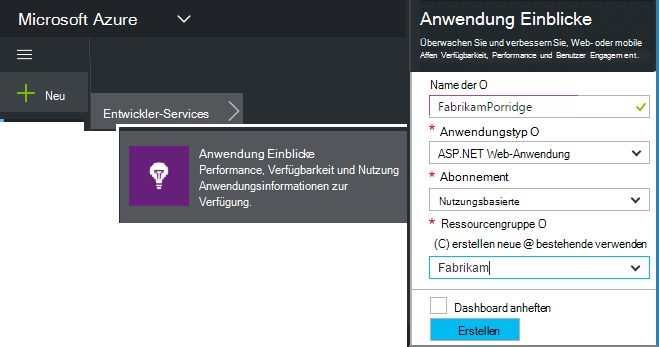
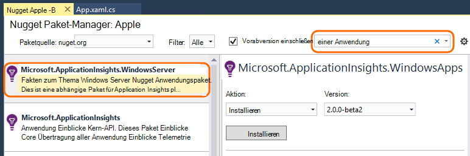
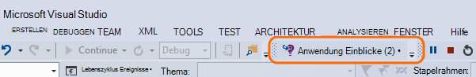
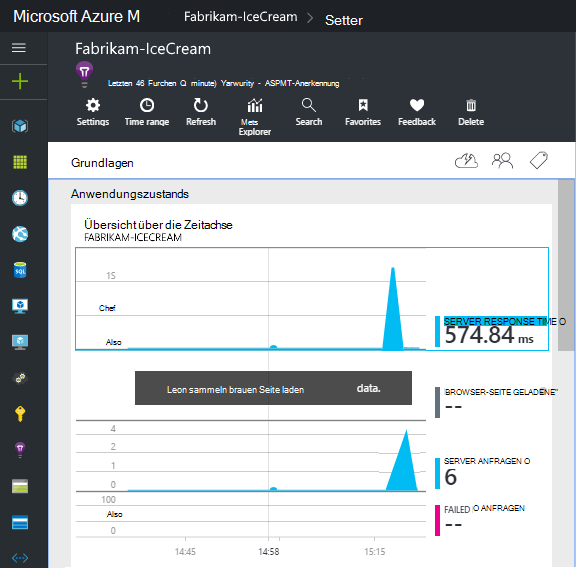
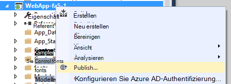

<properties
    pageTitle="Anwendungsdienste Einblicke für Windows und Workerrollen | Microsoft Azure"
    description="Manuell Application Insights-SDK der Anwendung ASP.NET Auslastung, Verfügbarkeit und Leistung zu analysieren."
    services="application-insights"
    documentationCenter=".net"
    authors="alancameronwills"
    manager="douge"/>

<tags
    ms.service="application-insights"
    ms.workload="tbd"
    ms.tgt_pltfrm="ibiza"
    ms.devlang="na"
    ms.topic="get-started-article"
    ms.date="08/30/2016"
    ms.author="awills"/>

# Für ASP.NET 4 Applikationen Anwendung Einblicke manuell konfigurieren

*Anwendung Informationen ist in der Vorschau.*

[AZURE.INCLUDE [app-insights-selector-get-started](../../includes/app-insights-selector-get-started.md)]

Sie können [Visual Studio Application Insights](app-insights-overview.md) überwachen Windows Services Worker-Rollen und anderen Programmen ASP.NET manuell konfigurieren. Web Apps wird manuelle Konfiguration eine Alternative zu der [Automatische Setup](app-insights-asp-net.md) von Visual Studio bereitgestellt.

Anwendung Einblicke können Sie die diagnose von Problemen und Überwachen der Leistung und Verwendung in der aktiven Anwendung.

#### Bevor Sie beginnen

Du brauchst:

* Ein [Microsoft Azure-](http://azure.com)Abonnement. Hat das Team oder die Organisation Azure-Abonnement, kann der Besitzer Sie hinzufügen, Ihr [Microsoft-Konto](http://live.com).
* Visual Studio 2013 oder höher.

## 1. erstellen Sie 1. eine Anwendung Insights-Ressource

[Azure-Portal](https://portal.azure.com/)anmelden und eine neue Application Insights-Ressource erstellen. Wählen Sie den Anwendungstyp ASP.NET.

[Ressource](app-insights-resources-roles-access-control.md) in Azure ist eine Instanz eines Dienstes. Diese Ressource ist, Telemetriedaten aus Ihrer app analysiert und zur Verfügung gestellt.

Anwendung Art legt den Standardinhalt Ressource Blades und die Eigenschaften im [Metrik-Explorer](app-insights-metrics-explorer.md)angezeigt.

#### Kopieren Sie den Instrumentationsschlüssel

Bezeichnet der Schlüssel der Ressource und installieren Sie es bald im SDK leiten Daten an die Ressource.

Die Schritte, die Sie gerade getan haben, erstellen Sie eine neue Ressource sind eine gute Möglichkeit zum Starten eine Anwendung überwachen. Nun können Sie Daten zu senden.

## 2. installieren Sie das SDK in Ihrer Anwendung

Installieren und Konfigurieren von Anwendung Insights SDK variiert je nach Plattform, auf der Sie arbeiten. Für ASP.NET apps ist einfach.

1. Bearbeiten Sie in Visual Studio NuGet-Pakete von Ihrem Web-app-Projekt.

    

2. Webapps installieren Sie Application Insights SDK.

    

    *Kann andere Pakete verwenden?*

    Ja. Wählen Sie die Kern-API (Microsoft.ApplicationInsights) Wenn Sie die API verwenden, um eigene Telemetriedaten senden möchten. Das Windows Server-Paket enthält automatisch die Kern-API sowie andere Pakete wie Sammlung von Leistungsindikatoren überwachen der Abhängigkeit. 

#### Aktualisierung auf künftige SDK-Versionen

Von Zeit zu Zeit veröffentlichen wir eine neue Version des SDK.

Öffnen Sie zum Aktualisieren auf eine [neue Version des SDK](https://github.com/Microsoft/ApplicationInsights-dotnet-server/releases/)NuGet-Paket-Manager erneut und installierten Pakete filtern. **Microsoft.ApplicationInsights.Web** und wählen Sie **Aktualisieren**.

Wenn Sie ApplicationInsights.config angepasst haben, Speichern einer Kopie aktualisieren und anschließend die neue Version Zusammenführen ändern

## 3. Telemetriedaten senden

**Wenn Sie nur das Kern-API-Paket installiert:**

* Legen Sie den instrumentationsschlüssel im Code beispielsweise `main()`: 

    `TelemetryConfiguration.Active.InstrumentationKey = "`*der Schlüssel*`";` 

* [Schreiben Sie eigene Telemetrie mithilfe der API](app-insights-api-custom-events-metrics.md#ikey).

**Andere Anwendung Einblicke Pakete installiert** können Sie natürlich verwenden die config-Datei für die Instrumentation festlegen:

* ApplicationInsights.config bearbeiten (wurde hinzugefügt von der NuGet Installation). Fügen Sie dies vor dem schließenden Tag:

    `<InstrumentationKey>`*die instrumentationsschlüssel kopieren*`</InstrumentationKey>`

* Stellen Sie sicher, dass die Eigenschaften des ApplicationInsights.config im Projektmappen-Explorer **Build Action = Content in Ausgabeverzeichnis kopieren Kopieren =**.

## Führen Sie das Projekt

Verwenden, um die Anwendung ausführen und testen **F5** : unterschiedliche Seiten um einige Telemetriedaten zu generieren.

In Visual Studio sehen Sie die Anzahl der Ereignisse, die gesendet wurden.

## Anzeigen der Telemetrie

[Azure-Portal](https://portal.azure.com/) zurück, und suchen Sie die Application Insights-Ressource.

Suchen Sie nach Daten in Diagrammen Overview. Zunächst sehen Sie nur ein oder zwei Punkte. Zum Beispiel:

Klicken Sie auf Diagramme detailliertere Kriterien anzeigen. [Erfahren Sie mehr über Metriken.](app-insights-web-monitor-performance.md)

#### Keine Daten?

* Mithilfe der Anwendung verschiedene Seiten öffnen, sodass einige Telemetriedaten generiert.
* Öffnen der [Suche](app-insights-diagnostic-search.md) Kachel, um einzelne Ereignisse anzuzeigen. Manchmal dauert es Ereignisse etwas länger Metriken Pipeline zu.
* Warten Sie einige Sekunden, und klicken Sie auf **Aktualisieren**. Diagramme aktualisieren sich regelmäßig, aber Sie können manuell aktualisieren, wenn einige Daten warten angezeigt werden.
* Finden Sie unter [Troubleshooting](app-insights-troubleshoot-faq.md).

## Veröffentlichen Sie Ihre app

Jetzt Bereitstellen der Anwendung auf dem Server oder in Azure und sehen die Daten sammeln.

Beim Ausführen im Debugmodus ist über die Pipeline Telemetrie beschleunigt, sodass Daten innerhalb von Sekunden angezeigt werden soll. Bei der Bereitstellung Ihrer Anwendung in Releasekonfiguration sammelt Daten langsamer.

#### Keine Daten nach dem Veröffentlichen auf dem Server?

Öffnen Sie diese Ports für ausgehenden Datenverkehr in der Server-Firewall:

+ `dc.services.visualstudio.com:443`
+ `f5.services.visualstudio.com:443`

#### Probleme auf dem Buildserver?

[Dieser Artikel Problembehandlung](app-insights-asp-net-troubleshoot-no-data.md#NuGetBuild)anzeigen

> [AZURE.NOTE]Wenn Ihre Anwendung viele Telemetrie generiert (und ASP.NET SDK Version 2.0.0-beta3 oder höher), adaptive Sampling-Modul reduziert das Volume, das das Portal an einen repräsentativen Teil Ereignisse senden. Jedoch wird Ereignisse bezüglich der gleichen Anforderung ausgewählt oder als Gruppe deaktiviert, damit Sie zwischen Ereignissen navigieren können. 
> [Erfahren Sie mehr über Sampling](app-insights-sampling.md).

## Nächste Schritte

* 360-Grad-Ansicht der Anwendung zu [mehr Telemetrie hinzufügen](app-insights-asp-net-more.md) .

