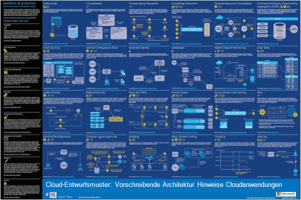
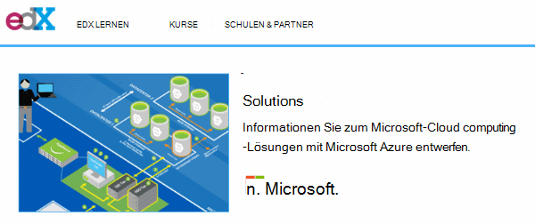
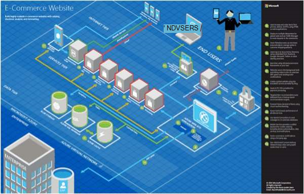
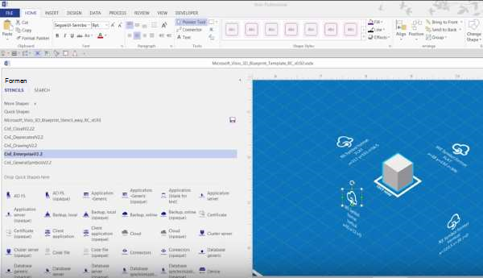
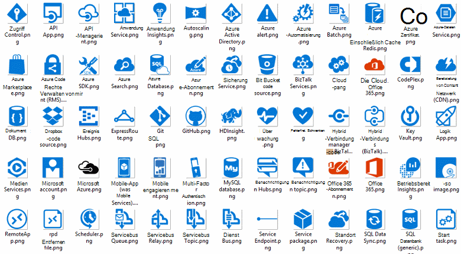
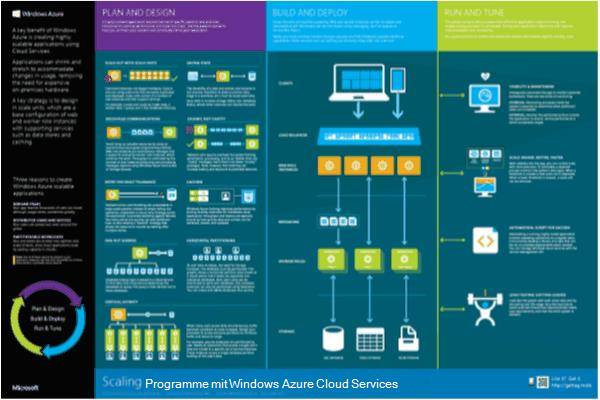

<properties 
    pageTitle="Anwendungsarchitektur in Microsoft Azure | Microsoft Azure" 
    description="Übersicht über die Architektur, die allgemeine Entwurfsmuster behandelt" 
    services="" 
    documentationCenter="" 
    authors="Rboucher" 
    manager="jwhit" 
    editor="mattshel"/>

<tags 
    ms.service="multiple" 
    ms.workload="na" 
    ms.tgt_pltfrm="na" 
    ms.devlang="na" 
    ms.topic="article" 
    ms.date="09/13/2016" 
    ms.author="robb"/>

#Anwendungsarchitektur in Microsoft Azure
Ressourcen zum Erstellen von Clientanwendungen, die Microsoft Azure verwenden. Dies umfasst Tools, damit Diagramme zeichnen, um visuell Softwaresysteme beschreiben. 

##Design Patterns poster

Microsoft Patterns & Practices veröffentlichte Buch [Entwurfsmuster Cloud](http://msdn.microsoft.com/library/dn568099.aspx) auf MSDN und PDF-Download verfügbar ist. Es gibt auch ein großes Format Plakat verfügbar sind die Muster aufgeführt. 

##Microsoft-Architektur-Zertifizierung

Microsoft erstellt einen Architektur-Kurs Microsoft Zertifizierung Prüfung 70-534 unterstützen. Es ist [auf EDX.ORG verfügbar](https://www.edx.org/course/architecting-microsoft-azure-solutions-microsoft-dev205x).  [3D Plan Visio-Vorlage](#3d-blueprint-visio-template)verwendet. 

##Microsoft Solutions

Microsoft veröffentlicht eine Reihe von hoher Ebene [Lösungsarchitekturen](http://aka.ms/azblueprints) mit bestimmten Systemen mit Microsoft-Produkten zu erstellen. 

Zuvor veröffentlichte Microsoft ein Beispiel Architekturen mit Blaupausen. Die durch erwähnten Lösungsarchitekturen ersetzt und Link Plan darauf Ihnen umgeleitet wurde. Benötigen Sie Zugang zu der vorherigen Entwürfe aus irgendeinem Grund, e-Mail- [CnESymbols@microsoft.com](mailto:CnESymbols@microsoft.com) mit der Anforderung.   

Die Blaupausen und Lösung Architekturen Diagramme verwenden [Cloud und Enterprise Symbol](#Drawing-symbol-and-icon-sets).   

##3D Plan Visio-Vorlage

3D Version des aufgelösten [Microsoft Architecture Blueprints](http://aka.ms/azblueprints) wurden zunächst in einem nicht-Microsoft-Tool erstellt. Visio 2013 (und höhere) Vorlage geliefert am 5. August 2015 als Teil einer [verteilten Architektur Microsoft-Zertifizierung auf EDX.ORG](#microsoft-architecture-certification-course).

Die Vorlage steht auch außerhalb des Kurses. 

- [Ansicht der Schulung video](http://aka.ms/3dBlueprintTemplateVideo) zunächst damit, was sie tun kann   
- Download der [Microsoft 3d Vorlage Visio-Vorlage](http://aka.ms/3DBlueprintTemplate)
- Die [Cloud und Enterprise Symbole](#drawing-symbol-and-icon-sets) mit 3D Vorlage herunterladen 

E-Mail an [CnESymbols@microsoft.com](mailto:CnESymbols@microsoft.com) für bestimmte Fragen nicht das Schulungsmaterial oder Feedback zu geben. Die Vorlage ist nicht mehr aktiv entwickelt es jedoch dennoch nützliche und relevante da verwenden können alle PNG oder der [Cloud und Enterprise-Symbolen](#drawing-symbol-and-icon-sets)aktualisiert.  

##Symbol und Symbol legt zeichnen 

[Visio und Symbole Schulung Video anzeigen](http://aka.ms/CnESymbolsVideo) und dann [Herunterladen der Cloud und Enterprise-Symbol](http://aka.ms/CnESymbols) zu technischen erstellen beschreiben Azure, Windows Server, SQL Server und mehr. Sie können die Symbole Architekturdiagramme Schulungsmaterial, Präsentationen, Datenblätter, infografiken, Whitepapers und sogar 3rd Party Bücher Buch man Microsoft-Produkte bildet. Jedoch sind nicht für die Verwendung in Benutzeroberflächen vorgesehen.

CnE-Symbole werden in Visio, SVG und PNG-Format. Weitere Informationen zur Verwendung von leicht mithilfe der Symbole in PowerPoint enthalten sind. 

Im Symbolsatz wird vierteljährlich und wird aktualisiert, wenn neue Services veröffentlicht werden. 

Zusätzliche Symbole für Microsoft Office und den entsprechenden Techniken stehen in [Microsoft Office Visio-Schablone](http://www.microsoft.com/en-us/download/details.aspx?id=35772)sie für Architekturdiagramme wie CnE ist nicht optimiert werden.   

**Bewertung:** Bei Verwendung der Symbole CnE kurzen 5 Frage [Umfrage](http://aka.ms/azuresymbolssurveyv2) ausfüllen oder uns eine e-Mail an [CnESymbols@microsoft.com](mailto:CnESymbols@microsoft.com) für Fragen und Probleme. Wir möchten Ihre Meinung einschließlich positives Feedback, damit wir wissen, dass sie Zeit investieren. 

##Architektur Infografiken

Microsoft veröffentlicht mehrere Architektur Poster-infografiken beziehen. Dazu gehören [Gebäude Cloud Praxis](https://azure.microsoft.com/documentation/infographics/building-real-world-cloud-apps/) und [Skalierung mit Cloud-Diensten](https://azure.microsoft.com/documentation/infographics/cloud-services/) . 

