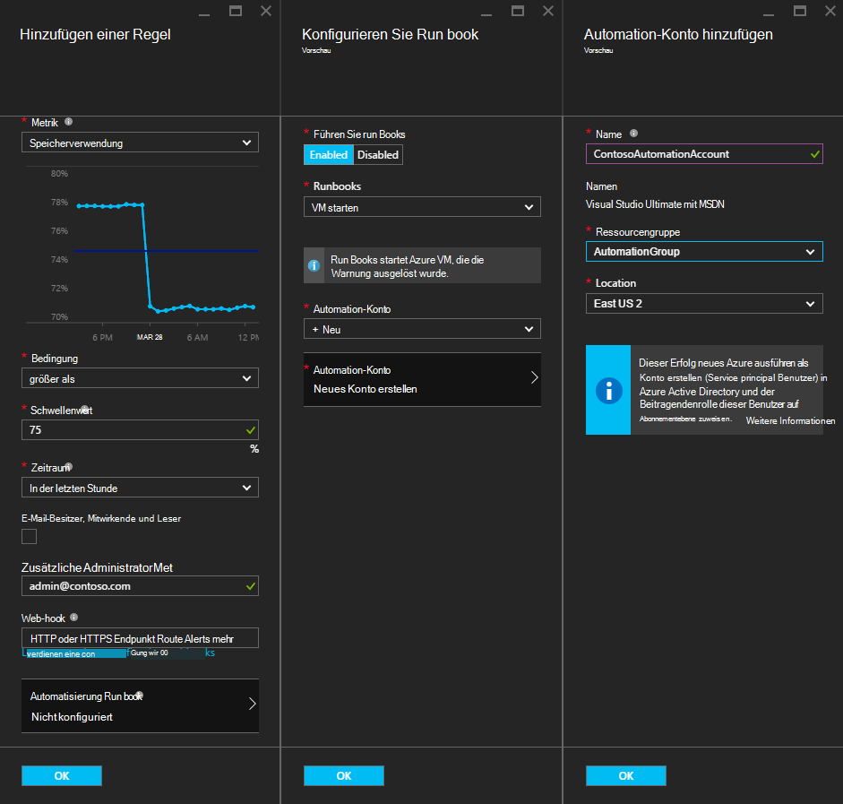
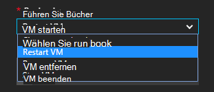
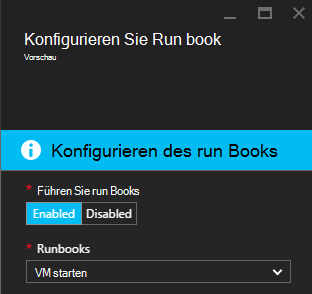
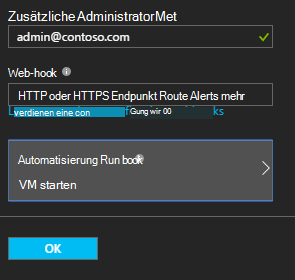

<properties
    pageTitle=" Behebung von Azure VM Warnungen Automatisierung Runbooks | Microsoft Azure"
    description="Dieser Artikel veranschaulicht das Azure Automatisierung Runbooks Azure Virtual Machine Alerts integriert und Probleme automatisch beheben"
    services="automation"
    documentationCenter=""
    authors="mgoedtel"
    manager="jwhit"
    editor="tysonn" />    
<tags
    ms.service="automation"
    ms.devlang="na"
    ms.topic="article"
    ms.tgt_pltfrm="na"
    ms.workload="infrastructure-services"
    ms.date="06/14/2016"
    ms.author="csand;magoedte" />

# <a name="azure-automation-scenario---remediate-azure-vm-alerts"></a>Szenarium für Azure - Behebung von Azure VM Alerts

Azure Automatisierung und Azure Virtual Machines erschienen eine neue Funktion Virtual Machine (VM) Alarme Automatisierung Runbooks ausführen konfigurieren. Diese neue Funktion können Sie automatisch standard Behebung auf VM-Alarme wie neu starten oder beenden den virtuellen Computer ausführen.

Zuvor konnten beim VM Warnregel erstellen Sie ein Runbook [eine Automatisierung Webhook anzugeben](https://azure.microsoft.com/blog/using-azure-automation-to-take-actions-on-azure-alerts/) Runbooks ausführen, wenn der Alarm ausgelöst. Dies muss jedoch Sie Runbooks erstellen, erstellen Webhook für das Runbook kopieren und Einfügen der Webhook während der Erstellung der Regel auszuführen. Mit dieser neuen Version ist der Prozess viel einfacher, da Sie ein Runbook direkt aus einer Liste, während Warnregel erstellen auswählen können und Automation-Konto Runbooks ausführen oder einfach ein Konto erstellen können.

In diesem Artikel zeigen wir Ihnen wie einfach es ist, eine Warnung Azure VM einrichten und Konfigurieren einer Automatisierung Runbook ausgeführt, wenn die Warnung ausgelöst. Beispielszenarien enthalten Neustarten einer VM überschreitet die Speicherverwendung einen Schwellenwert von einer Anwendung auf dem virtuellen Computer mit einem Speicherverlust oder eine VM beendet, wenn die CPU-Benutzerzeit weniger als 1 % Stunde seit und wird nicht verwendet. Wie die automatische Erstellung von Dienstprinzipal in Ihrem Konto Automatisierung verwendet Runbooks in Azure alert Remediation vereinfacht wird auch erläutert.

## <a name="create-an-alert-on-a-vm"></a>Erstellen einer Warnung für eine VM

Die folgenden Schritte konfigurieren Sie eine Warnung ein Runbook gestartet, wenn der Schwellenwert erreicht wurde.

>[AZURE.NOTE] In dieser Version nur unterstützt V2 virtuellen Maschinen und Support für Classic VMs bald hinzugefügt werden.  

1. Azure-Portal melden Sie an und auf **virtuellen Maschinen**.  
2. Wählen Sie die virtuellen Computer.  Virtuelle Computer Dashboard Blatt wird angezeigt und die **Einstellungen** rechts.  
3. Wählen Sie Blatt **Einstellungen** im Abschnitt Überwachung **Warnregeln**.
4. Klicken Sie auf das Blade **Warnregeln** auf **Benachrichtigung hinzufügen**.

Das **Hinzufügen einer Warnregel** Blade, konfigurieren die Vorschriften für die Warnung und wählen Sie eine oder alle Optionen eröffnet: Senden von e-Mail an eine Person, ein Webhook verwenden, um die Benachrichtigung zu einem anderen System weiterleiten und führen eine Automatisierung Runbook in Antwort versucht das Problem zu beheben.

## <a name="configure-a-runbook"></a>Ein Runbook konfigurieren

Wählen Sie konfigurieren ein Runbook ausgeführt, wenn die VM Alarmschwelle erfüllt **Automatisierung Runbook**. Blatt **Konfigurieren Runbook** können Runbooks ausgeführt und automatisierungskonto Runbook ausgeführt auswählen.



>[AZURE.NOTE] Für diese Version stehen drei Runbooks, der der Dienst bereitstellt – VM starten, stoppen VM oder VM entfernen (löschen).  Auswählen anderer Runbooks oder eine eigene Runbooks wird in einer zukünftigen Version verfügbar sein.



Wählen Sie eine der drei verfügbaren Runbooks **automatisierungskonto** Dropdown-Liste angezeigt wird und wählen Sie ein automatisierungskonto Runbooks ausgeführt wird. Runbooks muss im Kontext eines [Automation-Konto](automation-security-overview.md) ausführen, die in Azure-Abonnement. Bereits erstellt oder ein neues automatisierungskonto erstellt haben, können Sie eine automatisierungskonto auswählen.

Runbooks, die bereitgestellt werden authentifizieren in Azure verwenden einen Dienstprinzipal. Runbook in Ihrer vorhandenen automatisierungskonten ausgeführt werden soll, erstellt wir automatisch den Service principal. Wenn Sie ein neues automatisierungskonto erstellen möchten, dann erstellt wir das Konto und den Dienstprinzipalnamen automatisch. In beiden Fällen werden zwei Anlagen auch im Konto Automatisierung – ein Zertifikat Anlage namens **AzureRunAsCertificate** und eine Verbindung Anlage mit dem Namen **AzureRunAsConnection**erstellt. **AzureRunAsConnection** verwendet die Runbooks mit Azure authentifizieren, um Management Aktion gegen die VM.

>[AZURE.NOTE] Der Dienstprinzipalnamen wird im Bereich Abonnement erstellt und erhält die Rolle eines Beitragenden. Diese Funktion ist für das Konto zur Automatisierung Runbooks ausführen dürfen Azure VMs verwalten erforderlich.  Die Erstellung von Automaten Firma und/oder Service principal ist einmalig. Sobald sie erstellt sind, können dieses Konto Runbooks für andere Alarme Azure VM ausführen.

**Auf** die Warnung konfiguriert ist und wenn Sie die Option zum Erstellen eines neuen Kontos Automatisierung erstellt wird zusammen mit dem Service principal.  Dies kann einige Sekunden dauern.  



Nach Abschluss die Konfiguration sehen Sie den Namen des Runbooks Blatt **eine Warnungsregel hinzufügen** angezeigt.



**Klicken Sie auf** **eine Warnungsregel hinzufügen** Blade die Warnregel erstellt werden und aktivieren, wenn der virtuelle Computer ausgeführt wird.

### <a name="enable-or-disable-a-runbook"></a>Aktivieren Sie oder deaktivieren Sie ein runbook

Wenn ein Runbook für eine Warnung konfiguriert haben, können Sie es deaktivieren, ohne die Konfiguration Runbook. Dadurch können Sie unter Warnung testen vielleicht Warnregeln und später reaktivieren Runbooks.

## <a name="create-a-runbook-that-works-with-an-azure-alert"></a>Erstellen Sie ein Runbook mit einer Azure Warnung

Bei der Auswahl eines Runbooks als Teil einer Azure Warnregel muss Runbooks Logik, die Daten verwalten, die an sie übergeben wird.  Wenn ein Runbook in einer Warnregel konfiguriert ist, wird ein Webhook für Runbooks erstellt. Diese Webhook wird Runbooks Starten der Warnung verwendet.  Der eigentliche Aufruf Runbooks starten ist eine HTTP POST-Anforderung an den URL Webhook. Der Textkörper der POST-Anforderung enthält ein JSON-formatierte Objekt, nützliche Eigenschaften für die Warnung enthält.  Wie Sie sehen können, enthält die Warnungsdaten Details wie SubscriptionID, ResourceGroupName ResourceName und ResourceType.

### <a name="example-of-alert-data"></a>Beispiel für Daten
```
{
    "WebhookName": "AzureAlertTest",
    "RequestBody": "{
    \"status\":\"Activated\",
    \"context\": {
        \"id\":\"/subscriptions/<subscriptionId>/resourceGroups/MyResourceGroup/providers/microsoft.insights/alertrules/AlertTest\",
        \"name\":\"AlertTest\",
        \"description\":\"\",
        \"condition\": {
            \"metricName\":\"CPU percentage guest OS\",
            \"metricUnit\":\"Percent\",
            \"metricValue\":\"4.26337916666667\",
            \"threshold\":\"1\",
            \"windowSize\":\"60\",
            \"timeAggregation\":\"Average\",
            \"operator\":\"GreaterThan\"},
        \"subscriptionId\":\<subscriptionID> \",
        \"resourceGroupName\":\"TestResourceGroup\",
        \"timestamp\":\"2016-04-24T23:19:50.1440170Z\",
        \"resourceName\":\"TestVM\",
        \"resourceType\":\"microsoft.compute/virtualmachines\",
        \"resourceRegion\":\"westus\",
        \"resourceId\":\"/subscriptions/<subscriptionId>/resourceGroups/TestResourceGroup/providers/Microsoft.Compute/virtualMachines/TestVM\",
        \"portalLink\":\"https://portal.azure.com/#resource/subscriptions/<subscriptionId>/resourceGroups/TestResourceGroup/providers/Microsoft.Compute/virtualMachines/TestVM\"
        },
    \"properties\":{}
    }",
    "RequestHeader": {
        "Connection": "Keep-Alive",
        "Host": "<webhookURL>"
    }
}
```

Automatisierung Webhook Dienst empfängt die HTTP POST die Daten extrahiert und Runbook im WebhookData Runbook Eingabeparameter übergeben.  Es folgt ein Beispiel für ein Runbook, die veranschaulicht, wie mithilfe des WebhookData-Parameters und die Daten extrahieren und Azure Ressourcen verwalten, die die Warnung ausgelöst wurde.

### <a name="example-runbook"></a>Beispiel für ein runbook

```
#  This runbook will restart an ARM (V2) VM in response to an Azure VM alert.

[OutputType("PSAzureOperationResponse")]

param ( [object] $WebhookData )

if ($WebhookData)
{
    # Get the data object from WebhookData
    $WebhookBody = (ConvertFrom-Json -InputObject $WebhookData.RequestBody)

    # Assure that the alert status is 'Activated' (alert condition went from false to true)
    # and not 'Resolved' (alert condition went from true to false)
    if ($WebhookBody.status -eq "Activated")
    {
        # Get the info needed to identify the VM
        $AlertContext = [object] $WebhookBody.context
        $ResourceName = $AlertContext.resourceName
        $ResourceType = $AlertContext.resourceType
        $ResourceGroupName = $AlertContext.resourceGroupName
        $SubId = $AlertContext.subscriptionId

        # Assure that this is the expected resource type
        Write-Verbose "ResourceType: $ResourceType"
        if ($ResourceType -eq "microsoft.compute/virtualmachines")
        {
            # This is an ARM (V2) VM

            # Authenticate to Azure with service principal and certificate
            $ConnectionAssetName = "AzureRunAsConnection"
            $Conn = Get-AutomationConnection -Name $ConnectionAssetName
            if ($Conn -eq $null) {
                throw "Could not retrieve connection asset: $ConnectionAssetName. Check that this asset exists in the Automation account."
            }
            Add-AzureRMAccount -ServicePrincipal -Tenant $Conn.TenantID -ApplicationId $Conn.ApplicationID -CertificateThumbprint $Conn.CertificateThumbprint | Write-Verbose
            Set-AzureRmContext -SubscriptionId $SubId -ErrorAction Stop | Write-Verbose

            # Restart the VM
            Restart-AzureRmVM -Name $ResourceName -ResourceGroupName $ResourceGroupName
        } else {
            Write-Error "$ResourceType is not a supported resource type for this runbook."
        }
    } else {
        # The alert status was not 'Activated' so no action taken
        Write-Verbose ("No action taken. Alert status: " + $WebhookBody.status)
    }
} else {
    Write-Error "This runbook is meant to be started from an Azure alert only."
}
```

## <a name="summary"></a>Zusammenfassung

Beim Konfigurieren einer Warnung auf eine Azure-VM können Sie jetzt einfach ein Runbook Automatisierung automatisch Remediation Aktion bei die Warnung konfigurieren. Für diese Version können von Runbooks Sie starten, beenden oder Löschen einer VM je nach Szenario alert. Dies ist der Anfang eines Szenarien Sie die Aktionen (Benachrichtigung steuern, Fehlerbehebung, Reparatur), die automatisch ausgeführt wird, wenn eine Warnung ausgelöst.

## <a name="next-steps"></a>Nächste Schritte

- Zunächst mit grafisch Runbooks sehen Sie [Meine erste grafisch runbook](automation-first-runbook-graphical.md)
- Zunächst mit PowerShell Workflow Runbooks finden Sie [meinen ersten PowerShell Workflow runbook](automation-first-runbook-textual.md)
- Erfahren Sie mehr über Runbook Typen, deren vor- und Nachteile finden Sie unter [Azure Automation runbook](automation-runbook-types.md)
