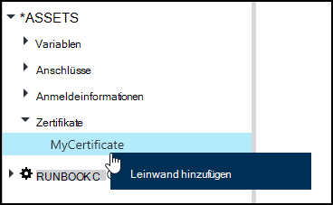
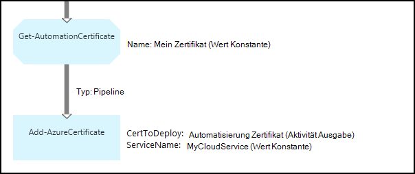

<properties 
   pageTitle="Anlagen in Azure Automation Zertifikat | Microsoft Azure"
   description="Zertifikate können sicher in Azure Automation gespeichert werden, damit sie Runbooks oder DSC Konfigurationen authentifizieren Azure und Drittanbieter-Ressourcen zugreifen können.  Dieser Artikel erläutert die Details der Zertifikate und zum Verfassen von Text und Grafiken arbeiten."
   services="automation"
   documentationCenter=""
   authors="mgoedtel"
   manager="stevenka"
   editor="tysonn" />
<tags 
   ms.service="automation"
   ms.devlang="na"
   ms.topic="article"
   ms.tgt_pltfrm="na"
   ms.workload="infrastructure-services"
   ms.date="02/23/2016"
   ms.author="magoedte;bwren" />

# Zertifikat Anlagen in Azure Automation

Zertifikate können sicher in Azure Automation gespeichert werden, damit sie Runbooks oder DSC-Konfigurationen mithilfe der **Get-AutomationCertificate** -Aktivität zugreifen können. Dadurch können Sie Runbooks und DSC-Konfigurationen, die Zertifikate für die Authentifizierung verwenden oder Azure oder dritten Ressourcen hinzugefügt.

>[AZURE.NOTE] Sichere Anlagen in Azure Automation gehören Anmeldeinformationen, Zertifikate, Anschlüsse und verschlüsselte Variablen. Diese Ressourcen werden verschlüsselt und in Azure Automation mit einem eindeutigen Schlüssel wird für jedes automatisierungskonto gespeichert. Dieser Schlüssel ist ein master Zertifikat verschlüsselt und in Azure Automation gespeichert. Vor dem Speichern einer sicheren Anlage, der Schlüssel für die Automation-Konto wird mit master Zertifikat entschlüsselt und anschließend zum Verschlüsseln der Anlage.

## Windows PowerShell-Cmdlets

Die Cmdlets in der folgenden Tabelle zum Erstellen und Automatisierung Zertifikat verwalten mit Windows PowerShell. Sie liefern als Teil des [Azure PowerShell-Modul](../powershell-install-configure.md) für Automatisierung Runbooks und DSC-Konfigurationen verfügbar ist.

|Cmdlets|Beschreibung|
|:---|:---|
|[AzureAutomationCertificate abrufen](http://msdn.microsoft.com/library/dn913765.aspx)|Ruft Informationen zu einem Zertifikat ab. Sie können das Zertifikat selbst nur aus Get-AutomationCertificate abrufen.|
|[Neue AzureAutomationCertificate](http://msdn.microsoft.com/library/dn913764.aspx)|Importiert ein neues Zertifikat in Azure.|
|[Entfernen - AzureAutomationCertificate](http://msdn.microsoft.com/library/dn913773.aspx)|Entfernt ein Zertifikat aus Azure Automation.|
|[Set - AzureAutomationCertificate](http://msdn.microsoft.com/library/dn913763.aspx)|Legt die Eigenschaften für ein vorhandenes Zertifikat einschließlich die Datei hochladen und Festlegen des Kennworts für ein PFX.|

## Aktivitäten auf Zertifikate

Die Aktivitäten in der folgenden Tabelle wird Zertifikate in einem Runbook oder DSC Konfiguration zugreifen.

|Aktivitäten|Beschreibung|
|:---|:---|
|AutomationCertificate abrufen|Ruft ein Zertifikat für ein Runbook oder DSC-Konfiguration ab.|

>[AZURE.NOTE] Vermeiden Sie die Verwendung von Variablen in Parameter – Name der Get-AutomationCertificate, da dadurch entdecken Abhängigkeiten Runbooks oder DSC-Konfigurationen erschweren und Anlagen zur Entwurfszeit Zertifikat.

## Erstellen eines neuen Zertifikats

Wenn Sie ein neues Zertifikat erstellen, wird eine CER oder PFX-Datei Azure Automatisierung hochladen. Wenn Sie das Zertifikat als exportierbar markieren, können Sie es aus dem Zertifikatspeicher Azure Automation übertragen. Ist es nicht exportiert, es nur lässt dann Dank Runbook oder DSC-Konfiguration.

### Erstellen Sie ein neues Zertifikat mit klassischen Azure-portal

1. Klicken Sie auf **Anlagen** am oberen Fensterrand Automation-Konto.
1. Klicken Sie am unteren Rand des Fensters auf **Hinzufügen**.
1. Klicken Sie auf **Anmeldeinformationen**.
2. Wählen Sie in der Dropdownliste **Anmeldeinformationstyp** **Zertifikat**.
3. Geben Sie im Feld **Name** einen Namen für das Zertifikat, und klicken Sie auf den Pfeil nach rechts.
4. Suchen Sie nach einer CER oder PFX-Datei.  Wählt eine PFX-Datei geben Sie ein Kennwort und ob es dürfen exportiert werden.
1. Klicken Sie zum Hochladen der Datei und speichern Sie die neue Zertifikat Anlage.

### Erstellen Sie ein neues Zertifikat mit Azure-portal

1. Automation-Konto klicken Sie auf die **Vermögenswerte** Blade **Anlagen** öffnen.
1. Klicken Sie öffnen das Blade **Zertifikate** auf **Zertifikate** .
1. Klicken Sie auf **Zertifikat hinzufügen** oben das Blade.
2. Geben Sie im Feld **Name** einen Namen für das Zertifikat.
2. Klicken Sie auf **eine Datei** unter Suchen eine CER oder PFX-Datei **Hochladen eine Zertifikatsdatei** .  Wählt eine PFX-Datei geben Sie ein Kennwort und ob es dürfen exportiert werden.
1. Klicken Sie auf **Erstellen** , um das neue Zertifikat Anlage speichern.

### Erstellen Sie ein neues Zertifikat mit Windows PowerShell

Die folgenden Beispielbefehle zeigen, wie ein neues Automatisierung Zertifikat erstellen und exportierbar markiert. Hierdurch wird eine vorhandene PFX-Datei importiert.

    $certName = 'MyCertificate'
    $certPath = '.\MyCert.pfx'
    $certPwd = ConvertTo-SecureString -String 'P@$$w0rd' -AsPlainText -Force
    
    New-AzureAutomationCertificate -AutomationAccountName "MyAutomationAccount" -Name $certName -Path $certPath –Password $certPwd -Exportable

## Mithilfe eines Zertifikats

Die **Get-AutomationCertificate** -Aktivität verwenden ein Zertifikat verwenden. Das Cmdlet " [Get-AzureAutomationCertificate](http://msdn.microsoft.com/library/dn913765.aspx) " kann nicht verwendet werden, Informationen zum Zertifikat Anlage jedoch nicht das Zertifikat selbst zurück.

### Text für ein Runbook-Beispiel

Der folgende Beispielcode veranschaulicht das Hinzufügen ein Zertifikats für einen Clouddienst in ein Runbook. In diesem Beispiel wird das Kennwort in einem verschlüsselten Automation-Variable abgerufen.

    $serviceName = 'MyCloudService'
    $cert = Get-AutomationCertificate -Name 'MyCertificate'
    $certPwd = Get-AutomationVariable –Name 'MyCertPassword'
    Add-AzureCertificate -ServiceName $serviceName -CertToDeploy $cert

### Grafisch Runbook-Beispiel

Sie können grafisch Runbook **Get-AutomationCertificate** hinzufügen, indem mit der rechten Maustaste auf das Zertifikat im Bibliotheksfenster im Grafik-Editor und **Hinzufügen zu**.

Die folgende Abbildung zeigt ein Beispiel für ein Zertifikat in eine grafisch Runbook.  Dies ist das gleiche Beispiel oben einen Cloud-Dienst aus Text Runbook ein Zertifikat hinzufügen.  

Dieses Beispiel verwendet den **UseConnectionObject** -Parameter für die Aktivität **Senden TwilioSMS** , die ein Verbindungsobjekt für die Authentifizierung des Dienstes verwendet.  Eine [Pipeline Link](automation-graphical-authoring-intro.md#links-and-workflow) muss hier verwendet werden, da Sequenz Link eine Auflistung mit einem einzelnen der Verbindungsparameter nicht erwartet-Objekt zurückgeben würde.

## Siehe auch

- [Links grafisch erstellen](automation-graphical-authoring-intro.md#links-and-workflow) 
