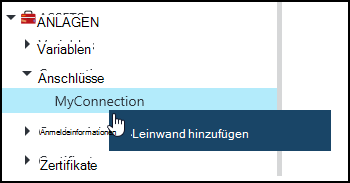
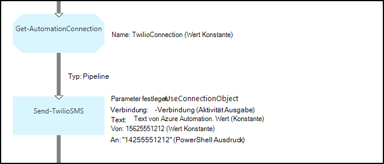
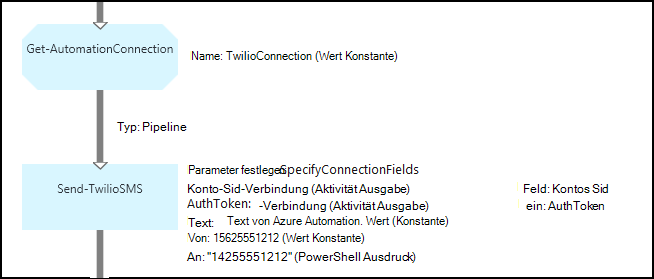

<properties 
   pageTitle="Verbindung Anlagen in Azure Automatisierung | Microsoft Azure"
   description="Verbindung Anlagen in Azure Automation enthalten Angaben Runbook oder DSC-Konfiguration eine Verbindung zu einem externen Dienst oder eine Anwendung. Dieser Artikel erläutert die Details der Verbindung und zum Verfassen von Text und Grafiken arbeiten."
   services="automation"
   documentationCenter=""
   authors="bwren"
   manager="stevenka"
   editor="tysonn" />
<tags 
   ms.service="automation"
   ms.devlang="na"
   ms.topic="article"
   ms.tgt_pltfrm="na"
   ms.workload="infrastructure-services"
   ms.date="01/27/2016"
   ms.author="bwren" />

# Verbindung Anlagen in Azure Automation

Anlage Verbindung Automatisierung enthält Runbook oder DSC-Konfiguration eine Verbindung zu einem externen Dienst oder Anwendung erforderlichen Informationen. Dazu gehören Informationen zur Authentifizierung wie Benutzername und Kennwort zusätzlich Informationen wie eine URL oder einen Anschluss. Der Wert einer Verbindung hält alle Eigenschaften für die Verbindung mit einer bestimmten Anwendung in einer Anlage anstatt mehrere Variablen. Der Benutzer kann Werte für eine Verbindung an einer Stelle bearbeiten und übergeben den Namen einer Verbindung zu einem Runbook DSC-Konfiguration in einem einzigen Parameter. Die Eigenschaften für eine Verbindung in der DSC-Konfiguration mit der **Get-AutomationConnection** oder Runbook möglich.

Wenn Sie eine Verbindung erstellen, müssen Sie eine *Verbindung*angeben. Der Verbindungstyp ist eine Vorlage, die eine Reihe von Eigenschaften definiert. Die Verbindung definiert Werte für jede Eigenschaft in der Verbindungstyp definiert. Verbindungstypen werden Integrationsmodule Azure Automation hinzugefügt oder mit [Azure Automation API](http://msdn.microsoft.com/library/azure/mt163818.aspx)erstellt. Nur Verbindungstypen, die beim Erstellen einer Verbindung werden in Ihrem Konto Automatisierung installiert.

>[AZURE.NOTE] Sichere Anlagen in Azure Automation gehören Anmeldeinformationen, Zertifikate, Anschlüsse und verschlüsselte Variablen. Diese Ressourcen werden verschlüsselt und in Azure Automation mit einem eindeutigen Schlüssel wird für jedes automatisierungskonto gespeichert. Dieser Schlüssel ist ein master Zertifikat verschlüsselt und in Azure Automation gespeichert. Vor dem Speichern einer sicheren Anlage, der Schlüssel für die Automation-Konto wird mit master Zertifikat entschlüsselt und anschließend zum Verschlüsseln der Anlage.

## Windows PowerShell-Cmdlets

Die Cmdlets in der folgenden Tabelle zum Erstellen und Verwalten von Verbindungen mit Windows PowerShell Automatisierung. Sie liefern als Teil des [Azure PowerShell-Modul](../powershell-install-configure.md) für Automatisierung Runbooks und DSC-Konfigurationen verfügbar ist.

|Cmdlets|Beschreibung|
|:---|:---|
|[AzureAutomationConnection abrufen](http://msdn.microsoft.com/library/dn921828.aspx)|Ruft eine Verbindung. Eine Hashtabelle mit den Werten der Felder für die Verbindung enthält.|
|[Neue AzureAutomationConnection](http://msdn.microsoft.com/library/dn921825.aspx)|Erstellt eine neue Verbindung.|
|[AzureAutomationConnection entfernen](http://msdn.microsoft.com/library/dn921827.aspx)|Entfernen Sie eine vorhandene Verbindung.|
|[AzureAutomationConnectionFieldValue festlegen](http://msdn.microsoft.com/library/dn921826.aspx)|Legt den Wert eines bestimmten Felds für eine vorhandene Verbindung.|

## Aktivitäten

Die Aktivitäten in der folgenden Tabelle wird Verbindungen in einem Runbook oder DSC Konfiguration zugreifen.

|Aktivitäten|Beschreibung|
|---|---|
|AutomationConnection abrufen|Ruft eine Verbindung verwenden. Gibt eine Hashtabelle mit den Eigenschaften der Verbindung zurück.|

>[AZURE.NOTE] Vermeiden Sie die Verwendung von Variablen in Parameter – Name der **Get-AutomationConnection** , da diese entdecken Abhängigkeiten Runbooks oder DSC-Konfigurationen und Verbindung Anlagen zur Entwurfszeit komplizieren kann.

## Erstellen einer neuen Verbindung

### Erstellen Sie eine neue Verbindung mit klassischen Azure-portal

1. Klicken Sie auf **Anlagen** am oberen Fensterrand Automation-Konto.
1. Klicken Sie am unteren Rand des Fensters auf **Hinzufügen**.
1. Klicken Sie auf **Verbindung hinzufügen**.
2. Wählen Sie in der Dropdownliste **Verbindung** die Verbindung zu erstellen.  Der Assistent präsentiert die Eigenschaften dieses Typs.
1. Führen Sie den Assistenten, und klicken Sie auf das Kontrollkästchen, um die neue Verbindung zu speichern.

### Erstellen Sie eine neue Verbindung mit Azure-portal

1. Automation-Konto klicken Sie auf die **Vermögenswerte** Blade **Anlagen** öffnen.
1. Klicken Sie zum Öffnen von **Verbindungen** Blade auf **Verbindungen** .
1. Klicken Sie auf **Hinzufügen einer Verbindung** am Anfang des Blades.
2. Wählen Sie in der Dropdownliste **Typ** den Typ der Verbindung, die Sie erstellen möchten. Das Formular wird die Eigenschaften dieses Typs angezeigt.
1. Füllen Sie das Formular, und klicken Sie auf **Erstellen** , um die neue Verbindung zu speichern.

### Erstellen eine neue Verbindung mit Windows PowerShell

Erstellen Sie eine neue Verbindung mit Windows PowerShell mithilfe des Cmdlets [New-AzureAutomationConnection](http://msdn.microsoft.com/library/dn921825.aspx) . Dieses Cmdlet hat einen Parameter namens **ConnectionFieldValues** , die eine [Hashtabelle](http://technet.microsoft.com/library/hh847780.aspx) Werte für jede Verbindung festgelegten Eigenschaften erwartet.

Die folgenden Beispielbefehle erstellen für [Twilio](http://www.twilio.com) der Telefonie-Dienst ermöglicht das Senden und Empfangen von Nachrichten eine neue Verbindung.  Im [Script Center](http://gallery.technet.microsoft.com/scriptcenter/Twilio-PowerShell-Module-8a8bfef8)steht eine Beispiel-Integrationsmodul, die eine Twilio Verbindung enthält.  Dieser Verbindungstyp definiert Eigenschaften für Konto-SID und Autorisierung Token Ihr Konto überprüfen, beim Verbinden mit Twilio müssen.  Sie müssen [Dieses Modul](http://gallery.technet.microsoft.com/scriptcenter/Twilio-PowerShell-Module-8a8bfef8) und installieren sie in Ihrem automatisierungskonto dieser Beispielcode funktioniert.

    $AccountSid = "DAf5fed830c6f8fac3235c5b9d58ed7ac5"
    $AuthToken  = "17d4dadfce74153d5853725143c52fd1"
    $FieldValues = @{"AccountSid" = $AccountSid;"AuthToken"=$AuthToken}

    New-AzureAutomationConnection -AutomationAccountName "MyAutomationAccount" -Name "TwilioConnection" -ConnectionTypeName "Twilio" -ConnectionFieldValues $FieldValues

## Eine Verbindung in einem Runbook oder DSC-Konfiguration

Sie rufen eine Verbindung in einem Runbook oder DSC-Konfiguration mit dem Cmdlet **Get-AutomationConnection** .  Diese Aktivität Ruft die Werte der anderen Felder in der Verbindung ab und gibt diese als eine [Hash-Tabelle](http://go.microsoft.com/fwlink/?LinkID=324844) mit den entsprechenden Befehlen in Runbook oder DSC-Konfiguration verwendet werden kann.

### Text für ein Runbook-Beispiel
Die folgenden Beispielbefehle Verwendungsmöglichkeiten von Twilio Verbindung im vorherigen Beispiel eine Textnachricht von einem Runbook senden.  Senden TwilioSMS Aktivität hier hat zwei Parameter, eine andere Methode für die Authentifizierung an den Twilio-Dienst verwenden.  Ein Verbindungsobjekt und ein anderes verwendet einzelner Parameter für die Konto-SID und Autorisierung Token.  In diesem Beispiel werden beide Methoden gezeigt.

    $Con = Get-AutomationConnection -Name "TwilioConnection"
    $NumTo = "14255551212"
    $NumFrom = "15625551212"
    $Body = "Text from Azure Automation."

    #Send text with connection object.
    Send-TwilioSMS -Connection $Con -From $NumFrom -To $NumTo -Body $Body

    #Send text with connection properties.
    Send-TwilioSMS -AccountSid $Con.AccountSid -AuthToken $Con.AuthToken -From $NumFrom -To $NumTo -Body $Body

### Grafisch Runbook-Beispiele

Sie können grafisch Runbook **Get-AutomationConnection** -Aktivität hinzufügen, mit der rechten Maustaste auf die Verbindung des Grafik-Editors im Bibliotheksfenster hinzufügen **zu**.

Die folgende Abbildung zeigt ein Beispiel für eine Verbindung in einem grafisch Runbook.  Dies ist dieselbe obigen Beispiel für SMS Text Runbook Twilio aus.  Dieses Beispiel verwendet den **UseConnectionObject** -Parameter für die Aktivität **Senden TwilioSMS** , die ein Verbindungsobjekt für die Authentifizierung des Dienstes verwendet.  Eine [Pipeline Link](automation-graphical-authoring-intro.md#links-and-workflow) wird hier verwendet, da der Verbindungsparameter ein einzelnes Objekt erwartet.

Deshalb ein PowerShell Ausdruck für den Wert im Parameter **,** statt einen konstanten Wert verwendet wird, dass dieser Parameter einen String-Array Werttyp erwartet, dass Sie mehrere Nummern senden können.  PowerShell-Ausdruck können Sie einen einzelnen Wert oder ein Array bereitstellen.

Die Abbildung unten zeigt, wie das Beispiel oben nur verwendet den **SpecifyConnectionFields** , die Parameter erwartet die Parameter AccountSid und AuthToken einzeln statt ein Verbindungsobjekt für die Authentifizierung angegeben werden.  In diesem Fall werden die Felder der Verbindung anstelle des Objekts angegeben.  

## Verwandte Artikel

- [Links grafisch erstellen](automation-graphical-authoring-intro.md#links-and-workflow)
 
