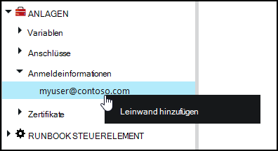
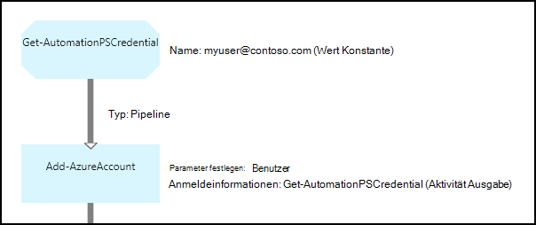

<properties 
   pageTitle="Anlagen in Azure Automation Anmeldeinformationen | Microsoft Azure"
   description="Anlagen in Azure Automation Anmeldeinformationen enthalten Anmeldeinformationen zum Authentifizieren auf Ressourcen zugreifen Runbook oder DSC-Konfiguration verwendet werden können. Dieser Artikel beschreibt die Anmeldeinformationen erstellen und in ein Runbook oder DSC-Konfiguration verwenden."
   services="automation"
   documentationCenter=""
   authors="mgoedtel"
   manager="jwhit"
   editor="tysonn" />
<tags 
   ms.service="automation"
   ms.devlang="na"
   ms.topic="article"
   ms.tgt_pltfrm="na"
   ms.workload="infrastructure-services"
   ms.date="06/09/2016"
   ms.author="bwren" />

# Anmeldeinformationen Anlagen in Azure Automation

Eine Automatisierung Anmeldeinformationen Anlage enthält ein [PSCredential](http://msdn.microsoft.com/library/system.management.automation.pscredential) Objekt enthält Anmeldeinformationen wie Benutzername und Kennwort. Runbooks und DSC-Konfigurationen können Cmdlets, die ein PSCredential-Objekt für die Authentifizierung akzeptiert, oder Extrahieren sie Benutzername und Kennwort des PSCredential-Objekts zu einigen Anwendung oder Dienst eine Authentifizierung erforderlich ist. Die Eigenschaften für Anmeldeinformationen werden sicher in Azure Automation und Runbook oder DSC-Konfiguration mit der [Get-AutomationPSCredential](http://msdn.microsoft.com/library/system.management.automation.pscredential.aspx) möglich.

>[AZURE.NOTE] Sichere Anlagen in Azure Automation gehören Anmeldeinformationen, Zertifikate, Anschlüsse und verschlüsselte Variablen. Diese Ressourcen werden verschlüsselt und in Azure Automation mit einem eindeutigen Schlüssel wird für jedes automatisierungskonto gespeichert. Dieser Schlüssel ist ein master Zertifikat verschlüsselt und in Azure Automation gespeichert. Vor dem Speichern einer sicheren Anlage, der Schlüssel für die Automation-Konto wird mit master Zertifikat entschlüsselt und anschließend zum Verschlüsseln der Anlage. 

## Windows PowerShell-cmdlets

Die Cmdlets in der folgenden Tabelle zum Erstellen und Automatisierung Anmeldeinformationen verwalten mit Windows PowerShell.  Sie liefern als Teil des [Azure PowerShell-Modul](../powershell-install-configure.md) für Automatisierung Runbooks und DSC-Konfigurationen verfügbar ist.

|Cmdlets|Beschreibung|
|:---|:---|
|[AzureAutomationCredential abrufen](http://msdn.microsoft.com/library/dn913781.aspx)|Ruft Informationen über eine Anlage Anmeldeinformationen. Sie können nur die Anmeldeinformationen selbst aus **Get-AutomationPSCredential** abrufen.|
|[Neue AzureAutomationCredential](http://msdn.microsoft.com/library/azure/jj554330.aspx)|Erstellt eine neue Automatisierung Anmeldeinformationen.|
|[Entfernen - AzureAutomationCredential](http://msdn.microsoft.com/library/azure/jj554330.aspx)|Entfernt eine Automatisierung Anmeldeinformationen.|
|[Set - AzureAutomationCredential](http://msdn.microsoft.com/library/azure/jj554330.aspx)|Legt die Eigenschaften für eine vorhandene Automatisierung Anmeldeinformationen.|

## Runbook Aktivitäten

Die Aktivitäten in der folgenden Tabelle werden Zugriff auf Anmeldeinformationen ein Runbook und DSC-Konfigurationen verwendet.

|Aktivitäten|Beschreibung|
|:---|:---|
|AutomationPSCredential abrufen|Ruft die Anmeldeinformationen für ein Runbook oder DSC-Konfiguration. Gibt ein [System.Management.Automation.PSCredential](http://msdn.microsoft.com/library/system.management.automation.pscredential) -Objekt.|

>[AZURE.NOTE] Vermeiden Sie die Verwendung von Variablen in-Parameter Name der Get-AutomationPSCredential, da dadurch entdecken Abhängigkeiten Runbooks oder DSC-Konfigurationen erschweren und Anlagen zur Entwurfszeit Anmeldeinformationen.

## Erstellen eine neue Anmeldeinformationen Anlage

### Erstellen Sie eine neue Anlage Anmeldeinformationen mit klassischen Azure-portal

1. Klicken Sie auf **Anlagen** am oberen Fensterrand Automation-Konto.
1. Klicken Sie am unteren Rand des Fensters auf **Hinzufügen**.
1. Klicken Sie auf **Anmeldeinformationen**.
2. Wählen Sie in der Dropdownliste **Anmeldeinformationstyp** **PowerShell Anmeldeinformationen**.
1. Führen Sie den Assistenten, und klicken Sie auf das Kontrollkästchen, um die neuen Anmeldeinformationen speichern.

### So erstellen Sie eine neue Anmeldeinformationen Anlage mit Azure-portal

1. Automation-Konto klicken Sie auf die **Vermögenswerte** Blade **Anlagen** öffnen.
1. Klicken Sie auf die-Blade **Anmeldeinformationen** öffnen **Anmeldeinformationen** .
1. Klicken Sie auf **Anmeldeinformationen hinzufügen** oben das Blade.
1. Füllen Sie das Formular, und klicken Sie auf **Erstellen** , um die neuen Anmeldeinformationen speichern.

### Erstellen Sie eine neue Anmeldeinformationen Anlage mit Windows PowerShell

Die folgenden Beispielbefehle zeigen, wie neue Automatisierung Anmeldeinformationen erstellen. Ein PSCredential-Objekt mit dem Namen und Kennwort erstellt und Anmeldeinformationen Anlage erstellt. Das Cmdlet " **Get-Credential** " können Sie auch aufgefordert, einen Namen und ein Kennwort einzugeben.

    $user = "MyDomain\MyUser"
    $pw = ConvertTo-SecureString "PassWord!" -AsPlainText -Force
    $cred = New-Object –TypeName System.Management.Automation.PSCredential –ArgumentList $user, $pw
    New-AzureAutomationCredential -AutomationAccountName "MyAutomationAccount" -Name "MyCredential" -Value $cred

## Verwendung von PowerShell Anmeldeinformationen

Sie rufen eine Anlage Anmeldeinformationen ein Runbook oder DSC-Konfiguration mit der **Get-AutomationPSCredential** . Dies gibt ein [PSCredential-Objekt](http://msdn.microsoft.com/library/system.management.automation.pscredential.aspx) , mit einer Aktivität oder eines Cmdlet, das einen PSCredential-Parameter erfordert. Sie können auch die Eigenschaften von Anmeldeinformationsobjekt einzeln verwenden abrufen. Das Objekt verfügt über eine Eigenschaft für den Benutzernamen und das Passwort oder können Sie die **GetNetworkCredential** -Methode ein [NetworkCredential](http://msdn.microsoft.com/library/system.net.networkcredential.aspx) -Objekt zurückzugeben, das eine nicht gesicherte Version des Kennworts angeben.

### Text für ein Runbook-Beispiel

Die folgenden Beispielbefehle zeigen, wie ein Runbook PowerShell Anmeldeinformationen verwenden. In diesem Beispiel die Anmeldeinformationen abgerufen und seinen Benutzernamen und Kennwort Variablen zugewiesen.

    $myCredential = Get-AutomationPSCredential -Name 'MyCredential'
    $userName = $myCredential.UserName
    $securePassword = $myCredential.Password
    $password = $myCredential.GetNetworkCredential().Password

### Grafisch Runbook-Beispiel

Hinzufügen eine **Get-AutomationPSCredential** -Aktivität, grafisch Runbook Anmeldeinformationen im Bibliotheksfenster im Grafik-Editor und hinzufügen **zu**.

Die folgende Abbildung zeigt ein Beispiel für Anmeldeinformationen im graphical Runbook.  In diesem Fall wird es verwendet zur Authentifizierung für ein Runbook Azure Ressourcen wie [Runbooks mit Azure AD authentifizieren](automation-sec-configure-aduser-account.md).  Die erste Aktivität Ruft die Anmeldeinformationen, die Zugriff auf den Azure-Abonnement hat.  Aktivität **Hinzufügen AzureAccount** verwendet diese Anmeldeinformationen zur Authentifizierung für alle Aktivitäten, die sie folgen.  Eine [Pipeline Link](automation-graphical-authoring-intro.md#links-and-workflow) hier seit **AutomationPSCredential Sie** ein einzelnes Objekt erwartet.  

## Verwendung von PowerShell Anmeldeinformationen in DSC
Während DSC-Konfigurationen in Azure Automation Anmeldeinformationen Anlagen mit **Get-AutomationPSCredential**referenzieren können, können Anmeldeinformationen Anlagen auch über Parameter übergeben werden bei Bedarf. Weitere Informationen finden Sie unter [Kompilieren Konfigurationen in Azure Automation DSC](automation-dsc-compile.md#credential-assets).

## Nächste Schritte

- Erfahren Sie mehr über Links grafisch erstellen, finden Sie unter [Links grafisch erstellen](automation-graphical-authoring-intro.md#links-and-workflow)
- Die verschiedenen Authentifizierungsmethoden mit der Automatisierung finden Sie unter [Azure Automation Security](automation-security-overview.md)
- Zunächst mit grafisch Runbooks sehen Sie [Meine erste grafisch runbook](automation-first-runbook-graphical.md)
- Zunächst mit PowerShell Workflow Runbooks finden Sie [meinen ersten PowerShell Workflow runbook](automation-first-runbook-textual.md) 

 
