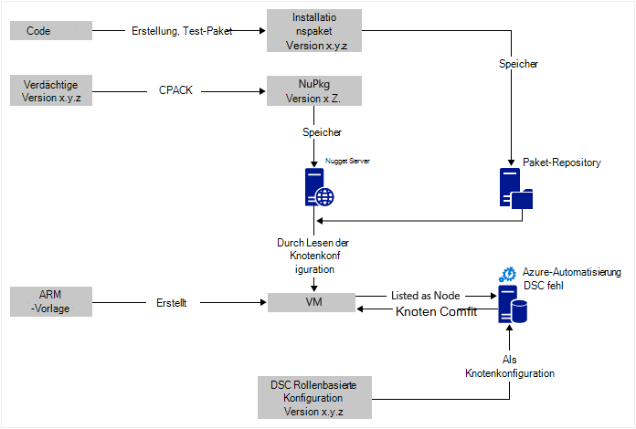
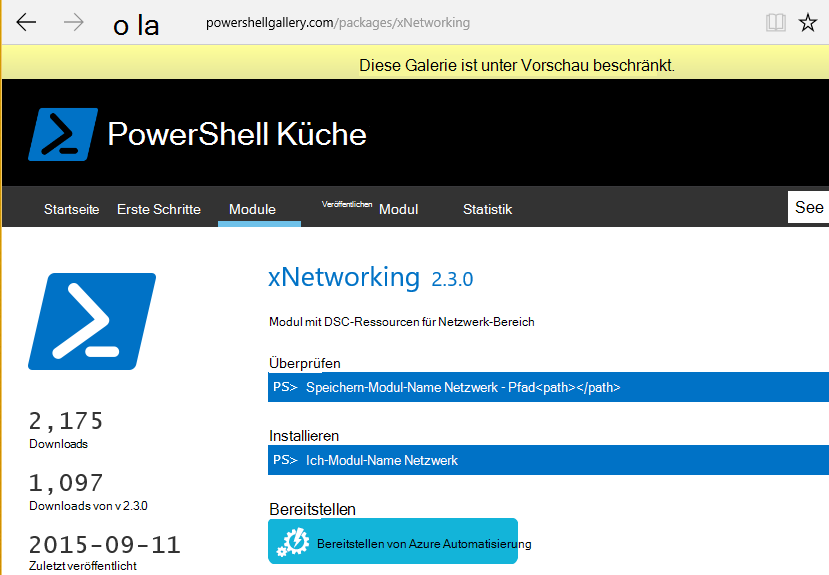

<properties
   pageTitle="Azure Automation DSC kontinuierliche Bereitstellung Schokoladig | Microsoft Azure"
   description="Kontinuierliche Bereitstellung DevOps Azure Automation DSC mit Schokoladig Paket-Manager.  Beispiel mit vollständigen JSON ARM-Vorlage und PowerShell Quelle."
   services="automation"
   documentationCenter=""
   authors="sebastus"
   manager="stevenka"
   editor=""/>

<tags
   ms.service="automation"
   ms.devlang="na"
   ms.topic="article"
   ms.tgt_pltfrm="vm-windows"
   ms.workload="na"
   ms.date="08/08/2016"
   ms.author="golive"/>

# Verwendungsbeispiel: Kontinuierliche Bereitstellung virtueller Maschinen Automatisierung DSC mit Chocolatey

In einer Welt DevOps sind viele Tools, die mit verschiedenen Punkten in der Pipeline fortlaufende Integration.  Azure Automatisierung gewünschte Konfiguration (DSC) ist eine willkommene Ergänzung neue Optionen, die DevOps-Teams verwenden können.  Dieser Artikel veranschaulicht das Festlegen von kontinuierlichen Bereitstellung (CD) für einen Computer.  Die Technik zur beliebig viele Windows Computer ggf. die Rolle (z. B. eine Website) und von dort auch zusätzliche Rollen können leicht erweitern.

## Auf hoher Ebene

Gibt es einiges los, aber Glücklicherweise kann in beiden wesentlichen Prozesse unterteilt werden: 

  - Schreiben von Code testen, erstellen und Veröffentlichen von Installationspaketen für Haupt- und Nebenversionen Versionen des Systems. 
  - Erstellen und Verwalten von VMs, die installieren und Ausführen von Code in den Paketen.  

Sobald diese zentrale Prozesse vorhanden sind, ist es zu automatisch das Paket auf bestimmten VM neue Versionen erstellt und bereitgestellt werden.

## Komponenten

Paket-Manager wie [apt-Get](https://en.wikipedia.org/wiki/Advanced_Packaging_Tool) sind ziemlich gut bekannt weltweit Linux, aber nicht in der Windows-Welt.  [Chocolatey](https://chocolatey.org/) ist und Scott Hanselmans [Blog](http://www.hanselman.com/blog/IsTheWindowsUserReadyForAptget.aspx) zum Thema ist eine hervorragende Einführung.  Kurz gesagt, können mit Chocolatey Pakete von einem zentralen Repository Pakete in einem Windows-System mithilfe der Befehlszeile installieren.  Erstellen und verwalten Ihre eigenen Repository und Chocolatey können Pakete aus einer beliebigen Anzahl von Repositories, die Sie festlegen.

Gewünschten Status Konfiguration (DSC) ([Übersicht](https://technet.microsoft.com/library/dn249912.aspx)) ist ein PowerShell-Tool, mit dem Sie die Konfiguration deklarieren, die für einen Computer aus.  Sie können z. B., "Chocolatey installiert werden soll, IIS installiert werden soll, Port 80 geöffnet werden soll, Version 1.0.0 meiner Website installiert werden soll."  DSC lokale Configuration Manager (LCM) implementiert die Konfiguration. Ein DSC ziehen Server enthält ein Repository von Konfigurationen für Ihre Computer. LCM auf jedem Computer überprüft regelmäßig, ob die Konfiguration die gespeicherte Konfiguration übereinstimmt. Sie können Status gemeldet oder versuchen, um den Computer wieder mit der gespeicherten Konfiguration. Sie können die gespeicherte Konfiguration auf dem Server ziehen zu einer Maschine oder Maschinen mit geänderter Konfiguration zu bearbeiten.

Azure-Automatisierung ist ein verwalteter Dienst in Microsoft Azure, die mit Runbooks, Knoten, Anmeldeinformationen, Ressourcen wie Zeitpläne und globale Variablen Aufgaben automatisieren können. Azure Automation DSC erweitert diese Funktion zur Automatisierung, PowerShell DSC-Tools enthält.  Hier ist eine gute [Übersicht](automation-dsc-overview.md).

DSC-Ressource ist ein Modul Code mit spezifischen Funktionen wie Netzwerk, Active Directory oder SQL Server verwalten.  Chocolatey DSC-Ressource kann Zugriff auf einen NuGet Server (unter anderem), Pakete herunterladen, Installationspakete usw..  Gibt es viele andere DSC-Ressourcen in der [PowerShell-Galerie](http://www.powershellgallery.com/packages?q=dsc+resources&prerelease=&sortOrder=package-title).  Diese Module sind in Ihren Azure DSC ziehen Automatisierungsserver (von Ihnen) installiert, damit sie Ihre Konfigurationen verwendet werden können.

ARM-Vorlagen bieten eine deklarative generieren Ihrer Infrastruktur - Dinge wie Netzwerke, Subnetze, Sicherheit und routing Balancers NICs, VMs, und laden.  Hier ist ein [Artikel](../resource-manager-deployment-model.md) , der das ARM Bereitstellungsmodell (deklarativen) Azure Service Management (ASM oder Classic) vergleicht Bereitstellungsmodell (Imperative).  Und ein weiterer [Artikel](../virtual-machines/virtual-machines-windows-compare-deployment-models.md) über Core Ressourcenprovider, Compute, Speicher und Netzwerk.

Ein wesentliches Merkmal einer ARM-Vorlage besteht darin, eine VM-Erweiterung die VM installieren wie bereitgestellt wird.  VM-Erweiterung hat bestimmte Funktionen oder Ausführen eines benutzerdefinierten Skripts, Antivirensoftware installieren, ein Konfigurationsskript DSC ausgeführt.  Es gibt viele Arten von VM-Erweiterungen.

## Um das Diagramm Abstecher

Oben beginnen, fügen Sie Ihren Code erstellen testen, und ein Installationspaket erstellen.  Chocolatey kann verschiedene Arten von Installationspaketen wie MSI MSU, ZIP behandeln.  Und die volle Leistungsfähigkeit von PowerShell dazu die Installation ganz auf systemeigenen Funktionen des Chocolatey nicht.  Legen Sie das Paket in irgendwo erreichbar-Paket-Repository.  Dieses Beispiel für die Verwendung verwendet einen öffentlichen Ordner in einem Konto Azure BLOB-Speicher, aber überall sein.  Chocolatey arbeitet direkt mit NuGet Server und andere für die Verwaltung von Metadaten Pakets.  [Dieser Artikel](https://github.com/chocolatey/choco/wiki/How-To-Host-Feed) beschreibt die Optionen.  Dieses Beispiel für die Verwendung verwendet NuGet.  Ein Nuspec sind Metadaten über Ihre Pakete.  Der Nuspec "kompilierte" des NuPkg und in NuGet-Server gespeichert.  Bei die Konfiguration ein Pakets nach Namen anfordert und NuGet-Server verweist, holt das Paket Chocolatey DSC-Ressource (jetzt auf die VM) und für Sie installiert.  Sie können auch eine bestimmte Version eines Pakets anfordern.

Im unteren linken Bereich des Bildes ist eine Vorlage Azure Resource Manager (ARM).  In diesem Beispiel für die Verwendung registriert die VM-Erweiterung die VM mit Azure Automation DSC Pull-Server (pullserver) als Knoten.  Die Konfiguration wird im pullserver gespeichert.  Tatsächlich gespeichert ist zweimal: einmal als Text und als eine MOF-Datei kompiliert (für diejenigen, die solche Dinge wissen.)  MOF ist im Portal "Knoten Configuration" (nicht einfach "Configuration").  Es ist das Artefakt, das mit einem Knoten verbunden ist, damit der Knoten seine Konfiguration wissen.  Unten zeigen, wie die Knoten dem Knoten zuweisen.

Sie tun vermutlich bereits oben oder die meisten Bit.  Die Nuspec erstellen, kompilieren und speichern in einem NuGet ist klein.  Und Sie bereits VMs verwalten.  Im nächsten Schritt erfordert zur kontinuierlichen Bereitstellung fehl (einmal) einrichten, registrieren Knoten (einmal), und erstellen und speichern die Konfiguration (anfänglich).  Pakete werden aktualisiert und in das Repository bereitgestellt aktualisieren Sie Konfiguration und Konfiguration Knoten im pullserver (ggf. wiederholen).

Wenn Sie nicht mit einer ARM-Vorlage beginnen, ist auch OK.  PowerShell-Cmdlets sollen Ihre VMs mit pullserver alle registriert werden Weitere Informationen finden Sie in diesem Artikel: [Onboarding-Computer für die Verwaltung von Azure Automation DSC](automation-dsc-onboarding.md)

## Schritt 1: Einrichten Pull Server und Automatisierung

Eine authentifizierte (Add-AzureRmAccount) PowerShell-Befehlszeile: (dauert einige Minuten während der pullserver eingerichtet ist)

    New-AzureRmResourceGroup –Name MY-AUTOMATION-RG –Location MY-RG-LOCATION-IN-QUOTES
    New-AzureRmAutomationAccount –ResourceGroupName MY-AUTOMATION-RG –Location MY-RG-LOCATION-IN-QUOTES –Name MY-AUTOMATION-ACCOUNT 

Stellt Ihr automatisierungskonto in folgende Bereiche (aka Location): USA 2 OST südlichen zentralen USA, US Gov Virginia, Westeuropa, Südostasien, Japan OST, zentralen Indien und Australien Südost.

## Schritt 2: VM Erweiterung Optimierungen der ARM-Vorlage

Details zur VM Registrierung (mit der Erweiterung PowerShell DSC VM) in [Azure Schnellstart Vorlage](https://github.com/Azure/azure-quickstart-templates/tree/master/dsc-extension-azure-automation-pullserver).  Dadurch registriert der neue VM pullserver in der Liste der DSC-Knoten.  Diese Registrierung ist Knotenkonfiguration auf den Knoten angewendet werden soll.  Diese Knotenkonfiguration muss noch im pullserver vorhanden ist OK, die Schritt 4, wo dies zum ersten Mal erfolgt.  Aber hier müssen Sie in Schritt2 der Name des Knotens und der Name der Konfiguration entschieden haben.  In diesem Beispiel für die Verwendung der Knoten 'Isvbox' und 'ISVBoxConfig' ist die Konfiguration.  So ist der Knoten Configuration Name (in DeploymentTemplate.json angegeben werden) 'ISVBoxConfig.isvbox'.  

## Schritt 3: pullserver erforderliche DSC-Ressourcen hinzufügen

PowerShell-Galerie wird instrumentiert berücksichtigt Azure Automation DSC-Ressourcen installieren.  Navigieren Sie zu der Ressource, und klicken Sie auf "bereitstellen, Azure-Automation.

Eine andere Technik, die vor kurzem zum Azure-Portal können Sie in neuen Modulen oder aktualisieren vorhandene Module. Klicken Sie auf die Ressource Automatisierung, Anlagen Kachel und Module nebeneinander.  Galerie durchsuchen-Symbol können Sie finden in der Liste der Module in der Galerie, Drilldown zu Details und letztendlich in Automation-Konto importieren. Dies ist eine hervorragende Möglichkeit, die Module von Zeit zu Zeit Stand. Und die Importfunktion überprüft Abhängigkeiten mit anderen Modulen um sicherzustellen, dass nichts synchronisiert wird.

Oder es ist beim manuellen vorgehen.  Die Ordnerstruktur einer PowerShell-Integrationsmodul für einen Computer wird unterscheidet sich etwas von der Ordnerstruktur von Azure Automation erwartet.  Dies erfordert etwas Feinabstimmung Ihrer Seite.  Aber es ist nicht schwer und erfolgt nur einmal pro Ressource (sofern es zukünftig aktualisieren möchten.)  Weitere Informationen über das Erstellen von PowerShell Integrationsmodule finden Sie in diesem Artikel: [Authoring Integration Modules für Azure Automation](https://azure.microsoft.com/blog/authoring-integration-modules-for-azure-automation/)

-   Installieren Sie das Modul, die Sie auf Ihrer Workstation wie folgt:
    -   Installieren von [Windows Management Framework, v5](http://aka.ms/wmf5latest) (nicht erforderlich für Windows 10)
    -   `Install-Module –Name MODULE-NAME`< – Holt das Modul aus der PowerShell-Galerie 
-   Kopieren Sie den Ordner Module von `c:\Program Files\WindowsPowerShell\Modules\MODULE-NAME` in einen temporären Ordner 
-   Beispiele und Dokumentation von Hauptordner löschen 
-   ZIP-Hauptordner Benennung der ZIP-Datei genau wie der Ordner 
-   Versetzen Sie die ZIP-Datei in einen erreichbar HTTP-Speicherort wie BLOB-Speicher in einem Azure Storage-Konto
-   Diese PowerShell ausführen:

        New-AzureRmAutomationModule `
            -ResourceGroupName MY-AUTOMATION-RG -AutomationAccountName MY-AUTOMATION-ACCOUNT `
            -Name MODULE-NAME –ContentLink "https://STORAGE-URI/CONTAINERNAME/MODULE-NAME.zip"
        

Im Beispiel führt folgendermaßen für cChoco und xNetworking. Siehe [Hinweise](#notes) für spezielle Behandlung für cChoco.

## Schritt 4: pullserver Knotenkonfiguration hinzufügen

Es ist nichts Besonderes erstmals fehl und Kompilieren Ihrer Konfiguration importieren.  Alle nachfolgenden Import/kompiliert mit derselben Konfiguration aussehen genau gleich.  Jedes Mal Sie aktualisieren Ihr Paket und Produktion ausrücken möchten diesen Schritt stellen Sie sicher, dass die Konfigurationsdatei richtig ist – die neue Version des Pakets.  Hier ist die Konfigurationsdatei und PowerShell:

ISVBoxConfig.ps1:

    Configuration ISVBoxConfig 
    { 
        Import-DscResource -ModuleName cChoco 
        Import-DscResource -ModuleName xNetworking
    
        Node "isvbox" {   
    
            cChocoInstaller installChoco 
            { 
                InstallDir = "C:\choco" 
            }
    
            WindowsFeature installIIS 
            { 
                Ensure="Present" 
                Name="Web-Server" 
            }
    
            xFirewall WebFirewallRule 
            { 
                Direction = "Inbound" 
                Name = "Web-Server-TCP-In" 
                DisplayName = "Web Server (TCP-In)" 
                Description = "IIS allow incoming web site traffic." 
                DisplayGroup = "IIS Incoming Traffic" 
                State = "Enabled" 
                Access = "Allow" 
                Protocol = "TCP" 
                LocalPort = "80" 
                Ensure = "Present" 
            }
    
            cChocoPackageInstaller trivialWeb 
            {            
                Name = "trivialweb" 
                Version = "1.0.0" 
                Source = “MY-NUGET-V2-SERVER-ADDRESS” 
                DependsOn = "[cChocoInstaller]installChoco", 
                "[WindowsFeature]installIIS" 
            } 
        }    
    }

Neu-ConfigurationScript.ps1:

    Import-AzureRmAutomationDscConfiguration ` 
        -ResourceGroupName MY-AUTOMATION-RG –AutomationAccountName MY-AUTOMATION-ACCOUNT ` 
        -SourcePath C:\temp\AzureAutomationDsc\ISVBoxConfig.ps1 ` 
        -Published –Force
    
    $jobData = Start-AzureRmAutomationDscCompilationJob ` 
        -ResourceGroupName MY-AUTOMATION-RG –AutomationAccountName MY-AUTOMATION-ACCOUNT ` 
        -ConfigurationName ISVBoxConfig 
    
    $compilationJobId = $jobData.Id
    
    Get-AzureRmAutomationDscCompilationJob ` 
        -ResourceGroupName MY-AUTOMATION-RG –AutomationAccountName MY-AUTOMATION-ACCOUNT ` 
        -Id $compilationJobId

Diese Schritte führen eine neue Knotenkonfiguration namens "ISVBoxConfig.isvbox" auf den Server ziehen.  Namen der Knoten wird als "configurationName.nodeName" erstellt.

## Schritt 5: Erstellen und Verwalten von Paket-Metadaten

Für jedes Paket Paket-Repository abgelegt, benötigen Sie ein Nuspec, das es beschreibt.  Dieser Nuspec kompiliert und in die NuGet-Server gespeichert. Dieser Prozess beschrieben [hier](http://docs.nuget.org/create/creating-and-publishing-a-package).  Sie können MyGet.org als NuGet-Server verwenden.  Dieser Service verkaufen, sondern haben Starter SKU ist.  Unter "NuGet.org" finden Sie Informationen auf eigene NuGet-Installation für Ihre private Pakete.

## Schritt 6: Letzte Schritte

Jedes Mal eine Version QA übergibt und ist für die Bereitstellung wird des Pakets erstellt, Nuspec und Nupkg aktualisiert und auf dem NuGet-Server bereitgestellt.  Darüber hinaus muss die Konfiguration (Schritt 4 oben) aktualisiert werden die neue Versionsnummer zustimmen.  Sie müssen an den pullserver gesendet und kompiliert.  Ab diesem Zeitpunkt liegt es auf VMs, die auf die Konfiguration des Updates und installieren Sie es.  Diese Updates sind einfach - nur ein oder zwei von PowerShell.  Bei Visual Studio Team Services sind davon in Buildaufgaben gekapselt, die in einem Build verkettet werden können.  Dieser [Artikel](https://www.visualstudio.com/en-us/docs/alm-devops-feature-index#continuous-delivery) enthält weitere Informationen.  Diese [GitHub Repo](https://github.com/Microsoft/vso-agent-tasks) werden die verschiedenen verfügbaren Buildaufgaben.

## Notizen

Dieses Beispiel für die Verwendung mit einem VM ein allgemeines Windows Server 2012 R2 Bild aus der Galerie Azure wird gestartet.  Sie können gespeicherte Bild ab und Optimieren mit DSC-Konfiguration.  Gebacken in ein Bild ändern ist jedoch schwieriger als die Konfiguration mit DSC dynamisch aktualisieren.

Sie müssen ein ARM-Vorlage und die VM-Erweiterung verwenden diese Technik mit Ihrer virtuellen Computer verwendet.  Und Ihre VMs müssen auf Azure zu CD-Verwaltung.  Erforderlich ist, dass Chocolatey installiert und LCM auf dem virtuellen Computer so konfiguriert, dass er weiß, wo die fehl.  

Natürlich müssen Sie beim Aktualisieren eines Pakets auf einem virtuellen Computer, die in der Produktion die VM aus der Rotation übernehmen, während das Update installiert ist.  Die Vorgehensweise unterschiedlich.  Beispielsweise können mit einer VM hinter einem Lastenausgleich Azure benutzerdefinierte Prüfpunkt hinzufügen.  Haben Sie während der Aktualisierung der VM Prüfpunkt Endpunkt 400 zurück.  Tweak erforderlich, diese Änderung kann in der Konfiguration wie optimieren, um es wieder 200 zurückgeben, nachdem die Aktualisierung abgeschlossen ist.

Vollständige ist Verwendung beispielsweise [das Visual Studio-Projekt](https://github.com/sebastus/ARM/tree/master/CDIaaSVM) auf GitHub.

##Verwandte Artikel##

- [Azure Automation DSC Overview] (Automatisierung-dsc-overview.md)
- [Azure Automation DSC Cmdlets] (https://msdn.microsoft.com/library/mt244122.aspx)
- [Onboarding-Computer für die Verwaltung von Azure Automation DSC] (Automatisierung-dsc-onboarding.md)
