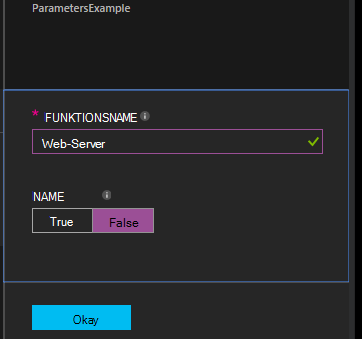

<properties 
   pageTitle="Konfigurationen in Azure Automation DSC kompilieren | Microsoft Azure" 
   description="Übersicht über zwei Arten Konfigurationen gewünschten Zustand Konfiguration (DSC) kompilieren: im Azure-Portal und Windows PowerShell. " 
   services="automation" 
   documentationCenter="na" 
   authors="coreyp-at-msft" 
   manager="stevenka" 
   editor="tysonn"/>

<tags
   ms.service="automation"
   ms.devlang="na"
   ms.topic="article"
   ms.tgt_pltfrm="powershell"
   ms.workload="na" 
   ms.date="01/25/2016"
   ms.author="coreyp"/>
   
#Konfigurationen in Azure Automation DSC kompilieren#

Konfigurationen gewünschten Zustand Konfiguration (DSC) auf zwei Arten mit Azure Automation kompilieren: im Azure-Portal und Windows PowerShell. In der folgenden Tabelle helfen Ihnen zu bestimmen, wann welche Methode anhand der Merkmale: 

###Der Azure-vorschauportal###
- Einfachste Methode interaktive Benutzeroberfläche
- Formular zu einfachen Parameterwerte
- Verfolgen Sie den Job-Status
- Zugriff mit Azure Anmeldung authentifiziert

###Windows PowerShell###
- Rufen Sie aus Befehlszeile mit Windows PowerShell-Cmdlets auf
- Können in automatisierte Lösung mit mehreren Schritten einbezogen werden
- Einfache und komplexe verbunden
- Job Status
- Client für die Unterstützung von PowerShell-Cmdlets erforderlich
- Übergeben von ConfigurationData
- Kompilieren Sie Konfigurationen mit Anmeldeinformationen

Nachdem Sie eine Kompilierung Methode entschieden haben, können Sie die jeweiligen Verfahren unten kompilieren folgen.

##Kompilieren einer DSC-Konfiguration mit der Azure-portal##

1.  **Klicken Sie in Ihrem automatisierungskonto.**
2.  Klicken Sie auf eine Konfiguration der Blade öffnen.
3.  Klicken Sie auf **Kompilieren**.
4.  Wenn die Konfiguration keine Parameter hat, werden Sie aufgefordert zu bestätigen, dass Sie kompilieren möchten. Die Konfiguration über Parameter verfügt, öffnet **Konfiguration kompilieren** Blade Parameterwerte bieten zu können. Abschnitt <a href="#basic-parameters">**Eckwerte**</a> unter Details auf Parameter.
5.  Blade **-Kompilierungsauftrag** wird geöffnet, damit die Kompilierung Auftragsstatus und verursacht auf Azure DSC ziehen Automatisierungsserver Knoten-Konfigurationen (MOF-Konfigurationsdokumente) nachverfolgen können.

##Kompilieren einer DSC-Konfigurations mit Windows PowerShell##

Sie können [`Start-AzureRmAutomationDscCompilationJob`](https://msdn.microsoft.com/library/mt244118.aspx) mit Windows PowerShell starten. Der folgende Code startet Kompilierung DSC Testkonfiguration **SampleConfig**.

    Start-AzureRmAutomationDscCompilationJob -ResourceGroupName "MyResourceGroup" -AutomationAccountName "MyAutomationAccount" -ConfigurationName "SampleConfig" 
 
`Start-AzureRmAutomationDscCompilationJob`Gibt ein Auftragsobjekt Kompilierung, mit denen Sie ihren Status verfolgen. Können Sie diese Kompilierung Auftragsobjekt mit [`Get-AzureRmAutomationDscCompilationJob`](https://msdn.microsoft.com/library/mt244120.aspx) den Status des Auftrags Kompilierung bestimmen und [`Get-AzureRmAutomationDscCompilationJobOutput`](https://msdn.microsoft.com/library/mt244103.aspx) der Streams (Ausgabe) anzeigen. Der folgende Beispielcode Kompilierung **SampleConfig** Konfiguration gestartet, wartet, bis es abgeschlossen hat, und dann die Streams zeigt.
    
    $CompilationJob = Start-AzureRmAutomationDscCompilationJob -ResourceGroupName "MyResourceGroup" -AutomationAccountName "MyAutomationAccount" -ConfigurationName "SampleConfig"
    
    while($CompilationJob.EndTime –eq $null -and $CompilationJob.Exception –eq $null)           
    {
        $CompilationJob = $CompilationJob | Get-AzureRmAutomationDscCompilationJob
        Start-Sleep -Seconds 3
    }
    
    $CompilationJob | Get-AzureRmAutomationDscCompilationJobOutput –Stream Any 

##Eckwerte##

Parameterdeklaration DSC-Konfigurationen, einschließlich Parametertypen und Eigenschaften ist in Azure Automation Runbooks. Anzeigen Sie erfahren Sie mehr über Runbook Parameter [ein Runbook in Azure Automation starten](automation-starting-a-runbook.md)

Das folgende Beispiel verwendet zwei Parameter **Funktionsname** und **Name**, bestimmen die Werte der Eigenschaften in der **ParametersExample.sample** Knoten während der Kompilierung generiert.

    Configuration ParametersExample
    {
        param(
            [Parameter(Mandatory=$true)]
    
            [string] $FeatureName,
    
            [Parameter(Mandatory=$true)]
            [boolean] $IsPresent
        )
    
        $EnsureString = "Present"
        if($IsPresent -eq $false)
        {
            $EnsureString = "Absent"
        }
    
        Node "sample"
        {
            WindowsFeature ($FeatureName + "Feature")
            {
                Ensure = $EnsureString
                Name = $FeatureName
            }
        }
    }

Kompilieren Sie die Eckwerte in Azure Automation DSC-Portal oder Azure PowerShell verwenden DSC-Konfigurationen:

###Portal###

Im Portal können Sie Parameterwerte eingeben, nachdem Sie auf **Kompilieren**.

###PowerShell###

PowerShell erfordert Parameter in einer [Hashtabelle](http://technet.microsoft.com/library/hh847780.aspx) , der Schlüssel entspricht den Parameternamen und der Wert ist gleich den Parameterwert.

    $Parameters = @{
            "FeatureName" = "Web-Server"
            "IsPresent" = $False
    }
    
    
    Start-AzureRmAutomationDscCompilationJob -ResourceGroupName "MyResourceGroup" -AutomationAccountName "MyAutomationAccount" -ConfigurationName "ParametersExample" -Parameters $Parameters 
    

Informationen PSCredentials als Parameter übergeben werden finden Sie unter <a href="#credential-assets">**Anmeldeinformationen Elemente**</a> unten.

##ConfigurationData##

**ConfigurationData** können Sie strukturelle Konfiguration Umgebung spezielle Konfiguration mit PowerShell DSC trennen. Finden Sie weitere Informationen zu **ConfigurationData** ["Was" "Where" in PowerShell DSC trennt](http://blogs.msdn.com/b/powershell/archive/2014/01/09/continuous-deployment-using-dsc-with-minimal-change.aspx) .

>[AZURE.NOTE] Sie können **ConfigurationData** in Azure Automation DSC mit Azure PowerShell jedoch nicht in der Azure-Portal zu kompilieren.

Beispiel DSC Konfiguration verwendet **ConfigurationData** über die **$ConfigurationData** und **$AllNodes** -Schlüsselwörter. Für dieses Beispiel benötigen Sie auch das [ **xWebAdministration** -Modul](https://www.powershellgallery.com/packages/xWebAdministration/) :

     Configuration ConfigurationDataSample
     {
        Import-DscResource -ModuleName xWebAdministration -Name MSFT_xWebsite
    
        Write-Verbose $ConfigurationData.NonNodeData.SomeMessage 
    
        Node $AllNodes.Where{$_.Role -eq "WebServer"}.NodeName
        {
            xWebsite Site
            {
                Name = $Node.SiteName
                PhysicalPath = $Node.SiteContents
                Ensure   = "Present"
            }
        }
    }

Sie können die DSC-Konfiguration über PowerShell kompilieren. Die folgenden PowerShell hinzugefügt zwei Knoten Konfigurationen Azure DSC ziehen Automatisierungsserver: **ConfigurationDataSample.MyVM1** und **ConfigurationDataSample.MyVM3**:

    $ConfigData = @{
        AllNodes = @(
            @{
                NodeName = "MyVM1"
                Role = "WebServer"
            },
            @{
                NodeName = "MyVM2"
                Role = "SQLServer"
            },
            @{
                NodeName = "MyVM3"
                Role = "WebServer"
    
            }
    
        )
    
        NonNodeData = @{
            SomeMessage = "I love Azure Automation DSC!"
    
        }
    
    } 
    
    Start-AzureRmAutomationDscCompilationJob -ResourceGroupName "MyResourceGroup" -AutomationAccountName "MyAutomationAccount" -ConfigurationName "ConfigurationDataSample" -ConfigurationData $ConfigData

##Anlagen##

Anlage Verweise sind in Azure Automation DSC-Konfigurationen und Runbooks. Finden Sie weitere Informationen:

- [Zertifikate](automation-certificates.md)
- [Anschlüsse](automation-connections.md)
- [Anmeldeinformationen](automation-credentials.md)
- [Variablen](automation-variables.md)

###Anmeldeinformationen Anlagen###
Während DSC-Konfigurationen in Azure Automation Anmeldeinformationen Anlagen mit **Get-AzureRmAutomationCredential**referenzieren können, können Anmeldeinformationen Anlagen auch über Parameter übergeben werden bei Bedarf. Nimmt eine Konfiguration einen Parameter vom Typ **PSCredential** , müssen Sie den Namen der Anlage Anmeldeinformationen Azure Automation als Wert des Parameters ein PSCredential-Objekt übergeben. Im Hintergrund wird Azure Automation Anmeldeinformationen Ressource mit diesem Namen abgerufen und die Konfiguration an.

Halten Anmeldeinformationen erfordert sichere Knoten Konfigurationen (MOF-Konfigurationsdokumente) verschlüsseln die Anmeldeinformationen in der Konfigurationsdatei MOF-Knoten. Azure Automation geht einen Schritt weiter und verschlüsselt die gesamte MOF-Datei. Allerdings müssen derzeit Sie PowerShell DSC sagen Anmeldeinformationen in Klartext ausgegeben werden, während der Knoten Konfiguration MOF-Generierung werden da PowerShell DSC nicht weiß, dass Azure Automation nach seiner Generierung über einen Job Kompilierung die gesamte MOF-Datei verschlüsseln werden wird.

Sie können PowerShell DSC feststellen, dass Anmeldeinformationen im Klartext in der Konfiguration generierte Knoten MOF-Dateien mit <a href="#configurationdata">**ConfigurationData**</a>ausgegeben werden. Übergeben Sie `PSDscAllowPlainTextPassword = $true` über **ConfigurationData** für jeden Knoten Block Namen erscheint in der DSC-Konfiguration und Anmeldeinformationen verwendet.

Das folgende Beispiel zeigt eine DSC-Konfiguration, die Anlage Anmeldeinformationen Automatisierung verwendet.

    Configuration CredentialSample
    {
       $Cred = Get-AzureRmAutomationCredential -Name "SomeCredentialAsset"
    
        Node $AllNodes.NodeName
        { 
            File ExampleFile
            { 
                SourcePath = "\\Server\share\path\file.ext" 
                DestinationPath = "C:\destinationPath" 
                Credential = $Cred 
            }
        }
    }

Sie können die DSC-Konfiguration über PowerShell kompilieren. Die folgenden PowerShell hinzugefügt zwei Knoten Konfigurationen Azure DSC ziehen Automatisierungsserver: **CredentialSample.MyVM1** und **CredentialSample.MyVM2**.

    $ConfigData = @{
        AllNodes = @(
            @{
                NodeName = "*"
                PSDscAllowPlainTextPassword = $True
            },
            @{
                NodeName = "MyVM1"
            },
            @{
                NodeName = "MyVM2"
            }
        )
    }
    
    Start-AzureRmAutomationDscCompilationJob -ResourceGroupName "MyResourceGroup" -AutomationAccountName "MyAutomationAccount" -ConfigurationName "CredentialSample" -ConfigurationData $ConfigData
