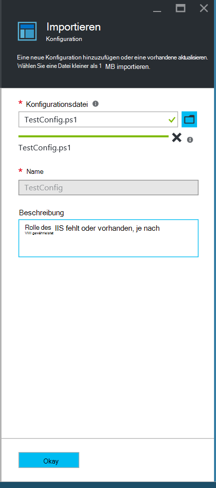
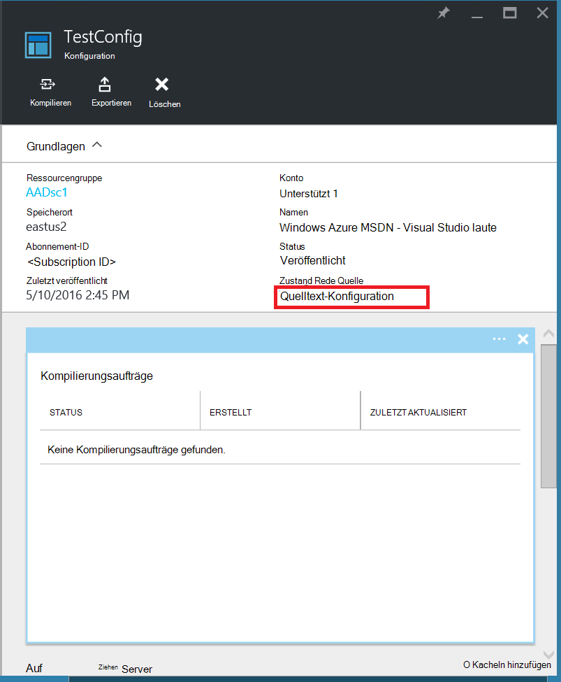
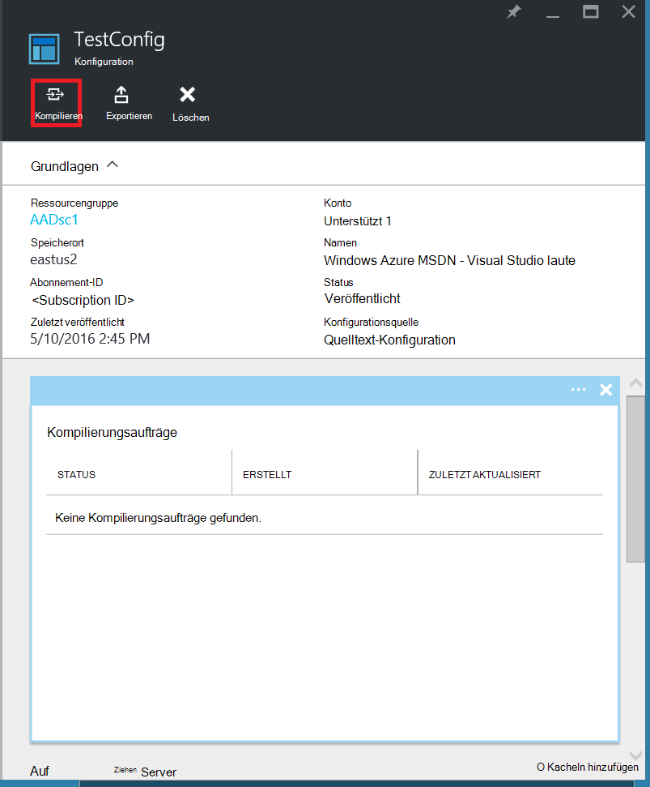
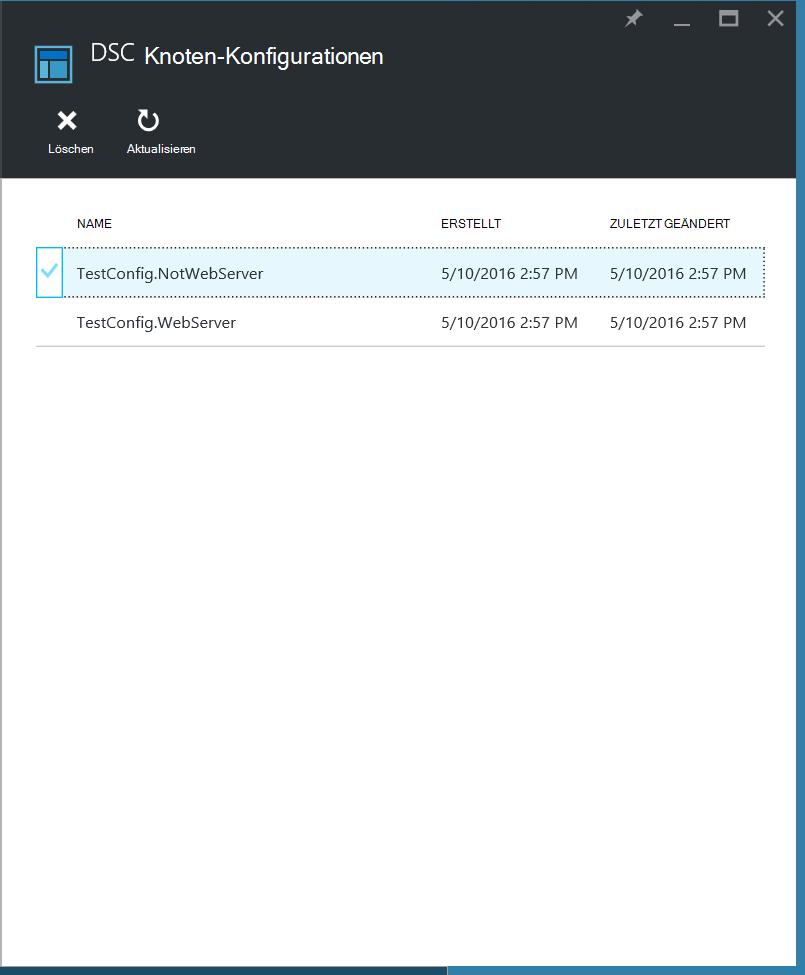
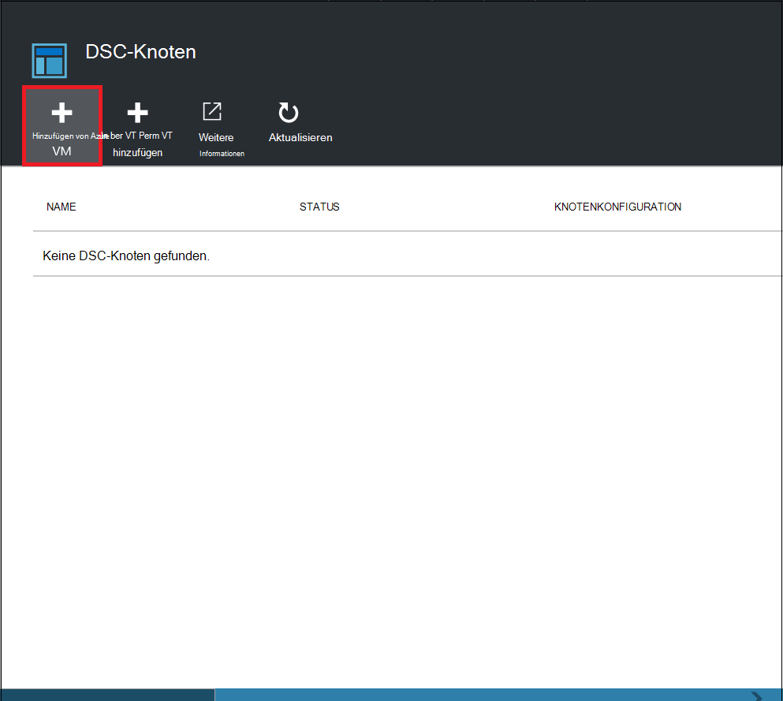
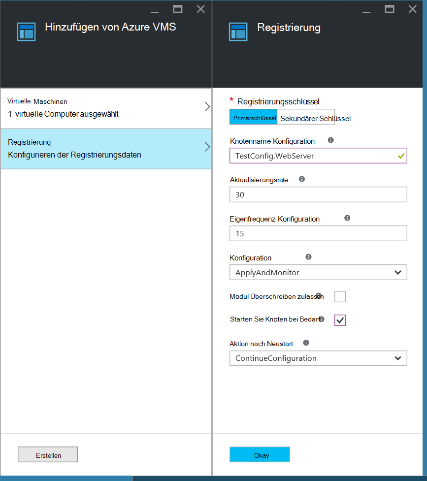
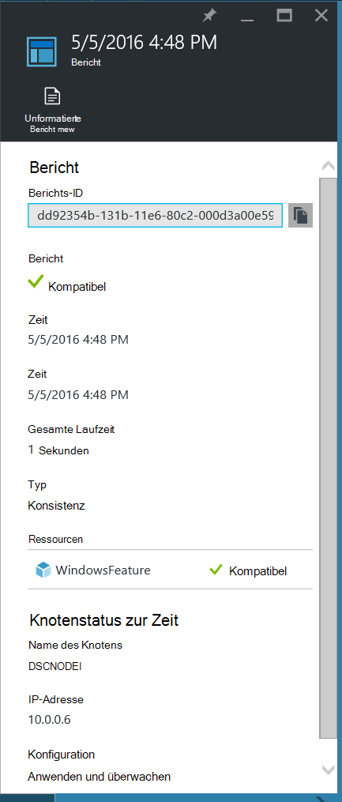
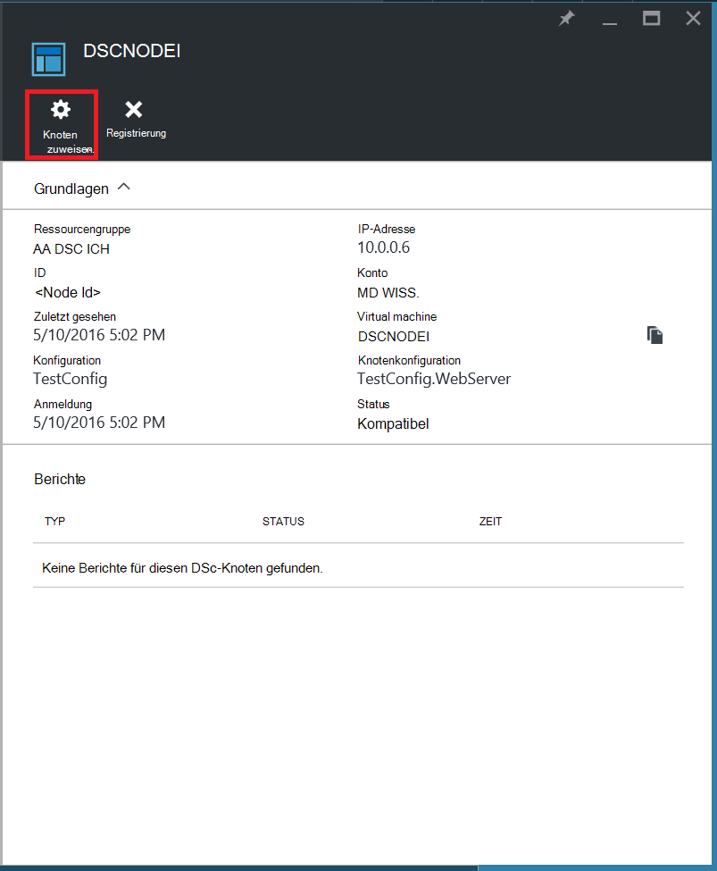
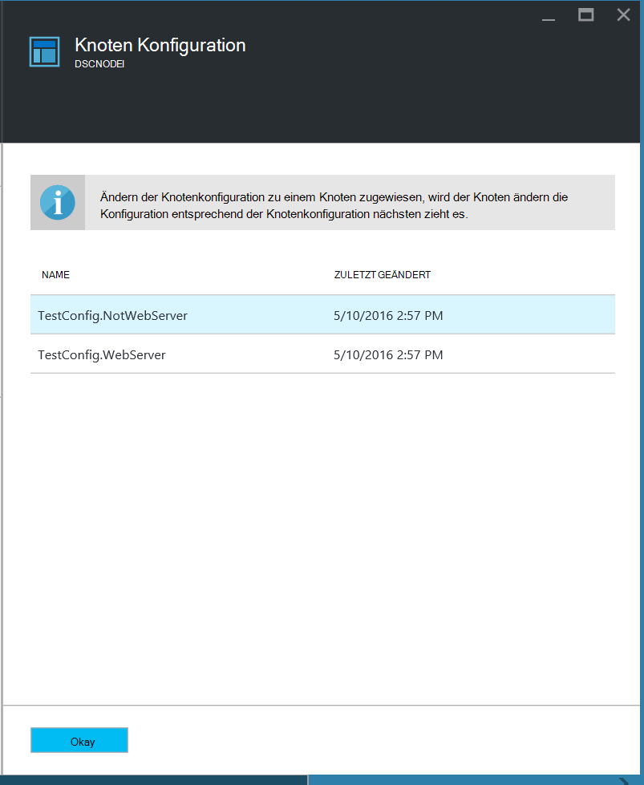
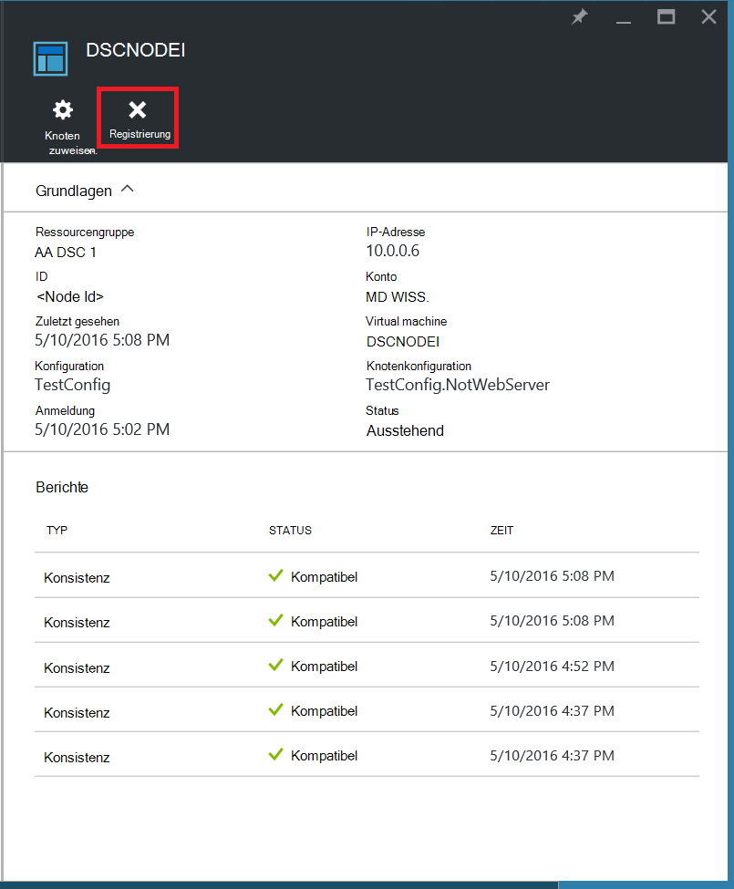

<properties
   pageTitle="Erste Schritte mit Azure Automation DSC"
   description="Erläuterung und Beispiele für die häufigsten Aufgaben in Azure Automation gewünschten Zustand Konfiguration (DSC)"
   services="automation" 
   documentationCenter="na" 
   authors="eslesar" 
   manager="dongill" 
   editor="tysonn"/>

<tags
   ms.service="automation"
   ms.devlang="na"
   ms.topic="article"
   ms.tgt_pltfrm="powershell"
   ms.workload="na" 
   ms.date="06/06/2016"
   ms.author="magoedte;eslesar"/>
   

# <a name="getting-started-with-azure-automation-dsc"></a>Erste Schritte mit Azure Automation DSC

Dieses Thema erläutert die häufigsten Aufgaben mit Azure Automation gewünschten Zustand Konfiguration (DSC), z. B. erstellen, importieren, kompilieren Konfigurationen Onboarding Computer verwalten und Anzeigen von Berichten. Finden Sie eine Übersicht der Azure Automation DSC [Azure Automation DSC Overview](automation-dsc-overview.md). DSC-Dokumentation finden Sie unter [Windows PowerShell gewünschten Zustand (Übersicht)](https://msdn.microsoft.com/PowerShell/dsc/overview).

Dieses Thema enthält eine schrittweise Anleitung zur Verwendung von Azure Automation DSC. Soll eine beispielumgebung, die bereits eingerichtet ist, ohne die Schritte in diesem Thema beschriebenen, können Sie [die folgenden ARM-Vorlage](https://github.com/azureautomation/automation-packs/tree/master/102-sample-automation-setup). Diese Vorlage stellt einen abgeschlossenen Azure Automation DSC-Umgebung, einschließlich Azure-VM, die von Azure Automation DSC verwaltet.
 
## <a name="prerequisites"></a>Erforderliche Komponenten

Schließen Sie die Beispiele in diesem Thema wird Folgendes benötigt:

- Ein Azure Automation-Konto. Informationen zum Erstellen eines Kontos Azure Automatisierung ausführen als [Azure ausführen als Konto](automation-sec-configure-azure-runas-account.md)angezeigt.
- Ein Azure Ressourcenmanager VM (nicht Classic) unter Windows Server 2008 R2 oder höher. Informationen zum Erstellen eines virtuellen Computers finden Sie unter [erstellen Ihre erste Windows virtuellen Computer in Azure-portal](../virtual-machines/virtual-machines-windows-hero-tutorial.md)

## <a name="creating-a-dsc-configuration"></a>Erstellen einer DSC-Konfiguration

Wir erstellen eine einfache [DSC-Konfiguration](https://msdn.microsoft.com/powershell/dsc/configurations) , die das Vorhandensein oder fehlen von **Webserver** Windows Funktion (IIS), je nach Knoten Zuweisung sicherstellt.

1. Starten Sie Windows PowerShell ISE (oder einen beliebigen Texteditor).

2. Geben Sie folgenden Text ein:

    ```powershell
    configuration TestConfig
    {
        Node WebServer
        {
            WindowsFeature IIS
            {
                Ensure               = 'Present'
                Name                 = 'Web-Server'
                IncludeAllSubFeature = $true

            }
        }

        Node NotWebServer
        {
            WindowsFeature IIS
            {
                Ensure               = 'Absent'
                Name                 = 'Web-Server'

            }
        }
        }
    ```
3. Speichern Sie die Datei als `TestConfig.ps1`.

Diese Konfiguration Ruft eine Ressource in jedem Knoten Block [WindowsFeature Ressource](https://msdn.microsoft.com/powershell/dsc/windowsfeatureresource), die das Vorhandensein oder Nichtvorhandensein einer **Webserver -** Funktion gewährleistet.

## <a name="importing-a-configuration-into-azure-automation"></a>Importieren einer Konfigurations in Azure

Anschließend werden wir die Konfiguration berücksichtigt Automatisierung importieren.

1. Mit der [Azure-Portal](https://portal.azure.com)anmelden.

2. Klicken Sie im Hub auf **alle Ressourcen** und den Namen Ihres Kontos Automatisierung.

3. Klicken Sie auf Blatt **automatisierungskonto** **DSC**.

4. Klicken Sie auf Blade **DSC-Konfigurationen** auf **eine Konfiguration hinzufügen**.

5. Auf die **Konfiguration importieren** , navigieren Sie zu den `TestConfig.ps1` Datei auf Ihrem Computer.
    
    
    

6. Klicken Sie auf **OK**.

## <a name="viewing-a-configuration-in-azure-automation"></a>Anzeigen einer Konfigurations in Azure Automation

Nach dem Importieren einer Konfigurations können Sie sie in Azure-Portal anzeigen.

1. Mit der [Azure-Portal](https://portal.azure.com)anmelden.

2. Klicken Sie im Hub auf **alle Ressourcen** und den Namen Ihres Kontos Automatisierung.

3. Klicken Sie auf Blatt **automatisierungskonto** **DSC**

4. Klicken Sie auf das Blade **DSC-Konfigurationen** auf **TestConfig** (Dies ist der Name der Konfiguration, die Sie im vorherigen Verfahren importiert).

5. Klicken Sie auf dem Blatt **TestConfig Konfiguration** auf **Ansicht Konfiguration**.

    
    
    **TestConfig Konfigurationsquelle** Blade wird geöffnet und den PowerShell-Code für die Konfiguration.
    
## <a name="compiling-a-configuration-in-azure-automation"></a>Kompilieren einer Konfigurations in Azure Automation

Bevor Sie einen gewünschten Zustand zu einem Knoten anwenden können, muss DSC-Konfiguration definieren diesen Zustand in eine oder mehrere Knoten Konfigurationen (MOF-Dokument) kompiliert und DSC ziehen Automatisierungsserver gebracht. Eine ausführlichere Beschreibung der Konfigurationen in Azure Automation DSC Kompilieren Siehe [Kompilieren von Konfigurationen in Azure Automation DSC](automation-dsc-compile.md). Weitere Informationen zum Kompilieren Konfigurationen finden Sie unter [DSC-Konfigurationen](https://msdn.microsoft.com/PowerShell/DSC/configurations).

1. Mit der [Azure-Portal](https://portal.azure.com)anmelden.

2. Klicken Sie im Hub auf **alle Ressourcen** und den Namen Ihres Kontos Automatisierung.

3. Klicken Sie auf Blatt **automatisierungskonto** **DSC**

4. Klicken Sie auf das Blade **DSC-Konfigurationen** auf **TestConfig** (der Name der zuvor importierte Konfiguration).

5. Blade **TestConfig Konfiguration** klicken Sie auf **Kompilieren**, und klicken Sie auf **Ja**. Einen Kompilierung Job wird gestartet.
    
    
    
> [AZURE.NOTE] Beim Kompilieren einer Konfigurations in Azure Automation wird automatisch alle erstellten Knotenkonfiguration MOFs an den pullserver bereitgestellt.

## <a name="viewing-a-compilation-job"></a>Anzeigen einer Kompilierungsauftrag

Nachdem Sie eine Kompilierung starten, es **Kompilierungsaufträge** Kachel in Blade- **Konfiguration** angezeigt. **Kompilierungsaufträge** Kachel wird ausgeführt, abgeschlossen und nicht Aufträge. Beim Öffnen einer Kompilierung Job Blades zeigt Informationen über den Auftrag einschließlich Fehler oder Warnungen gefunden, Eingabeparameter verwendet die Buildkonfiguration und-Kompilierung Protokolle.

1. Mit der [Azure-Portal](https://portal.azure.com)anmelden.

2. Klicken Sie im Hub auf **alle Ressourcen** und den Namen Ihres Kontos Automatisierung.

3. Klicken Sie auf Blatt **automatisierungskonto** **DSC**.

4. Klicken Sie auf das Blade **DSC-Konfigurationen** auf **TestConfig** (der Name der zuvor importierte Konfiguration).

5. Die Kachel **Kompilierungsaufträge** Blade **TestConfig Konfiguration** klicken Sie auf einen der aufgelisteten Aufträge. Eine Blade **-Kompilierungsauftrag** öffnet bezeichnet das Datum der Kompilierungsauftrag gestartet wurde.

    
  
6. Klicken Sie auf ein Puzzleteil **Kompilierungsauftrag** Blatt Weitere Details zum Projekt.

## <a name="viewing-node-configurations"></a>Knoten-Konfigurationen anzeigen

Erfolgreiche Kompilierung Job erstellt eine oder mehrere neue Knoten Konfigurationen. Knotenkonfiguration ist ein MOF-Dokument, das bereitgestellt wird an den pullserver abgerufen und von einem oder mehreren Knoten bereit. Sie können Knoten-Konfigurationen in Ihrem Konto Automatisierung Blade- **Konfigurationen der DSC-Knoten** anzeigen. Eine Konfiguration mit Knoten hat einen Namen mit dem Formular *ConfigurationName*. *Knotenname*.

1. Mit der [Azure-Portal](https://portal.azure.com)anmelden.

2. Klicken Sie im Hub auf **alle Ressourcen** und den Namen Ihres Kontos Automatisierung.

3. Klicken Sie auf Blade **Automation-Konto** auf **DSC Knoten Konfigurationen**.

    
    
## <a name="onboarding-an-azure-vm-for-management-with-azure-automation-dsc"></a>Ein Azure-VM für Management mit Azure Automation DSC Onboarding

Azure Automation DSC können Azure VMs (Classic und Ressourcen-Manager), lokalen VMs Linux Maschinen, AWS VMs und lokalen physischen Computer verwalten. In diesem Thema besprochen wie integrierte nur Azure Ressourcenmanager VMs. Informationen Onboarding andere Typen von Computern finden Sie unter [Onboarding-Computer für die Verwaltung von Azure Automation DSC](automation-dsc-onboarding.md).

### <a name="to-onboard-an-azure-resource-manager-vm-for-management-by-azure-automation-dsc"></a>Zu integrierten eine VM Azure Ressourcen-Manager für die Verwaltung von Azure Automation DSC

1. Mit der [Azure-Portal](https://portal.azure.com)anmelden.

2. Klicken Sie im Hub auf **alle Ressourcen** und den Namen Ihres Kontos Automatisierung.

3. Klicken Sie auf das Blade **Automation-Konto** auf **DSC-Knoten**.

4. Klicken Sie auf **Hinzufügen Azure VM**Blatt **DSC-Knoten** .

    

5. Blatt **Hinzufügen Azure VMs** klicken Sie auf **virtuellen Computern an Bord**.

6. Blatt **Wählen VMs** wählen Sie integrierte sollen VM aus und auf **OK**.

    >[AZURE.IMPORTANT] Muss ein Azure Ressourcenmanager VM unter Windows Server 2008 R2 oder höher.
    
7. Klicken Sie auf **Konfigurieren Registrierungsdaten**Blatt **Azure VMs hinzufügen** .

8. Blade **Registrierung** Geben Sie den Namen der Knotenkonfiguration der VM im Feld **Knotenname Konfiguration** anwenden möchten. Dies muss der Name einer Knoten-Konfiguration im Automation-Konto genau übereinstimmen. Ein zu diesem Zeitpunkt ist optional. Sie können die Knotenkonfiguration zugewiesenen nach Onboarding Knotens ändern.
Überprüfen Sie **Ggf. Knoten neu starten**, und klicken Sie auf **OK**.
    
    
    
    Angegebenen Knotenkonfiguration der VM **Eigenfrequenz Konfiguration**angegebenen Intervall angewendet und die VM Updates Knotenkonfiguration **Bildschirmfrequenz**angegebenen Intervall überprüft. Weitere Informationen über die Verwendung dieser Werte finden Sie unter [Konfigurieren der lokalen Configuration Manager](https://msdn.microsoft.com/PowerShell/DSC/metaConfig).
    
9. Blatt **Hinzufügen Azure VMs** klicken Sie auf **Erstellen**.

Azure beginnen Onboarding VM. Wenn er abgeschlossen ist, wird die VM Blatt **DSC-Knoten** im Automation-Konto angezeigt.

## <a name="viewing-the-list-of-dsc-nodes"></a>Anzeigen der Liste von DSC-Knoten

Sie können die Liste aller Computer anzeigen, die diesem für die Verwaltung in Ihrem Konto Automatisierung Blade **DSC-Knoten** .

1. Mit der [Azure-Portal](https://portal.azure.com)anmelden.

2. Klicken Sie im Hub auf **alle Ressourcen** und den Namen Ihres Kontos Automatisierung.

3. Klicken Sie auf das Blade **Automation-Konto** auf **DSC-Knoten**.

## <a name="viewing-reports-for-dsc-nodes"></a>Anzeigen von Berichten für DSC-Knoten

Jedem Azure Automation DSC eine Überprüfung der Konsistenz auf verwalteten Knoten führt sendet der Knoten einen Statusbericht an den pullserver. Sie können diese Berichte auf dem Blatt für diesen Knoten anzeigen.

1. Mit der [Azure-Portal](https://portal.azure.com)anmelden.

2. Klicken Sie im Hub auf **alle Ressourcen** und den Namen Ihres Kontos Automatisierung.

3. Klicken Sie auf das Blade **Automation-Konto** auf **DSC-Knoten**.

4. Klicken Sie auf der Kachel **Berichte** auf Berichte in der Liste.

    

Auf dem Blatt für einen einzelnen Bericht sehen Sie die folgenden Statusinformationen für die entsprechende konsistenzprüfung:

- Berichtstatus, ob der Knoten ist "Kompatibel" Konfiguration "Fehlgeschlagen", der Knoten "Nicht konform" (wenn der Knoten im **Applyandmonitor** Modus ist und des Computers nicht im gewünschten Zustand).
- Die Startzeit für die Überprüfung der Konsistenz.
- Der gesamten Laufzeit für die Überprüfung der Konsistenz.
- Der Typ der Überprüfung der Konsistenz.
- Fehler, einschließlich der Fehlercode und die Fehlermeldung. 
- DSC Ressourcen verwendet, die Konfiguration und den Status jeder Ressource (ob der Knoten im gewünschten Zustand für diese Ressource ist), klicken Sie auf jede Ressource detailliertere Informationen für diese Ressource erhalten.
- Name, Adresse und Konfigurationsmodus des Knotens.

Sie können auch klicken **unformatierten Bericht anzeigen** , um die Daten anzuzeigen, die der Knoten an den Server sendet. Weitere Informationen zur Verwendung dieser Daten finden Sie unter [Verwenden von DSC Berichtsserver](https://msdn.microsoft.com/powershell/dsc/reportserver).

Es dauert einige Zeit nach ein Knoten diesem erste Bericht verfügbar ist. Sie müssen bis zu 30 Minuten für den ersten Bericht nach dem integrierten Knoten warten.

## <a name="reassigning-a-node-to-a-different-node-configuration"></a>Neuzuweisen von einem Knoten auf einen anderen Knoten-Konfiguration

Sie können einen Knoten mit einer Konfiguration mit anderen Knoten als anfänglich zugewiesen.

1. Mit der [Azure-Portal](https://portal.azure.com)anmelden.

2. Klicken Sie im Hub auf **alle Ressourcen** und den Namen Ihres Kontos Automatisierung.

3. Klicken Sie auf das Blade **Automation-Konto** auf **DSC-Knoten**.

4. Das Blade **DSC-Knoten** klicken Sie auf den Namen des Knotens, den Sie neu zuweisen möchten.

5. Klicken Sie auf dem Blatt für diesen Knoten auf **Knoten zuweisen**.

    

6. Blade **Knotenkonfiguration zuweisen** wählen Sie Knoten den Knoten zugewiesen werden soll, und klicken Sie dann auf **OK**.

    
    
## <a name="unregistering-a-node"></a>Aufheben der Registrierung eines Knotens

Wenn mehr Knoten von Azure Automation DSC verwaltet werden soll, können Sie die Registrierung aufheben.

1. Mit der [Azure-Portal](https://portal.azure.com)anmelden.

2. Klicken Sie im Hub auf **alle Ressourcen** und den Namen Ihres Kontos Automatisierung.

3. Klicken Sie auf das Blade **Automation-Konto** auf **DSC-Knoten**.

4. Das Blade **DSC-Knoten** klicken Sie auf den Namen des Knotens abmelden möchten.

5. Klicken Sie auf dem Blatt für diesen Knoten auf **Registrierung**.

    

## <a name="related-articles"></a>Verwandte Artikel
* [Azure Automation DSC-Übersicht](automation-dsc-overview.md)
* [Computer für die Verwaltung von Azure Automation DSC Onboarding](automation-dsc-onboarding.md)
* [Windows PowerShell gewünschten Status (Übersicht)](https://msdn.microsoft.com/powershell/dsc/overview)
* [Azure Automation DSC-cmdlets](https://msdn.microsoft.com/library/mt244122.aspx)
* [Azure Automation DSC-Preisen](https://azure.microsoft.com/pricing/details/automation/)

