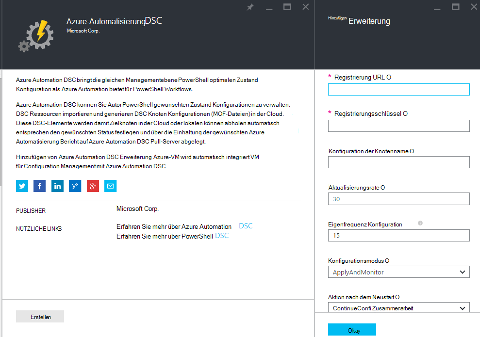
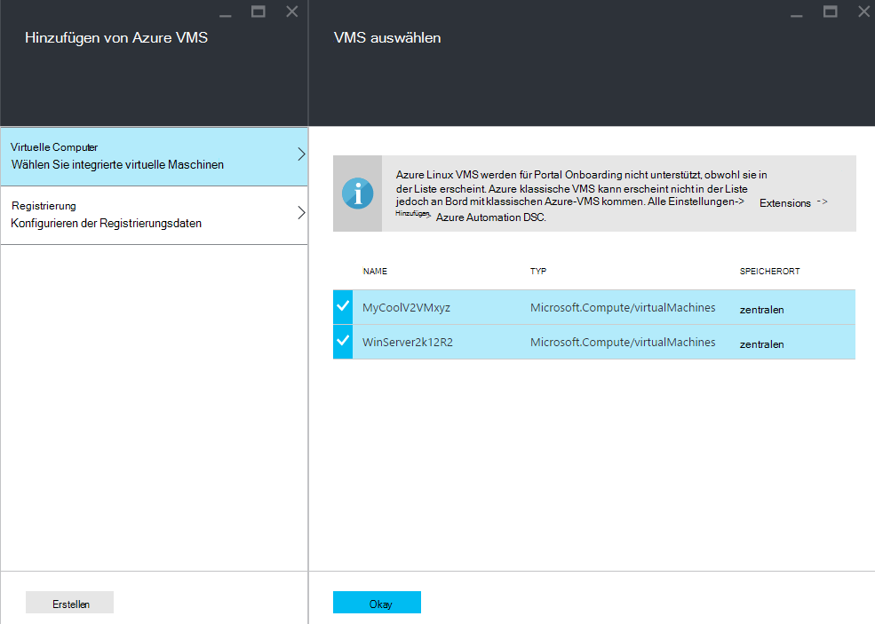
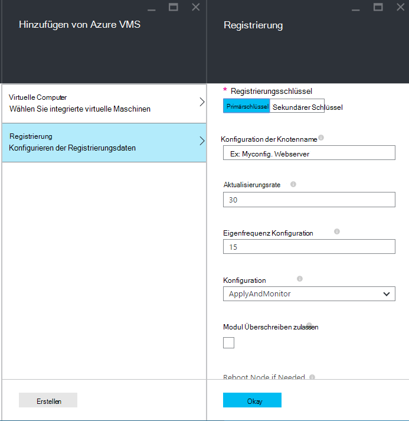
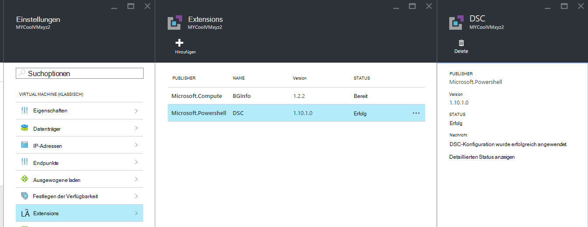

<properties 
   pageTitle="Onboarding physische und virtuelle Computer für die Verwaltung von Azure Automation DSC | Microsoft Azure" 
   description="Computer mit Azure Automation DSC Einrichtung" 
   services="automation" 
   documentationCenter="dev-center-name" 
   authors="coreyp-at-msft" 
   manager="stevenka" 
   editor="tysonn"/>

<tags
   ms.service="automation"
   ms.devlang="NA"
   ms.topic="article"
   ms.tgt_pltfrm="powershell"
   ms.workload="TBD" 
   ms.date="04/22/2016"
   ms.author="coreyp"/>

# Computer für die Verwaltung von Azure Automation DSC Onboarding

## Gründe für das Verwalten von Computern mit Azure Automation DSC

Wie [PowerShell gewünschten Konfiguration](https://technet.microsoft.com/library/dn249912.aspx)wird Azure Automatisierung gewünschten Konfiguration eine einfache, aber leistungsfähige Management Dienst für DSC-Knoten (physischen und virtuellen Computern) Cloud oder lokalen Datencenters Dadurch skalierbar auf Tausende von Computern schnell und einfach von einem zentralen, sicheren Ort. Können Sie problemlos integrierte Maschinen, weisen Sie sie deklarative Konfigurationen und Anzeigen von Berichten mit jeder Computer Einhaltung der angegebenen gewünschten Status. Managementebene Azure Automation DSC ist auf DSC Managementebene Azure Automation PowerShell Scripting. Also hilft dabei, die Azure Automation PowerShell-Skripts verwalten können, es auch DSC-Konfigurationen verwalten. Erfahren Sie mehr über die Vorteile von Azure Automation DSC Übersicht [Azure Automation DSC](automation-dsc-overview.md). 

Azure Automation DSC können zu verschiedenen Rechnern verwendet werden:

*    Azure virtuelle Computer (klassisch)
*    Azure virtuelle Computer
*    Amazon Web Services (AWS) virtuelle Computer
*    Physische/virtuelle Windows Maschinen lokal oder in einer anderen Azure-AWS
*    Physische/virtuelle Linux Computer lokal in Azure oder in einer anderen Azure

Wenn Sie keine Konfiguration aus der Cloud verwalten möchten, kann darüber hinaus Azure Automation DSC auch als nur-Endpunkt verwendet. Dadurch (Push) Konfiguration durch DSC lokal und Knoten Einhaltung der gewünschten in Azure Automation umfangreiche Berichterstattung Details anzeigen.

Die folgenden Abschnitten wie integrierte kann jede Art von Computer Azure Automation DSC.

## Azure virtuelle Computer (klassisch)

Mit Azure Automation DSC können Sie problemlos integrierte Azure virtuelle Computer (klassisch) für Configuration Management mit der Azure-Portal oder PowerShell. Hinter den Kulissen und ohne Administrator Remotestandort in der VM registriert Erweiterung Azure VM gewünschten Konfiguration die VM Azure Automation DSC. Erweiterung Azure VM gewünschten Konfiguration läuft asynchron Schritte zum verfolgen oder beheben sie dienen im Abschnitt [**Problembehandlung bei Azure Virtual Machine Onboarding**](#troubleshooting-azure-virtual-machine-onboarding) .

### Azure-portal

Klicken Sie im [Azure-Portal](http://portal.azure.com/)auf **Durchsuchen** -> **virtuellen Maschinen (classic)**. Wählen Sie onboard möchten Windows-VM. Klicken Sie auf dem virtuellen Computer Dashboard, auf **Alle** -> **Extensions** -> **Hinzufügen** -> **Azure Automation DSC** -> **Erstellen**. Geben Sie die [PowerShell DSC lokale Configuration Manager Werte](https://msdn.microsoft.com/powershell/dsc/metaconfig4) VM Zuweisen der Anwendungsfall, der automatisierungskonto Registrierungsschlüssel Registrierung URL und optional eine Knotenkonfiguration erforderlich.

Um die Registrierung finden Konto URL und Schlüssel für die Automatisierung an Bord die Maschine, finden im Abschnitt [**sichere Registrierung**](#secure-registration) .

### PowerShell

    # log in to both Azure Service Management and Azure Resource Manager
    Add-AzureAccount
    Add-AzureRmAccount
    
    # fill in correct values for your VM/Automation account here
    $VMName = ""
    $ServiceName = ""
    $AutomationAccountName = ""
    $AutomationAccountResourceGroup = ""

    # fill in the name of a Node Configuration in Azure Automation DSC, for this VM to conform to
    $NodeConfigName = ""

    # get Azure Automation DSC registration info
    $Account = Get-AzureRmAutomationAccount -ResourceGroupName $AutomationAccountResourceGroup -Name $AutomationAccountName
    $RegistrationInfo = $Account | Get-AzureRmAutomationRegistrationInfo

    # use the DSC extension to onboard the VM for management with Azure Automation DSC
    $VM = Get-AzureVM -Name $VMName -ServiceName $ServiceName
    
    $PublicConfiguration = ConvertTo-Json -Depth 8 @{
      SasToken = ""
      ModulesUrl = "https://eus2oaasibizamarketprod1.blob.core.windows.net/automationdscpreview/RegistrationMetaConfigV2.zip"
      ConfigurationFunction = "RegistrationMetaConfigV2.ps1\RegistrationMetaConfigV2"

    # update these PowerShell DSC Local Configuration Manager defaults if they do not match your use case.
    # See https://technet.microsoft.com/library/dn249922.aspx?f=255&MSPPError=-2147217396 for more details
     Properties = @{
        RegistrationKey = @{
          UserName = 'notused'
          Password = 'PrivateSettingsRef:RegistrationKey'
        }
        RegistrationUrl = $RegistrationInfo.Endpoint
        NodeConfigurationName = $NodeConfigName
        ConfigurationMode = "ApplyAndMonitor"
        ConfigurationModeFrequencyMins = 15
        RefreshFrequencyMins = 30
        RebootNodeIfNeeded = $False
        ActionAfterReboot = "ContinueConfiguration"
        AllowModuleOverwrite = $False
      }
    }

    $PrivateConfiguration = ConvertTo-Json -Depth 8 @{
      Items = @{
         RegistrationKey = $RegistrationInfo.PrimaryKey
      }
    }
    
    $VM = Set-AzureVMExtension `
     -VM $vm `
     -Publisher Microsoft.Powershell `
     -ExtensionName DSC `
     -Version 2.19 `
     -PublicConfiguration $PublicConfiguration `
     -PrivateConfiguration $PrivateConfiguration `
     -ForceUpdate

    $VM | Update-AzureVM

## Azure virtuelle Computer

Azure Automation DSC können Sie problemlos integrierte Azure VMs für Configuration Management mit Azure-Portal, Azure-Ressourcen-Manager Vorlagen oder PowerShell. Hinter den Kulissen und ohne Administrator Remotestandort in der VM registriert Erweiterung Azure VM gewünschten Konfiguration die VM Azure Automation DSC. Erweiterung Azure VM gewünschten Konfiguration läuft asynchron Schritte zum verfolgen oder beheben sie dienen im Abschnitt [**Problembehandlung bei Azure Virtual Machine Onboarding**](#troubleshooting-azure-virtual-machine-onboarding) .

### Azure-portal

Navigieren Sie in [Azure-Portal](https://portal.azure.com/)integrierte virtuellen Maschinen soll Azure Automation-Konto. Klicken Sie auf Dashboard Konto Automatisierung auf **DSC-Knoten** -> **Azure VM hinzufügen**.

Wählen Sie unter **Wählen Sie integrierte virtuelle Maschinen**mindestens Azure virtuellen Computer integrierten.

Geben Sie unter **Daten konfigurieren**den [PowerShell DSC lokale Configuration Manager Werte](https://msdn.microsoft.com/powershell/dsc/metaconfig4) für Ihren Anwendungsfall und optional eine Knotenkonfiguration VM zuweisen.

 
### Azure Ressourcenmanager Vorlagen

Azure virtuelle Computer bereitgestellt werden und diesem zu Azure Automation DSC über Azure Resource Manager Vorlagen. Finden Sie unter [Konfigurieren einer VM DSC-Erweiterung und Azure Automation DSC](https://azure.microsoft.com/documentation/templates/dsc-extension-azure-automation-pullserver/) eine Beispielvorlage, Onboard eine vorhandene VM Azure Automation DSC. Der Registrierungsschlüssel und Registrierung URL ausgeführt als Eingabe in dieser Vorlage finden Sie im Abschnitt [**sichere Registrierung**](#secure-registration) .

### PowerShell

[Register-AzureRmAutomationDscNode](https://msdn.microsoft.com/library/mt603833.aspx) -Cmdlet kann integrierte virtuelle Computer in Azure-Portal über PowerShell verwendet werden.

## Amazon Web Services (AWS) virtuelle Computer

Sie können einfache integrierte Amazon Web Services VMs für Configuration Management von Azure Automation DSC mit AWS DSC-Toolkit. Erfahren Sie mehr über das Toolkit [hier](https://blogs.msdn.microsoft.com/powershell/2016/04/20/aws-dsc-toolkit/).

## Physische/virtuelle Windows Maschinen lokal oder in einer anderen Azure-AWS

Lokale Windows und Windows-Maschinen-Azure Wolken (z. B. Amazon Web Services) auch möglich diesem zu Azure Automation DSC, solange sie ausgehenden Zugriff auf das Internet über ein paar einfache Schritte:

1. Stellen Sie sicher, dass die neueste Version des [WMF-5](http://aka.ms/wmf5latest) auf den Computern installiert ist integrierte Azure Automation DSC möchten.
2. Führen Sie die Schritte im Abschnitt [**generieren DSC-Metaconfigurations**](#generating-dsc-metaconfigurations) unten einen Ordner mit den benötigten DSC-Metaconfigurations generiert.
3. Soll integrierte Computer Remote zuweisen Sie PowerShell DSC Metaconfiguration. **Der Computer, dem von diesem Befehl müssen die neueste Version des [WMF 5](http://aka.ms/wmf5latest) installiert**:

    `Set-DscLocalConfigurationManager -Path C:\Users\joe\Desktop\DscMetaConfigs -ComputerName MyServer1, MyServer2`

4. Wenn Sie PowerShell DSC-Metaconfigurations Remote anwenden können, kopieren Sie den Ordner Metaconfigurations aus Schritt 2 auf jedem Computer an Bord. Rufen Sie **DscLocalConfigurationManager Gruppe** lokal auf jedem Computer, an Bord.
5. Verwenden der Azure-Portal oder Cmdlets, sicher, dass der Computer integrierten jetzt als Ihr Konto Azure Automation DSC-Knoten angezeigt.

## Physische/virtuelle Linux Computer lokal in Azure oder in einer anderen Azure

Lokalen Linux-Computer, Linux-Computer in Azure und Linux-Computern nicht Azure Wolken auch möglich diesem zu Azure Automation DSC, solange sie ausgehenden Zugriff auf das Internet über ein paar einfache Schritte:

1. Stellen Sie sicher, dass die neueste Version von [DSC Linux-Agent](http://www.microsoft.com/download/details.aspx?id=49150) auf den Computern installiert ist integrierte Azure Automation DSC möchten.

2. Wenn [PowerShell DSC lokale Configuration Manager Standards](https://msdn.microsoft.com/powershell/dsc/metaconfig4) entsprechen der Anwendungsfall, und zu integrierten Computer so, dass **sowohl** aus und Azure Automation DSC melden:

    *    Auf jedem Linux-System integrierte Azure Automation DSC mit der Register.py onboard Standardvorgaben PowerShell DSC lokale Konfigurations-Manager:

        `/opt/microsoft/dsc/Scripts/Register.py <Automation account registration key> <Automation account registration URL>`

    *    Registrierungsschlüssel und Registrierung URL für Ihr Konto Automatisierung finden finden Sie im Abschnitt [**sichere Registrierung**](#secure-registration) .

    Wenn PowerShell DSC lokale Configuration Manager **werden** **nicht** standardmäßig, Ihre Anwendungsfall oder integrierte Maschinen möchten, dass sie nur Azure Automation DSC melden, aber führen Sie nicht die Pull-Konfiguration oder PowerShell-Module aus, führen Sie die Schritte 3 bis 6. Andernfalls gehen Sie direkt zu Schritt 6.

3.  Führen Sie die Schritte im [**Generieren von DSC-Metaconfigurations**](#generating-dsc-metaconfigurations) Abschnitt einen Ordner mit den benötigten DSC-Metaconfigurations generiert.
4.  Gelten Sie PowerShell DSC-Metaconfiguration Remote Computer soll an Bord:
        
        $SecurePass = ConvertTo-SecureString -String "<root password>" -AsPlainText -Force
        $Cred = New-Object System.Management.Automation.PSCredential "root", $SecurePass
        $Opt = New-CimSessionOption -UseSsl -SkipCACheck -SkipCNCheck -SkipRevocationCheck

        # need a CimSession for each Linux machine to onboard
        
        $Session = New-CimSession -Credential $Cred -ComputerName <your Linux machine> -Port 5986 -Authentication basic -SessionOption $Opt
        
        Set-DscLocalConfigurationManager -CimSession $Session –Path C:\Users\joe\Desktop\DscMetaConfigs
    
Der Computer, dem von diesem Befehl müssen die neueste Version des [WMF 5](http://aka.ms/wmf5latest) installiert.

5.  Falls Sie PowerShell DSC-Metaconfigurations, für jeden Linux-Maschine, kopieren Sie die Metaconfiguration für diesen Computer aus in Schritt 5 auf dem Linux-Computer anwenden können. Rufen Sie dann `SetDscLocalConfigurationManager.py` lokal auf jedem Linux-Computer soll Azure Automation DSC zu integrierten:

    `/opt/microsoft/dsc/Scripts/SetDscLocalConfigurationManager.py –configurationmof <path to metaconfiguration file>`

6.  Verwenden der Azure-Portal oder Cmdlets, sicher, dass der Computer integrierten jetzt als Ihr Konto Azure Automation DSC-Knoten angezeigt.

##DSC-Metaconfigurations generieren
Generisch integrierte jede Maschine Azure Automation DSC DSC-Metaconfiguration können generiert, die bei DSC-Agent auf dem Computer aus ziehen oder Azure Automation DSC Bericht informiert. DSC-Metaconfigurations für Azure Automation DSC können mit PowerShell DSC-Konfiguration oder Azure Automatisierung PowerShell-Cmdlets generiert werden.

**Hinweis:** DSC-Metaconfigurations enthalten die Geheimnisse integrierte ein Computer eine Automatisierung für das Management Konto benötigt. Sicher schützen alle DSC-Metaconfigurations, die Sie erstellen oder nach Verwendung löschen.

###Eine DSC-Konfiguration
1.  Öffnen der PowerShell ISE als Administrator auf einem Computer in der Umgebung. Der Computer muss die neueste Version des [WMF 5](http://aka.ms/wmf5latest) installiert.

2.  Kopieren Sie das folgende Skript lokal. Dieses Skript enthält eine PowerShell DSC-Konfiguration zum Erstellen von Metaconfigurations und der Befehl Start Metaconfiguration erstellen.
    
        # The DSC configuration that will generate metaconfigurations
        [DscLocalConfigurationManager()]
        Configuration DscMetaConfigs 
        { 
            param 
            ( 
                [Parameter(Mandatory=$True)] 
                [String]$RegistrationUrl,
         
                [Parameter(Mandatory=$True)] 
                [String]$RegistrationKey,

                [Parameter(Mandatory=$True)] 
                [String[]]$ComputerName,

                [Int]$RefreshFrequencyMins = 30, 
            
                [Int]$ConfigurationModeFrequencyMins = 15, 
            
                [String]$ConfigurationMode = "ApplyAndMonitor", 
            
                [String]$NodeConfigurationName,

                [Boolean]$RebootNodeIfNeeded= $False,

                [String]$ActionAfterReboot = "ContinueConfiguration",

                [Boolean]$AllowModuleOverwrite = $False,

                [Boolean]$ReportOnly
            )

    
            if(!$NodeConfigurationName -or $NodeConfigurationName -eq "") 
            { 
                $ConfigurationNames = $null 
            } 
            else 
            { 
                $ConfigurationNames = @($NodeConfigurationName) 
            }

            if($ReportOnly)
            {
               $RefreshMode = "PUSH"
            }
            else
            {
               $RefreshMode = "PULL"
            }

            Node $ComputerName
            {

                Settings 
                { 
                    RefreshFrequencyMins = $RefreshFrequencyMins 
                    RefreshMode = $RefreshMode 
                    ConfigurationMode = $ConfigurationMode 
                    AllowModuleOverwrite = $AllowModuleOverwrite 
                    RebootNodeIfNeeded = $RebootNodeIfNeeded 
                    ActionAfterReboot = $ActionAfterReboot 
                    ConfigurationModeFrequencyMins = $ConfigurationModeFrequencyMins 
                }

                if(!$ReportOnly)
                {
                   ConfigurationRepositoryWeb AzureAutomationDSC 
                    { 
                        ServerUrl = $RegistrationUrl 
                        RegistrationKey = $RegistrationKey 
                        ConfigurationNames = $ConfigurationNames 
                    }

                    ResourceRepositoryWeb AzureAutomationDSC 
                    { 
                       ServerUrl = $RegistrationUrl 
                       RegistrationKey = $RegistrationKey 
                    }
                }

                ReportServerWeb AzureAutomationDSC 
                { 
                    ServerUrl = $RegistrationUrl 
                    RegistrationKey = $RegistrationKey 
                }
            } 
        }
        
        # Create the metaconfigurations
        # TODO: edit the below as needed for your use case
        $Params = @{
             RegistrationUrl = '<fill me in>';
             RegistrationKey = '<fill me in>';
             ComputerName = @('<some VM to onboard>', '<some other VM to onboard>');
             NodeConfigurationName = 'SimpleConfig.webserver';
             RefreshFrequencyMins = 30;
             ConfigurationModeFrequencyMins = 15;
             RebootNodeIfNeeded = $False;
             AllowModuleOverwrite = $False;
             ConfigurationMode = 'ApplyAndMonitor';
             ActionAfterReboot = 'ContinueConfiguration';
             ReportOnly = $False;  # Set to $True to have machines only report to AA DSC but not pull from it
        }
        
        # Use PowerShell splatting to pass parameters to the DSC configuration being invoked
        # For more info about splatting, run: Get-Help -Name about_Splatting
        DscMetaConfigs @Params

3.  Füllen Sie den Registrierungsschlüssel und die URL für Ihr Konto Automatisierung sowie die Namen der Computer integrierten. Alle Parameter sind optional. Registrierungsschlüssel und Registrierung URL für Ihr Konto Automatisierung finden finden Sie im Abschnitt [**sichere Registrierung**](#secure-registration) .

4.  Soll der Computer DSC Status Informationen zu Azure Automation DSC, aber nicht ziehen Konfiguration oder PowerShell-Module, festlegen Sie den **ReportOnly** -Parameter auf True.

5.  Führen Sie das Skript. Ordner **DscMetaConfigs** im Arbeitsverzeichnis, müsste nun mit PowerShell DSC-Metaconfigurations für den Computer an Bord.

###Verwenden von Azure Automation-cmdlets
Wenn PowerShell DSC lokale Configuration Manager-Standards der Anwendungsfall entsprechen soll integrierte Maschinen, sie ziehen aus und Azure Automation DSC melden, bieten Azure Automation Cmdlets eine vereinfachte Methode generieren DSC Metaconfigurations benötigt:

1.  Öffnen Sie die PowerShell-Konsole oder PowerShell ISE als Administrator auf einem Computer in der Umgebung.

2.  Verbindung zum Azure-Ressourcen-Manager mit **AzureRmAccount hinzufügen**

3.  Ziel PowerShell DSC-Metaconfigurations für die gewünschten Computer integrierten integrierten Knoten soll Automation-Konto:

        # Define the parameters for Get-AzureRmAutomationDscOnboardingMetaconfig using PowerShell Splatting
        $Params = @{
            ResourceGroupName = 'ContosoResources'; # The name of the ARM Resource Group that contains your Azure Automation Account
            AutomationAccountName = 'ContosoAutomation'; # The name of the Azure Automation Account where you want a node on-boarded to
            ComputerName = @('web01', 'web02', 'sql01'); # The names of the computers that the meta configuration will be generated for
            OutputFolder = "$env:UserProfile\Desktop\";
        }
        
        # Use PowerShell splatting to pass parameters to the Azure Automation cmdlet being invoked
        # For more info about splatting, run: Get-Help -Name about_Splatting
        Get-AzureRmAutomationDscOnboardingMetaconfig @Params

Sie haben nun einen Ordner namens ***DscMetaConfigs***, mit der PowerShell DSC-Metaconfigurations für den Computer an Bord.

##Sichere Registrierung

Computer können sicher an Bord Azure Automation-Konto über das WMF 5 DSC Registrierung Protokoll einen DSC-Knoten (einschließlich Azure Automation DSC) PowerShell DSC V2 ziehen oder Reporting Server authentifizieren kann. Der Knoten registriert Server eine **URL Registrierung**, Authentifizierung mit einem **Registrierungsschlüssel**. Während der Registrierung handeln DSC-Knoten und DSC Pull/Berichtsserver ein eindeutiges Zertifikat für diesen Knoten zur Authentifizierung der Server nach der Registrierung. Diese verhindert, dass diesem Knoten imitiert einen anderen Wenn ein Knoten beschädigt und böswillig verhält. Nach der Registrierung der Registrierungsschlüssel Authentifizierungsprozess erneut verwendet und aus dem Knoten gelöscht.

Die Angaben für DSC Registrierung Protokoll aus dem **Schlüssel verwalten** Blade in Azure vorschauportal erhalten. Öffnen dieser Blade Schlüsselsymbol auf dem **Essentials** Automation-Konto.

*    Registrierung-URL ist das URL-Feld im Blade-Schlüssel verwalten.
*    Registrierungsschlüssel ist Access Primärschlüssel oder sekundäre Taste Blatt Schlüssel verwalten. Beide Schlüssel kann verwendet werden.

Für zusätzliche Sicherheit können die primären und sekundären Zugriffstasten Automation-Konto (auf **Schlüssel verwalten** Blade) generiert werden, um zukünftigen Knoten Registrierung mit vorherigen Schlüssel zu verhindern.

##Problembehandlung bei Azure Virtual Machine onboarding

Azure Automation DSC können problemlos integrierte Azure Windows VMs für Configuration Management. Hinter den Kulissen dient Erweiterung Azure VM gewünschten Konfiguration die VM Azure Automation DSC registrieren. Da die Erweiterung Azure VM gewünschten Konfiguration asynchron ausgeführt wird, können der Fortschritt und Problembehandlung bei seiner Ausführung wichtig sein. 

>[AZURE.NOTE] Methode Onboarding eine VM Azure Windows Azure Automation DSC, die die Erweiterung Azure VM gewünschten Konfiguration verwendet dauert bis zu einer Stunde für den Knoten wie in Azure Automation registriert angezeigt. Liegt der Installation von Windows Management Framework 5.0 auf dem virtuellen Computer durch die integrierte Azure VM DSC-Erweiterung der VM Azure Automation DSC.

Zum Beheben oder den Status der Erweiterung Azure VM gewünschten Konfiguration der Azure Portal Navigieren zu diesem VM und -> **Alle** -> **Extensions** -> **DSC**. Weitere Informationen können Sie den **detaillierten Status anzeigen**klicken.

## Gültigkeitsdauer und erneute

Nach der Registrierung eines Computers als DSC Knoten in Azure Automation DSC gibt es zahlreiche Gründe, warum Sie möglicherweise diesen Knoten später registrieren:

* Nach der Registrierung handelt jeder Knoten automatisch ein eindeutiges Zertifikat für die Authentifizierung, die nach einem Jahr abläuft. Derzeit kann keine PowerShell DSC Registrierung Protokoll Zertifikate automatisch erneuern, wenn sie Ablauf nähern, müssen Sie die Knoten nach einem Jahr registrieren. Sicherstellen Sie bevor Sie neu registrieren, dass jeder Knoten Windows Management Framework 5.0 RTM ausgeführt wird. Wenn ein Knoten Authentifizierungszertifikat abläuft und der Knoten nicht registriert der Knoten Kommunikation mit Azure Automation nicht und markiert "Reagiert." Erneute 90 Tage durchgeführt oder über das Ablaufdatum des Zertifikats oder jederzeit nach dem Ablaufzeitpunkt Zertifikat führt ein neues Zertifikat generiert und verwendet.

* So ändern Sie [PowerShell DSC lokale Configuration Manager-Werte](https://msdn.microsoft.com/powershell/dsc/metaconfig4) , die während der Registrierung eines Knotens wie ConfigurationMode festgelegt wurden. Diese Werte DSC-Agent können derzeit nur durch erneute geändert werden. Ausnahme dem Knoten zugewiesenen Knoten-Konfiguration ist dies möglich in Azure Automation DSC direkt.

Erneute genauso erfolgt der Knoten zunächst registriert die Onboarding Methoden in diesem Dokument beschrieben. Sie brauchen einen Knoten von Azure Automation DSC abmelden, bevor sie neu registrieren.

## Verwandte Artikel
* [Azure Automation DSC-Übersicht](automation-dsc-overview.md)
* [Azure Automation DSC-cmdlets](https://msdn.microsoft.com/library/mt244122.aspx)
* [Azure Automation DSC-Preisen](https://azure.microsoft.com/pricing/details/automation/)

