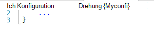
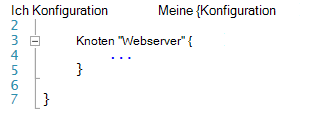
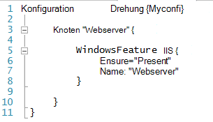
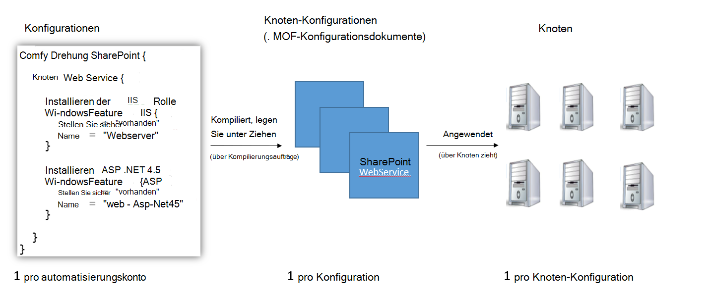
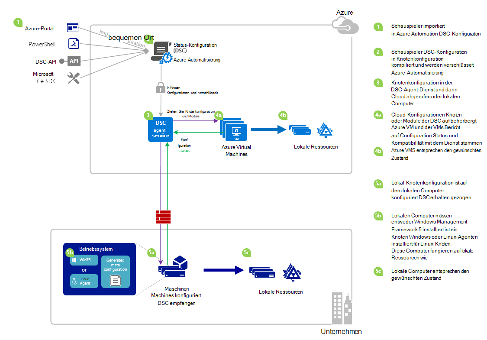

<properties 
   pageTitle="Azure Automation DSC Übersicht | Microsoft Azure" 
   description="Eine Übersicht der Azure Automatisierung gewünschten Zustand Konfiguration (DSC), Begriffe und bekannte Probleme" 
   services="automation" 
   documentationCenter="dev-center-name" 
   authors="coreyp-at-msft" 
   manager="stevenka" 
   editor="tysonn"
   keywords="PowerShell dsc gewünschten Konfiguration, Powershell dsc Azure"/>

<tags
   ms.service="automation"
   ms.devlang="NA"
   ms.topic="article"
   ms.tgt_pltfrm="powershell"
   ms.workload="TBD" 
   ms.date="05/10/2016"
   ms.author="magoedte;coreyp"/>

# Azure Automation DSC-Übersicht #

##Was ist Azure Automation DSC?##
Bereitstellen und Verwalten des gewünschten Status der Server und Anwendungsressourcen kann mühsam und fehleranfällig. Mit Azure Automation gewünschten Zustand Konfiguration (DSC), können Sie konsistente Bereitstellung zuverlässig überwachen und automatisch alle Ihre IT-Ressourcen aus der Cloud Ebene den gewünschten Status. Grundlage PowerShell DSC können Automatisierung DSC Computerkonfiguration mit bestimmten physischen und virtuellen Maschinen (VMs) mit Windows oder Linux, und in der Cloud oder lokalen ausrichten. Sie fortlaufende IT-Dienstleistungen mit konsistenten aktivieren und rasche Änderung über Ihre heterogenen hybride IT-Umgebung mit Leichtigkeit verwalten.

Azure Automation DSC baut auf die Grundlagen eingeführt PowerShell DSC ein einfacher Configuration Management bieten. Azure Automation DSC bringt [PowerShell gewünschten Konfiguration](https://msdn.microsoft.com/powershell/dsc/overview) die gleiche Managementebene Azure Automation bietet für PowerShell scripting heute.

Azure Automation DSC können Sie [Erstellen und Verwalten von PowerShell gewünschten Zustand Konfigurationen](https://technet.microsoft.com/library/dn249918.aspx)importieren [DSC-Ressourcen](https://technet.microsoft.com/library/dn282125.aspx)und DSC Knoten Konfigurationen (MOF-Dateien) in der Cloud erstellen. Diese DSC-Elemente werden auf Azure Automation [DSC ziehen Server](https://technet.microsoft.com/library/dn249913.aspx) platziert werden, sodass Zielknoten (wie physische und virtuelle Computer) in der Cloud oder lokalen können abholen automatisch entsprechen den gewünschten Status festlegen und über die Einhaltung der gewünschten Azure Automatisierung Bericht.

Bevorzugen Sie gerade lesen? Sehen Sie sich die unter Video ab Mai 2015 bei Azure Automation DSC erstmals angekündigt. **Hinweis:** Konzepte und Lebenszyklus in diesem Video erläutert korrekt sind, Fortschritte Azure Automation DSC viel seit diesem Video aufgezeichnet wurde. Es ist jetzt erhältlich ist eine umfangreiche Benutzeroberfläche im Azure-Portal und unterstützt viele weitere Funktionen.

> [AZURE.VIDEO microsoft-ignite-2015-heterogeneous-configuration-management-using-microsoft-azure-automation]

## Azure Automation DSC-Begriffe ##
### Konfiguration ###
PowerShell DSC, Konfigurationen ein neues Konzept eingeführt. Konfigurationen können über PowerShell Syntax den gewünschten Status Ihrer Umgebung definieren. DSC mithilfe Ihrer Umgebung konfigurieren, definieren Sie einen Windows PowerShell-Skriptblock mit dem konfigurationsschlüsselwort zunächst mit einem Bezeichner mit geschweiften Klammern ({}) zum Begrenzen des Blocks folgen.

Innerhalb des Blocks Konfiguration definieren Sie Knoten Konfiguration Blöcke, die angeben, dass die gewünschte Konfiguration für einen Satz von Knoten (Computer) in Ihrer Umgebung sollte genau konfiguriert. Auf diese Weise stellt eine Knotenkonfiguration "Rollen" für einen oder mehrere Knoten an. Ein Knoten Konfiguration beginnt mit dem Schlüsselwort Knoten. Führen Sie dieses Schlüsselwort mit dem Namen der Rolle, die eine Variable oder einen Ausdruck ein. Verwenden Sie nach der Rollenname geschweiften Klammern {} zum Begrenzen von Knoten Konfiguration blockieren.

 
In Block Konfiguration Knoten definieren Sie Ressource blockiert bestimmte DSC-Ressourcen konfigurieren. Eine Ressource beginnt mit dem Namen der Ressource, die Bezeichner für diesen Block angeben möchten Sie geschweifte Klammern {}, um den Block zu trennen.

Ausführlichere Informationen über das konfigurationsschlüsselwort finden Sie unter: [Understanding Konfigurationsschlüsselwort im gewünschten Konfiguration](http://blogs.msdn.com/b/powershell/archive/2013/11/05/understanding-configuration-keyword-in-desired-state-configuration.aspx "Verständnis Konfigurationsschlüsselwort im gewünschten Konfiguration")

Ausführen (Kompilieren) DSC-Konfiguration erzeugt mindestens DSC Knoten Konfigurationen (MOF-Dateien) was DSC-Knoten Einhaltung der gewünschten Status zuweisen.

Azure Automation DSC können Sie importieren, Autor und Kompilieren DSC Konfigurationen in Azure Automation, ähnlich wie Runbooks importiert werden, erstellt und in Azure Automation gestartet.

>[AZURE.IMPORTANT] Eine Konfiguration sollte nur eine Konfiguration Block mit dem gleichen Namen wie die Konfiguration in Azure Automation DSC. 

###Knotenkonfiguration###

Beim Kompilieren einer DSC-Konfiguration werden eine oder mehrere Knoten Konfigurationen je nach Knoten Blöcke in der Konfiguration erstellt. Knotenkonfiguration ist gleich "MOF" oder "Konfiguration des Dokuments" (Wenn Sie mit diesen Begriffen PS DSC vertraut sind) und "Rolle" Webserver oder Arbeitskraft dem Zustand Bedarf einen oder mehrere Knoten nehmen oder Einhaltung überprüfen sollten. Namen der Knoten Konfigurationen in Azure Automation DSC nehmen die Form von "Konfiguration Name.NodeConfigurationBlockName".

PS DSC-Knoten werden Knoten-Konfigurationen, die sie über DSC Push- oder Pull-Methoden darstellen soll. Azure Automation DSC beruht auf DSC Pull-Methode, wobei Knoten Anforderung Knoten Konfigurationen von Azure Automation DSC gelten, sollten sie Server ziehen. Da Knoten Azure Automation DSC die Anforderung vornehmen, kann Knoten hinter Firewalls, eingehende Anschlüsse usw. geschlossen haben. Sie brauchen nur ausgehenden Zugriff auf das Internet (entweder direkt oder über einen Proxy).

###Knoten###

DSC-Knoten ist jedem Computer, dessen Konfiguration von DSC verwaltet. Möglicherweise Windows oder Linux Azure VM lokale VM / physische Host oder Computer in einem anderen öffentlichen Cloud. Knoten Knoten-Konfigurationen zu und Einhaltung der gewünschten Zustand definieren sie erlassen und auch Bericht auf einem Berichtsserver auf Configuration Status und Kompatibilität im Vergleich zu den gewünschten Status.

Azure Automation DSC Onboarding Knoten für die Verwaltung von Azure Automation DSC erleichtert und Ändern der Knotenkonfiguration jedes serverseitige Knoten zugewiesen nächsten Knoten überprüft der Server Informationen wird eine andere Rolle und Ändern von Konfiguration und Status Konformitätsübersicht gegen melden sollten übereinstimmen.

###Ressource###
DSC-Ressourcen sind Bausteine, mit denen Sie Windows PowerShell gewünschten Zustand Konfiguration (DSC) Konfiguration definieren. DSC enthält eine Reihe von integrierten Ressourcen wie Dateien und Ordner, Server-Features und Rollen Registrierungseinträge, Umgebungsvariablen und Services und Prozesse. Zur vollständigen Liste der integrierten DSC-Ressourcen und deren Verwendung finden Sie unter [Integrierte Windows PowerShell gewünschten Zustand Ressource](https://technet.microsoft.com/library/dn249921.aspx).

DSC-Ressourcen können auch als Teil des PowerShell-Module erweitern die integrierten DSC-Ressourcen importiert werden. Nicht standardmäßige Ressourcen werden von DSC-Knoten von DSC Pull-Server abgerufen, eine Knotenkonfiguration der Knoten erlassen soll Verweise auf Ressourcen enthält. Zum Erstellen von benutzerdefinierten Ressourcen finden Sie unter [Erstellen benutzerdefinierter Windows PowerShell gewünschten Zustand Konfigurationsressourcen](https://technet.microsoft.com/library/dn249927.aspx).

Azure Automation DSC Lieferumfang alle integrierten DSC-Ressourcen wie PS DSC. Zusätzliche Ressourcen können Azure Automation DSC Importieren von PowerShell-Module mit den Ressourcen in Azure hinzugefügt werden.

###Kompilierungsauftrag###
Ein Azure Automation DSC-Kompilierungsauftrag ist eine Instanz der Kompilierung einer Konfiguration eine oder mehrere Knoten Konfigurationen erstellen. Sie ähneln Azure Automation Runbook Aufträge, außer dass sie nicht wirklich alle Aufgaben außer zum Erstellen Knoten durchführen. Erstellt ein Kompilierungsauftrag Knoten Konfigurationen automatisch auf Azure Automation DSC fehl platziert und Vorgängerversionen von Knoten Konfigurationen überschreiben, wenn sie für diese Konfiguration vorhanden. Der Name einer Knoten-Konfiguration durch einen Kompilierungsauftrag erzeugt hat die Form "Konfigurationsname.nodeconfigurationblockname". Beispielsweise Kompilieren der folgenden Konfiguration erzeugt eine einzelne Knotenkonfiguration namens "MyConfiguration.webserver"

>[AZURE.NOTE] Wie Runbooks können Konfigurationen veröffentlicht werden. Dies bezieht sich nicht, DSC-Elemente auf Azure Automation DSC fehl. Kompilierungsaufträge führen DSC Elementen auf Azure Automation DSC Pull-Server. Weitere Informationen über "Veröffentlichen" in Azure Automation finden Sie unter [ein Runbook veröffentlichen](https://msdn.microsoft.com/library/dn903765.aspx).

##Azure Automation DSC-Lebenszyklus##
Geht von einem leeren Automatisierung auf verwalteten ordnungsgemäß konfigurierten Knoten umfasst Prozesse für Konfigurationen durch Konfigurationen in Knoten Konfigurationen und Onboarding Knoten Azure Automation DSC und Knoten Konfigurationen definieren. Das folgende Diagramm veranschaulicht den Azure Automation DSC-Lebenszyklus:

Das folgende Bild zeigt detaillierte Schritt im Lebenszyklus DSC. Sie enthält verschiedene Arten, die eine Konfiguration importiert und Knoten in Azure Automation für einen lokalen Computer Unterstützung DSC und Interaktionen zwischen verschiedenen Komponenten erforderliche Komponenten angewendet. 

     

##Probleme Probleme bekannt:##

- Bei WMF 5 RTM, wenn der Computer als Knoten in Azure Automation DSC registriert ist, von Azure Automation DSC abmelden und nach der Aktualisierung die WMF 5 RTM registrieren.

- Azure Automation DSC unterstützt zurzeit nicht teilweise oder zusammengesetzte DSC-Konfigurationen. Zusammengesetzte DSC-Ressourcen können jedoch importiert und in Azure Automation DSC Konfigurationen wie in lokalen PowerShell Konfiguration Wiederverwendung verwendet.

- Die neueste Version des WMF 5 installiert für PowerShell DSC-Agent für Windows Azure Automation kommunizieren können. Die neueste Version von PowerShell DSC-Agenten für Linux muss für Linux mit Azure Automation installiert.

- Herkömmliche PowerShell DSC pullserver erwartet Modul Reißverschlüsse platziert auf pullserver im Format **ModuleName_Version.zip "**. Azure Automatisierung erwartet PowerShell-Module mit Namen in Form von **ModuleName.zip**importiert werden. [In diesem Blogbeitrag](https://azure.microsoft.com/blog/2014/12/15/authoring-integration-modules-for-azure-automation/) mehr benötigt das Modul in Azure importieren Integrationsmodul-Format anzeigen 

- PowerShell-Module importiert in Azure darf keine .doc oder DOCX-Dateien enthalten. Einige PowerShell-Module mit DSC-Ressourcen enthalten diese Dateien zu Hilfe. Diese Dateien sollten vor dem import in Azure Module entfernt.

- Wenn Knoten zuerst mit einem Azure Automation-Konto registriert oder der Knoten geändert, um einen anderen Knoten Konfiguration-serverseitigen zugeordnet werden, werden der Status "Kompatibel", auch wenn Status des Knotens nicht tatsächlich die Knotenkonfiguration entspricht jetzt zugeordnet ist. Nachdem der Knoten der erste Abruf führt und seine ersten Bericht nach Registrierung oder eine Änderung der Knoten Konfiguration Zuordnung sendet kann den Status des vertrauenswürdig sein.

- Wenn konnte Onboarding eine Windows Azure VM für die Verwaltung von Azure Automation DSC unserer direkten Onboarding Methoden Stunde für die VM angezeigt als Knoten in Azure Automation DSC bis zu dauern. Liegt der Installation von Windows Management Framework 5.0 auf dem virtuellen Computer durch die integrierte Azure VM DSC-Erweiterung der VM Azure Automation DSC.

- Nach der Registrierung handelt jeder Knoten automatisch ein eindeutiges Zertifikat für die Authentifizierung, die nach einem Jahr abläuft. Zu diesem Zeitpunkt nicht möglich PowerShell DSC Registrierung Protokoll Zertifikate automatisch erneuern, wenn sie Ablauf nähern, müssen Sie die Knoten nach einem Jahr zu registrieren. Sicherstellen Sie bevor Sie neu registrieren, dass jeder Knoten Windows Management Framework 5.0 RTM ausgeführt wird. Wenn ein Knoten Authentifizierungszertifikat abläuft und der Knoten nicht registriert der Knoten Kommunikation mit Azure Automation nicht und markiert "Reagiert." Erneute erfolgt auf die gleiche Weise der Knoten zunächst registriert. Erneute 90 Tage durchgeführt oder über das Ablaufdatum des Zertifikats oder jederzeit nach dem Ablaufzeitpunkt Zertifikat führt ein neues Zertifikat generiert und verwendet.

- Bei WMF 5 RTM, wenn der Computer als Knoten in Azure Automation DSC registriert ist, von Azure Automation DSC abmelden und nach der Aktualisierung die WMF 5 RTM registrieren. Löschen Sie bevor neu registrieren die Datei $env:windir\system32\configuration\DSCEngineCache.mof.

- DSC PowerShell-Cmdlets funktionieren nicht, wenn WMF 5 RTM auf WMF 5 Produktion Preview installiert ist. Um dieses Problem zu beheben, führen Sie den folgenden Befehl in einer erhöhten PowerShell-Sitzung (Ausführen als Administrator):`mofcomp $env:windir\system32\wbem\DscCoreConfProv.mof`
 

##Verwandte Artikel##

- [Onboarding-Computer für die Verwaltung von Azure Automation DSC] (.. /Automation/Automation-DSC-Onboarding.MD)
- [Kompilierung Konfigurationen in Azure Automation DSC] (.. /Automation/Automation-DSC-Compile.MD)
- [Azure Automation DSC Cmdlets] (https://msdn.microsoft.com/library/mt244122.aspx)
- Azure Automation DSC [Preis] (https://azure.microsoft.com/pricing/details/automation/)
- [Kontinuierliche Bereitstellung Azure Automatisierung DSC IaaS VMs und Schokoladig] (Automatisierung-dsc-cd-chocolatey.md)
