<properties
    pageTitle="Meine erste grafisch Runbook in Azure Automatisierung | Microsoft Azure"
    description="Lernprogramm, das durch das Erstellen, testen und Veröffentlichen eines einfachen grafisch Runbooks geführt."
    services="automation"
    documentationCenter=""
    authors="mgoedtel"
    manager="jwhit"
    editor=""
    keywords="Runbook Runbook Vorlage Runbook Automatisierung, Azure runbook"/>
<tags
    ms.service="automation"
    ms.workload="tbd"
    ms.tgt_pltfrm="na"
    ms.devlang="na"
    ms.topic="get-started-article"
    ms.date="07/06/2016"
    ms.author="magoedte;bwren"/>

# <a name="my-first-graphical-runbook"></a>Meine erste grafisch runbook

> [AZURE.SELECTOR] - [Grafisch](automation-first-runbook-graphical.md) - [PowerShell](automation-first-runbook-textual-PowerShell.md) - [PowerShell Workflow](automation-first-runbook-textual.md)

Dieses Lernprogramm führt Sie durch die Erstellung eines [grafisch Runbook](automation-runbook-types.md#graphical-runbooks) in Azure Automation.  Wir beginnen mit einem einfachen Runbook, die wir testen und veröffentlichen und erläutert, wie Sie den Status des Auftrags Runbook verfolgen.  Dann werden wir Runbook tatsächlich Azure Ressourcen verwalten ändern, in diesem Fall Starten einer Azure Virtual Machine.  Wir dann machen Runbooks stabiler Runbook Parameter und bedingte Links.

## <a name="prerequisites"></a>Erforderliche Komponenten

Um dieses Lernprogramm benötigen Sie Folgendes.

-   Azure-Abonnement.  Wenn Sie noch keine haben, können Sie [Ihre MSDN-Abonnementvorteile aktivieren](https://azure.microsoft.com/pricing/member-offers/msdn-benefits-details/) oder <a href="/pricing/free-account/" target="_blank"> [für ein kostenloses Konto anmelden](https://azure.microsoft.com/free/).
-   [Azure Ausführen als Konto](automation-sec-configure-azure-runas-account.md) zu Runbooks Azure Ressourcen authentifizieren.  Dieses Konto muss über die Berechtigung zum Starten und beenden Sie den virtuellen Computer.
-   Azure VM.  Wir beenden und starten dieses Computers damit Produktion nicht zulässig.


## <a name="step-1---create-new-runbook"></a>Schritt 1 - erstellen Sie neue runbook

Zunächst erstellen eine einfache Runbooks, das den Text *Hello World*ausgibt.

1.  Öffnen Sie in Azure-Verwaltungsportal Automation-Konto.  
    Die Automatisierung Seite bietet einen schnellen Überblick über die Ressourcen auf diesem Konto.  Sie haben bereits einige Vermögenswerte.  Die meisten sind die Module, die automatisch in ein neues automatisierungskonto enthalten sind.  Sie müssen auch Anmeldeinformationen Anlage, die in [Komponenten](#prerequisites)genannt.
2.  Klicken Sie auf die Kachel **Runbooks** Runbooks öffnen.<br> 
3.  Erstellen Sie neue Runbook durch Klicken auf die Schaltfläche **Hinzufügen ein Runbook** und **erstellen eine neue Runbook**.
4.  Geben Sie dem Runbook *MyFirstRunbook grafisch*.
5.  In diesem Fall werden wir erstellen [grafisch Runbook](automation-graphical-authoring-intro.md) **Graphical** **Runbook**Typ wählen.<br> 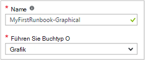<br>
6.  Klicken Sie auf **Erstellen** , um Runbooks erstellen und den Grafiken-Editor öffnen.

## <a name="step-2---add-activities-to-the-runbook"></a>Schritt 2 - Runbooks Aktivitäten hinzufügen

Library Control auf der linken Seite des Editors können Sie Aktivitäten der Runbook hinzufügen auswählen.  Wir werden ein Cmdlet **Write-Output** aus dem Runbook Ausgabe hinzufügen.

1.  Im Steuerelement Bibliothek im Suchtextfeld auf, und geben Sie **Write-Output**.  Die Suchergebnisse werden unten angezeigt. <br> 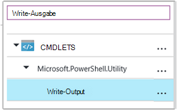
2.  Blättern Sie zum Ende der Liste.  Sie können entweder Rechtsklick **Write-Output** und wählen **zum Zeichnungsbereich hinzuzufügen** oder klicken Sie auf die Ellipse neben dem Cmdlet und wählen **zum Zeichnungsbereich hinzuzufügen**.
3.  Klicken Sie auf die Aktivität **Write-Output** auf der Leinwand.  Das Configuration Control Blade ermöglicht Ihnen das Konfigurieren der Aktivität wird geöffnet.
4.  Die **Bezeichnung** wird standardmäßig auf den Namen des Cmdlets, aber wir können aussagekräftigeren ändern. Ändern sie *Schreiben Hello World ausgegeben*.
5.  Klicken Sie auf **Parameter** , um Werte der Cmdlet-Parameter.  
    Einige Cmdlets haben mehrere Parametersätze und auswählen, die Sie verwenden möchten. **Write-Output** hat nur einen Parametersatz in diesem Fall müssen Sie nicht auf eine. <br> 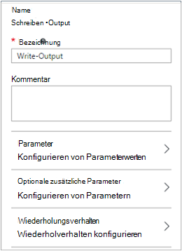
6.  Wählen Sie den Parameter **Eingabeobjekt** .  Dies ist der Parameter, wo wir den Text an den Ausgabestream geben.
7.  Wählen Sie in der Dropdownliste **Datenquelle** **PowerShell Ausdruck**.  Die Dropdownliste **Datenquelle** bietet verschiedene Quellen, mit denen Sie einen Parameterwert füllen.  
    Sie können Ausgabe aus Quellen wie einen Vermögenswert Automatisierung oder ein PowerShell-Ausdruck.  In diesem Fall möchten wir nur den Text *Hello World*. Wir können einen PowerShell-Ausdruck und eine Zeichenfolge angeben.
8.  Geben Sie im **Ausdruck** *"Hello World"* , und klicken Sie auf **OK** zweimal, um zur Leinwand zurückzukehren.<br> 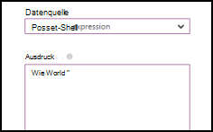
9.  Speichern des Runbooks **Speichern**.<br> 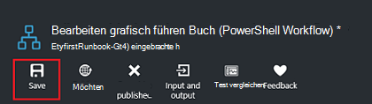

## <a name="step-3---test-the-runbook"></a>Schritt 3: Test Runbooks

Vor dem veröffentlichen wir Runbook in der Produktion zur Verfügung stellen wollen wir testen, um sicherzustellen, dass sie ordnungsgemäß funktioniert.  Beim Testen ein Runbook **dessen Entwurf** ausgeführt und die Ausgabe interaktiv anzeigen.

1.  Klicken Sie **im Bereich Test** Blade Test öffnen.<br> 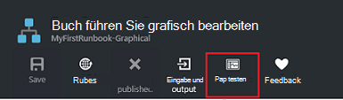
2.  Klicken Sie auf **Start** , um den Test zu starten.  Dies sollte die einzige aktivierte Option.
3.  Ein [Runbook Auftrag](automation-runbook-execution.md) erstellt und seinen Status im Bereich angezeigt.  
    Der Status wird als *Warteschlange* angibt, dass eine Arbeitskraft für ein Runbook in der Cloud verfügbar auf gestartet.  Es wird zu *Starten* nun bei eine Arbeitskraft behauptet das Projekt und dann *Ausführen* , wenn Runbooks tatsächlich gestartet.  
4.  Bei Beendigung des Auftrags Runbook wird die Ausgabe angezeigt. In diesem Fall sollte *Hello World*angezeigt werden.<br> 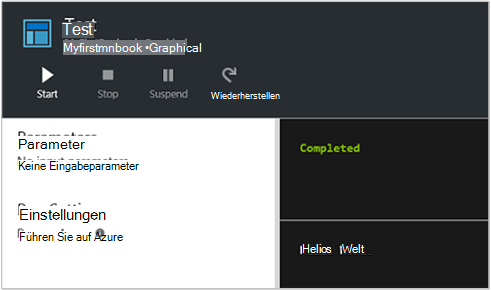
5.  Schließen Sie Test Blade Leinwand zurückzukehren.

## <a name="step-4---publish-and-start-the-runbook"></a>Schritt 4: Veröffentlichen und Runbooks starten

Das soeben erstellte Runbook ist immer noch im Entwurfsmodus. Wir müssen es veröffentlichen, bevor wir in der Produktion ausgeführt werden kann.  Beim Veröffentlichen eines Runbooks überschrieben mit Entwurf vorhandene veröffentlichte Version.  In unserem Fall haben wir nicht veröffentlichte Version noch da wir nur Runbook erstellt.

1.  Klicken Sie auf **Veröffentlichen** Runbook veröffentlichen und dann auf **Ja** .<br> 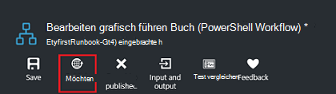
2.  Wenn Sie links blättern, um die Runbook **Runbooks** Blatt anzuzeigen, zeigt es ein **Erstellungsstatus** **veröffentlicht**.
3.  Bildlauf nach rechts um das Blade **MyFirstRunbook**anzuzeigen.  
    Mit den Optionen oben können Runbooks starten, zu einem Zeitpunkt in der Zukunft zu planen oder ein [Webhook](automation-webhooks.md) erstellen, damit er gestartet werden kann über einen HTTP-Aufruf.
4.  Wir wollen nur Runbooks starten klicken Sie auf **Start** und dann auf **Ja** .<br> 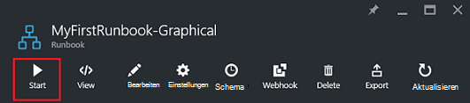
5.  Job-Blade wird Runbook Auftrag geöffnet, die wir gerade erstellt haben.  Wir können diese Blade schließen, aber in diesem Fall wir werden offen, damit wir den Auftrag Fortschritt überwachen können.
6.  Der Status wird in **Jobübersicht** und entspricht der Status, die wir beim Runbooks getestet haben.<br> 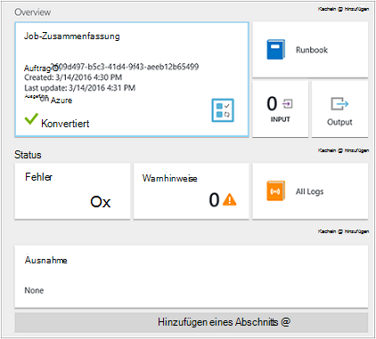
7.  Sobald der Runbook Status *abgeschlossen*angezeigt wird, klicken Sie auf **Ausgabe**. **Ausgabe** -Blade geöffnet, und wir sehen unsere *Hello World* im Bereich.<br> 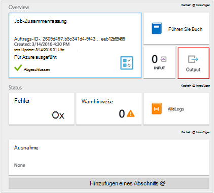  
8.  Schließen Sie das Blade Ausgabe.
9.  Klicken Sie auf **Alle Protokolle** Streams Blade dafür Runbook öffnen.  Sehen wir nur *Hello World* im Ausgabestream, aber dies kann anderen Streams für ein Runbook Projekt ausführlich und Fehler anzeigen, wenn Runbooks schreibt.<br> 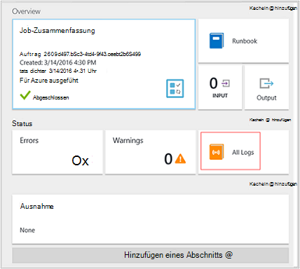
10. Schließen Sie alle Protokolle Blade- und Blade Auftrag MyFirstRunbook Blade wieder.
11. Klicken Sie auf **Aufträge** Blade Aufträge für diese Runbook öffnen.  Hier werden alle Arbeitsplätze dieser Runbook. Es sollte nur ein Auftrag, da wir den Auftrag nur einmal ausführen angezeigt.<br> 
12. Klicken Sie auf dieses Projekt im gleichen Auftrag öffnen, die wir beim wir Runbook gestartet angezeigt.  So können Sie zurück, und zeigen Sie die Details eines Auftrags, der für ein bestimmtes Runbook erstellt wurde.

## <a name="step-5---create-variable-assets"></a>Schritt 5 - Variable erstellen

Wir getestet und unsere Runbook veröffentlicht, aber so weit es nicht sinnvoll. Wir möchten es Azure Ressourcen.  Bevor wir Runbook Authentifizierung konfigurieren, erstellen wir eine Variable die Abonnement-ID und darauf verweisen, nachdem wir die Aktivität in Schritt 6 unter Authentifizierung einrichten.  Auf den Kontext Abonnement können Sie problemlos zwischen mehreren Abonnements.  Kopieren Sie zunächst Ihre Abonnement-ID Option Abonnements aus dem Navigationsbereich.  

1. Blatt Automatisierungskonten klicken Sie auf die Kachel **Anlagen** und **Anlagen** Blade wird geöffnet.
2. Blade Anlagen klicken Sie auf die Kachel **Variablen** .
3. Das Blade Variablen klicken Sie auf **eine Variable hinzufügen**.<br>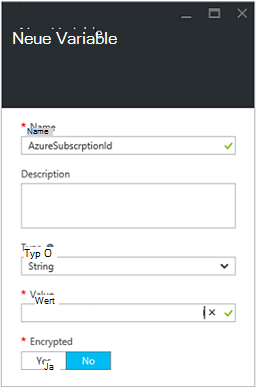
4. Neue Variable Blatt im Feld **Name** Geben Sie **AzureSubscriptionId** und im Feld **Wert** die Abonnement-ID  Halten Sie *Zeichenfolge* für den **Typ** und den Standardwert für die **Verschlüsselung**.  
5. Klicken Sie auf **Erstellen** , um die Variable zu erstellen.  


## <a name="step-6---add-authentication-to-manage-azure-resources"></a>Schritt 6 - Authentifizierung Azure Ressourcen

Jetzt haben wir eine Variable für unsere Abonnement-ID können wir unsere Runbook mit Ausführen als Anmeldeinformationen authentifizieren, die [Komponenten](#prerequisites)bezeichnet werden.  Zu diesem Zweck das Azure ausführen als Verbindung **Ressourcen** und **Add-AzureRMAccount** -Cmdlet der Leinwand hinzufügen.  

1.  Öffnen Sie den Grafiken-Editor-Blade MyFirstRunbook auf **Bearbeiten** .<br> 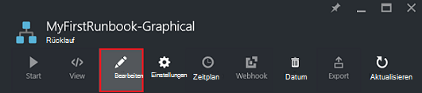
2.  Wir brauchen **Schreiben Hello World Ausgabe** mehr, so rechten Maustaste und wählen Sie **Löschen**.
3.  Erweitern Sie **Verbindungen** in Library Control und der Leinwand durch Hinzufügen **zu**fügen Sie **AzureRunAsConnection hinzu** .
4.  Wählen Sie auf der Leinwand **AzureRunAsConnection** und geben Sie im Steuerelement Konfiguration **Ausführen als Verbindung erhalten** im Textfeld **Beschriftung** .  Dies ist die Verbindung 
5.  Geben Sie im Steuerelement Bibliothek **Hinzufügen AzureRmAccount** im Suchtextfeld.
6.  Die Leinwand **Hinzufügen AzureRmAccount** hinzufügen.<br> 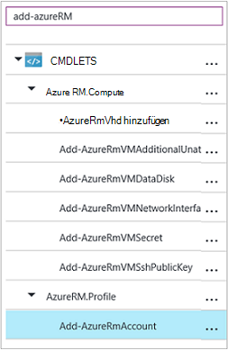
7.  Zeigen Sie auf **Ausführen als Verbindung erhalten** ein Kreis auf der Unterseite der Form angezeigt. Klicken Sie auf den Kreis, und ziehen Sie den Pfeil **Hinzufügen AzureRmAccount**.  Die soeben erstellte Pfeil ist ein *Link*.  Runbooks starten mit **Ausführen als Verbindung erhalten** und führen Sie **AzureRmAccount hinzufügen**.<br> 
8.  Auf der Leinwand **Hinzufügen AzureRmAccount** wählen und in der Konfiguration Steuerelementtyp Bereich **bei Azure** im Textfeld **Beschriftung** .
9.  Klicken Sie auf **Parameter** und die Aktivität Parameterkonfiguration Blade wird angezeigt. 
10.  **Hinzufügen AzureRmAccount** hat mehrere Parametersätze müssen etwas auswählen, bevor wir Parameterwerte angeben können.  Klicken Sie auf **Parameter** und dann der **ServicePrincipalCertificate** Parameter festgelegt. 
11.  Nach Auswahl der Parameter werden die Parameter Aktivität Parameterkonfiguration Blatt angezeigt.  Klicken Sie auf **APPLICATIONID**.<br> 
12.  Blatt Parameterwert wählen Sie **Leistungsabgabe** für die **Datenquelle aus** und wählen Sie **Ausführen als Verbindung abrufen** aus der Liste im **Feldpfad** Textbox Typ **ApplicationId**und klicken Sie auf **OK**.  Wir sind der Name der Eigenschaft für das Feldpfad angeben, weil die Aktivität ein Objekt mit mehreren Eigenschaften ausgibt.
13.  Klicken Sie auf **CERTIFICATETHUMBPRINT**und wählen Sie das Blade Parameterwert **aktivitätsausgabe** für die **Datenquelle**.  Wählen Sie **Ausführen als Verbindung erhalten** aus der Liste im **Feldpfad** Textbox Typ **CertificateThumbprint**, und klicken Sie auf **OK**. 
14.  Klicken Sie auf **SERVICEPRINCIPAL**und wählen Sie das Blade Parameterwert **ConstantValue** für die **Datenquelle**auf **True**Option und klicken Sie auf **OK**.
15.  Klicken Sie auf **TENANTID**und wählen Sie das Blade Parameterwert **aktivitätsausgabe** für die **Datenquelle**.  Wählen Sie **Ausführen als Verbindung erhalten** aus der Liste im **Feldpfad** Textbox Typ **TenantId**, und klicken Sie auf **OK** .  
16.  Geben Sie im Library Control **Set-AzureRmContext** im Suchtextfeld.
17.  Die Leinwand **AzureRmContext Gruppe** hinzufügen.
18.  Auf der Leinwand **AzureRmContext festlegen** wählen und in der Konfiguration Steuerelementtyp Bereich **Abonnement-Id Geben Sie** im Textfeld **Beschriftung** .
19.  Klicken Sie auf **Parameter** und die Aktivität Parameterkonfiguration Blade wird angezeigt. 
20. **Set AzureRmContext** hat mehrere Parametersätze müssen etwas auswählen, bevor wir Parameterwerte angeben können.  Klicken Sie auf **Parameter** und dann **SubscriptionId** Parametersatz.  
21.  Nach Auswahl der Parameter werden die Parameter Aktivität Parameterkonfiguration Blatt angezeigt.  Klicken Sie auf **SubscriptionID**
22.  Blatt Parameterwert wählen Sie **Variable Anlage** für die **Datenquelle aus** wählen Sie **AzureSubscriptionId** aus, und klicken Sie auf **OK** .   
23.  Mauszeiger **bei Azure** ein Kreis auf der Unterseite der Form angezeigt. Klicken Sie auf den Kreis, und ziehen Sie den Pfeil **Abonnement**-ID angeben.


Ihr Runbook sollte nun folgendermaßen aussehen: <br>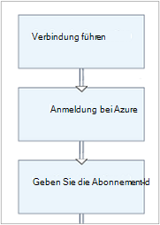

## <a name="step-7---add-activity-to-start-a-virtual-machine"></a>Schritt 7 - Aktivität, um eine virtuelle Maschine

Wir fügen nun eine Aktivität **Starten AzureRmVM** um einen virtuellen Computer zu starten.  Wählen alle virtuellen Computer in der Azure-Abonnement und jetzt werden wir in das Cmdlet Namen hartzucodieren.

1. Geben Sie **Start AzureRm** Library Control im Suchtextfeld.
2. Leinwand **Start AzureRmVM** hinzufügen und klicken und ziehen Sie unter **Abonnement-Id angeben**.
3. Mauszeiger **Abonnement-Id Geben Sie** ein Kreis auf der Unterseite der Form angezeigt.  Klicken Sie auf den Kreis, und ziehen Sie den Pfeil **Start AzureRmVM**. 
4.  Wählen Sie **Start-AzureRmVM**.  Klicken Sie auf **Parameter** **Parameter festgelegt** , die für **Start AzureRmVM**anzeigen.  Wählen Sie den **ResourceGroupNameParameterSetName** -Parameter. Beachten Sie, dass **ResourceGroupName** und **ein** Ausrufezeichen neben ihnen.  Dies bedeutet, dass sie Parameter erforderlich sind.  Beachten Sie, dass beide Werte erwartet.
5.  Wählen Sie **Namen**aus.  Wählen Sie **PowerShell-Ausdruck** für die **Datenquelle** und geben Sie den Namen der virtuellen Computer mit diesem Runbook zunächst Anführungszeichen umgeben.  Klicken Sie auf **OK**.<br>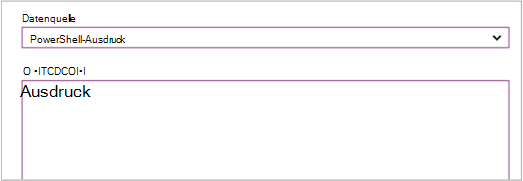
6.  **ResourceGroupName**auswählen Verwenden Sie **PowerShell Ausdruck** für die **Datenquelle** und geben Sie den Namen der Ressourcengruppe in doppelte Anführungszeichen eingeschlossen.  Klicken Sie auf **OK**.<br> 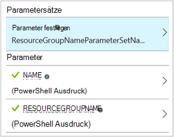
8.  Klicken Sie auf Test, damit wir Runbooks testen können.
9.  Klicken Sie auf **Start** , um den Test zu starten.  Sobald dies abgeschlossen ist, sicher, dass der virtuelle Computer gestartet wurde.

Ihr Runbook sollte nun folgendermaßen aussehen: <br>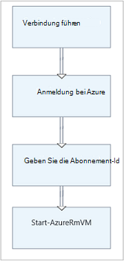

## <a name="step-8---add-additional-input-parameters-to-the-runbook"></a>Schritt 8 - Runbooks zusätzliche Parameter hinzufügen

Unsere Runbook startet der virtuelle Computer derzeit in der Ressourcengruppe, die wir das Cmdlet " **Start-AzureRmVM** " angegeben, aber unsere Runbook wäre sinnvoller, wenn wir beide begann Runbooks festlegen konnte.  Jetzt fügen wir diese Funktionalität Runbook Eingabeparameter hinzufügen.

1. Öffnen Sie den Grafiken-Editor im Bereich **MyFirstRunbook** auf **Bearbeiten** .
2. Klicken Sie auf **Eingabe und Ausgabe** **Hinzufügen Eingabe** Bereich Eingabeparameter Runbook öffnen.<br> 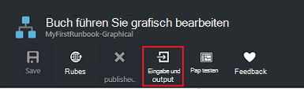
3. *VMName* **Namen**angeben  *Zeichenfolge* für den **Typ**beibehalten und ändern Sie **obligatorisch** auf *Ja*zu.  Klicken Sie auf **OK**.
4. Erstellen Sie zweiten obligatorischen Eingabeparameter namens *ResourceGroupName* , und klicken Sie dann auf **OK** , um den Bereich **ein- und Ausgabe** zu schließen.<br> 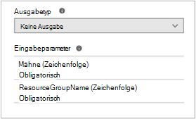
5. Wählen Sie die **Start-AzureRmVM** -Aktivität und dann auf **Parameter**.
6. Ändern Sie der **Datenquelle** für **Namen** **Runbook** Eingabe und dann **VMName**.<br>
7. Ändern Sie der **Datenquelle** für **ResourceGroupName** **Runbook** Eingabe und dann **ResourceGroupName**.<br> 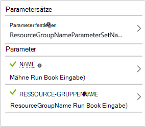
8. Speichern Sie Runbook und öffnen Sie das Fenster Test.  Beachten Sie, dass Sie nun Werte für zwei Eingabevariablen bereitstellen können, die im Test verwendet werden.
9. Schließen Sie das Fenster Test.
10. Klicken Sie auf **Veröffentlichen** , um die neue Version des Runbooks veröffentlichen.
11. Beenden Sie den virtuellen Computer, den Sie im vorherigen Schritt gestartet.
12. Klicken Sie auf **Starten** , um Runbooks starten.  Geben Sie **VMName** und **ResourceGroupName** für den virtuellen Computer, den Sie starten wollen.<br> 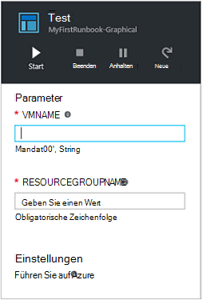
13. Nach Abschluss das Runbook sicher, dass der virtuelle Computer gestartet wurde.

## <a name="step-9---create-a-conditional-link"></a>Schritt 9 - bedingte verknüpfen

Wir werden jetzt Runbook ändern, sodass nur versucht wird, den virtuellen Computer starten, wenn er nicht bereits gestartet wurde.  Wir tun dies Runbooks, der Status der Instanz des virtuellen Computers erhalten ein Cmdlet **Get-AzureRmVM** hinzu. Wir fügen dann einem PowerShell Workflow Modul namens **Status Abfragen** mit einen Codeausschnitt PowerShell, ob der Zustand des virtuellen Computers ausgeführt wird oder angehalten ist.  Eine bedingte Verknüpfung aus dem Modul **"Status abfragen"** läuft nur **Start AzureRmVM** wird der aktuelle Ausführungsstatus beendet.  Schließlich gibt es eine Meldung, wenn die VM gestartet wurde oder nicht mit PowerShell Write-Output-Cmdlet.

1. Öffnen Sie **MyFirstRunbook** im Grafik-Editor.
2. Entfernen Sie die Verknüpfung zwischen **Abonnement-Id angeben** und **AzureRmVM Start** klicken und dann die *ENTF* -Taste drücken.
3. Geben Sie **Get-AzureRm** Library Control im Suchtextfeld.
4. Fügen Sie **Get-AzureRmVM** auf die Leinwand.
5. Wählen Sie **Get-AzureRmVM** und dann **Parametersatz** im wird für **Get-AzureRmVM**anzeigen.  Wählen Sie den **GetVirtualMachineInResourceGroupNameParamSet** -Parameter.  Beachten Sie, dass **ResourceGroupName** und **ein** Ausrufezeichen neben ihnen.  Dies bedeutet, dass sie Parameter erforderlich sind.  Beachten Sie, dass beide Werte erwartet.
6. Klicken Sie unter **Datenquelle** **Namen**wählen Sie **Runbook Eingabe** und dann **VMName**.  Klicken Sie auf **OK**.
7. Klicken Sie unter **Datenquelle** für **ResourceGroupName**wählen Sie **Runbook Eingabe** , und wählen Sie **ResourceGroupName**.  Klicken Sie auf **OK**.
8. Klicken Sie unter **Datenquelle** **Status**wählen Sie **Konstanten Wert aus** und dann auf **True**.  Klicken Sie auf **OK**.  
9. Erstellen einer Verknüpfung zur **AzureRmVM abrufen**von **Abonnement-Id angeben** .
10. Im Steuerelement Bibliothek **Runbook** Erweiterungssteuerelement und Leinwand **Code** hinzufügen.  
11. Erstellen einer Verknüpfung von **Get-AzureRmVM** **Code**.  
12. Klicken Sie auf **Code** und ändern Sie den Konfigurationsbereich Bezeichnung Status **Abrufen**.
13. **Code** -Parameter wählen und Blade- **Code-Editor** angezeigt.  
14. Fügen Sie im Code-Editor den folgenden Codeausschnitt:

     ```
     $StatusesJson = $ActivityOutput['Get-AzureRmVM'].StatusesText 
     $Statuses = ConvertFrom-Json $StatusesJson 
     $StatusOut ="" 
     foreach ($Status in $Statuses){ 
     if($Status.Code -eq "Powerstate/running"){$StatusOut = "running"} 
     elseif ($Status.Code -eq "Powerstate/deallocated") {$StatusOut = "stopped"} 
     } 
     $StatusOut 
     ```

15. Erstellen einer Verknüpfung zur **Start-AzureRmVM**Status **Abrufen** .<br> 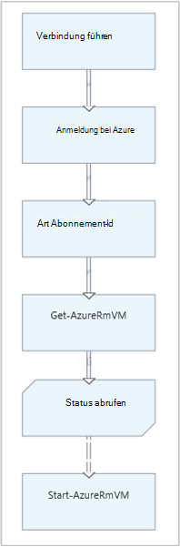  
16. Klicken Sie, und ändern Sie im Bereich Konfiguration **Übernehmen Bedingung** auf **Ja**.   Beachten Sie der Link wird eine gestrichelte Linie gibt an, dass die Aktivität nur ausgeführt wird, wenn die Bedingung ergibt true.  
17. Geben Sie für die **Bedingung** *$ActivityOutput ['Get Status'] - Eq "Beendet"*.  **Start-AzureRmVM** wird jetzt nur ausgeführt, wenn der virtuelle Computer angehalten wird.
18. Erweitern Sie im Library Control **Cmdlets** und **Microsoft.PowerShell.Utility**.
19. Die Leinwand zweimal **Write-Output** hinzufügen.<br> 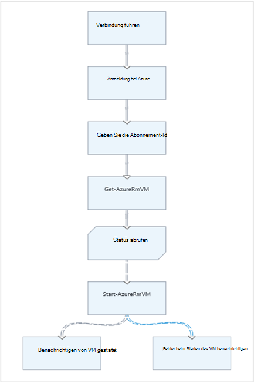
20. Das erste Steuerelement **Write-Output** **Parameter** auf und ändern Sie das **Etikett** *Benachrichtigen VM gestartet*.
21. Ändern Sie **Datenquelle** für **Eingabeobjekt** **PowerShell Ausdruck** und geben Sie den Ausdruck *"$VMName erfolgreich gestartet"*.
22. Das zweite Steuerelement **Write-Output** **Parameter** auf und ändern Sie den **Etikett** *Benachrichtigen VM starten* fehlgeschlagen
23. Ändern Sie **Datenquelle** für **Eingabeobjekt** **PowerShell Ausdruck** und geben Sie den Ausdruck *"$VMName konnte nicht gestartet werden."*.
24. Verknüpfen von **Start-AzureRmVM** zu **Benachrichtigen VM** **Benachrichtigen VM starten fehlgeschlagen**.
25. Wählen Sie den Link **Benachrichtigen VM** gestartet und ändern Sie **Übernehmen Bedingung** **true**.
26. Geben Sie die **Bedingung** *$ActivityOutput ['Start-AzureRmVM']. IsSuccessStatusCode - Eq $true*.  Dieses Steuerelement Write-Output wird jetzt nur ausgeführt, wenn der virtuelle Computer gestartet wird.
27. Wählen Sie den Link **Benachrichtigen VM starten** fehlgeschlagen und ändern Sie **Übernehmen Bedingung** **true**.
28. Geben Sie die **Bedingung** *$ActivityOutput ['Start-AzureRmVM']. IsSuccessStatusCode - Ne $true*.  Dieses Steuerelement Write-Output wird jetzt nur ausgeführt, wenn der virtuelle Computer nicht gestartet wird.
29. Speichern Sie Runbook und öffnen Sie das Fenster Test.
30. Starten Runbooks mit der virtuellen Maschine beendet und es sollte.

## <a name="next-steps"></a>Nächste Schritte

-   Erfahren Sie mehr zum Erstellen von Grafiken finden Sie unter [Graphical authoring in Azure Automation](automation-graphical-authoring-intro.md)
-   Zunächst mit PowerShell Runbooks finden Sie [meinen ersten PowerShell runbook](automation-first-runbook-textual-powershell.md)
-   Zunächst mit PowerShell Workflow Runbooks finden Sie [meinen ersten PowerShell Workflow runbook](automation-first-runbook-textual.md)
