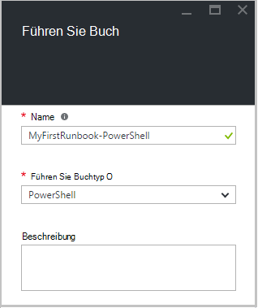
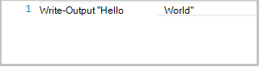
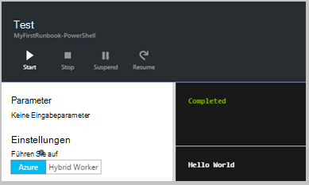
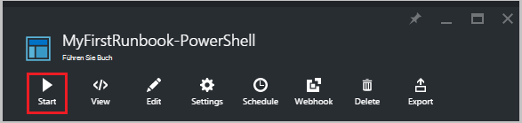
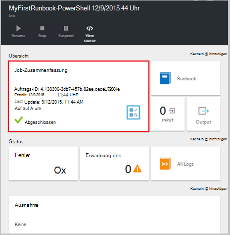
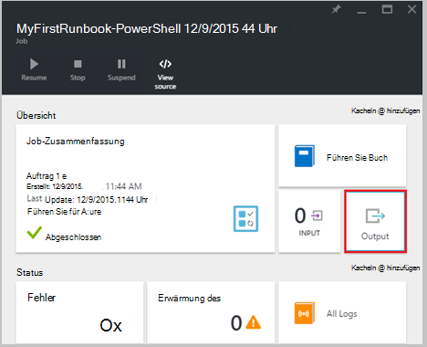
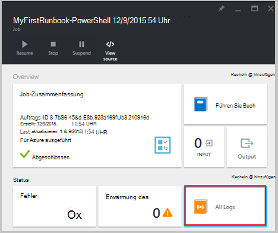
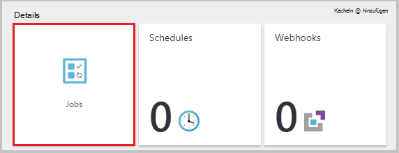
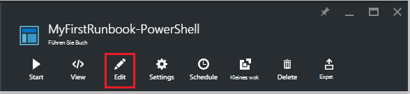
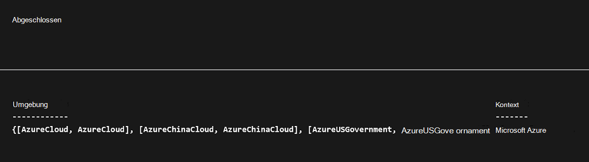

<properties
    pageTitle="Meine erste PowerShell Runbook in Azure Automatisierung | Microsoft Azure"
    description="Lernprogramm, in dem Sie durch das Erstellen, testen und Veröffentlichen eines einfachen PowerShell Runbooks geführt."
    services="automation"
    documentationCenter=""
    authors="mgoedtel"
    manager="jwhit"
    editor=""
    keywords="Azure Powershell Powershell Skript Lernprogramm, Powershell Automatisierung"/>
<tags
    ms.service="automation"
    ms.workload="tbd"
    ms.tgt_pltfrm="na"
    ms.devlang="na"
    ms.topic="get-started-article"
    ms.date="07/19/2016"
    ms.author="magoedte;sngun"/>

# <a name="my-first-powershell-runbook"></a>Meine erste PowerShell runbook

> [AZURE.SELECTOR] - [Grafisch](automation-first-runbook-graphical.md) - [PowerShell](automation-first-runbook-textual-PowerShell.md) - [PowerShell Workflow](automation-first-runbook-textual.md)  

Dieses Lernprogramm führt Sie durch die Erstellung eines [PowerShell Runbook](automation-runbook-types.md#powershell-runbooks) in Azure Automation. Wir beginnen mit einem einfachen Runbook, die wir testen und veröffentlichen und erläutert, wie Sie den Status des Auftrags Runbook verfolgen. Dann werden wir Runbook tatsächlich Azure Ressourcen verwalten ändern, in diesem Fall Starten einer Azure Virtual Machine. Wir werden dann Runbooks stabiler machen Runbook Parameter hinzufügen.

## <a name="prerequisites"></a>Erforderliche Komponenten

Um dieses Lernprogramm benötigen Sie Folgendes.

-   Azure-Abonnement. Wenn Sie noch keine haben, können Sie [Ihre MSDN-Abonnementvorteile aktivieren](https://azure.microsoft.com/pricing/member-offers/msdn-benefits-details/) oder <a href="/pricing/free-account/" target="_blank"> [für ein kostenloses Konto anmelden](https://azure.microsoft.com/free/).
-   [Automation-Konto](automation-security-overview.md) zu Runbooks Azure Ressourcen authentifizieren.  Dieses Konto muss über die Berechtigung zum Starten und beenden Sie den virtuellen Computer.
-   Azure VM. Wir beenden und starten dieses Computers damit Produktion nicht zulässig.

## <a name="step-1---create-new-runbook"></a>Schritt 1 - erstellen Sie neue runbook

Zunächst erstellen eine einfache Runbooks, das den Text *Hello World*ausgibt.

1.  Öffnen Sie in Azure-Verwaltungsportal Automation-Konto.  
    Die Automatisierung Seite bietet einen schnellen Überblick über die Ressourcen auf diesem Konto. Sie haben bereits einige Vermögenswerte. Die meisten sind die Module, die automatisch in ein neues automatisierungskonto enthalten sind. Sie müssen auch Anmeldeinformationen Anlage, die in [Komponenten](#prerequisites)genannt.
2.  Klicken Sie auf die Kachel **Runbooks** Runbooks öffnen.  
      
3.  Erstellen Sie neue Runbook durch Klicken auf die Schaltfläche **Hinzufügen ein Runbook** und **erstellen eine neue Runbook**.
4.  Geben Sie dem Runbook *PowerShell MyFirstRunbook*.
5.  In diesem Fall werden wir ein [PowerShell Runbook](automation-runbook-types.md#powershell-runbooks) erstellen für **ein Runbook** **Powershell** wählen.  
      
6.  Klicken Sie auf **Erstellen** , um die Runbook erstellen und den Texten-Editor öffnen.

## <a name="step-2---add-code-to-the-runbook"></a>Schritt 2 - Runbooks Code hinzufügen

Können Sie entweder Code für direkt in die Runbook und Library Control Cmdlets Runbooks und Elemente auswählen und diese Runbooks mit verknüpften Parametern hinzugefügt. In dieser exemplarischen Vorgehensweise werden wir direkt in die Runbook eingeben.

1.  Unsere Runbook ist leer, Typ *Output schreiben "Hello World"*.  
      
2.  Speichern des Runbooks **Speichern**.  
      

## <a name="step-3---test-the-runbook"></a>Schritt 3: Test Runbooks

Vor dem veröffentlichen wir Runbook in der Produktion zur Verfügung stellen wollen wir testen, um sicherzustellen, dass sie ordnungsgemäß funktioniert. Beim Testen ein Runbook **dessen Entwurf** ausgeführt und die Ausgabe interaktiv anzeigen.

1.  Klicken Sie **im Bereich Test** im Bereich Test öffnen.  
      
2.  Klicken Sie auf **Start** , um den Test zu starten. Dies sollte die einzige aktivierte Option.
3.  Ein [Runbook Auftrag](automation-runbook-execution.md) erstellt und Status angezeigt.  
    Der Status wird als *Warteschlange* , dass eine Arbeitskraft für ein Runbook in die Cloud sind gewartet wird gestartet. Es wird zu *Starten* nun bei eine Arbeitskraft behauptet das Projekt und dann *Ausführen* , wenn Runbooks tatsächlich gestartet.  
4.  Bei Beendigung des Auftrags Runbook wird die Ausgabe angezeigt. In diesem Fall sollten wir *Hello World* sehen.  
      
5.  Schließen Sie das Fenster Test der Leinwand zurückzukehren.

## <a name="step-4---publish-and-start-the-runbook"></a>Schritt 4: Veröffentlichen und Runbooks starten

Das soeben erstellte Runbook ist immer noch im Entwurfsmodus. Wir müssen es veröffentlichen, bevor wir in der Produktion ausgeführt werden kann. Beim Veröffentlichen eines Runbooks überschrieben mit Entwurf vorhandene veröffentlichte Version. In unserem Fall haben wir nicht veröffentlichte Version noch da wir nur Runbook erstellt.

1.  Klicken Sie auf **Veröffentlichen** Runbook veröffentlichen und dann auf **Ja** .  
      
2.  Wenn Sie Bildlaufleiste um Runbooks jetzt im **Runbooks** anzeigen, zeigt es ein **Erstellungsstatus** **veröffentlicht**.
3.  Bildlauf nach rechts im Bereich **MyFirstRunbook -**PowerShell anzeigen.  
    Die Optionen oben können Sie Runbooks Starten anzeigen Runbooks, zu einem Zeitpunkt in der Zukunft zu planen oder [Webhook](automation-webhooks.md) erstellen, damit er gestartet werden kann über einen HTTP-Aufruf.
4.  Wir wollen nur Runbooks starten klicken Sie auf **Start** und dann auf **Ok** , wenn das Blade starten Runbook öffnet.  
      
5.  Eine im Auftrag wird Runbook Auftrag geöffnet, die wir gerade erstellt haben. Können wir diesen Bereich schließen, aber in diesem Fall wir werden offen, damit wir den Auftrag Fortschritt überwachen können.
6.  Der Status wird in **Jobübersicht** und entspricht der Status, die wir beim Runbooks getestet haben.  
      
7.  Sobald der Runbook Status *abgeschlossen*angezeigt wird, klicken Sie auf **Ausgabe**. Ausgabebereich wird geöffnet, und wir sehen unsere *Hello World*.  
    
8.  Schließen Sie das Fenster Ausgabe.
9.  Klicken Sie auf **Alle Protokolle** Bereich des Streams Runbook Auftrag geöffnet. Sehen wir nur *Hello World* im Ausgabestream, aber dies kann anderen Streams für ein Runbook Projekt ausführlich und Fehler anzeigen, wenn Runbooks schreibt.  
      
10. Schließen Sie den Streams und im Auftrag MyFirstRunbook-PowerShell-Fenster zurückzukehren.
11. Klicken Sie auf **Aufträge** Aufträge im für dieses Runbook öffnen. Hier werden alle Arbeitsplätze dieser Runbook. Es sollte nur ein Auftrag, da wir den Auftrag nur einmal ausführen angezeigt.  
      
12. Klicken Sie auf dieses Projekt im gleichen Auftrag öffnen, die wir beim wir Runbook gestartet angezeigt. So können Sie zurück, und zeigen Sie die Details eines Auftrags, der für ein bestimmtes Runbook erstellt wurde.

## <a name="step-5---add-authentication-to-manage-azure-resources"></a>Schritt 5 - Authentifizierung Azure Ressourcen

Wir getestet und unsere Runbook veröffentlicht, aber so weit es nicht sinnvoll. Wir möchten es Azure Ressourcen. Sie werden dazu jedoch ohne Authentifizierung mit den Anmeldeinformationen, die in [Komponenten](#prerequisites)bezeichnet werden, können. Dazu verwenden wir das Cmdlet **AzureRmAccount hinzufügen** .

1.  Öffnen des Texten-Editors im Bereich MyFirstRunbook-PowerShell auf **Bearbeiten** .  
      
2.  Wir benötigen **Schreibzugriff** Ausgabezeile mehr, so weiter und löschen.
3.  Geben Sie oder kopieren Sie und fügen Sie folgenden Code, der die Authentifizierung mit Automatisierung ausführen als Konto behandelt:

    ```
     $Conn = Get-AutomationConnection -Name AzureRunAsConnection 
     Add-AzureRMAccount -ServicePrincipal -Tenant $Conn.TenantID `
     -ApplicationId $Conn.ApplicationID -CertificateThumbprint $Conn.CertificateThumbprint
    ``` 
<br>
4.  Klicken Sie auf **Test Bereich** , sodass Runbooks getestet werden können.
5.  Klicken Sie auf **Start** , um den Test zu starten. Nach Abschluss erhalten Sie eine Ausgabe wie die folgende, mit grundlegenden Informationen von Ihrem Konto. Dadurch wird bestätigt, dass die Anmeldeinformationen gültig ist. <br> 

## <a name="step-6---add-code-to-start-a-virtual-machine"></a>Schritt 6 - Code zum Starten der virtuellen Computer

Da unsere Runbook Azure-Abonnement authentifiziert, können wir Ressourcen verwalten. Wir fügen einen Befehl zu einem virtuellen Computer. Wählen alle virtuellen Computer in der Azure-Abonnement und jetzt werden wir in das Cmdlet Namen hartzucodieren.

1.  Geben Sie nach dem *Hinzufügen AzureRmAccount* *Start AzureRmVM-Namen 'VMName' - ResourceGroupName 'NameofResourceGroup'* die Namen und Name der Ressourcengruppe des virtuellen Computers zu.  
    
    ```
     $Conn = Get-AutomationConnection -Name AzureRunAsConnection 
     Add-AzureRMAccount -ServicePrincipal -Tenant $Conn.TenantID `
     -ApplicationID $Conn.ApplicationID -CertificateThumbprint $Conn.CertificateThumbprint 
     Start-AzureRmVM -Name 'VMName' -ResourceGroupName 'ResourceGroupName'
     ```
<br>
2.  Runbooks und klicken **im Bereich testen** , damit wir sie testen können.
3.  Klicken Sie auf **Start** , um den Test zu starten. Sobald dies abgeschlossen ist, sicher, dass der virtuelle Computer gestartet wurde.

## <a name="step-7---add-an-input-parameter-to-the-runbook"></a>Schritt 7 - Runbooks Eingabeparameter hinzufügen

Unsere Runbook gegenwärtig startet virtual, die hartcodiert im Runbook Computer, aber es wäre besser nutzen wir den virtuellen Computer begann Runbooks bestimmen. Jetzt fügen wir diese Funktionalität Runbook Eingabeparameter hinzufügen.

1.  Runbooks Parameter für *VMName* und *ResourceGroupName* hinzufügen und diese Variablen mit dem **Start-AzureRmVM** -Cmdlet wie im folgenden Beispiel verwenden.  
    
    ```
    Param(
       [string]$VMName,
       [string]$ResourceGroupName
    )
     $Conn = Get-AutomationConnection -Name AzureRunAsConnection 
     Add-AzureRMAccount -ServicePrincipal -Tenant $Conn.TenantID `
     -ApplicationID $Conn.ApplicationID -CertificateThumbprint $Conn.CertificateThumbprint 
     Start-AzureRmVM -Name $VMName -ResourceGroupName $ResourceGroupName
     ```
<br> 
2.  Speichern Sie Runbook und öffnen Sie das Fenster Test. Beachten Sie, dass Sie nun Werte für zwei Eingabevariablen bereitstellen können, die im Test verwendet werden.
3.  Schließen Sie das Fenster Test.
4.  Klicken Sie auf **Veröffentlichen** , um die neue Version des Runbooks veröffentlichen.
5.  Beenden Sie den virtuellen Computer, den Sie im vorherigen Schritt gestartet.
6.  Klicken Sie auf **Starten** , um Runbooks starten. Geben Sie **VMName** und **ResourceGroupName** für den virtuellen Computer, den Sie starten wollen.  
      
7.  Nach Abschluss das Runbook sicher, dass der virtuelle Computer gestartet wurde.

## <a name="differences-from-powershell-workflow"></a>Unterschiede von PowerShell-Workflow

PowerShell Runbooks Lebenszyklus, Funktionen und Management als PowerShell Workflow Runbooks aber es gibt einige Unterschiede und Grenzen:

1.  PowerShell Runbooks schnell ausgeführt wie Kompilierung nicht mit PowerShell Workflow Runbooks verglichen.
2.  PowerShell Workflow Runbooks unterstützt Kontrollpunkte mit Prüfpunkten, PowerShell Workflow Runbooks können von einem beliebigen Punkt im Runbook fortsetzen, während PowerShell Runbooks nur am Anfang fortgesetzt werden kann.
3.  PowerShell Workflow Runbooks unterstützen parallele und serielle Ausführung während PowerShell Runbooks seriell nur Befehle ausführen können.
4.  In ein Runbook PowerShell Workflow haben eine Aktivität, einen Befehl oder einen Skriptblock eigene Runspace muß in ein Runbook PowerShell alles in einem Skript in einer einzigen Runspace ausgeführt wird. Gibt es auch einige [Unterschiede](https://technet.microsoft.com/magazine/dn151046.aspx) zwischen systemeigenen PowerShell Runbook und ein Runbook PowerShell Workflow.

## <a name="next-steps"></a>Nächste Schritte

-   Zunächst mit grafisch Runbooks sehen Sie [Meine erste grafisch runbook](automation-first-runbook-graphical.md)
-   Zunächst mit PowerShell Workflow Runbooks finden Sie [meinen ersten PowerShell Workflow runbook](automation-first-runbook-textual.md)
-   Über Runbook Typen, deren vor- und Nachteile finden Sie unter [Azure Runbook Automatisierungstypen](automation-runbook-types.md)
-   Weitere Informationen zu PowerShell-Skript Feature unterstützt, finden Sie [in Azure Automation unterstützt Native PowerShell-Skript](https://azure.microsoft.com/blog/announcing-powershell-script-support-azure-automation-2/)
