<properties 
    pageTitle="Grafisch erstellen in Azure Automatisierung | Microsoft Azure"
    description="Grafisch erstellen kann Runbooks Azure Automatisierung erstellen, ohne Code. Dieser Artikel bietet eine Einführung in grafisch erstellen und alle Details erstellen grafisch Runbook."
    services="automation"   
    documentationCenter=""
    authors="mgoedtel"
    manager="jwhit"
    editor="tysonn" />
<tags 
    ms.service="automation"
    ms.devlang="na"
    ms.topic="article"
    ms.tgt_pltfrm="na"
    ms.workload="infrastructure-services"
    ms.date="06/03/2016"
    ms.author="magoedte;bwren" />

# Grafisch in Azure Automation erstellen

## Einführung

Grafisch erstellen kann Runbooks Azure Automatisierung ohne die Komplexität der zugrunde liegenden Windows PowerShell oder Workflow-PowerShell-Code erstellen. Sie fügen Aktivitäten auf der Leinwand aus einer Bibliothek mit Cmdlets und Runbooks, miteinander verknüpfen und zu einem Workflow konfigurieren.  Wenn Sie jemals mit System Center Orchestrator oder Service Management-Automatisierung (SMA) gearbeitet haben, sollte dann dies vertraut aussehen.   

Dieser Artikel enthält eine Einführung in grafisch erstellen und den Konzepten grafisch Runbook erstellen möchten.

## Grafisch runbooks

Alle Runbooks in Azure Automation sind Windows PowerShell Workflows.  Grafik- und grafisch PowerShell Workflow Runbooks PowerShell Code generieren, der durch die Automatisierung Arbeitskräfte ausführen, jedoch können nicht anzeigen oder direkt zu ändern.  Grafisch Runbook grafisch PowerShell Workflow Runbook und umgekehrt konvertiert werden kann, jedoch nicht in Textform Runbook konvertiert werden. Vorhandenen Text Runbook kann im Grafik-Editor importiert werden.  

## Übersicht des Grafik-Editors

Sie können den Grafiken-Editor in Azure-Portal öffnen erstellen oder Bearbeiten einer grafisch Runbook.

In den folgenden Abschnitten werden die Steuerelemente im Grafik-Editor beschrieben.

### Leinwand
Die Leinwand ist, in dem Ihr Runbook entwerfen.  Sie Runbooks Aktivitäten von Knoten im Steuerelement Bibliothek hinzufügen und Links zu definieren, die Logik des Runbooks verbinden.

Die Steuerelemente können am unteren Rand der Leinwand Sie vergrößern und verkleinern.

### Bibliothek-Steuerelement

Library Control ist, wählen Sie [Aktivitäten](#activities) der Runbook hinzu.  Sie fügen zu dem Bereich, in dem Sie diese anderen Aktivitäten verbinden.  Es enthält vier Abschnitte in der folgenden Tabelle beschrieben.

| Abschnitt | Beschreibung |
|:---|:---|
| Cmdlets | Enthält Ihr Runbook alle Cmdlets, die verwendet werden kann.  Modul Cmdlets organisiert.  Alle Module, die Sie in Ihrem automatisierungskonto installiert haben sind verfügbar.  |
| Runbooks |  Enthält die Runbooks Automation-Konto. Diese Runbooks können Canvas als untergeordnete Runbooks verwendet werden hinzugefügt. Nur Runbooks Core dasselbe als Runbook bearbeitet werden angezeigt. für Graphical sind nur PowerShell-basiertes Runbooks Runbooks angezeigt, während grafisch PowerShell Workflow Runbooks nur PowerShell-Workflow-basierten Runbooks angezeigt werden.
| Anlagen | Enthält die [Automatisierung Anlagen](http://msdn.microsoft.com/library/dn939988.aspx) in Kontos Automatisierung in Ihrem Runbook verwendet werden kann.  Beim Hinzufügen einer Anlage auf ein Runbook wird eine Workflow-Aktivität hinzugefügt, die der ausgewählten Ressource abruft.  Bei Variablen Elemente können Sie auswählen, ob eine Aktivität die Variable oder die Variable hinzufügen.
| Runbook Steuerelement | Runbook Kontrollen, die verwendet werden können enthält in Ihrem aktuellen Runbook. Eine *Verbindung* hat mehrere Eingaben und wartet, bis alle abgeschlossen haben, bevor der Workflow fortgesetzt. *Code* -Aktivität führt eine oder mehrere Codezeilen PowerShell oder PowerShell Workflow grafisch Runbook je.  Können Sie diese Aktivität für benutzerdefinierten Code oder Funktionen, die schwierig mit anderen Aktivitäten.|

### Konfiguration

Das Konfigurationssteuerelement ist wo Sie Details für ein Objekt auf der Leinwand aktiviert. Die Eigenschaften dieses Steuerelements hängt von den Typ des ausgewählten Objekts.  Beim Auswählen einer Option im Konfigurationssteuerelement öffnet weiterer Blades um zusätzliche Informationen bereitzustellen.

### Steuerelement

Test-Steuerelement wird nicht angezeigt, wenn der grafische-Editor zuerst gestartet wird. Wird geöffnet, wenn Sie interaktiv [grafisch Runbook testen](#graphical-runbook-procedures).  

## Grafisch Runbook Verfahren 

### Exportieren und Importieren von Grafiken runbook

Sie können nur veröffentlichte grafisch Runbooks exportieren.  Runbook noch nicht veröffentlicht wurde, wird die Schaltfläche **Exportieren veröffentlichten** deaktiviert.  Beim Klicken auf die Schaltfläche **Exportieren veröffentlicht** wird Runbook auf Ihren lokalen Computer heruntergeladen.  Der Name der Datei mit dem Namen Runbooks mit der Erweiterung *Graphrunbook* übereinstimmt.

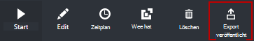

Eine Runbook Graphical oder grafisch PowerShell Workflow können durch Auswahl der Option **Importieren** , wenn ein Runbook hinzufügen.   Bei der Auswahl der zu importierenden Datei können Sie den alten **Namen** beibehalten oder eine neue.  Feld Runbook wird zeigen den Runbooks bewertet der ausgewählten Datei und wenn Sie versuchen, einen anderen Typ auswählen, der nicht korrekt ist, eine Nachricht präsentiert werden potenzielle Konflikte und während der Konvertierung möglicherweise Syntaxfehler beachten.  

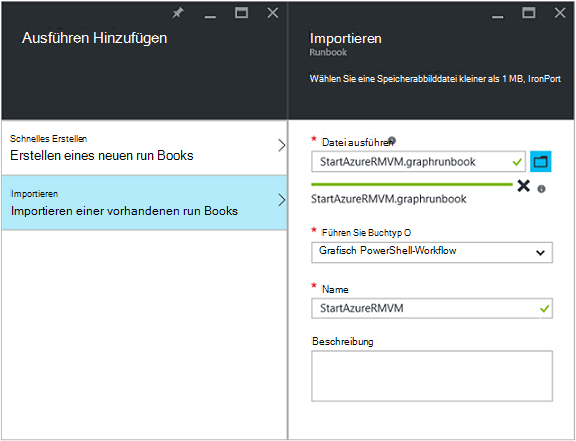

### Grafisch Runbook testen

Testen Sie den Entwurf ein Runbook in Azure-Portal die veröffentlichte Version des Runbooks unverändert, oder Sie können eine neue Runbook testen, bevor sie veröffentlicht. Dadurch können Sie sicherstellen, dass das Runbook ordnungsgemäß funktioniert, bevor die veröffentlichte Version ersetzen. Beim Testen eines Runbooks Entwurf Runbook ausgeführt und diese führt Aktionen abgeschlossen. Keine Historie erstellt, aber Ausgabe im der Ausgabe. 

Öffnen Sie Test-Steuerelement für ein Runbook Runbook zum Bearbeiten öffnen, und klicken Sie dann auf die Schaltfläche **Test** .

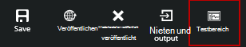

Fordert das Test-Steuerelement für alle Eingabeparameter und starten Runbooks durch Klicken auf die Schaltfläche **Start** .

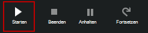

### Grafisch Runbook veröffentlichen

Jedes Runbook in Azure Automation hat einen Entwurf und veröffentlichte Version. Nur veröffentlichte Version steht ausgeführt werden, und nur die Entwurfsversion kann bearbeitet werden. Die veröffentlichte Version ist von Änderungen zum Entwurf. Wenn der Entwurf verfügbar ist, veröffentlichen Sie die veröffentlichte Version mit Entwurf überschreibt.

Zum Veröffentlichen grafisch Runbook Runbook für bearbeiten und dann auf die Schaltfläche " **Veröffentlichen** " öffnen.

Wenn ein Runbook noch nicht veröffentlicht wurde, hat den Status **neu**.  Wenn es veröffentlicht wurde, hat den Status **veröffentlicht**.  Bearbeiten das Runbook veröffentlicht wurde und die Entwurfsdatenbank und der veröffentlichten Versionen unterscheiden hat Runbooks Status **In Bearbeitung**.

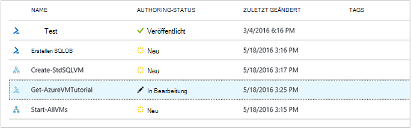 

Sie können auch auf die veröffentlichte Version eines Runbooks zurückgesetzt.  Dies wirft Weg Änderungen Runbooks zuletzt veröffentlicht wurde und die Entwurfsversion der Runbook veröffentlichte Version ersetzt.

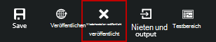

## Aktivitäten

Aktivitäten sind die Bausteine eines Runbooks.  Eine Aktivität kann ein PowerShell-Cmdlet, untergeordnete Runbook oder einer Workflow-Aktivität.  Hinzufügen einer Aktivität zu Runbooks rechts im Steuerelement Bibliothek und hinzufügen **zu**.  Sie können dann klicken und ziehen die Aktivität, um sie auf der Leinwand platzieren, das Ihnen gefällt.  Die Position der Aktivität auf der Leinwand hat keinen Einfluss auf die Operation Runbook in keiner Weise.  Können Sie Layout der Runbook Sie am besten geeigneten Vorgangsphasen visualisieren gefunden. 

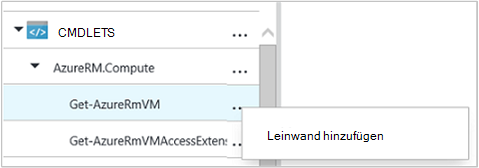

Wählen Sie die Aktivität auf der Leinwand Eigenschaften und Parameter in der Blade-Konfiguration konfigurieren.  Die **Bezeichnung** der Aktivität können Sie etwas ändern, die für Sie aussagekräftig ist.  Das ursprüngliche Cmdlet noch ausgeführt wird, ändern Sie einfach den Anzeigenamen im Grafik-Editor.  Die Bezeichnung muss innerhalb der Runbook eindeutig sein. 

### Parametersätze

Ein Parameter definiert die erforderliche und optionale Parameter, die Werte für ein bestimmtes Cmdlet akzeptieren.  Alle Cmdlets mindestens einen Parameter festlegen und einige mehrere.  Hat ein Cmdlet mehrere Parametersätze müssen, wählen Sie verwendet wird, bevor Sie Parameter konfigurieren können.  Die Parameter, die Sie konfigurieren können, hängt von der Parameter festgelegt, die Sie auswählen.  Ändern Sie den Parametersatz, indem **Parametersatz** auswählen und einen anderen Satz von Aktivität verwendet.  In diesem Fall sind alle konfigurierten Parameterwerte verloren.

Im folgenden Beispiel hat das Cmdlet "Get-AzureRmVM" drei Parameter.  Parameterwerte können nicht konfiguriert werden, bis eines der Parameter auswählen.  Parametersatz ListVirtualMachineInResourceGroupParamSet ist für die Rückgabe aller virtuellen Computer in einer Ressourcengruppe und verfügt über einen optionalen Parameter.  Die GetVirtualMachineInResourceGroupParamSet ist für den virtuellen Computer zurückkehren und hat zwei obligatorische und einen optionalen Parameter angeben.

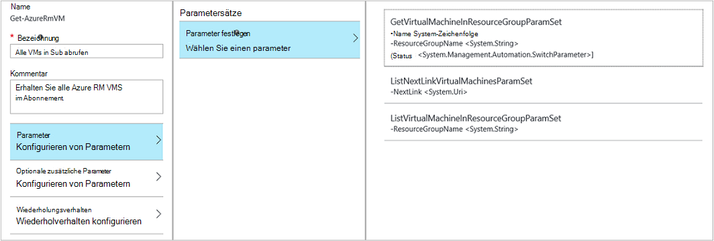

#### Parameterwerte

Wenn Sie einen Wert für einen Parameter angeben, wählen Sie eine Datenquelle bestimmen, wie der Wert angegeben werden.  Datenquellen, die für einen bestimmten Parameter hängen gültige Werte für diesen Parameter.  Null werden z. B. keine verfügbare Option für Parameter, die keine null-Werte zulässt.

| Datenquelle | Beschreibung |
|:---|:---|
|Konstanter Wert|Geben Sie einen Wert für den Parameter ein.  Dies ist nur für die folgenden Datentypen: Int32, Int64, String, Boolean, DateTime, wechseln. |
|Leistungsabgabe|Ausgabe einer Aktivität, die vor der aktuellen Aktivität im Workflow.  Alle gültige Aktivitäten werden aufgelistet.  Wählen Sie nur die Aktivität die Ausgabe des Parameterwerts verwendet.  Wenn die Aktivität ein Objekt mit mehreren Eigenschaften gibt, können Sie den Namen der Eigenschaft nach der Auswahl der Aktivität eingeben.|
|Runbook Eingabe |Wählen Sie einen Runbook Eingabeparameter als Eingabe für den Aktivitätsparameter.|  
|Variable Anlage|Wählen Sie ein Automation-Variable als Eingabe.|  
|Anmeldeinformationen Anlage|Wählen Sie eine Automatisierung Anmeldeinformationen als Eingabe.|  
|Zertifikat-Anlage|Auswählen eines Zertifikats Automatisierung als Eingabe.|  
|Verbindung Anlage|Wählen Sie eine Automatisierung Verbindung als Eingabe.| 
|PowerShell-Ausdruck|Einfache [PowerShell Ausdruck](#powershell-expressions)angeben.  Der Ausdruck wird vor der Aktivität und der Parameterwert zum Ergebnis ausgewertet.  Variablen können Sie die Ausgabe einer Aktivität oder ein Runbook Eingabeparameter verweisen.|
|Nicht konfiguriert|Löscht alle zuvor konfigurierten Wert.|

#### Optionale zusätzliche Parameter

Alle Cmdlets haben die Möglichkeit, zusätzliche Parameter bereitzustellen.  Dies sind allgemeine PowerShell-Parameter oder andere benutzerdefinierte Parameter.  Ein Textfeld wird angezeigt, wo Sie mit PowerShell Syntax Parameter erhalten.  Beispielsweise um gemeinsame **Verbose** -Parameter verwenden, geben Sie **"-Verbose: $True"**.

### Aktivität wiederholen

**Erneut** kann eine Aktivität mehrmals ausgeführt werden, bis eine bestimmte Bedingung erfüllt ist, ähnlich wie eine Schleife.  Verwenden Sie diese Funktion für Aktivitäten, die mehrmals ausgeführt werden sollten, fehleranfällig und mehrere Erfolg versuchen, oder testen Ausgabeinformationen Aktivität für gültige Daten.    

Wenn Sie nach einer Aktivität wiederholen aktivieren, können Sie eine Verzögerung und eine Bedingung festlegen.  Die Verzögerung ist die Zeit (in Sekunden oder Minuten gemessen), dass Runbooks warten soll, bevor die Aktivität erneut ausgeführt wird.  Wenn ohne Verzögerung angegeben ist, wird die Aktivität erneut ausführen, sofort nach Abschluss. 

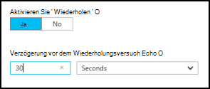

Die Wiederholung Bedingung ist ein Ausdruck PowerShell, der nach jedem ausgewertet wird, wenn die Aktivität ausgeführt wird.  Wenn der Ausdruck true ergibt, wird die Aktivität erneut.  Wenn der Ausdruck False ergibt Runbooks fährt mit der nächsten Aktivität die Aktivität ist nicht wiederholen 

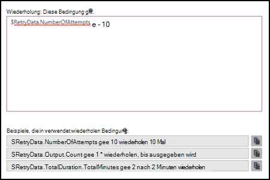

Die Bedingung wiederholen können eine Variable namens $RetryData den Zugriff auf Informationen zur Aktivität Versuche.  Diese Variable hat die Eigenschaften in der folgenden Tabelle.

| Eigenschaft | Beschreibung |
|:--|:--|
| NumberOfAttempts | Anzahl der Fälle, in denen die Aktivität ausgeführt wurde.              |
| Ausgabe           | Ausgabe der letzten Ausführung der Aktivität.                    |
| TotalDuration    | Timeout verstrichene Aktivität zum ersten Mal gestartet wurde. |
| StartedAt        | Die Zeit im UTC-Format, die Aktivität zuerst gestartet wurde.           |

Es folgen Beispiele für Startbedingungen wiederholen.

    # Run the activity exactly 10 times.
    $RetryData.NumberOfAttempts -ge 10 

    # Run the activity repeatedly until it produces any output.
    $RetryData.Output.Count -ge 1 

    # Run the activity repeatedly until 2 minutes has elapsed. 
    $RetryData.TotalDuration.TotalMinutes -ge 2

Nach dem Konfigurieren einer Wiederholung Bedingung für eine Aktivität enthält der Aktivität zwei optische Hinweise, um Sie zu erinnern.  Wird eine Aktivität dargestellt und das andere ist die Konfiguration der Aktivität zu überprüfen.

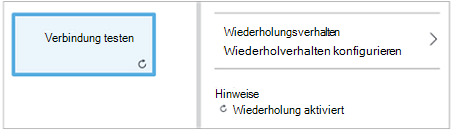

### Workflow Skriptsteuerelement

Ein Code-Steuerelement ist eine spezielle Aktivität, die akzeptiert PowerShell oder PowerShell Workflow Skript je grafisch Runbook wird erstellt, um Funktionen bereitzustellen, die ansonsten nicht verfügbar sind.  Es kann keine Parameter annehmen, aber Variablen für Aktivität Ausgabe und Runbook Parameter verwenden.  Ausgabe der Aktivität den Datenbus hinzugefügt, sofern es keine ausgehenden Verknüpfen der Ausgabe des Runbooks hinzugefügt wurde.

Der folgende Code führt beispielsweise Datumskalkulationen verwenden eine Eingabevariable Runbook $NumberOfDays aufgerufen.  Er schickt berechnete Datum Uhrzeit als Ausgabe von nachfolgenden Aktivitäten im Runbook verwendet werden.

    $DateTimeNow = (Get-Date).ToUniversalTime()
    $DateTimeStart = ($DateTimeNow).AddDays(-$NumberOfDays)}
    $DateTimeStart

## Links und workflow

Einen **Link** in eine grafisch Runbook verbindet zwei Aktivitäten.  Es wird als ein Pfeil aus der Quelle zum Zielaktivität auf der Leinwand angezeigt.  Die Aktivitäten führen Sie in Richtung des Pfeils mit Zielaktivität nach quellaktivität abgeschlossen ist.  

### Erstellen einer Verknüpfung

Erstellen einer Verknüpfung zwischen zwei Aktivitäten quellaktivität auswählen und auf den Kreis am unteren Rand der Form.  Ziehen Sie den Pfeil Zielaktivität und Release.

Die Eigenschaften in der Blade-Konfiguration konfigurieren klicken.  Dazu gehören den Linktyp beschrieben in der folgenden Tabelle.

| Verknüpfungstyp | Beschreibung |
|:---|:---|
| Pipeline | Die Zielaktivität wird einmal für jedes Objektausgabe aus der Quelle ausgeführt.  Die Zielaktivität wird nicht ausgeführt, wenn keine quellaktivität führt.  Ausgabe aus der Quelle ist als Objekt verfügbar.  |
| Sequenz | Die Zielaktivität wird nur einmal ausgeführt.  Sie empfängt ein Array von Objekten aus der Quelle.  Ausgabe aus der Quelle wird als ein Array von Objekten. |

### Aktivität starten

Grafisch Runbook beginnt mit Aktivitäten, die nicht über eine eingehende Verbindung.  Dies wird häufig nur eine Aktivität als erste Aktivität für die Runbook handeln.  Wenn mehrere Aktivitäten eine eingehende Verknüpfung, keinen Runbooks parallel ausgeführt zu werden.  Es folgen dann Links zu anderen Aktivitäten ausführen als Vorgang abgeschlossen ist.

### Startbedingungen

Beim Angeben einer Bedingung auf einen Link wird die Zielaktivität nur ausgeführt, wenn Bedingung ergibt true.  In der Regel benötigen eine $ActivityOutput-Variable in einer Bedingung die Ausgabe aus der Datenquelle abgerufen.  

Eine pipelineverknüpfung eine Bedingung für ein einzelnes Objekt und die Bedingung für jedes Objektausgabe von der quellaktivität ausgewertet.  Die Zielaktivität wird für jedes Objekt ausgeführt, das die Bedingung erfüllt.  Beispielsweise konnte mit einer quellaktivität von Get-AzureRmVm die folgende Syntax für einen bedingten Pipeline Link verwendet werden nur virtuelle Computer in der Ressourcengruppe mit dem Namen *Gruppe1*abgerufen.  

    $ActivityOutput['Get Azure VMs'].Name -match "Group1"

Für einen Link Sequenz die Bedingung nur einmal ausgewertet wird seit ein Array alle Objekte Ausgabe aus der Quelle.  Deshalb ein Sequenz Link nicht wie ein Link Pipeline Filtern verwendet werden, aber wird einfach feststellen, ob die nächste Aktivität ausgeführt wird. Nehmen Sie beispielsweise die folgende Gruppe von Aktivitäten in unserer Runbook VM starten.  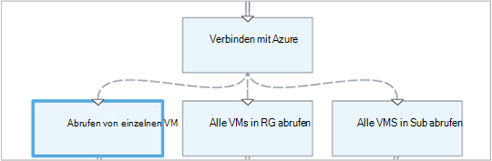 
Es gibt drei verschiedene Sequenz Links, die Werte gab zwei Runbook Eingabeparametern darstellt VM und Ressource Gruppennamen Bestimmung ist die entsprechende Aktion zu - überprüfen beginnen eine einzige VM, alle virtuellen Computer in der Gruppe Ressourcen oder VMs in einem Abonnement.  Für die sequenzverknüpfung zwischen Azure Connect und einzelnen Get-VM lautet die Bedingung Logik

    <# 
    Both VMName and ResourceGroupName runbook input parameters have values 
    #>
    (
    (($VMName -ne $null) -and ($VMName.Length -gt 0))
    ) -and (
    (($ResourceGroupName -ne $null) -and ($ResourceGroupName.Length -gt 0))
    )

Bei Verwendung eine bedingte Verknüpfung werden die Daten aus der Quelle zu anderen Aktivitäten in diesem Zweig der Bedingung gefiltert.  Ist eine Aktivität die Quelle mehrere Links, dann hängt Aktivitäten in jeder Verzweigung Daten die Bedingung in der Filiale Verbindung.

**Start AzureRmVm** -Aktivität im folgenden Runbook beginnt alle virtuellen Computer.  Er verbindet zwei bedingte.  Der erste bedingte Link verwendet den Ausdruck *$ActivityOutput ['Start-AzureRmVM']. IsSuccessStatusCode - Eq $true* filtern, wenn die Start-AzureRmVm Aktivität erfolgreich abgeschlossen wurde.  Die zweite verwendet Ausdruck *$ActivityOutput ['Start-AzureRmVM']. IsSuccessStatusCode - Ne $true* filtern, wenn die Start-AzureRmVm-Aktivität der virtuelle Computer gestartet.  

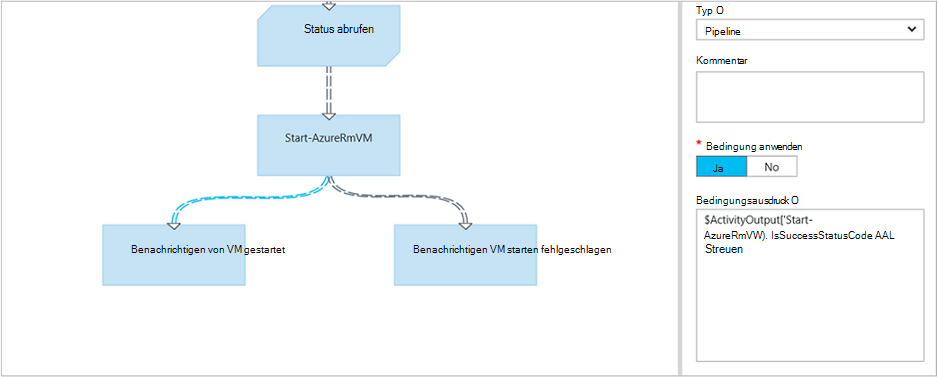

Jede Aktivität folgt der ersten Link und verwendet die aktivitätsausgabe von Get-AzureVM nur die virtuellen Computer erhalten, die gleichzeitig gestartet wurden und Get-AzureVM ausführen.  Alle Aktivitäten, die auf die zweite Verknüpfung folgt erhalten nur die virtuellen Computer, die zur Zeit gestoppt wurden und Get-AzureVM ausführen.  Der dritte Hyperlink Aktivitäten erhalten alle virtuellen Computer unabhängig von ihrem ausgeführt.

### Knoten

Eine Verbindung ist eine spezielle Aktivität wartet, bis alle eingehenden Zweige abgeschlossen haben.  Dadurch können Sie mehrere Aktivitäten gleichzeitig ausführen und sicherstellen, dass alle abgeschlossen wurden, bevor Sie fortfahren.

Verbindung unbegrenzt eingehende Hyperlinks kann zwar, kann nicht mehrere Links eine Rohrleitung.  Die Anzahl der eingehenden Reihenfolge Links ist nicht eingeschränkt.  Dürfen die Verbindung mit mehreren eingehende Pipeline Links erstellen und speichern Runbooks, jedoch schlägt fehl, wenn er ausgeführt wird.

Im folgenden Beispiel ist Teil eines Runbooks, die mehrere virtuelle Computer startet, während gleichzeitig herunterladen von Patches auf den Computern angewendet werden.  Eine Verbindung wird verwendet, um sicherzustellen, dass beide Prozesse abgeschlossen sind, bevor das Runbook fortgesetzt.

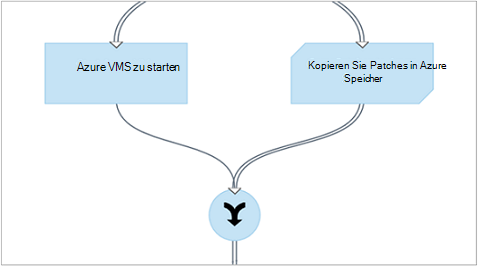

### Zyklen

Ein Zyklus wird ein Ziel Aktivität Links seine quellaktivität oder einer anderen Aktivität verknüpft schließlich zur Quelle zurück.  Zyklen werden grafisch erstellen derzeit nicht zulässig.  Verfügt Ihr Runbook Zyklus ordnungsgemäß gespeichert aber erhalten eine Fehlermeldung, wenn sie ausgeführt wird.

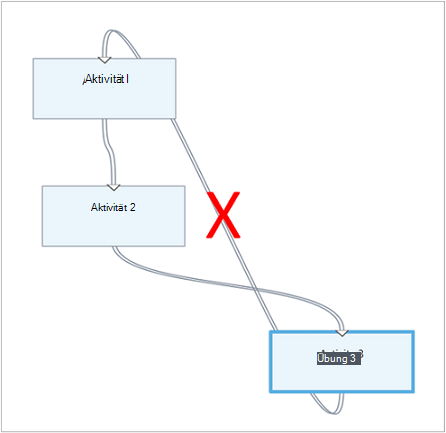

### Freigeben von Daten zwischen

Alle Daten, die durch eine Aktivität mit ausgehenden Ausgabe werden *Datenbus* für Runbooks geschrieben.  Alle Aktivitäten im Runbook können Daten auf den Datenbus Parameterwerte zu füllen oder in Skripts.  Eine Aktivität kann die Ausgabe der vorherigen Aktivität im Workflow zugreifen.     

Wie die Daten in den Datenbus geschrieben werden, hängt von der Typ der Aktivität ab.  Ausgabe einer **Pipeline**wird als Vielfache Objekte werden.  Ausgabe eine Verknüpfung **Sequenz** wird als Array werden.  Wenn nur ein Wert vorhanden ist, wird es als einzelnes Element-Array ausgegeben.

Sie können Daten mit einer der beiden Methoden Datenbus zugreifen.  Zunächst verwendet eine Datenquelle **Leistungsabgabe** Parameter einer anderen Aktivität füllen.  Wenn die Ausgabe über ein Objekt ist, können Sie eine einzelne Eigenschaft angeben.

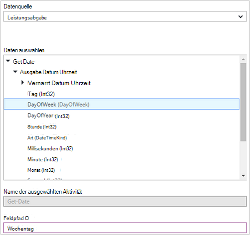

Sie können auch die Ausgabe einer Aktivität in einer Datenquelle **PowerShell-Ausdruck** oder eine Aktivität **Workflowskript** mit einem ActivityOutput abrufen.  Wenn die Ausgabe über ein Objekt ist, können Sie eine einzelne Eigenschaft angeben.  ActivityOutput-Variablen verwenden Sie folgende Syntax.

    $ActivityOutput['Activity Label']
    $ActivityOutput['Activity Label'].PropertyName 

### Prüfpunkte

[Prüfpunkte](automation-powershell-workflow.md#checkpoints) lassen grafisch PowerShell Workflow Runbook *Checkpoint Runbook* eine Tätigkeit auswählen.  Dadurch wird einen Checkpoint gesetzt werden, nachdem die Aktivität ausgeführt wird.

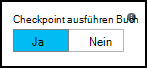

Prüfpunkte nur im Workflow grafisch PowerShell Runbooks aktiviert sind, ist nicht verfügbar in grafisch Runbooks.  Runbooks Azure Cmdlets verwendet, befolgen Sie alle geprüfte Aktivitäten mit einem Add-AzureRMAccount Runbook wird angehalten und neu gestartet wird von diesen Punkt auf eine andere Arbeitskraft. 

## Authentifizierung bei Azure-Ressourcen

Runbooks in Azure Automation, die Azure Ressourcen erfordert Authentifizierung in Azure.  Die neue [Ausführen als Konto](automation-sec-configure-azure-runas-account.md) -Funktion (auch als Dienstprinzipal bezeichnet) ist die Standardmethode für Ihr Abonnement mit Automatisierung Runbooks Azure-Ressourcen-Manager zugreifen.  Sie können diese Funktionalität grafisch Runbook hinzufügen mit PowerShell [Get-AutomationConnection](https://technet.microsoft.com/library/dn919922%28v=sc.16%29.aspx) -Cmdlet und [Add-AzureRmAccount](https://msdn.microsoft.com/library/mt619267.aspx) -Cmdlet der Leinwand **AzureRunAsConnection** -Anlage Verbindung hinzufügen. Dies wird im folgenden Beispiel veranschaulicht. 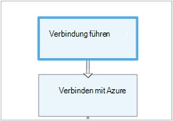 
Aktivität ausführen als Verbindung abzurufen (z. B. Get-AutomationConnection), ist mit konstanter Wert die Datenquelle AzureRunAsConnection konfiguriert. 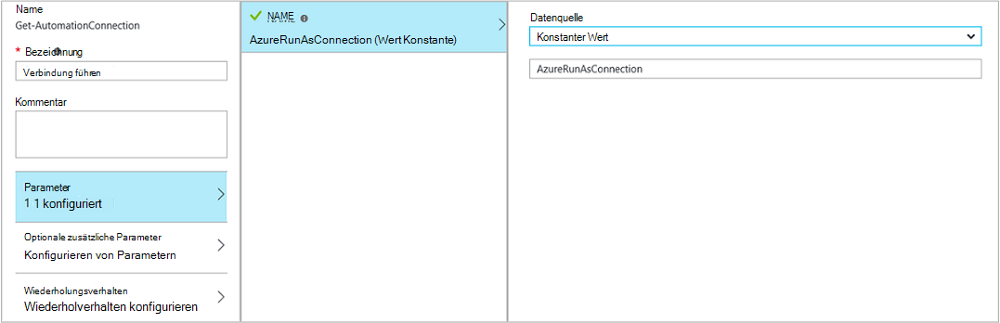 
Die nächste Aktivität hinzufügen-AzureRmAccount fügt das authentifizierte Ausführen als Konto für die Verwendung im Runbook. 
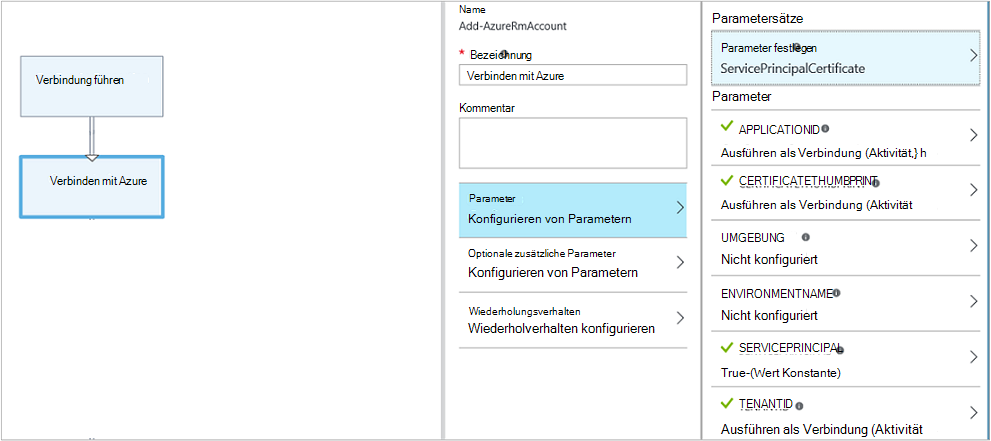 
Die Parameter **p**, **CERTIFICATETHUMBPRINT**und **TENANTID** müssen Sie den Namen der Eigenschaft für das Feldpfad angeben, da die Aktivität ein Objekt mit mehreren Eigenschaften gibt.  Andernfalls beim Ausführen des Runbooks schlägt fehl Authentifizierung.  Dies ist, was Sie zumindest Ihr Runbook mit Ausführen als Konto authentifizieren müssen.

Um Abwärtskompatibilität für Abonnenten Kompatibilität, die mit einem [Azure AD-Benutzerkonto](automation-sec-configure-aduser-account.md) zu Azure Service Management (ASM) oder Azure Ressourcenmanager Ressourcen Automation-Konto erstellt haben, ist die Methode zur Authentifizierung Add-AzureAccount-Cmdlet mit [Anmeldeinformationen Anlage](http://msdn.microsoft.com/library/dn940015.aspx) , die Active Directory-Benutzer mit Zugriff auf Azure-Konto darstellt.

Sie können grafisch Runbook gefolgt von einer Aktivität hinzufügen AzureAccount Leinwand Anmeldeinformationen Anlage hinzufügen diese Funktionalität hinzufügen.  Hinzufügen AzureAccount verwendet die Anmeldeinformationen Aktivität für die Eingabe.  Dies wird im folgenden Beispiel veranschaulicht.

Anfang des Runbooks nach jedem Checkpoint authentifizieren muss.  Dies bedeutet eine Aktivität hinzufügen Hinzufügen AzureAccount nach einer Checkpoint Workflowaktivität hinzufügen. Brauchen Sie nicht zusätzlich Anmeldeinformationen Aktivität gleich verwenden können 

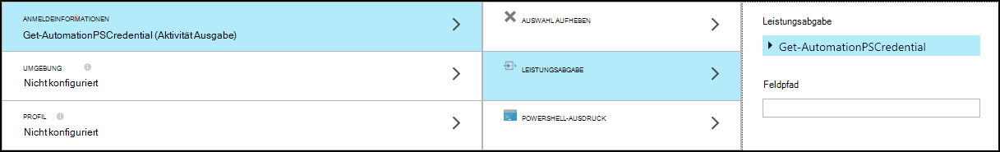

## Runbook Eingabe und Ausgabe

### Runbook Eingabe

Ein Runbook erfordern Eingaben von Benutzern beim start Runbook Azure Portal oder aus einem anderen Runbook Wenn der aktuelle Knoten als untergeordnetes Element verwendet wird.
Wenn Sie ein Runbook, die einen virtuellen Computer erstellt haben, müssen Sie Informationen wie den Namen der virtuellen Maschine und andere Eigenschaften jeder Runbooks starten.  

Sie Eingaben für ein Runbook Definieren eines oder mehrerer Eingabeparameter.  Geben Sie Werte für diese Parameter jedes Mal Runbook gestartet wird.  Beim Starten eines Runbooks mit Azure-Portal fordert es Sie Werte für jeden Parameter der Runbook angeben.

Für den Zugriff auf Eingabeparameter für ein Runbook Schaltfläche **ein- und Ausgabe** der Runbook Symbolleiste.  

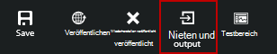 

Das **Eingabe und Ausgabe** Steuerelement können vorhandenen Eingabeparameter bearbeiten oder erstellen ein neues hinzufügen **Eingabe**wird geöffnet. 

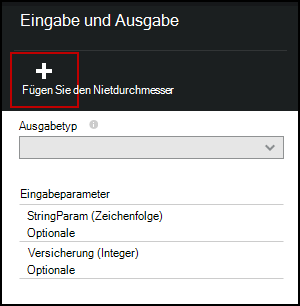

Jeder Eingabeparameter wird durch die Eigenschaften in der folgenden Tabelle definiert.

|Eigenschaft|Beschreibung|
|:---|:---|
| Name | Der eindeutige Name des Parameters.  Dies kann nur Ziffern enthalten und darf keine Leerzeichen enthalten. |
| Beschreibung | Eine optionale Beschreibung für den Eingabeparameter.  |
| Typ | Datentyp des Parameterwerts erwartet.  Azure-Portal wird eine entsprechende Steuerelement für den Datentyp für jeden Parameter angeben Eingabe aufgefordert werden. |
| Obligatorisch | Gibt an, ob ein Wert für den Parameter angegeben werden muss.  Runbook kann nicht gestartet werden, wenn Sie keinen Wert für jedes obligatorische Parameter angeben, die keinen Standardwert definiert. |
| Standardwert | Gibt an, welcher Wert für den Parameter verwendet wird, sofern nicht.  Dies ist entweder Null oder einen bestimmten Wert. |

### Runbook Ausgabe

Die [Ausgabe des Runbooks](http://msdn.microsoft.com/library/azure/dn879148.aspx)werden Daten aller Aktivitäten, die keinen ausgehenden Links hinzugefügt.  Die Ausgabe wird mit dem Runbook gespeichert und steht eine übergeordnete Runbook Runbook wird als untergeordnetes Element.  

## PowerShell-Ausdrücke

Einer der Vorteile von grafisch erstellen bietet Sie können Runbooks mit minimaler PowerShell erstellen.  Derzeit müssen Sie ein bisschen PowerShell für bestimmte [Parameterwerte](#activities) Auffüllen und [Link Vorschriften](#links-and-workflow)kennen.  Dieser Abschnitt enthält eine kurze Einführung in PowerShell Ausdrücke für Benutzer, die möglicherweise nicht vertraut.  Einzelheiten der PowerShell stehen unter [Scripting mit Windows PowerShell](http://technet.microsoft.com/library/bb978526.aspx). 

### PowerShell Ausdrucksdatenquelle

PowerShell-Ausdruck können als Datenquelle zum Auffüllen des Wertes eines [Aktivitätsparameter](#activities) mit PowerShell-Code.  Eine einzelne Codezeile möglicherweise, die führt einige einfache Funktion oder mehrere Zeilen, die komplexe Logik ausführen.  Ausgabe eines Befehls keiner Variablen zugewiesen wird an den Parameterwert. 

Der folgende Befehl würde z. B. das aktuelle Datum ausgeben. 

    Get-Date

Die folgenden Befehle eine Zeichenfolge aus dem aktuellen Datum und einer Variablen zuweisen.  Der Inhalt der Variablen werden dann an die Ausgabe gesendet. 

    $string = "The current date is " + (Get-Date)
    $string

Die folgenden Befehle das aktuelle Datum auszuwerten und eine Zeichenfolge, die angibt, ob der aktuelle Tag ein Wochenende oder Wochentag zurückzugeben. 

    $date = Get-Date
    if (($date.DayOfWeek = "Saturday") -or ($date.DayOfWeek = "Sunday")) { "Weekend" }
    else { "Weekday" }
    
 
### Leistungsabgabe

Um die Ausgabe aus einer vorherigen Aktivität im Runbook verwenden, verwenden Sie die $ActivityOutput-Variable mit der folgenden Syntax.

    $ActivityOutput['Activity Label'].PropertyName

Z. B. möglicherweise eine Aktivität mit einer Eigenschaft, die den Namen eines virtuellen Computers muss in diesem Fall den folgenden Ausdruck verwenden können.

    $ActivityOutput['Get-AzureVm'].Name

Die Eigenschaft, die den virtuellen Computer erforderlichen statt nur einer Eigenschaft Objekt müsste das gesamte Objekt mit der folgenden Syntax zurückgegeben werden.

    $ActivityOutput['Get-AzureVm']

Sie können auch die Ausgabe einer Aktivität in einem komplexen Ausdruck, die Name des virtuellen Computers Text verkettet.

    "The computer name is " + $ActivityOutput['Get-AzureVm'].Name

### Startbedingungen

[Vergleichsoperatoren Sie vergleichen Werte oder bestimmen, ob ein Wert mit einem angegebenen Muster übereinstimmt.](https://technet.microsoft.com/library/hh847759.aspx)  Ein zurück oder $true $false.

Die folgende Bedingung bestimmt beispielsweise, ob der virtuelle Computer aus einer Aktivität mit dem Namen *Get-AzureVM* derzeit *angehalten*ist. 

    $ActivityOutput["Get-AzureVM"].PowerState –eq "Stopped"

Die folgende Bedingung prüft, ob die in einem anderen Staat als *beendet*ist.

    $ActivityOutput["Get-AzureVM"].PowerState –ne "Stopped"

Mehrere Konditionen mit einem [logischen Operator](https://technet.microsoft.com/library/hh847789.aspx) wie join **- und** oder **- oder**.  Die folgende Bedingung prüft beispielsweise die im vorherigen Beispiel in einem *beendet* oder *angehalten*ist.

    ($ActivityOutput["Get-AzureVM"].PowerState –eq "Stopped") -or ($ActivityOutput["Get-AzureVM"].PowerState –eq "Stopping") 

### Hashtabellen

[Hashtabellen](http://technet.microsoft.com/library/hh847780.aspx) sind Name-Wert-Paare, die für einen Satz von Werten zurückgeben.  Eigenschaften für bestimmte Aktivitäten können eine Hashtabelle statt einer einfachen Wert erwarten.  Sie können auch als Hashtabelle als Wörterbuch angezeigt. 

Sie erstellen eine Hashtabelle mit der folgenden Syntax.  Hashtable kann beliebig viele Einträge enthalten jeweils durch einen Namen und einen Wert definiert.

    @{ <name> = <value>; [<name> = <value> ] ...}

Beispielsweise erstellt der folgende Ausdruck eine Hashtabelle in der Datenquelle für eine Aktivitätsparameter verwendet werden, die eine Hashtabelle mit Werten für eine Internetsuche erwartet.

    $query = "Azure Automation"
    $count = 10
    $h = @{'q'=$query; 'lr'='lang_ja';  'count'=$Count}
    $h

Das folgende Beispiel verwendet Ausgabe eine Aktivität namens *Twitter Verbindung erhalten* Hashtable aufgefüllt.

    @{'ApiKey'=$ActivityOutput['Get Twitter Connection'].ConsumerAPIKey;
      'ApiSecret'=$ActivityOutput['Get Twitter Connection'].ConsumerAPISecret;
      'AccessToken'=$ActivityOutput['Get Twitter Connection'].AccessToken;
      'AccessTokenSecret'=$ActivityOutput['Get Twitter Connection'].AccessTokenSecret}

## Nächste Schritte

- Zunächst mit PowerShell Workflow Runbooks finden Sie [meinen ersten PowerShell Workflow runbook](automation-first-runbook-textual.md) 
- Zunächst mit grafisch Runbooks sehen Sie [Meine erste grafisch runbook](automation-first-runbook-graphical.md)
- Über Runbook Typen, deren vor- und Nachteile finden Sie unter [Azure Runbook Automatisierungstypen](automation-runbook-types.md)
- Authentifizierung mit Automatisierung ausführen als Konto finden Sie unter [Konfigurieren Azure ausführen als Konto](automation-sec-configure-azure-runas-account.md)
 
