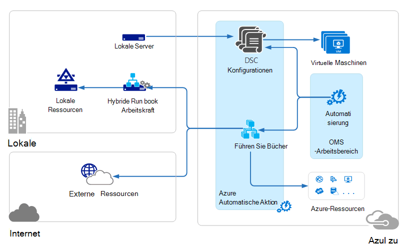
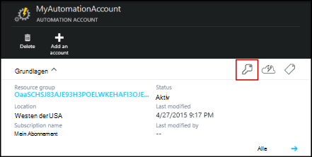
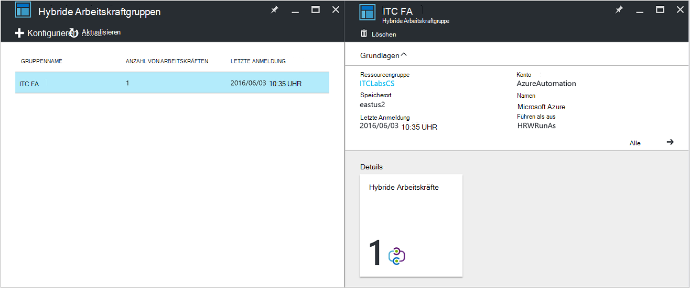
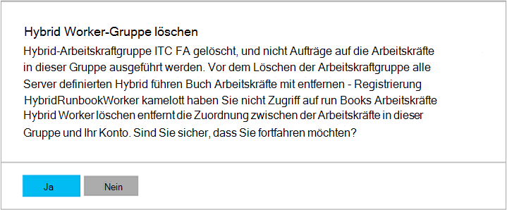

<properties
   pageTitle="Azure Automation Hybrid Runbook Arbeitskräfte | Microsoft Azure"
   description="Dieser Artikel enthält Informationen zur Installation und Verwendung Hybrid Runbook Worker, eine Funktion von Azure, die Sie auf Computer im lokalen Rechenzentrum Runbooks ausführen können."
   services="automation"
   documentationCenter=""
   authors="mgoedtel"
   manager="jwhit"
   editor="tysonn" />
<tags
   ms.service="automation"
   ms.devlang="na"
   ms.topic="article"
   ms.tgt_pltfrm="na"
   ms.workload="infrastructure-services"
   ms.date="10/14/2016"
   ms.author="bwren" />

# Azure Automation Hybrid Runbook Arbeitskräfte

Runbooks in Azure Automation Zugriff auf Ressourcen im lokalen Rechenzentrum, da sie in der Azure-Cloud ausgeführt.  Die Hybrid Runbook Worker von Azure Funktion Runbooks auf Maschinen im Rechenzentrum, um lokale Ressourcen ausgeführt. Die Runbooks werden gespeichert und in Azure Automation und an lokale Computer übermittelt.  

Diese Funktionalität ist in der folgenden Abbildung dargestellt.   

Definieren einen oder mehrere Computer in Ihrem Rechenzentrum Hybrid Runbook Worker und Runbooks von Azure Automation ausführen.  Jede Arbeitskraft benötigt Microsoft Management Agent eine Verbindung mit Microsoft Operations Management Suite und Azure Automation Runbook Umgebung.  Operations Management Suite dient nur zur Installation und Wartung des Management Agents und die Funktionalität der Arbeitskraft überwachen.  Bereitstellung von Runbooks und die Anweisung ausgeführt werden Azure Automation ausgeführt.

Es gibt keine eingehende firewallanforderungen Hybrid Runbook Arbeitskräfte unterstützen. Der Agent auf dem lokalen Computer initiiert Kommunikation mit Azure Automation in der Cloud. Wenn ein Runbook gestartet wird, erstellt Azure Automation eine Anweisung, die vom Agenten abgerufen wird. Der Agent ruft dann Runbooks und Parameter vor der Ausführung.  Es werden auch [Ressourcen](http://msdn.microsoft.com/library/dn939988.aspx) , die von Azure Automation Runbook verwendet abrufen.

>[AZURE.NOTE] Hybrid Runbook Arbeitskräfte unterstützen derzeit keine [DSC-Konfigurationen](automation-dsc-overview.md).

## Hybrid Runbook Worker-Gruppen

Jede Arbeitskraft Hybrid Runbook ist Mitglied einer Hybrid Runbook Worker-Gruppe, die Sie angeben, wenn Sie den Agenten installieren.  Eine Gruppe kann einen einzigen Agent enthalten Sie können mehrere Agenten in einer Gruppe für hohe Verfügbarkeit.

Beim Starten ein Runbook auf Hybrid Runbook Worker angeben die Gruppe ausgeführt wird.  Die Arbeitskraft eine Anfrage werden bestimmt Mitglieder der Gruppe.  Sie können keine bestimmte Arbeitskraft angeben.

## Hybrid Runbook Worker Vorschriften

Sie müssen mindestens einen lokalen Computer Hybrid Runbook Auftrag ausführen festlegen.  Dieser Computer muss folgende Elemente aufweisen:

- Windows Server 2012 oder höher
- Windows PowerShell 4.0 oder höher
- Mindestens zwei Kernen und 4 GB RAM

Folgende Punkte Hybrid Arbeitnehmer: 

- Festlegen Sie mehrerer Hybrid Arbeitskräfte in jeder Gruppe für hohe Verfügbarkeit.  
- Hybrid-Mitarbeiter können mit automatischem Management Service oder System Center Orchestrator Runbook Server koexistieren.
- Verwenden Sie einen Computer physisch in der Region Ihres Kontos Automatisierung oder da die Daten beim Abschließen eines Auftrags an Azure Automation gesendet werden.

>[AZURE.NOTE] Hybrid Runbook Worker Version 7.2.11136.0 unterstützt derzeit Kommunikation über einen Proxyserver mit PowerShell-Skripts.  Unterstützung für PowerShell Workflowskripts wird in einer zukünftigen Version verfügbar sein.  

### Proxy- und Firewall konfigurieren

Die lokale Hybrid Runbook Worker und Microsoft Operations Management Suite (OMS) Service registrieren müssen sie die Portnummer zu URLs beschrieben.  Dies neben [Anschlüsse und URLs für Microsoft Monitoring Agent erforderlichen](../log-analytics/log-analytics-proxy-firewall.md#configure-proxy-and-firewall-settings-with-the-microsoft-monitoring-agent) OMS verbunden ist. Wenn Sie einen Proxyserver für die Kommunikation zwischen dem Agent und dem OMS-Dienst verwenden, müssen Sie sicherstellen, dass geeigneten Ressourcen zugegriffen werden kann. Wenn Sie eine Firewall verwenden, den Zugriff auf das Internet einschränken, müssen Sie die Firewall zugänglich. 

Die folgenden Informationen sind die Port und URLs Hybrid Runbook Arbeitskraft kommunizieren mit Automatisierung.

- Port: Nur TCP 443 ist für ausgehenden Internetzugriff erforderlich
- Globale URL: *.azure-automation.net

Wenn Sie Automation-Konto für eine bestimmte Region definiert und Kommunikation mit regionalen Datencenter beschränken möchten, bietet die nachfolgend den DNS-Eintrag für jede Region.

|**Region**|**DNS-Eintrag**|
|--------------|--------------|
|Südlichen zentralen USA|Scus-Jobruntimedata-Prod-su1.azure-automation.net|
|USA 2 OST|eus2-Jobruntimedata-Prod-su1.azure-automation.net|
|Westeuropa|Wir-Jobruntimedata-Prod-su1.azure-automation.net|
|Nordeuropa|Ne-Jobruntimedata-Prod-su1.azure-automation.net|
|Kanada zentral|cc-Jobruntimedata-Prod-su1.azure-automation.net|
|Südostasien|SEA-Jobruntimedata-Prod-su1.azure-automation.net|
|Zentrale Indien|CID-Jobruntimedata-Prod-su1.azure-automation.net|
|Japan OST|Jpe-Jobruntimedata-Prod-su1.azure-automation.net|
|Australien Südost|ASE-Jobruntimedata-Prod-su1.azure-automation.net|

## Installieren von Hybrid Runbook Worker

Nachfolgend beschreibt das Installieren und Konfigurieren von Hybrid Runbook Worker.  Führen Sie die ersten beiden Schritte einmal für die Automation-Umgebung aus und wiederholen Sie die Schritte für jede Arbeitskraft Computer.

### 1. Operations Management Suite Arbeitsbereich erstellen

Wenn Sie nicht bereits einen Arbeitsbereich Operations Management Suite haben, erstellen Sie eine mit Anleitung [Richten Sie den Arbeitsbereich](https://technet.microsoft.com/library/mt484119.aspx). Einen vorhandenen Arbeitsbereich können Sie noch keines haben.

### 2. Lösung Operations Management Suite Arbeitsbereich hinzufügen

Solutions hinzufügen Operations Management Suite Funktionalität.  Die automatisierungslösung funktionell Azure Automation einschließlich Hybrid Runbook Worker.  Arbeitsbereich die Projektmappe hinzugefügt wird, wird es automatisch Arbeitskraft Komponenten zum Agentcomputer schieben, die Sie im nächsten Schritt installieren.

Anweisungen Sie die an [eine Lösung im Lösungskatalog hinzufügen](../log-analytics/log-analytics-add-solutions.md) Arbeitsbereich Operations Management Suite **Automatisierung** Projektmappe hinzu.

### 3. installieren Sie das Microsoft Agent überwachen

Microsoft Monitoring Agent verbindet Computer mit Operations Management Suite.  Installieren Sie den Agent auf dem lokalen Computer und verbinden Sie es mit Ihrem Arbeitsbereich werden Hybrid Runbook Arbeitskraft erforderlichen Komponenten automatisch gedownloadet.

Befolgen Sie die Anweisungen [Protokollanalyse verbinden Windows-Computern](../log-analytics/log-analytics-windows-agents.md) den Agent auf dem lokalen Computer installieren.  Sie können diesen Prozess für mehrere Computer in Ihrer Umgebung mehrere Arbeitskräfte hinzufügen wiederholen.

Wenn der Agent mit Operations Management Suite verbunden ist, wird es auf der Registerkarte **Quellen verbundenen** Bereich Operations Management Suite **Einstellungen** aufgeführt.  Sie können überprüfen, ob der Agent ordnungsgemäß automatisierungslösung heruntergeladen wurde, wenn es einen Ordner namens **AzureAutomationFiles** in C:\Program Files\Microsoft Überwachung Agent\Agent hat.  Bestätigen Sie die Version der Hybrid Runbook Worker können C:\Program Files\Microsoft Agent\Agent\AzureAutomation\ überwachen und beachten Sie die \\Ordner *Version* .   

### 4. Installieren der Runbook Umgebung und Azure Automation an

Beim Hinzufügen eines Agents Operations Management Suite drückt die automatisierungslösung Moduls PowerShell **HybridRegistration** **Add-HybridRunbookWorker** -Cmdlet enthält.  Mithilfe dieses Cmdlet Runbook Umgebung auf dem Computer installieren und bei Azure Automation registrieren.

Öffnen Sie PowerShell-Sitzung im Administratormodus, und führen Sie die folgenden Befehle das Modul importieren.

    cd "C:\Program Files\Microsoft Monitoring Agent\Agent\AzureAutomation\<version>\HybridRegistration"
    Import-Module HybridRegistration.psd1

Führen Sie mithilfe der folgenden Syntax **Add-HybridRunbookWorker** -Cmdlet:

    Add-HybridRunbookWorker –Name <String> -EndPoint <Url> -Token <String>

Sie können die Informationen für dieses Cmdlet aus dem **Schlüssel verwalten** Blade im Azure-Portal abrufen.  Auf das Schlüsselsymbol im Bedienfeld "Elemente" für das automatisierungskonto öffnen Sie diese Blade.

- **Name** ist der Name der Gruppe Hybrid Runbook Worker. Wenn diese Gruppe in Automation-Konto bereits der aktuelle Computer hinzugefügt wird.  Wenn es nicht bereits vorhanden ist, wird sie hinzugefügt.
- **Endpunkt** ist das **URL** -Feld im Blade- **Schlüssel verwalten** .
- **Token** ist der **Primärschlüssel Zugriff** Blatt **Schlüssel verwalten** .  

Verwenden der **-ausführlichen** switch mit **Hinzufügen HybridRunbookWorker** detaillierte Informationen über die Installation.

### 5. installieren Sie PowerShell-Module

Runbooks können Aktivitäten und Cmdlets in Azure Automation-Umgebung installierten Module definiert.  Diese Module werden nicht automatisch auf lokalen Computern jedoch bereitgestellt sodass Sie manuell installieren müssen.  Die Ausnahme ist der Azure-Modul die standardmäßig Zugriff auf Cmdlets alle Azure Services und Azure-Automatisierung installiert.

Da der Hauptzweck der Hybrid Runbook Worker-Funktion lokale Ressourcen verwalten ist, müssen Sie wahrscheinlich Module zu installieren, die diese Ressourcen unterstützen.  Sie finden Informationen zum Installieren von Windows PowerShell-Module Module [Installieren](http://msdn.microsoft.com/library/dd878350.aspx) .

## Hybrid Runbook Arbeitskraft entfernen

Hybrid Runbook Arbeitskräfte aus einer Gruppe entfernen, oder entfernen Sie die Gruppe je nach Bedarf.  Um eine hybride Runbook Arbeitskraft von einem lokalen Computer zu entfernen, öffnen Sie eine PowerShell-Sitzung im Administratormodus und führen Sie folgenden Befehl - **Entfernen-HybridRunbookWorker** -Cmdlet.  Verwenden der **-ausführlichen** switch für eine detaillierte Protokollierung des Entfernungsvorgangs. 

Dies entfernt Microsoft Monitoring Agent nicht vom Computer nur die Funktionen und Konfiguration des Hybrid Runbook Worker-Rolle.  

Um eine Gruppe zu entfernen, müssen Sie zunächst Hybrid Runbook Worker von jedem Computer entfernen, die Mitglied der Gruppe mithilfe des Befehls gezeigt und dann führen Sie die folgenden Schritte aus, um die Gruppe zu entfernen.  

1. Öffnen Sie die Firma Automatisierung im Azure-Portal.
2. **Hybride Arbeitskraftgruppen** Kachel wählen Sie und im Blade **Hybrid Arbeitskraftgruppen** Gruppe löschen möchten.  Nach Gruppe auswählen, wird das **Hybrid Arbeitskraft** Eigenschaften Blatt angezeigt.     
3. Klicken Sie auf die Eigenschaften für die ausgewählte Gruppe auf **Löschen**.  Eine Nachricht zur Bestätigung dieser Aktion angezeigt und wählen Sie **Ja** , wenn Sie wirklich möchten.    Dieser Vorgang kann einige Sekunden dauern und verfolgen den Fortschritt unter **Benachrichtigung** aus.  

## Hybrid Runbook Worker Runbooks starten

[Starten ein Runbook in Azure Automation](automation-starting-a-runbook.md) beschreibt verschiedene Methoden zum Starten eines Runbooks.  Hybrid Runbook Worker Fügt eine **RunOn** -Option, den Namen einer Gruppe Hybrid Runbook Arbeitskraft angeben können.  Bei Angabe einer Gruppe Runbooks abgerufen und von der Arbeitskräfte in dieser Gruppe ausgeführt.  Wenn diese Option nicht angegeben ist, wird es in Azure Automation normal ausgeführt.

Beim Starten ein Runbook in Azure-Portal wird mit der Option **Ausführen auf** angezeigt, in dem Sie **Azure** oder **Hybride Arbeitskraft**auswählen.  Wenn **Hybrid Arbeitskraft**auswählen, können Sie die Gruppe aus einer Dropdownliste auswählen.

Verwenden Sie den folgenden Befehl ein Runbook namens Test Runbook auf ein Hybrid Runbook Worker-Gruppe mit dem Namen MyHybridGroup mit Windows PowerShell zu verwenden konnte **RunOn** -Parameter.

    Start-AzureRmAutomationRunbook –AutomationAccountName "MyAutomationAccount" –Name "Test-Runbook" -RunOn "MyHybridGroup"

>[AZURE.NOTE] **RunOn** -Parameter wurde an das Cmdlet **Start-AzureAutomationRunbook** Version 0.9.1 von Microsoft Azure PowerShell hinzugefügt.  Sie sollten [die neueste Version](https://azure.microsoft.com/downloads/) haben Sie früher installiert.  Sie müssen nur diese Version auf einer Workstation installieren, in dem Sie Runbook in Windows PowerShell beginnen.  Sie müssen nicht auf dem workercomputer installiert werden, wenn Sie Runbooks von diesem Computer aus starten möchten.  Ein Runbook kann nicht derzeit auf anderen Runbook Arbeitnehmer Runbook Hybrid gestartet werden, da die neueste Version von Azure Powershell in Ihrem Konto Automatisierung installiert werden müsste.  Die neueste Version automatisch Azure Automation und automatisch weitergegeben, die Arbeitskräfte schnell.

## Runbook Berechtigungen

Runbooks auf Hybrid Runbook Worker können die gleiche [Methode, die normalerweise für Runbooks ist Authentifizierung Azure-Ressourcen](automation-configuring.md#configuring-authentication-to-azure-resources) verwenden, da sie Ressourcen von Azure zugreifen.  Runbook kann entweder eine eigene Authentifizierung auf lokale Ressourcen, oder können RunAs-Konto für alle Runbooks einen Benutzerkontext bereitstellen.

### Runbook Authentifizierung

Standardmäßig wird Runbooks im Kontext des lokalen Systemkontos auf dem lokalen Computer ausgeführt, daher müssen sie eigene Authentifizierung Ressourcen angeben, auf die sie zugreifen.  

[Anmeldeinformationen](http://msdn.microsoft.com/library/dn940015.aspx) und [Zertifikat](http://msdn.microsoft.com/library/dn940013.aspx) -Assets können in Ihr Runbook Cmdlets, mit denen Sie Anmeldeinformationen angeben, damit Sie verschiedene Ressourcen authentifizieren können.  Das folgende Beispiel zeigt einen Ausschnitt eines Runbooks, die einen Neustart.  Anmeldeinformationen eines Vermögenswertes Anmeldeinformationen und den Namen des Computers aus einer Variablen abgerufen und verwendet dann diese Werte mit dem Cmdlet Computer neu starten.

    $Cred = Get-AzureRmAutomationCredential -ResourceGroupName "ResourceGroup01" -Name "MyCredential"
    $Computer = Get-AzureRmAutomationVariable -ResourceGroupName "ResourceGroup01" -Name  "ComputerName"

    Restart-Computer -ComputerName $Computer -Credential $Cred

Sie können auch [InlineScript](automation-powershell-workflow.md#inline-script) nutzen die Codeblöcke auf einem anderen Computer mit [PSCredential gemeinsame Parameter](http://technet.microsoft.com/library/jj129719.aspx)angegebenen Anmeldeinformationen ausgeführt werden.

### RunAs-Konto

Anstatt eigene Authentifizierung auf lokale Ressourcen Runbooks können **RunAs** -Konto für eine hybride Arbeitskraft angeben.  Geben Sie [Anmeldeinformationen Vermögenswert](automation-credentials.md) , der Zugriff auf lokale Ressourcen und alle Runbooks diese Anmeldeinformationen im Hybrid Runbook Arbeitskraft in der Gruppe ausgeführt wird.  

Der Benutzername für die Anmeldeinformationen muss eines der folgenden Formate aufweisen:

- Domäne\Benutzername 
- username@domain
- Benutzername (für Konten lokal auf dem lokalen Computer)

Gehen Sie folgendermaßen vor, ein Konto RunAs für eine hybride Arbeitskraft angegeben:

1. Erstellen Sie eine [Anlage Anmeldeinformationen](automation-credentials.md) Zugriff auf lokale Ressourcen.
2. Öffnen Sie die Firma Automatisierung im Azure-Portal.
2. Wählen Sie die Kachel **Hybrid Arbeitskraftgruppen** und wählen Sie die Gruppe.
3. Wählen Sie **Alle Einstellungen** und **Hybrid Arbeitskraft Einstellungen**.
4. **Als** von **Standard** in **Benutzerdefiniert**ändern.
5. Wählen Sie die Anmeldeinformationen, und klicken Sie auf **Speichern**.

## Runbooks erstellen Hybrid Runbook Arbeitskraft

Es gibt keinen Unterschied in der Struktur von Runbooks, die in Azure, und solchen, die auf eine Arbeitskraft Hybrid Runbook ausgeführt. Runbooks, mit denen Sie mit wahrscheinlich variiert deutlich aber, da Runbooks Hybrid Runbook Arbeitskraft normalerweise lokale Ressourcen im Rechenzentrum verwalten während Runbooks in Azure Automation normalerweise in Azure Cloud Ressourcen. 

Bearbeiten eines Runbooks Hybrid Runbook Arbeitskraft in Azure Automation, aber möglicherweise Probleme beim Runbooks im Editor testen.  Das PowerShell-Module, die Zugriff auf lokalen Ressourcen nicht in Ihrer Umgebung Azure Automatisierung der installiert werden, wird der Test fehl.  Wenn Sie die erforderlichen Module installieren, es dürfen Zugriff auf lokale Ressourcen für einen vollständigen Test Runbooks führen Sie dann

## Problembehandlung Runbooks Hybrid Runbook Worker

[Runbook Ausgabe und Nachrichten](automation-runbook-output-and-messages.md) werden Azure Automatisierung von Hybriden wie Runbook Aufträge in der Cloud ausgeführt.  Sie können auch Streams Verbose und den Fortschritt der wie für andere Runbooks.  

Protokolle werden für jeden Arbeitsthread Hybrid am C:\ProgramData\Microsoft\System Center\Orchestrator\7.2\SMA\Sandboxes lokal gespeichert.

Wenn Ihre Runbooks nicht beliebige erfolgreich und Zusammenfassung Job Status **angehalten**angezeigt, lesen Sie zur Problembehandlung Artikel [Hybrid Runbook Worker: ein Runbook Auftrag mit dem Status angehalten beendet](automation-troubleshooting-hrw-runbook-terminates-suspended.md).   

## Beziehung zu Service Management-Automatisierung

[Service Management-Automatisierung (SMA)](https://technet.microsoft.com/library/dn469260.aspx) können Sie die gleichen Runbooks ausführen, die Azure Automatisierung im lokalen Rechenzentrum unterstützt. SMA ist im Allgemeinen mit Windows Azure Pack bereitgestellt, wie Windows Azure Pack eine Benutzeroberfläche für die Verwaltung der SMA enthält. Im Gegensatz zu Azure Automatisierung erfordert SMA eine lokale Installation, die Webserver Host-API eine Datenbank Runbooks und SMA-Konfiguration und Runbook Arbeitskräfte Runbook Aufträge ausführen. Azure Automatisierung werden diese Dienste in der Cloud und erfordert nur Hybrid Runbook Arbeitskräfte in Ihrer lokalen Umgebung verwalten.

Wenn Sie einen vorhandenen SMA-Benutzer sind, können Sie Ihre Runbooks Azure Automatisierung mit Hybrid Runbook ohne Änderungen verwendet, sofern sie eigene Authentifizierung auf Ressourcen durchführen [Runbooks Hybrid Runbook Arbeitskraft](#creating-runbooks-for-hybrid-runbook-worker)erstellen beschrieben verschieben.  Runbooks in SMA auf Arbeitskraft-Server die Authentifizierung für die Runbooks bieten kann im Kontext des Dienstkontos ausgeführt.

Die folgenden Kriterien können Sie bestimmen, ob Azure Automation Hybrid Runbook Worker oder Service Management-Automatisierung für Ihre Bedürfnisse besser geeignet ist.

- SMA erfordert eine lokale Installation von zugrunde liegenden Komponenten, die auf Windows Azure Pack verbunden sind, ist eine grafisch Management-Schnittstelle erforderlich. Mehr lokalen Ressourcen ist mit höheren Wartungskosten als Azure Automation erforderlich, die nur auf lokale Runbook Arbeitskräfte einen Agent installiert. Weitere Verringerung der Wartungskosten Operations Management Suite Agents verwaltet.
- Azure Automation speichert seine Runbooks in der Cloud und lokalen Hybrid Runbook Arbeitskräften bietet. Wenn die Sicherheitsrichtlinie dies nicht zulässt, sollten Sie SMA verwenden.
- SMA ist in System Center enthalten. und daher erfordert eine Lizenz für System Center 2012 R2. Azure Automation basiert auf tiered Abonnement.
- Azure Automation verfügt über erweiterte Funktionen wie grafisch Runbooks, die in SMA nicht verfügbar sind.

## Nächste Schritte

- Erfahren Sie mehr über die verschiedenen Methoden, mit der ein Runbook starten, siehe [Starten ein Runbook in Azure Automation](automation-starting-a-runbook.md)
- Verschiedenen Verfahren zum Arbeiten mit PowerShell und PowerShell Workflow Runbooks in Azure Automatisierung mithilfe des Text-Editors finden Sie unter [Bearbeiten ein Runbook in Azure Automation](automation-edit-textual-runbook.md)

 
