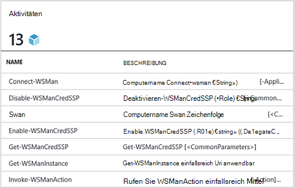
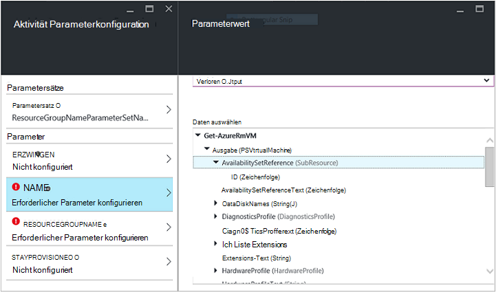
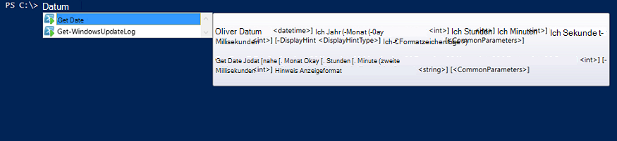

<properties
   pageTitle="Erstellt ein Integrationsmodul Azure Automatisierung | Microsoft Azure"
   description="Tutorial führt, die Sie mithilfe der Erstellung, Prüfung und Beispiel Integrationsmodule in Azure Automation."
   services="automation"
   documentationCenter=""
   authors="mgoedtel"
   manager="jwhit"
   editor="" />

<tags
   ms.service="automation"
   ms.workload="tbd"
   ms.tgt_pltfrm="na"
   ms.devlang="na"
   ms.topic="get-started-article"
   ms.date="09/12/2016"
   ms.author="magoedte" />

# <a name="azure-automation-integration-modules"></a>Azure Automation Integrationsmodule

PowerShell ist die grundlegende Technologie Azure Automatisierung. Da Azure Automation PowerShell basiert, sind PowerShell-Module für die Erweiterbarkeit Azure Automation. In diesem Artikel führen wir Sie durch die Merkmale der Azure-Automatisierung mit PowerShell-Module als "Integrationsmodule" und best Practices für PowerShell-Module erstellen, um sicherzustellen, dass sie als Integrationsmodule Azure Automatisierung arbeiten. 

## <a name="what-is-a-powershell-module"></a>Was ist ein PowerShell-Modul?

PowerShell-Modul ist eine Gruppe von PowerShell-Cmdlets, wie **Get-Date** oder **Element kopieren**, die verwendet werden können, von PowerShell-Konsole, Skripts, Workflows, Runbooks und PowerShell DSC-Ressourcen wie WindowsFeature oder Datei, die von PowerShell DSC-Konfigurationen verwendet werden kann. Funktionalität von PowerShell-Cmdlets und DSC-Ressourcen unterliegt und alle Cmdlet-DSC-Ressourcen von einem Modul PowerShell unterstützt viele der im Lieferumfang von PowerShell. Beispielsweise das Cmdlet " **Get-Date** " ist Bestandteil des Moduls Microsoft.PowerShell.Utility PowerShell Cmdlet " **Copy-Item** " ist Teil des Moduls Microsoft.PowerShell.Management PowerShell und Paket DSC-Ressource ist Teil PSDesiredStateConfiguration PowerShell. Beide Module mit PowerShell ausgeliefert. Aber viele PowerShell-Module werden nicht als Teil von PowerShell geliefert und werden stattdessen mit ersten oder von Drittanbietern wie System Center 2012 Configuration Manager oder große PowerShell Community auf wie PowerShell Gallery verteilt.  Die Module sind nützlich, da sie komplexe Aufgaben durch gekapselte Funktionalität zu vereinfachen.  Sie erhalten weitere Informationen zu [PowerShell-Module auf MSDN](https://msdn.microsoft.com/library/dd878324%28v=vs.85%29.aspx). 

## <a name="what-is-an-azure-automation-integration-module"></a>Was ist ein Integrationsmodul Azure Automatisierung?

Ein Integrationsmodul nicht geringfügig von PowerShell-Modul. Die einfach ein PowerShell-Modul, optional eine zusätzliche Datei Metadaten einen Azure Automation Verbindungstyp mit dem Modul Cmdlets in Runbooks Angabe enthält. Optional- oder nicht, diese PowerShell Module in Azure zu ihrer Cmdlets für Runbooks und ihre Ressourcen DSC verwendet DSC Konfigurationen importiert werden können. Hinter den Kulissen Azure Automation speichert diese Module und Runbook Auftrag und Ausführungszeit DSC mishnah lädt sie in Azure Automation Sandboxen, Runbooks ausgeführt und DSC-Konfigurationen werden kompiliert.  DSC Ressourcen Module werden automatisch auf Automatisierung DSC Pull-Server gespeichert, damit von Computern versuchen, DSC Konfigurationen gezogen werden kann.  Liefern wir eine Anzahl von Azure PowerShell-Module bei Azure-Automatisierung verwenden können Sie loslegen sofort Azure Management automatisieren, aber Sie können leicht PowerShell-Module für alle System Service oder Tool zu integrieren. 

>[AZURE.NOTE] Module werden als "Globale Module" in Automation Service ausgeliefert. Globale Module werden aus der Box Automation-Konto erstellen und wir aktualisieren manchmal drückt automatisch diese Ihrem Konto Automatisierung zur Verfügung. Möchten Sie sie automatisch aktualisiert, Sie können immer demselben Modul selbst importieren und, die Vorrang gegenüber globalen Modulversion dieses Moduls im Service liefern. 

Das Format, in dem ein Integrationsmodul Paket importieren, ist eine komprimierte Datei mit demselben Namen wie das Modul und eine ZIP-Erweiterung. Es enthält die Windows PowerShell-Modul und alle Hilfsdateien, einschließlich einer Manifestdatei (psd1), wenn das Modul hat.

Wenn das Modul einen Verbindungstyp Azure Automation enthalten soll, muss es auch eine Datei mit dem Namen enthalten *<ModuleName>*-Automation.json, die Eigenschaften der Verbindung angibt. Dies ist eine Json-Datei innerhalb des Moduls der komprimierten ZIP-Datei gespeichert und enthält die Felder "Verbindung" erforderlich, das System oder das Modul darstellt wird. Hiermit beenden Sie einen Verbindungstyp in Azure Automation erstellen. Mithilfe dieser Datei die Feldnamen festlegen eingibt, und ob die Felder verschlüsselte bzw. optional für den Verbindungstyp des Moduls. Im folgenden finden eine Vorlage im Json-Format:

```
{ 
   "ConnectionFields": [
   {
      "IsEncrypted":  false,
      "IsOptional":  false,
      "Name":  "ComputerName",
      "TypeName":  "System.String"
   },
   {
      "IsEncrypted":  false,
      "IsOptional":  true,
      "Name":  "Username",
      "TypeName":  "System.String"
   },
   {
      "IsEncrypted":  true,
      "IsOptional":  false,
      "Name":  "Password",
   "TypeName":  "System.String"
   }],
   "ConnectionTypeName":  "DataProtectionManager",
   "IntegrationModuleName":  "DataProtectionManager"
}
```

Service Management-Automatisierung bereitgestellt haben und Integrationsmodule Pakete für die Automatisierung Runbooks erstellt, diese sieht sehr vertraut. 


## <a name="authoring-best-practices"></a>Erstellen von Best Practices

Nur weil Integrationsmodule im Wesentlichen PowerShell-Module, heißt das nicht, dass wir eine Reihe von Methoden erstellen sie haben. Gibt es noch einige Dinge Sie beim Erstellen eines Moduls PowerShell sollten zu nutzbare in Azure Automation berücksichtigen. Einige davon sind Azure bestimmten und einige eignen sich nur um die Module funktionieren gut PowerShell Workflow, unabhängig davon, ob Sie Automatisierung verwenden. 

1. Enthalten Sie eine Zusammenfassung, Beschreibung und helfen Sie URI für jedes Cmdlet in der Unterrichtseinheit. In PowerShell können Sie bestimmte Hilfeinformationen für Cmdlets können auf das Cmdlet " **Get-Help** " mit Hilfe definieren. Hier ist z. B. wie Sie definieren eine Zusammenfassung und Hilfe URI für ein PowerShell-Modul in eine Datei psm1 geschrieben.<br>  

    ```
    <#
        .SYNOPSIS
         Gets all outgoing phone numbers for this Twilio account 
    #>
    function Get-TwilioPhoneNumbers {
    [CmdletBinding(DefaultParameterSetName='SpecifyConnectionFields', `
    HelpUri='http://www.twilio.com/docs/api/rest/outgoing-caller-ids')]
    param(
       [Parameter(ParameterSetName='SpecifyConnectionFields', Mandatory=$true)]
       [ValidateNotNullOrEmpty()]
       [string]
       $AccountSid,

       [Parameter(ParameterSetName='SpecifyConnectionFields', Mandatory=$true)]
       [ValidateNotNullOrEmpty()]
       [string]
       $AuthToken,

       [Parameter(ParameterSetName='UseConnectionObject', Mandatory=$true)]
       [ValidateNotNullOrEmpty()]
       [Hashtable]
       $Connection
    )

    $cred = CreateTwilioCredential -Connection $Connection -AccountSid $AccountSid -AuthToken $AuthToken

    $uri = "$TWILIO_BASE_URL/Accounts/" + $cred.UserName + "/IncomingPhoneNumbers"
    
    $response = Invoke-RestMethod -Method Get -Uri $uri -Credential $cred

    $response.TwilioResponse.IncomingPhoneNumbers.IncomingPhoneNumber
    }
    ```
<br> 
Sofern diese Informationen nicht nur diese Hilfe das Cmdlet " **Get-Help** " in der PowerShell-Konsole angezeigt wird, wird auch diese Hilfefunktionen in Azure Automation beispielsweise beim Authoring Runbook Aktivitäten Einfügen verfügbar. Auf "Hilfe" öffnet der URI-Hilfe in einer anderen Registerkarte des Webbrowsers auf Azure Automatisierung verwendeten.<br>
2. Das Modul läuft auf einem remote-System ein. Es sollte eine Metadatendatei Integration Module enthalten, die Informationen für die Verbindung zu diesem Remotesystem bedeutet den Verbindungstyp definiert. b. Jedes Cmdlet im Modul sollte an ein Connection-Objekt (eine Instanz dieses Typs Verbindung) als Parameter.  
    Cmdlets im Modul leichter in Azure Automation verwenden, wenn ein Objekt mit dem Typ der als Parameter an das Cmdlet übergeben werden können. Benutzer müssen die Parameter der Verbindung Anlage entsprechenden Parameter des Cmdlets jedem zuordnen sie ein Cmdlet aufrufen. Basierend auf dem obigen Beispiel für ein Runbook verwendet eine Twilio Verbindung Anlage namens CorpTwilio zu Twilio Zugriff auf alle Telefonnummern im Konto.  Beachten Sie, wie sie die Parameter des Cmdlets Felder die Verbindung zugeordnet wird?<br>

    ```
    workflow Get-CorpTwilioPhones
    {
      $CorpTwilio = Get-AutomationConnection -Name 'CorpTwilio'
    
      Get-TwilioPhoneNumbers 
        -AccountSid $CorpTwilio.AccountSid  
        -AuthToken $CorptTwilio.AuthToken
    }
    ```
<br>
Eine einfachere und bessere Methode Ansatz ist das Verbindungsobjekt direkt an das Cmdlet übergeben-

    ```
    workflow Get-CorpTwilioPhones
    {
      $CorpTwilio = Get-AutomationConnection -Name 'CorpTwilio'

      Get-TwilioPhoneNumbers -Connection $CorpTwilio
    }
    ```
<br>
Verhalten sieht für die Cmdlets können zu ein Verbindungsobjekt direkt als Parameter anstatt nur Verbindung Felder für Parameter akzeptieren. Normalerweise sollten Sie Parametersatz, damit ein Benutzer nicht mit Azure Automation die Cmdlets aufrufen kann, ohne eine Hashtabelle fungieren als Verbindungsobjekt erstellen. Parametersatz- **SpecifyConnectionFields** unten Verbindung Eigenschaften jeweils übergeben wird. **UseConnectionObject** können Sie die Verbindung direkt übergeben. Wie Sie sehen können, kann das Cmdlet senden TwilioSMS im [Twilio-PowerShell-Modul](https://gallery.technet.microsoft.com/scriptcenter/Twilio-PowerShell-Module-8a8bfef8) übergeben oder so: 

    ```
    function Send-TwilioSMS {
      [CmdletBinding(DefaultParameterSetName='SpecifyConnectionFields', `
      HelpUri='http://www.twilio.com/docs/api/rest/sending-sms')]
      param(
         [Parameter(ParameterSetName='SpecifyConnectionFields', Mandatory=$true)]
         [ValidateNotNullOrEmpty()]
         [string]
         $AccountSid,

         [Parameter(ParameterSetName='SpecifyConnectionFields', Mandatory=$true)]
         [ValidateNotNullOrEmpty()]
         [string]
         $AuthToken,

         [Parameter(ParameterSetName='UseConnectionObject', Mandatory=$true)]
         [ValidateNotNullOrEmpty()]
         [Hashtable]
         $Connection

       )
    }
    ```
<br>
3. Definieren Sie Ausgabetyp für alle Cmdlets im Modul Definieren eines Ausgabetyps für ein Cmdlet kann Entwurfszeit IntelliSense Sie die Ausgabeeigenschaften des Cmdlets für die Verwendung während des Authorings bestimmen. Besonders hilfreich ist Authoring Automatisierung Runbook Grafik, Design Time Knowledge-Taste, um eine einfache Umgebung mit Ihrem Modul ist.<br> <br> Dies entspricht die Funktionalität "weiter geben" ein Cmdlet-Ausgabe in PowerShell ISE ohne ausführen.<br> <br>
4. Cmdlets im Modul darf keine komplexen Typen für Parameter übernehmen. PowerShell-Workflow werden von PowerShell komplexe Typen im deserialisierten Formular gespeichert. Primitive Typen werden als primitive bleiben jedoch komplexe Datentypen in ihren deserialisierten Versionen im Wesentlichen Eigenschaftensammlungen sind konvertiert. Wenn Sie das Cmdlet " **Get-Process** " ein Runbook (oder einen PowerShell Workflow darum) verwendet, würde er ein Objekt des Typs [Deserialized.System.Diagnostic.Process] nicht den erwarteten Typ [System.Diagnostic.Process] zurückgeben. Diese hat dieselben Eigenschaften wie der Typ nicht deserialisiert, aber keine der Methoden. Wenn Sie versuchen, diesen Wert als Parameter übergeben, ein Cmdlet, das Cmdlet [System.Diagnostic.Process] Wert für diesen Parameter erwartet, erhalten Sie folgende Fehlermeldung: *Argument Transformation für Parameter 'Prozess' kann nicht verarbeitet werden. Fehler: "den Wert"System.Diagnostics.Process (CcmExec)"vom Typ"System.Diagnostics.Process"Eingabe" Deserialized.System.Diagnostics.Process"kann nicht konvertiert werden.*   Dies ist ein Typenkonflikt zwischen dem erwarteten Typ [System.Diagnostic.Process] und [Deserialized.System.Diagnostic.Process] Art. Die Lösung dieses Problems besteht darin, die Cmdlets des Moduls nicht komplexe Typen für Parameter akzeptieren. Hier ist der falsche Weg zu tun.

    ```
    function Get-ProcessDescription {
      param (
            [System.Diagnostic.Process] $process
      )
      $process.Description
    }
    ``` 
<br>
Und hier ist der richtige Weg, eine Primitive, die intern Cmdlet verwendet kann, das komplexe Objekt, und verwenden Sie es an. Da Cmdlets im Rahmen von PowerShell ausführen, wird keine PowerShell Workflow in das Cmdlet $process den richtigen [System.Diagnostic.Process].  

    ```
    function Get-ProcessDescription {
      param (
            [String] $processName
      )
      $process = Get-Process -Name $processName

      $process.Description
    }
    ```
<br>
Verbindung Anlagen in Runbooks sind Hashtabellen, die einen komplexen Typ, und noch diese Hashtables an Cmdlets für übergeben werden können-Verbindungsparameter, mit keine Ausnahme aus. Technisch gesehen bestimmte PowerShell können deserialisierte Form ordnungsgemäß aus der serialisierten Form umgewandelt und können daher nicht deserialisierten Typ akzeptieren Parameter in Cmdlets übergeben werden. Hashtable ist ein solcher. Kann ein Autor Modul definierten Typen implementiert werden, die sie auch korrekt deserialisiert werden können, aber es gibt einige Nachteile. Der Typ muss über einen Standardkonstruktor verfügen, haben alle öffentlichen Eigenschaften und ein PSTypeConverter. Jedoch für bereits definierte Typen, die der Autor Modul nicht besitzt, besteht keine Möglichkeit zu, daher "Reparieren" die Empfehlung zu komplexen Typen für Parameter zusammen. Tipp Runbook erstellen: wird irgendwelchen Cmdlets müssen einen komplexen Typ Parameter oder Verwenden einer anderen Person-Modul, das einen komplexen Typparameter erfordert, die Abhilfe in PowerShell Workflow Runbooks und PowerShel Workflows in lokalen PowerShell das Cmdlet zu umschließen, die komplexen Typs und das Cmdlet, das verbraucht den komplexen Typ in der gleichen InlineScript Aktivität generiert. Da InlineScript seinen Inhalt als PowerShell PowerShell Workflow ausgeführt wird, erzeugt das Cmdlet generiert den komplexen Typ korrekten Typs nicht deserialisierten komplexen Typs.
5. Stellen Sie alle Cmdlets im Modul statusfrei. PowerShell Workflow führt jedes Cmdlet im Workflow in einer anderen Sitzung aufgerufen. Dies bedeutet, dass alle Cmdlets Sitzungszustand erstellt / geändert von anderen Cmdlets im selben Modul abhängig in PowerShell Workflow Runbooks nicht funktioniert.  Hier ist ein Beispiel nicht.

    ```
    $globalNum = 0
    function Set-GlobalNum {
       param(
           [int] $num
       )
      
       $globalNum = $num
    }
    function Get-GlobalNumTimesTwo {
       $output = $globalNum * 2
     
       $output
    }
    ```
<br>
6. Das Modul sollte vollständig Xcopy können Paket enthalten sein. Da Runbooks ausführen müssen Azure Automation-Module, die Automatisierung Sandboxen verteilt sind, müssen sie unabhängig vom Host arbeiten sie ausgeführt werden. Dies bedeutet, dass Sie ZIP-Datei können das Paket Modul verschieben zu einem anderen Server mit PowerShell dieselbe oder eine neuere Version, und es funktioniert normal, wenn dieser Host PowerShell-Umgebung importiert. Nacheinander zu diesem Zweck sollte das Modul nicht auf Dateien außerhalb der Modul-Ordner (Ordner, die beim Importieren in Azure Automation Reißverschluss wird) oder jede eindeutige Registrierungseinträge auf einem Host wie durch die Installation eines Produkts abhängig. Wenn dieser bewährten Methoden nicht befolgt wird, wird das Modul nicht in Azure Automation verwendet werden.  

## <a name="next-steps"></a>Nächste Schritte

- Zunächst mit PowerShell Workflow Runbooks finden Sie [meinen ersten PowerShell Workflow runbook](automation-first-runbook-textual.md)
- Weitere Informationen zum Erstellen von PowerShell-Module finden Sie unter [Schreiben von einem Windows PowerShell-Modul](https://msdn.microsoft.com/library/dd878310%28v=vs.85%29.aspx)