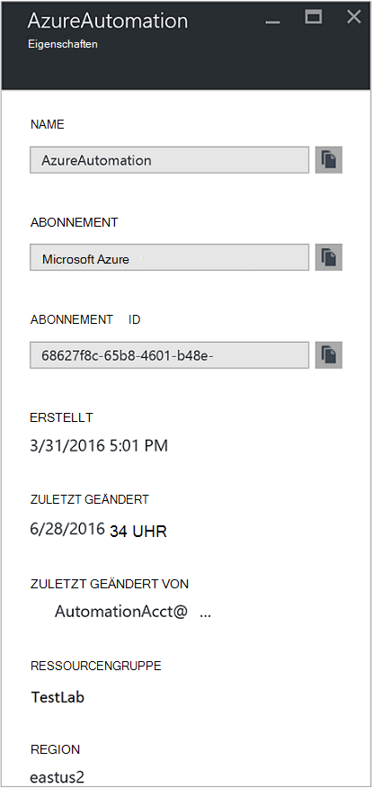
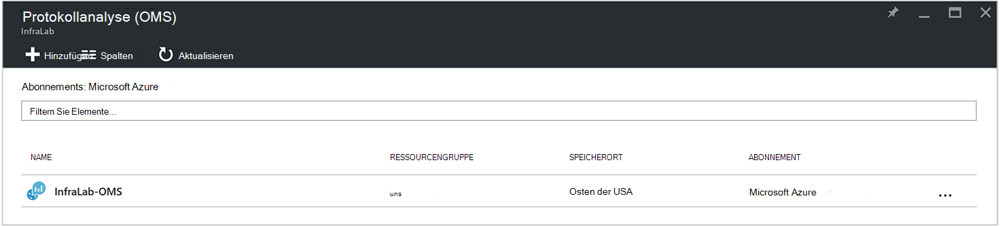
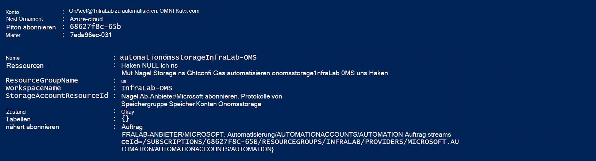
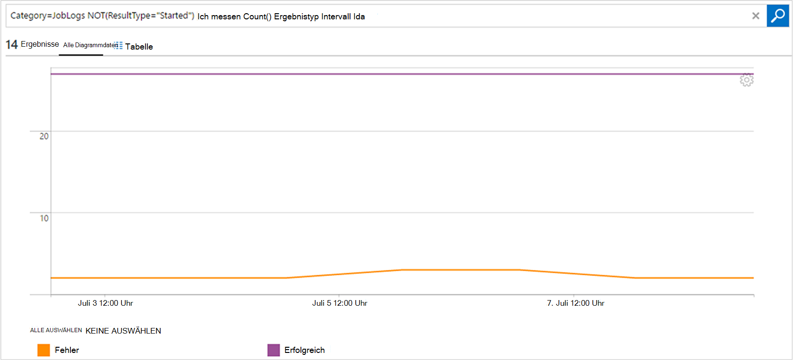

<properties
    pageTitle="Auftragsstatus und Weiterleiten Auftrag Streams in der Automatisierung zu Protokoll Analytics (OMS) | Microsoft Azure"
    description="Dieser Artikel beschreibt wie Auftragsstatus und Runbook Auftrag Streams Microsoft Operations Management Suite Protokollanalyse zu Zusatzinformationen und Management."
    services="automation"
    documentationCenter=""
    authors="MGoedtel"
    manager="jwhit"
    editor="tysonn" />
<tags
    ms.service="automation"
    ms.devlang="na"
    ms.topic="article"
    ms.tgt_pltfrm="na"
    ms.workload="infrastructure-services"
    ms.date="09/22/2016"
    ms.author="magoedte" />

# Weiterleiten Sie Auftragsstatus und Auftrag Streams in der Automatisierung zu Protokoll Analytics (OMS)

Automatisierung kann Runbooks Job Status und Auftrag Streams Arbeitsbereich Protokollanalyse Microsoft Operations Management Suite (OMS) senden.  Während Sie diese Informationen im Azure-Portal oder mit PowerShell einzelne Auftragsstatus oder alle Aufträge für einen bestimmten automatisierungskonto anzeigen können, erfordert etwas erweitert Ihre betrieblichen Erfordernisse unterstützen benutzerdefinierte PowerShell-Skripts erstellen.  Mit Log-Anaytics können Sie jetzt:

- Einsichten Sie für Ihre Projekte Automatisierung 
- Der Auftragsstatus Runbook (Fehler oder angehalten) eine e-Mail oder Warnung auf Trigger 
- Die Job-Datenströme erweiterte Abfragen schreiben 
- Korrelieren Aufträge Automatisierung Konten 
- Visualisieren Sie den Auftragsverlauf langfristig     

## Komponenten und Bereitstellung

Um die Automatisierung Protokolle an Protokollanalyse senden zu müssen Sie Folgendes:

1. Ein OMS-Abonnement. Weitere Informationen finden Sie unter [Erste Schritte mit Protokollanalyse](../log-analytics/log-analytics-get-started.md).  

    >[AZURE.NOTE]OMS-Arbeitsbereich und automatisierungskonto müssen in der gleichen Azure-Abonnement in Reihenfolge für diese Konfiguration ordnungsgemäß funktioniert. 
  
2. Ein [Azure Storage-Konto](../storage/storage-create-storage-account.md).  
   
    >[AZURE.NOTE]Der Storage-Konto *muss* sein im Bereich der Automation-Konto. 
 
3. Azure PowerShell Version 1.0.8 oder neuer Operational Insights-Cmdlets. Informationen zu dieser Version und installieren finden Sie unter [Installieren und Konfigurieren von Azure PowerShell](../powershell-install-configure.md).
4. Azure Diagnose- und Log Analytics PowerShell.  Weitere Informationen zu dieser Version und zur Installation finden Sie unter [Azure Diagnose- und Protokollanalyse](https://www.powershellgallery.com/packages/AzureDiagnosticsAndLogAnalytics/0.1).  
5. PowerShell-Skript **Aktivieren AzureDiagnostics.ps1** von [PowerShell Gallery](https://www.powershellgallery.com/packages/Enable-AzureDiagnostics/1.0/DisplayScript)herunterladen Dieses Skript wird Folgendes konfigurieren:
 - Ein Speicherkonto für die Runbook Job Status und Stream Daten für Automation-Konto, das Sie angeben.
 - Aktivieren der Sammlung von Daten von Ihrem Konto Automatisierung in einem Azure BLOB-Speicher JSON-Format speichern.
 - Konfigurieren Sie Sammeln von Daten aus dem BLOB-Speicher-Konto zu OMS-Protokollanalyse.
 - Aktivieren Sie Automatisierung Protokollanalyse Lösung OMS Arbeitsbereich.   

Das Skript **Aktivieren AzureDiagnostics.ps1** benötigt die folgenden Parameter während der Ausführung:

- *AutomationAccountName* - der Name des Kontos Automatisierung
- *LogAnalyticsWorkspaceName* - der Name des Arbeitsbereichs OMS

Die Werte für *AutomationAccountName*finden in Azure-Portal Kontos Automatisierung aus dem Blade **Automation-Konto** und wählen Sie **Alle Einstellungen**.  Wählen Sie Blatt **Alle Einstellungen** unter **Konto** **Eigenschaften**.  **Eigenschaften** Blatt Beachten Sie diese Werte.  .

## Integration der Protokollanalyse einrichten

1. Starten Sie auf dem Computer **Windows PowerShell-** Bildschirm **Starten** .  
2. PowerShell-Befehlszeilenshell navigieren Sie zum Ordner enthält das Skript heruntergeladen und Ändern der Werte für Parameter ausführen *- AutomationAccountName* und *-LogAnalyticsWorkspaceName*.

    >[AZURE.NOTE] Sie werden aufgefordert, den Azure authentifizieren, nachdem Sie das Skript ausführen.  Sie **müssen** mit einem Konto, das Mitglied der Admins-Abonnement und Co-Administrator des Abonnements ist anmelden.   
    
        .\Enable-AzureDiagnostics -AutomationAccountName <NameofAutomationAccount> `
        -LogAnalyticsWorkspaceName <NameofOMSWorkspace> `

3. Nach dem Ausführen dieses Skripts sollten Sie Datensätze Protokollanalyse sehen Minuten nach neue Diagnosedaten in den Speicher geschrieben werden.  Wenn keine Datensätze verfügbar sind, nach diesem Zeitpunkt finden Sie im Abschnitt Problembehandlung in [JSON-Dateien im BLOB-Speicher](../log-analytics/log-analytics-azure-storage-json.md#troubleshooting-configuration-for-azure-diagnostics-written-to-blob-in-json).

### Überprüfen der Konfiguration

Um sicherzustellen, dass das Skript die automatisierungskonto und OMS Portalnavigation erfolgreich konfiguriert, führen Sie die folgenden Schritte in PowerShell.  Notieren Sie den Wert für **Name** und **Ressourcengruppe**, vor, dass die Werte für die OMS-Arbeitsbereich und Ressourcengruppennamen von Azure-Portal zu Protokoll Analytics (OMS) und Blade-Protokoll Analytics (OMS) navigieren finden.   wir diese beiden Werte Wenn wir überprüfen Sie die Konfiguration im Arbeitsbereich OMS mit PowerShell-Cmdlet [Get-AzureRmOperationalInsightsStorageInsight](https://msdn.microsoft.com/library/mt603567.aspx)verwenden.

1.  Azure-Portal navigieren Sie zum Speicherkonten und suchen Sie nach folgenden Storage Konto Namenskonvention - *AutomationAccountNameomsstorage*verwendet.  Nachdem ein Runbook Auftragsabschluss, kurz danach sollte zwei BLOBs erstellten Container - **Einblicke Protokolle Joblogs** und **Einblicke Protokolle Jobstreams**angezeigt.  

2.  PowerShell, führen Sie den folgenden Code PowerShell Ändern der Werte für die Parameter **ResourceGroupName** und **ein** , die kopiert oder erwähnt.  

    AzureRmAccount Login Get-AzureRmSubscription - SubscriptionName 'SubscriptionName' | Get Set-AzureRmContext-AzureRmOperationalInsightsStorageInsight - ResourceGroupName "OMSResourceGroupName" "-Arbeitsbereich"OMSWorkspaceName" 

    Storage Insight für den angegebenen OMS-Arbeitsbereich wird zurückgegeben.  Wir möchten Storage Insight für zuvor angegebenen Automation-Konto vorhanden ist und **das Zustandsobjekt** **OK**angezeigt.  .

## Analytics-Datensätze

Automatisierung erstellt zwei Arten von Datensätzen in die OMS-Repository.

### Aufträge

Eigenschaft | Beschreibung|
----------|----------|
Zeit | Datum und Uhrzeit Runbook Auftrag ausgeführt.|
resourceId | Gibt an, welche Ressourcen in Azure.  Für die Automatisierung Wert zugeordnete Runbooks Automation-Konto.|
operationName | Gibt den Typ der Operation, die in Azure ausgeführt.  Automatisierung werden der Wert Job.|
resultType | Der Status des Auftrags Runbook.  Mögliche Werte sind: -Gestartet -Beendet -Angehalten -Fehler -Erfolgreich|
resultDescription | Beschreibt den Ergebnis Runbook Auftragsstatus.  Mögliche Werte sind: -Auftrag wird gestartet -Job fehlgeschlagen -Job abgeschlossen|
CorrelationId | GUID, die die Korrelations-ID des Auftrags Runbook.|
Kategorie | Klassifikation von Daten.  Für die Automatisierung ist der Wert JobLogs.|
RunbookName | Der Name des Runbooks.|
Auftrags | GUID, die die Id des Auftrags Runbook ist.|
Anrufer |  Der den Vorgang initiiert hat.  Mögliche Werte sind eine e-Mail-Adresse oder System für geplante Aufträge.|

### Job-Streams
Eigenschaft | Beschreibung|
----------|----------|
Zeit | Datum und Uhrzeit Runbook Auftrag ausgeführt.|
resourceId | Gibt an, welche Ressourcen in Azure.  Für die Automatisierung Wert zugeordnete Runbooks Automation-Konto.|
operationName | Gibt den Typ der Operation, die in Azure ausgeführt.  Automatisierung werden der Wert Job.|
resultType | Der Status des Auftrags Runbook.  Mögliche Werte sind: -In Bearbeitung|
resultDescription | Enthält den Ausgangsdatenstrom Runbooks.|
CorrelationId | GUID, die die Korrelations-ID des Auftrags Runbook.|
Kategorie | Klassifikation von Daten.  Für die Automatisierung ist der Wert JobStreams.|
RunbookName | Der Name des Runbooks.|
Auftrags | GUID, die die Id des Auftrags Runbook ist.|
Anrufer | Der den Vorgang initiiert hat.  Mögliche Werte sind eine e-Mail-Adresse oder System für geplante Aufträge.| 
StreamType | Der Typ des Auftrags Stream. Mögliche Werte sind: -Status -Ausgabe -Warnung -Fehler -Debuggen -Ausführliche|

## Anzeigen von Automatisierung Protokollanalyse anmeldet 

Sehen Sie die mit diesen Protokollen in OMS möglich, da Start Protokollanalyse die Automatisierung Protokollen übermittelt.   

### Senden Sie eine e-Mail, wenn ein Runbook Auftrag fehlschlägt oder unterbrochen 

Eines unserer Top-Kunden fordert eine e-Mail oder einen Text senden, wenn etwas mit einem Runbook schief ist.   

Erstellen eine Warnregel zunächst erstellen Sie Protokoll suchen Runbook Stellendatensätze, die die Warnung aufrufen soll.  **Warnung** -Schaltfläche werden so erstellen und konfigurieren Sie die Regel dann verfügbar.

1.  Die OMS-Übersichtsseite klicken Sie auf **Protokoll suchen**.
2.  Erstellen eine Suchabfrage Protokoll für eine Warnung im Abfragefeld Folgendes eingeben: `Category=JobLogs (ResultType=Failed || ResultType=Suspended)`.  Sie können auch nach dem RunbookName gruppieren, mit: `Category=JobLogs (ResultType=Failed || ResultType=Suspended) | measure Count() by RunbookName_s`.   
  
    Wenn Sie Protokolle von mehreren automatisierungskonto oder Abonnement im Arbeitsbereich eingerichtet haben, können Sie auch Ihre Alerts Abonnement oder automatisierungskonto gruppieren interessieren.  Automatisierung Kontoname kann das Ressourcenfeld im Bereich JobLogs abgeleitet werden.  

3.  Klicken Sie auf **Warnung** oben auf der Seite **Regel hinzufügen** Bildschirm öffnen.  Weitere Informationen zu den Optionen zum Konfigurieren der Warnung finden Sie unter [Alerts in Protokollanalyse](../log-analytics/log-analytics-alerts.md#creating-an-alert-rule).

### Suchen Sie alle Aufträge mit Fehlern 

Neben Warnung aus der Fehler wahrscheinlich möchten wissen, wenn ein Auftrag für ein Runbook andauernd Fehler hatte (PowerShell erzeugt einen Fehlerstream aber andauernd Fehler führen Ihre Arbeit unterbrechen oder nicht).    

1. Klicken Sie im Portal OMS auf **Protokoll suchen**.
2. Geben Sie in das Abfragefeld `Category=JobStreams StreamType_s=Error | measure count() by JobId_g` und dann auf **Suchen**.

### Auftrag-Streams für ein Projekt anzeigen  

Beim Debuggen eines Auftrags sollten Sie in der Job-Streams suchen.  Die folgende Abfrage zeigt alle Streams für ein einzelnes Projekt mit GUID 2ebd22ea-e05e-4eb9 - 9d 76-d73cbd4356e0:   

`Category=JobStreams JobId_g="2ebd22ea-e05e-4eb9-9d76-d73cbd4356e0" | sort TimeGenerated | select ResultDescription` 

### Historisch Einzelvorgangsstatus anzeigen 

Schließlich sollten Sie den Auftragsverlauf Zeitverlauf darstellen.  Diese Abfrage können Sie den Status Ihrer Aufträge über Zeit suchen. 

`Category=JobLogs NOT(ResultType="started") | measure Count() by ResultType interval 1day`  
   

## Zusammenfassung

Die Automatisierung Job Status und Stream Daten für Protokollanalyse senden, erhalten Sie Einblick in den Status von Aufträgen Automatisierung durch Einrichten von Alerts benachrichtigt wird ein Problem und benutzerdefinierte Dashboards mithilfe erweiterte Abfragen Ergebnisse Runbook visualisieren, Runbook Auftragsstatus und andere wichtige Indikatoren oder Metriken.  Dadurch größere betriebliche Sichtbarkeit und Adresse Vorfälle schneller.  

## Nächste Schritte

- Weitere Informationen zu verschiedenen Abfragen Automatisierung Auftragsprotokolle mit Protokollanalyse finden Sie unter [Log durchsucht Protokollanalyse](../log-analytics/log-analytics-log-searches.md)
- Zum Erstellen und Abrufen der Ausgabe und Fehlermeldungen von Runbooks finden Sie unter [Runbook Ausgabe und Nachrichten](automation-runbook-output-and-messages.md) 
- Mehr über Runbook Ausführung wie Aufträge Runbook überwachen und andere technische Details finden Sie unter [Nachverfolgen eines Auftrags runbook](automation-runbook-execution.md)
- OMS-Protokollanalyse und Auflistung von Datenquellen finden Sie unter [Erfassen von Azure Speicherdaten Protokollanalyse-Übersicht](../log-analytics/log-analytics-azure-storage.md)