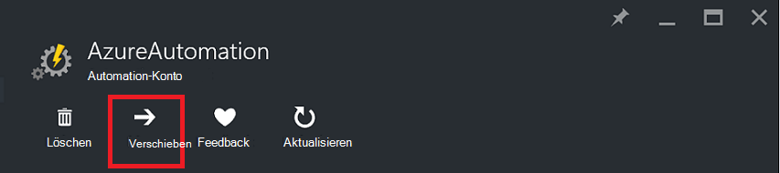
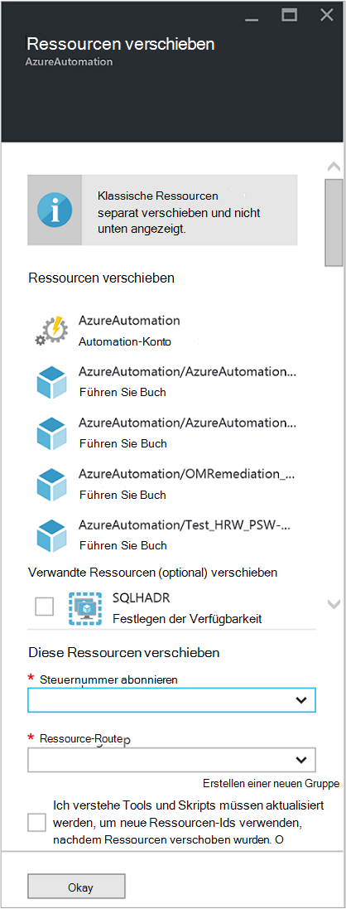

<properties
   pageTitle="Migrieren von Automation-Konto und Ressourcen | Microsoft Azure"
   description="Dieser Artikel beschreibt das in Azure Automation und zugehörigen Ressourcen Automation-Konto ein Abonnement wechseln."
   services="automation"
   documentationCenter=""
   authors="MGoedtel"
   manager="jwhit"
   editor="tysonn" />
<tags
   ms.service="automation"
   ms.devlang="na"
   ms.topic="article"
   ms.tgt_pltfrm="na"
   ms.workload="infrastructure-services"
   ms.date="07/07/2016"
   ms.author="magoedte" />

# <a name="migrate-automation-account-and-resources"></a>Migrieren von Automation-Konten und Ressourcen

Automatisierungskonten und ihre zugeordneten Ressourcen (d. h. Ressourcen, Runbooks, Module usw.), die in Azure-Portal erstellt und aus einer Ressourcengruppe zu einem anderen oder von einem Abonnement zu einem anderen migrieren möchten, erreichen Sie dies einfach mit den [Ressourcen](../resource-group-move-resources.md) in Azure-Portal verfügbar. Jedoch sollte vor dem Fortfahren mit dieser Aktion Sie zuerst die folgende [Checkliste vor dem Verschieben von Ressourcen](../resource-group-move-resources.md#Checklist-before-moving-resources) und der Liste spezifische Automatisierung lesen.   

1.  Die Zielgruppe Abonnement-Ressource muss in derselben Region als Quelle.  Also können Regionen automatisierungskonten verschoben werden.
2.  Beim Verschieben von Ressourcen (z. B. Runbooks, Aufträge usw.) werden die Gruppe und die Zielgruppe für die Dauer des Vorgangs gesperrt. Schreiben und löschen auf Gruppen blockiert, bis zum Abschluss der Verschiebung.  
3.  Runbooks oder Variablen, die Ressource oder Abonnement-ID aus dem Abonnement verweisen müssen aktualisiert werden, nachdem die Migration abgeschlossen ist.   


>[AZURE.NOTE] Dieses Feature unterstützt keine verschieben Classic Automatisierung Ressourcen.

## <a name="to-move-the-automation-account-using-the-portal"></a>Über das Portal Automation-Konto verschieben

1. Klicken Sie auf oben das Blade **verschoben** , Automation-Konto.<br> <br> 
2. Blade **Ressourcen** Beachten Sie, dass Ressourcen für Ihr Konto Automatisierung und die Ressource Gruppen dargestellt.  Wählen Sie aus den Dropdown Listen **Abonnement** und **Ressourcengruppe** oder wählen Sie die Option **eine neue Ressourcengruppe erstellen** und geben Sie im Feld den Namen einer neuen Ressource Gruppe.  
3. Überprüfen und bestätigen Sie das Kontrollkästchen *verstehen, Tools und Skripts müssen aktualisiert werden, um neue Ressourcen-IDs verwenden, nachdem Ressourcen verschoben wurden* und klicken Sie dann auf **OK**.<br> <br>   

Dieser Vorgang dauert einige Minuten.  **Benachrichtigung**Sie präsentiert werden mit dem Status jeder Aktion, die stattfindet - Validierung, Migration, und schließlich ist abgeschlossen.     

## <a name="to-move-the-automation-account-using-powershell"></a>So verschieben Sie mit PowerShell Automation-Konto

Um die vorhandene Automatisierung Ressourcen Ressourcengruppe oder Abonnement zu wechseln, verwenden Sie das Cmdlet " **Get-AzureRmResource** " der bestimmten Automation-Konto und dann **Verschieben-AzureRmResource** -Cmdlet zum Verschieben verwenden.

Das erste Beispiel zeigt eine automatisierungskonto eine neue Ressourcengruppe verschieben.

   ```
    $resource = Get-AzureRmResource -ResourceName "TestAutomationAccount" -ResourceGroupName "ResourceGroup01"
    Move-AzureRmResource -ResourceId $resource.ResourceId -DestinationResourceGroupName "NewResourceGroup"
   ``` 

Nach dem Ausführen des oben genannten Codebeispiel werden Sie aufgefordert zu überprüfen, ob Sie diese Aktion ausführen möchten.  Klicken Sie auf **Ja** und das Skript fortfahren können, erhalten Sie während die Migration durchgeführt wird keine Benachrichtigungen.  

Um ein neues Abonnement zu verschieben, enthalten Sie einen Wert für den Parameter *DestinationSubscriptionId* .

   ```
    $resource = Get-AzureRmResource -ResourceName "TestAutomationAccount" -ResourceGroupName "ResourceGroup01"
    Move-AzureRmResource -ResourceId $resource.ResourceId -DestinationResourceGroupName "NewResourceGroup" -DestinationSubscriptionId "SubscriptionId"
   ``` 

Mit dem vorherigen Beispiel werden Sie aufgefordert, die Verschiebung zu bestätigen.  

## <a name="next-steps"></a>Nächste Schritte

- Weitere Informationen zum Verschieben von Ressourcen auf neue Ressourcengruppe oder Abonnement finden Sie [Ressourcen neue Ressourcengruppe oder Abonnement](../resource-group-move-resources.md)
- Weitere Informationen über rollenbasierte Zugriffskontrolle in Azure Automation finden Sie [Rollenbasierte Zugriffskontrolle in Azure Automation](../automation/automation-role-based-access-control.md).
- Informationen zu PowerShell-Cmdlets für die Verwaltung Ihres Abonnements finden Sie unter [Verwendung von Azure PowerShell mit Ressourcen-Manager](../powershell-azure-resource-manager.md)
- Informationen zu den Funktionen für die Verwaltung Ihres Abonnements finden Sie unter [Verwenden der Azure-Portal zur Verwaltung der Ressourcen](../azure-portal/resource-group-portal.md). 
