<properties 
   pageTitle="Rollenbasierte Zugriffskontrolle in Azure Automatisierung | Microsoft Azure"
   description="Rollenbasierte Zugriffskontrolle (RBAC) ermöglicht die Verwaltung für Azure-Ressourcen. Dieser Artikel beschreibt wie RBAC in Azure Automation eingerichtet."
   services="automation"
   documentationCenter=""
   authors="mgoedtel"
   manager="jwhit"
   editor="tysonn"
   keywords="Automatisierung Rbac rollenbasierten Zugriff Steuerelement Rbac azure" />
<tags 
   ms.service="automation"
   ms.devlang="na"
   ms.topic="get-started-article"
   ms.tgt_pltfrm="na"
   ms.workload="infrastructure-services"
   ms.date="09/12/2016"
   ms.author="magoedte;sngun"/>

# Rollenbasierte Zugriffskontrolle in Azure Automation

## Rollenbasierte Zugriffskontrolle

Rollenbasierte Zugriffskontrolle (RBAC) ermöglicht die Verwaltung für Azure-Ressourcen. [RBAC](../active-directory/role-based-access-control-configure.md)können Sie Aufgaben innerhalb Ihres Teams aufteilen und das Ausmaß des Zugriffs für Benutzer, Gruppen und Programme, die sie für ihre Aufgaben gewähren. Rollenbasierte können mit Azure-Portal, Azure Befehlszeilentools oder Azure Management-APIs zugreifen.

## RBAC in Automation-Konten

In Azure Automation erhält Zugriff durch Benutzer, Gruppen und Applikationen im Bereich Konto Automatisierung die entsprechende RBAC-Rolle zugewiesen. Folgende sind die integrierten Rollen von Automation-Konto unterstützt:  

|**Rolle** | **Beschreibung** |
|:--- |:---|
| Besitzer | Die Besitzerrolle ermöglicht Zugriff auf alle Ressourcen und Aktionen in Automation-Konto einschließlich Zugang zu Benutzern, Gruppen und Applikationen Automation-Konto verwalten. |
| Teilnehmer | Die Rolle eines Beitragenden können Sie alles ändern anderer Benutzer Zugriffsberechtigungen für Automation-Konto verwalten. |
| Reader | Rolle können Sie alle Ressourcen in Automation-Konto jedoch nicht verändern.|
| Automatisierung Operator | Die Automatisierung Operator Rolle können Sie operative Aufgaben wie starten, beenden, anhalten, fortsetzen und Einzelvorgänge planen. Diese Funktion ist hilfreich, wenn Automatisierungskonto Ressourcen wie Anmeldeinformationen Vermögenswerte und Runbooks verhindern, angezeigt oder geändert aber noch Mitglieder Ihrer Organisation diese Runbooks ausgeführt werden soll. |
| Benutzeradministrator-Zugriff | Der Benutzeradministratorrolle Zugriff ermöglicht Benutzerzugriff auf Azure Automation-Konten verwalten. |

>[AZURE.NOTE] Zugriffsrechte zu einem bestimmten Runbook Runbooks, nur Ressourcen und Aktionen in Automation-Konto kann nicht gewährt werden.  

In diesem Artikel werden wir Sie RBAC in Azure Automation einrichten durchlaufen. Zunächst werfen Betrachtung einzelnen Berechtigungen für den Teilnehmer, Leser, Automatisierung Operator und Zugriff, damit wir eine gute ehe alle Rechte der Automatisierung zu verstehen.  Andernfalls führen sie unbeabsichtigt oder unerwünschten Folgen.     

## Berechtigungen für Rolle

Die folgende Tabelle zeigt die spezifischen Aktionen der Beitragendenrolle Automatisierung erfolgen können.

| **Ressourcentyp** | **Lesen** | **Schreiben** | **Löschen** | **Andere Aktionen** |
|:--- |:---|:--- |:---|:--- |
| Azure Automation-Konto |  |  |  | | 
| Automatisierung Zertifikat Anlage |  |  |  | |
| Automatisierung Verbindung Anlage |  |  |  | | 
| Automatisierung Verbindung Typ Anlage |  |  |  | | 
| Automatisierung Anmeldeinformationen Anlage |  |  |  | |
| Automatisierung Zeitplan Anlage |  |  |  | |
| Automation Variable Anlage |  |  |  | |
| Automatisierung gewünscht State-Konfiguration | | | |  |
| Hybrid Runbook Worker Ressourcentyp |  | |  | | 
| Azure Automation Auftrag |  |  | |  | 
| Automatisierung Job Stream |  | | | | 
| Auftragszeitplan Automatisierung |  |  |  | |
| Automatisierung-Modul |  |  |  | |
| Azure Automation Runbook |  |  |  |  |
| Automatisierung Runbook Entwurf |  | | |  |
| Automatisierung Entwurf Runbook Testauftrag |  |  | |  | 
| Automatisierung Webhook |  |  |  |  |

## Leseberechtigungen für Rolle

Die folgende Tabelle zeigt die spezifischen Aktionen der Leserrolle in der Automatisierung ausgeführt werden können.

| **Ressourcentyp** | **Lesen** | **Schreiben** | **Löschen** | **Andere Aktionen** |
|:--- |:---|:--- |:---|:--- |
| Klassische Abonnement |  | | | 
| Management-Sperre |  | | | 
| Berechtigung |  | | |
| Anbieter-Operationen |  | | | 
| Zuweisung der Sicherheitsrolle |  | | | 
| Rollendefinition |  | | | 

## Automatisierung Rolle Operatorberechtigungen

Die folgende Tabelle zeigt bestimmten Aktionen durch Automatisierung Operator bei Automatisierung ausgeführt werden können.

| **Ressourcentyp** | **Lesen** | **Schreiben** | **Löschen** | **Andere Aktionen** |
|:--- |:---|:--- |:---|:--- |
| Azure Automation-Konto |  | | | 
| Automatisierung Zertifikat Anlage | | | |
| Automatisierung Verbindung Anlage | | | |
| Automatisierung Verbindung Typ Anlage | | | |
| Automatisierung Anmeldeinformationen Anlage | | | |
| Automatisierung Zeitplan Anlage |  |  | | |
| Automation Variable Anlage | | | |
| Automatisierung gewünscht State-Konfiguration | | | | |
| Hybrid Runbook Worker Ressourcentyp | | | | | 
| Azure Automation Auftrag |  |  | |  | 
| Automatisierung Job Stream |  | | |  
| Auftragszeitplan Automatisierung |  |  | | |
| Automatisierung-Modul | | | |
| Azure Automation Runbook |  | | | |
| Automatisierung Runbook Entwurf | | | |
| Automatisierung Entwurf Runbook Testauftrag | | | |  
| Automatisierung Webhook | | | |

Weitere Details führt die [Automatisierung Operator Aktionen](../active-directory/role-based-access-built-in-roles.md#automation-operator) Maßnahmen durch Automatisierung operatorrolle für das Konto Automatisierung und seine Ressourcen.

## Rollenberechtigungen Benutzeradministrator-Zugriff

Die folgende Tabelle zeigt die bestimmten Aktionen, die von Access Benutzeradministratorrolle bei Automatisierung durchgeführt werden können.

| **Ressourcentyp** | **Lesen** | **Schreiben** | **Löschen** | **Andere Aktionen** |
|:--- |:---|:--- |:---|:--- |
| Azure Automation-Konto |  | | | |
| Automatisierung Zertifikat Anlage |  | | | |
| Automatisierung Verbindung Anlage |  | | | |
| Automatisierung Verbindung Typ Anlage |  | | | |
| Automatisierung Anmeldeinformationen Anlage |  | | | |
| Automatisierung Zeitplan Anlage |  | | | |
| Automation Variable Anlage |  | | | |
| Automatisierung gewünscht State-Konfiguration | | | | |
| Hybrid Runbook Worker Ressourcentyp |  | | | | 
| Azure Automation Auftrag |  | | | | 
| Automatisierung Job Stream |  | | | | 
| Auftragszeitplan Automatisierung |  | | | |
| Automatisierung-Modul |  | | | |
| Azure Automation Runbook |  | | | |
| Automatisierung Runbook Entwurf |  | | | |
| Automatisierung Entwurf Runbook Testauftrag |  | | | | 
| Automatisierung Webhook |  | | |

## Konfigurieren Sie RBAC für Ihre Azure-Portal mit Automation-Konto

1.  [Azure-Portal](https://portal.azure.com/) anmelden und Ihr Konto Automatisierung Automatisierungskonten Blatt öffnen.  

2.  Klicken Sie auf **die Zugriffskontrolle in der oberen rechten Ecke** . Daraufhin Blatt **Benutzer** , Hinzufügen von neuen Benutzern, Gruppen und Applikationen zu Ihrem Konto Automatisierung vorhandenen Rollen für die Automation-Konto konfiguriert werden können.  

      

>[AZURE.NOTE] **Abonnement-Administratoren** als Standardbenutzer ist bereits vorhanden. Abonnement Administratoren active Directory-Gruppe enthält die Service-Administratoren und Co-administrator(s) für Ihre Azure-Abonnement. Der Dienstadministrator ist der Besitzer des Abonnements Azure und ihre Ressourcen und wird die Rolle geerbt haben für die automatisierungskonten zu. Dies bedeutet, dass der Zugriff **Inherited** für **Dienstadministratoren und co-Administratoren** ein Abonnement und die **zugewiesene** für alle Benutzer. Klicken Sie auf **Abonnement Administratoren** Weitere Einzelheiten über ihre Berechtigungen.  

### Fügen Sie einen neuen Benutzer und weisen eine Rolle zu

1.  Blatt Benutzer klicken Sie auf **Hinzufügen** , um das **Blatt Zugriff hinzufügen** öffnen, in dem Sie Benutzer, Gruppe oder Anwendung hinzufügen und eine Rolle zuweisen können.  

    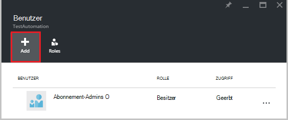  

2.  Wählen Sie eine Rolle aus der Liste der verfügbaren Rollen. Wir **Rolle** wählen, aber Sie können alle verfügbaren Standardrollen, die Automation-Konto unterstützt oder eine benutzerdefinierte Rolle, die Sie definiert haben.  

    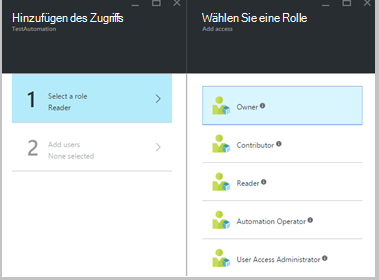  

3.  Klicken Sie auf **Benutzer hinzufügen** , Blade **Benutzer hinzufügen** zu öffnen. Wenn Sie alle Benutzer, Gruppen oder Applikationen Abonnements verwalten die Benutzer aufgelistet und können sie hinzufügen hinzugefügt haben. Es sind keine aufgeführten Benutzer oder wenn der Benutzer Sie interessieren hinzufügen nicht aufgeführt klicken Sie auf **Laden** , um Blade **Gast Einladung** öffnen, in dem einen Benutzer mit einer gültigen Microsoft Konto e-Mail-Adresse wie Outlook.com, OneDrive oder Xbox Live Ids laden können. Sobald Sie die e-Mail-Adresse des Benutzers eingegeben haben, klicken Sie auf **auswählen** , um den Benutzer hinzuzufügen, und klicken Sie auf **OK**. 

    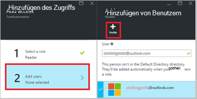  
 
    Blatt **Benutzer** **zugewiesene Rolle** hinzugefügt Benutzer sollte jetzt angezeigt werden.  

      

    Sie können auch eine Rolle der Benutzer aus dem Blade **Rollen** zuweisen. 

1. Klicken Sie auf **Rollen** aus dem Blade Benutzer **Rollen Blade**geöffnet. Dieses Blatt können Sie den Namen der Rolle, die Anzahl der Benutzer und Gruppen mit dieser Rolle anzeigen.

    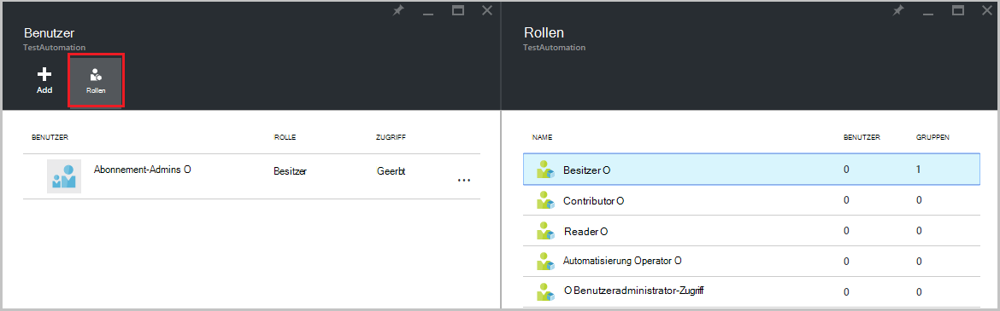  
   
    >[AZURE.NOTE] Rollenbasierte Zugriffskontrolle kann nur auf die Automation-Konto und keine Ressourcen unter Automatisierungskonto festgelegt werden.

    Sie können einen Benutzer, eine Gruppe oder eine Anwendung mehr als eine Rolle zuweisen. Z. B. wenn **Automatisierung Operator** Rolle die **Rolle** für den Benutzer hinzugefügt werden, können dann sie hier die Automatisierung Ressourcen sowie Runbook Aufträge ausführen. Sie können die Dropdownliste eine Liste der Rollen für den Benutzer erweitern.  

    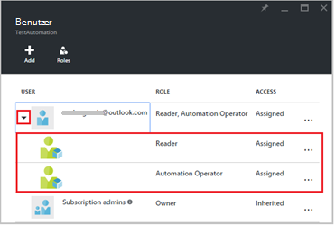  
 
### Entfernen eines Benutzers

Sie können die Berechtigung für einen Benutzer entfernen, die Automatisierungskonto nicht verwaltet oder nicht mehr funktioniert, die für die Organisation. Es folgen die Schritte zum Entfernen eines Benutzers: 

1.  Wählen Sie Blatt **Benutzer** die rollenzuordnung, die Sie entfernen möchten.

2.  Klicken Sie **Entfernen** im Blatt Details Zuordnung.

3.  Klicken Sie auf **Ja,** um das Entfernen zu bestätigen. 

    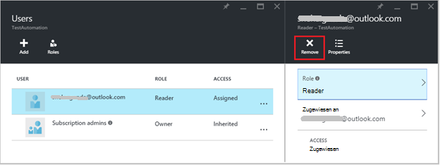  

## Rolle zugewiesene Benutzer

Benutzer zugewiesen eine Rolle die Automation-Konto anmelden, sehen sie jetzt die Liste der **Verzeichnisse standardmäßig**Besitzerkonto. Um die Automation-Konto anzuzeigen, dem sie hinzugefügt wurden, müssen sie das Standardverzeichnis Standardverzeichnis des Besitzers wechseln.  

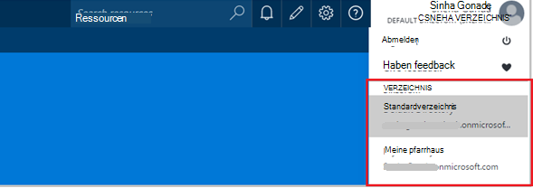  

### Benutzeroberfläche für Automatisierung operatorrolle

Wenn ein Benutzer die Automatisierung Operator Rolle Ansichten Automation-Konto zugewiesen, denen, dem Sie zugeordnet sind, können sie können nur Liste der Runbooks, Runbook Aufträge und Terminpläne erzeugt die Automatisierung aber ihre Definition. Sie starten, beenden, anhalten, fortsetzen oder Runbook Auftrag planen. Der Benutzer keinen Zugriff auf andere Ressourcen Automatisierung wie Konfigurationen Arbeitskraftgruppen Hybrid oder DSC-Knoten.  

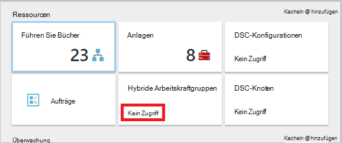  

Klickt der Benutzer auf die Runbook dienen die Befehle die Quelle anzeigen oder Bearbeiten des Runbooks nicht Automatisierung operatorrolle nicht darauf zugreifen können.  

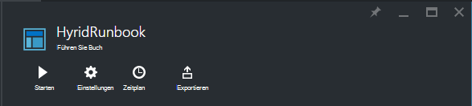  

Benutzer haben Zugriff auf anzeigen und Zeitpläne erstellen jedoch keinen Zugriff auf andere Asset-Typ.  

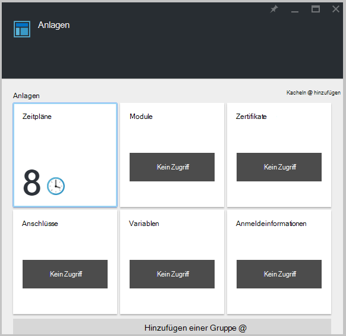  

Diese Benutzer keinen Zugriff auf ein Runbook zugeordnet Webhooks auch

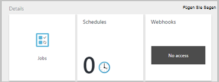  

## Konfigurieren Sie RBAC für die Automation-Konto mithilfe von Azure PowerShell

Rollenbasierter Zugriff kann auch mit den folgenden [Azure PowerShell-Cmdlets](../active-directory/role-based-access-control-manage-access-powershell.md)Automation-Konto konfiguriert werden.

• [Get-AzureRmRoleDefinition](https://msdn.microsoft.com/library/mt603792.aspx) Listet alle RBAC-Rollen, die in Azure Active Directory verfügbar sind. Sie können diesen Befehl zusammen mit der **Name** -Eigenschaft alle Aktionen aufgeführt, die von einer bestimmten Rolle durchgeführt werden können.  
    **Beispiel:**  
    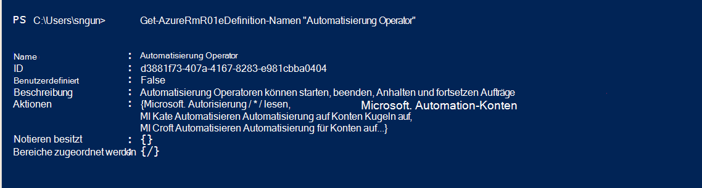  

• [Get-AzureRmRoleAssignment](https://msdn.microsoft.com/library/mt619413.aspx) listet Azure AD RBAC-Rolle Aufgaben im angegebenen Bereich. Dieser Befehl gibt ohne Parameter alle Abonnements vorgenommen Rolle Aufgaben. Verwenden Sie den Parameter **ExpandPrincipalGroups** Liste Zugriff Aufgaben für den angegebenen Benutzer sowie die Gruppen, denen der Benutzer angehört.  
    **Beispiel:** Verwenden Sie den folgenden Befehl, alle Benutzer und ihre Rollen in Automation-Konto.

    Get-AzureRMRoleAssignment -scope “/subscriptions/<SubscriptionID>/resourcegroups/<Resource Group Name>/Providers/Microsoft.Automation/automationAccounts/<Automation Account Name>” 

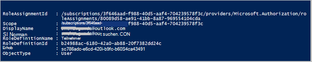

• [Neue AzureRmRoleAssignment](https://msdn.microsoft.com/library/mt603580.aspx) Zugriff für Benutzer, Gruppen und Applikationen zu einem bestimmten Bereich zuweisen.  
    **Beispiel:** Verwenden Sie den folgenden Befehl zuweisen "Automatisierung Operator" Rolle für den Benutzer im Bereich Automation-Konto.

    New-AzureRmRoleAssignment -SignInName <sign-in Id of a user you wish to grant access> -RoleDefinitionName "Automation operator" -Scope “/subscriptions/<SubscriptionID>/resourcegroups/<Resource Group Name>/Providers/Microsoft.Automation/automationAccounts/<Automation Account Name>”  

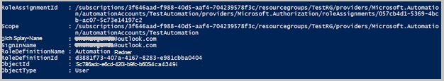

• Verwenden Sie [Entfernen AzureRmRoleAssignment](https://msdn.microsoft.com/library/mt603781.aspx) einen bestimmten Bereich auf einen bestimmten Benutzer, Gruppe oder Anwendung entfernen.  
    **Beispiel:** Verwenden Sie den folgenden Befehl, um den Benutzer aus der Rolle "Automatisierung Operator" im Bereich Automation-Konto entfernen.

    Remove-AzureRmRoleAssignment -SignInName <sign-in Id of a user you wish to remove> -RoleDefinitionName "Automation Operator" -Scope “/subscriptions/<SubscriptionID>/resourcegroups/<Resource Group Name>/Providers/Microsoft.Automation/automationAccounts/<Automation Account Name>”

Ersetzen Sie in den obigen Beispielen **Id anmelden**, **Abonnement-Id**, **den Namen** und **Automatisierung Benutzerkonto** mit Angaben zu Ihrem Konto. Wählen Sie **Ja,** um zu bestätigen, bevor Sie fortfahren, entfernen Sie die Zuweisung von Benutzerrollen.   

## Nächste Schritte
-  Informationen auf verschiedene Arten konfigurieren RBAC für Azure Automation finden Sie [RBAC Azure PowerShell](../active-directory/role-based-access-control-manage-access-powershell.md)verwalten.
- Informationen auf verschiedene Arten ein Runbook starten Siehe [Starten ein runbook](automation-starting-a-runbook.md)
- Informationen zu anderen Runbook finden Sie in [Azure Runbook Automatisierungstypen](automation-runbook-types.md)

