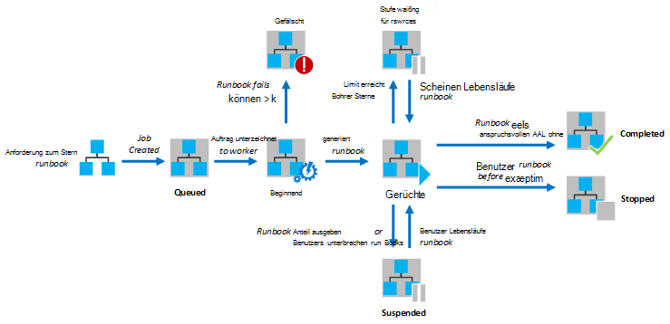
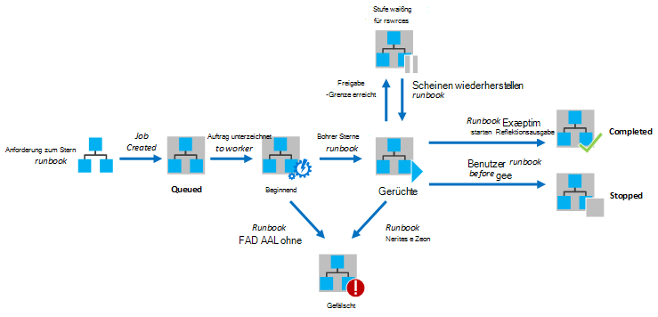

<properties
   pageTitle="Runbook Ausführung in Azure Automation"
   description="Beschreibt die Details der Verarbeitung ein Runbook in Azure Automation."
   services="automation"
   documentationCenter=""
   authors="mgoedtel"
   manager="stevenka"
   editor="tysonn" />
<tags
   ms.service="automation"
   ms.devlang="na"
   ms.topic="article"
   ms.tgt_pltfrm="na"
   ms.workload="infrastructure-services"
   ms.date="03/21/2016"
   ms.author="bwren" />

# Runbook Ausführung in Azure Automation

Beim Starten ein Runbook in Azure Automation wird ein Auftrag erstellt. Ein Auftrag ist eine einzelne Ausführungsinstanz eines Runbooks. Eine Arbeitskraft Azure Automation erhält jeder Auftrag ausgeführt. Während Mitarbeiter von Azure Konten gemeinsam genutzt werden, stellen aus verschiedenen Automatisierung voneinander isoliert. Sie haben nicht steuern die Arbeitskraft Service wird die Anforderung für den Auftrag.  Ein Runbook können mehrere Aufträge gleichzeitig ausgeführt. Beim Anzeigen der Liste von Runbooks im Azure-Portal wird den Status des letzten Auftrags angezeigt, die für jedes Runbook gestartet wurde. Um den Status nachverfolgen können Sie die Liste der Aufträge für jedes Runbook anzeigen. Eine Beschreibung der verschiedenen Statusarten finden Sie unter [Status](#job-statuses).

Das folgende Diagramm zeigt den Lebenszyklus eines Auftrags Runbook [grafisch Runbooks](automation-runbook-types.md#graphical-runbooks) und [PowerShell Workflow Runbooks](automation-runbook-types.md#powershell-workflow-runbooks).

Das folgende Diagramm zeigt den Lebenszyklus eines Auftrags Runbook für [PowerShell Runbooks](automation-runbook-types.md#powershell-runbooks).

Ihre Aufträge haben Zugriff auf Ihre Azure Ressourcen eine Verbindung zu Ihrem Azure-Abonnement. Sie haben Zugriff auf Ressourcen nur im Rechenzentrum, wenn diese Ressourcen der öffentlichen Cloud zugegriffen werden.

## Status

Die folgende Tabelle beschreibt die verschiedenen Statuswerte für einen Auftrag.

| Status| Beschreibung|
|:---|:---|
|Abgeschlossen|Der Auftrag wurde erfolgreich abgeschlossen.|
|Fehler| Konnte nicht für [Grafik- und PowerShell Workflow Runbooks](automation-runbook-types.md)Runbooks kompiliert.  [PowerShell-Skript Runbooks](automation-runbook-types.md)Runbooks konnte nicht gestartet oder das Projekt Ausnahme. |
|Fehler beim Warten auf Ressourcen|Der Auftrag ist fehlgeschlagen, da der [Anteil](#fairshare) dreimal erreicht und von denselben Prüfpunkt oder vom Anfang des Runbooks jedes Mal gestartet.|
|In Warteschlange|Der Einzelvorgang wartet Ressourcen auf eine Arbeitskraft Automatisierung zu zur Verfügung, damit er gestartet werden kann.|
|Starten|Eine Arbeitskraft der Einzelvorgang zugewiesen wurde, und das System beim Starten.|
|Fortsetzen|Das System führt den Auftrag fortsetzen, nachdem er angehalten wurde.|
|Ausführen|Der Auftrag wird ausgeführt.|
|Ausführen, warten auf Ressourcen|Der Auftrag wurde entladen, da die [Anteil](#fairshare) erreicht. Es wird vom letzten Prüfpunkt in Kürze fortgesetzt.|
|Beendet|Der Auftrag wurde vom Benutzer beendet, bevor er abgeschlossen war.|
|Beenden|Das System ist dabei der Auftrag gestoppt wird.|
|Angehalten|Der Auftrag wurde vom Benutzer vom System oder von einem Befehl im Runbook angehalten. Ein Auftrag, der angehalten wurde erneut gestartet werden kann und wird fortgesetzt, vom letzten Prüfpunkt oder ab dem Runbook hat keine Prüfpunkte. Runbook wird nur vom System im Fall einer Ausnahme angehalten. ErrorActionPreference ist standardmäßig **für** Bedeutung der Auftrag bei einem Fehler ausgeführt wird. Wenn diese Einstellung **zu** gesetzt ist wird das Projekt auf Fehler ausgesetzt.  Gilt nur für [Grafik- und PowerShell Workflow Runbooks](automation-runbook-types.md) .|
|Anhalten|Das System versucht, den Auftrag an die Anforderung des Benutzers zu unterbrechen. Runbooks muss nächsten Prüfpunkt erreichen, bevor er angehalten werden kann. Wenn bereits letzten Prüfpunkt übergeben wurde, wird abgeschlossen, bevor er angehalten werden kann.  Gilt nur für [Grafik- und PowerShell Workflow Runbooks](automation-runbook-types.md) .|

## Anzeigen des Jobstatus mit Azure-Verwaltungsportal

### Automatisierung Dashboard

Automatisierung Dashboard zeigt eine Zusammenfassung aller Runbooks für ein bestimmtes Automatisierung ein. Darüber hinaus einen Verbrauch für das Konto. Zusammenfassung Diagramm zeigt die Anzahl der Aufträge insgesamt für alle Runbooks, die jeden Status über eine angegebene Anzahl von Tagen oder Stunden eingegeben. Wählen Sie den Zeitraum in der oberen rechten Ecke des Diagramms. Die Zeitachse des Diagramms wird je nach Zeitraum zu ändern. Sie können auswählen, ob die Zeile für einen bestimmten Status anzeigen, indem Sie am oberen Bildschirmrand auf.

Die folgenden Schritte können Sie Automatisierung Dashboard angezeigt.

1. Aktivieren Sie in Azure-Verwaltungsportal **Automatisierung** , und klicken Sie auf den Namen eines Kontos Automatisierung.
1. Wählen Sie die Registerkarte **Dashboard** .

### Runbook Dashboard

Runbook Dashboard zeigt eine Zusammenfassung für ein Runbook. Zusammenfassung Diagramm zeigt die Anzahl der Aufträge für das einzelnen Status über eine angegebene Anzahl von Tagen oder Stunden eingegeben Runbook insgesamt. Wählen Sie den Zeitraum in der oberen rechten Ecke des Diagramms. Die Zeitachse des Diagramms wird je nach Zeitraum zu ändern. Sie können auswählen, ob die Zeile für einen bestimmten Status anzeigen, indem Sie am oberen Bildschirmrand auf.

Die folgenden Schritte können Sie Runbook Dashboard angezeigt.

1. Aktivieren Sie in Azure-Verwaltungsportal **Automatisierung** , und klicken Sie auf den Namen eines Kontos Automatisierung.
1. Klicken Sie auf den Namen eines Runbooks.
1. Wählen Sie die Registerkarte **Dashboard** .

### Job-Zusammenfassung

Sie können eine Übersicht über alle Aufträge anzeigen, die für ein bestimmtes Runbook und deren aktuellen Status erstellt wurden. Sie können diese Liste nach Auftragsstatus und den Datumsbereich für die letzte Änderung an der Stelle filtern. Klicken Sie auf einen Auftrag, der Informationen und die Ausgabe anzeigen. Die Detailansicht des Auftrags bezieht die Runbook-Parameter, die für den Auftrag bereitgestellt wurden.

Die folgenden Schritte können Sie Aufträge für ein Runbook anzeigen.

1. Aktivieren Sie in Azure-Verwaltungsportal **Automatisierung** , und klicken Sie auf den Namen eines Kontos Automatisierung.
1. Klicken Sie auf den Namen eines Runbooks.
1. Wählen Sie auf der Registerkarte **Aufträge** .
1. Klicken Sie auf die Spalte **Auftrag erstellt** einen Auftrag zum Anzeigen der Details und Ausgabe.

## Jobstatus mit Windows PowerShell abrufen

[Get-AzureAutomationJob](http://msdn.microsoft.com/library/azure/dn690263.aspx) können Sie die Details eines bestimmten Auftrags zu einem Runbook erstellten Aufträge abrufen. Wenn nun ein Runbook mit [Start-AzureAutomationRunbook](http://msdn.microsoft.com/library/azure/dn690259.aspx)mit Windows PowerShell gibt es entstehenden Auftrags zurück. [Get-AzureAutomationJob](http://msdn.microsoft.com/library/azure/dn690263.aspx)Ausgabe des Auftrags Ausgabe zu verwenden.

Die folgenden Beispielbefehle den letzten Auftrag für ein Beispiel für ein Runbook werden abgerufen und dessen Status Werte für Runbook Parameter und der Ausgabe aus dem Auftrag bereitstellen.

    $job = (Get-AzureAutomationJob –AutomationAccountName "MyAutomationAccount" –Name "Test-Runbook" | sort LastModifiedDate –desc)[0]
    $job.Status
    $job.JobParameters
    Get-AzureAutomationJobOutput –AutomationAccountName "MyAutomationAccount" -Id $job.Id –Stream Output

## Anteil

Um alle Runbooks in der Cloud Ressourcen freigeben, wird Azure Automation einen Auftrag vorübergehend entfernen, nach 3 Stunden ausgeführt wurde.    [Grafik-](automation-runbook-types.md#graphical-runbooks) und [PowerShell Workflow](automation-runbook-types.md#powershell-workflow-runbooks) Runbooks wird ihre letzten [Checkpoint](http://technet.microsoft.com/library/dn469257.aspx#bk_Checkpoints)fortgesetzt. Während dieser Zeit zeigt das Projekt Status wird ausgeführt, Ressourcen warten. Wenn Runbook keine Prüfpunkte oder der Auftrag den ersten Prüfpunkt vor dem Entladen nicht erreicht, wird es am Anfang neu.  [PowerShell](automation-runbook-types.md#powershell-runbooks) Runbooks werden immer vom Anfang neu gestartet, Prüfpunkte nicht unterstützt.

>[AZURE.NOTE] Anteil Grenzwert gilt nicht für Runbook Aufträge auf Hybrid Runbook ausgeführt.

Runbooks denselben Prüfpunkt oder Anfang des Runbooks drei Mal neu gestartet wird, wird es mit dem Status Fehler Ressourcen warten beendet. Dies ist Runbooks unbegrenzt Ausführen ohne, schützen sie nicht zum nächsten Checkpoint machen, ohne wieder entladen werden können. In diesem Fall erhalten Sie die folgende Ausnahme mit dem Fehler.

*Der Auftrag kann nicht fortsetzen, da wiederholt aus denselben Prüfpunkt entfernt wurde. Stellen Sie sicher, dass Ihr Runbook langwierige Operationen nicht durchgeführt wird, ohne seinen Zustand beibehalten.*

Wenn ein Runbook erstellen, sollten Sie sicherstellen, dass die Zeit zum Ausführen von Aktivitäten zwischen zwei Prüfpunkten 3 Stunden nicht überschreiten. Möglicherweise Ihr Runbook um sicherzustellen, dass dieser 3-stündigen erreichen oder nicht lange Pause Prüfpunkte hinzufügen Betrieb. Beispielsweise kann Ihr Runbook ein Reindex in einer großen SQL-Datenbank ausführen. Wenn dieser Vorgang innerhalb der Anteil nicht abgeschlossen wird, anschließend das Projekt entladen und neu gestartet ab. In diesem Fall sollten Sie Reindex Vorgang in mehreren Schritten wie dies eine Tabelle gleichzeitig aufteilen und fügen einen Prüfpunkt nach jedem Vorgang, dass der Auftrag nach der letzten Vorgang fortsetzen kann.

## Nächste Schritte

- [Starten Sie ein Runbook in Azure Automation](automation-starting-a-runbook.md)
