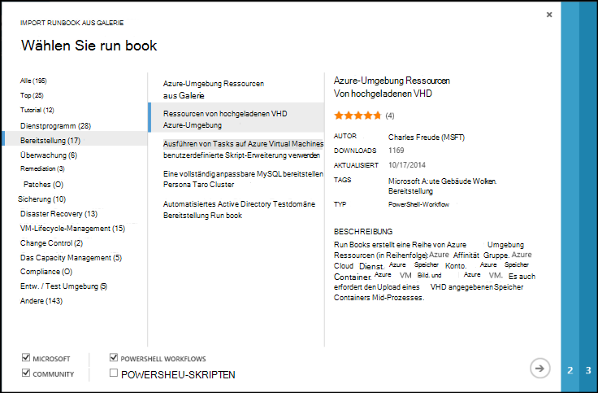
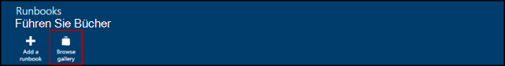
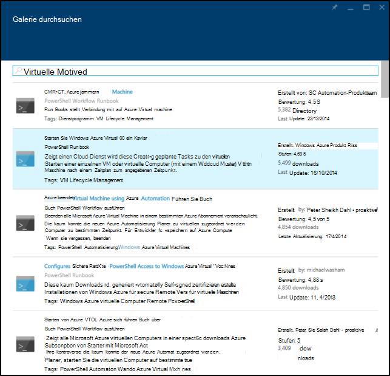
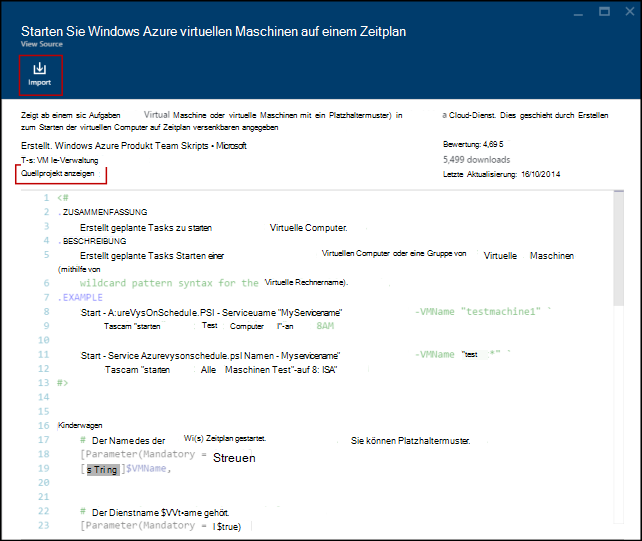
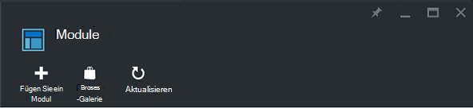
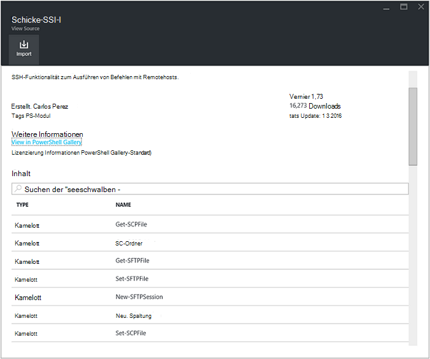
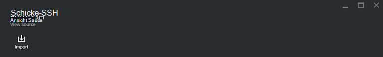
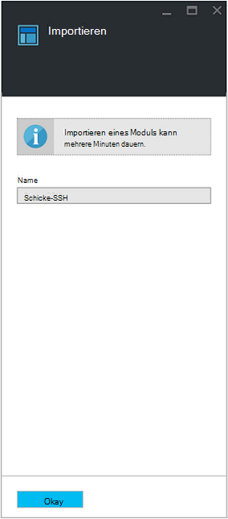

<properties
    pageTitle="Runbook und Modul Kataloge Azure Automatisierung | Microsoft Azure"
    description="Runbooks und Module von Microsoft und der Community sind zur Installation und Verwendung in Ihrer Umgebung Azure Automation.  Dieser Artikel beschreibt, wie Sie diese Ressourcen zugreifen können und die Runbooks der Galerie."
    services="automation"
    documentationCenter=""
    authors="mgoedtel"
    manager="jwhit"
    editor="tysonn" />
<tags
    ms.service="automation"
    ms.devlang="na"
    ms.topic="article"
    ms.tgt_pltfrm="na"
    ms.workload="infrastructure-services"
    ms.date="09/18/2016"
    ms.author="magoedte;bwren" />

# Runbook und Modul Kataloge für Azure Automation

Anstatt eine eigene Runbooks und Module in Azure Automation möglich Szenarien, die von Microsoft und der Community erstellt wurden.  Können diese Szenarien ohne Änderung oder als Ausgangspunkt verwenden und für Ihre Bedürfnisse zu bearbeiten.

Sie können Runbooks [Runbook Gallery](#runbooks-in-runbook-gallery) und Module aus der [Galerie PowerShell](#modules-in-powerShell-gallery)abrufen.  Sie können auch in der Gemeinschaft beitragen, teilen Sie Szenarien, die Sie entwickeln.

## Runbooks Runbook Galerie

[Runbook Gallery](http://gallery.technet.microsoft.com/scriptcenter/site/search?f[0].Type=RootCategory&f[0].Value=WindowsAzure&f[1].Type=SubCategory&f[1].Value=WindowsAzure_automation&f[1].Text=Automation) bietet eine Vielzahl von Runbooks von Microsoft und der Community, die in Azure importieren können. Sie können entweder Download ein Runbook aus der Galerie im [TechNet Script Center](http://gallery.technet.microsoft.com/)statt oder Runbooks direkt aus der Galerie aus dem Azure-Verwaltungsportal oder Azure-Portal importieren.

Sie können nur direkt aus der Galerie Runbook mit klassischen Azure-Portal oder Azure-Portal. Diese Funktion mithilfe von Windows PowerShell nicht möglich.

>[AZURE.NOTE] Sie sollten den Inhalt jeder Runbooks, dass Sie aus der Galerie Runbook und seien Sie vorsichtig bei der Installation und Ausführung in einer überprüfen. |

### So importieren Sie ein Runbook aus der Galerie Runbook mit klassischen Azure-portal

1. Im Azure-Portal **neu** **App Services**, **Automatisierung**, **Runbook**, **Aus Galerie**klicken.
2. Wählen Sie eine Kategorie verknüpften Runbooks und ein Runbook Details dazu anzuzeigen. Bei Auswahl von Runbooks gewünschte klicken Sie rechts.

    

3. Überprüfen Sie den Inhalt des Runbooks, und beachten Sie alle Vorschriften in der Beschreibung. Klicken Sie rechts, wenn Sie fertig sind.
4. Geben Sie Runbook ein und dann auf das Kontrollkästchen. Runbook-Name wird bereits ausgefüllt.
5. Runbooks erscheint auf der Registerkarte **Runbooks** Automation-Konto.

### So importieren Sie ein Runbook aus Galerie Runbook Azure-portal

1. Öffnen Sie in Azure-Verwaltungsportal Automation-Konto.
2. Klicken Sie auf die Kachel **Runbooks** Runbooks öffnen.
3. Klicken Sie auf die Schaltfläche **Katalog durchsuchen** .

    

4. Suchen Sie das Galerieelement und wählen sie Details dazu anzuzeigen.

    

4. Klicken Sie auf **View Source-Projekt** zum Anzeigen des Elements im [TechNet Script Center](http://gallery.technet.microsoft.com/).
5. Um ein Element zu importieren, klicken sie auf Details anzeigen und dann auf die Schaltfläche **Importieren** .

    

6. Gegebenenfalls ändern Sie den Namen des Runbooks, und klicken Sie auf **OK** , um das Runbook importieren.
5. Runbooks erscheint auf der Registerkarte **Runbooks** Automation-Konto.

### Ein Runbook hinzufügen Runbook Galerie

Microsoft empfiehlt Kunden hilfreich sein Runbook Gallery Runbooks hinzu.  Sie können ein Runbook [Hochladen im Script Center](http://gallery.technet.microsoft.com/site/upload) unter Berücksichtigung der folgenden Details hinzufügen.

- *Windows Azure* Geben Sie **Kategorie** und **Unterkategorie** für das Runbook *Automatisierung* im Assistenten angezeigt werden.  

- Der Upload muss eine einzelne Datei ps1 oder .graphrunbook.  Wenn Runbook alle Module untergeordnete Runbooks oder Ressourcen benötigt, sollten Sie die Beschreibung der Vorlage und den Kommentaren des Runbooks auflisten.  Haben Sie ein Szenario erfordern mehrere Runbooks, jeweils separat hochladen und die Namen von verwandten Runbooks in jeder Beschreibung. Stellen Sie sicher, dass die gleichen Tags verwenden, sodass sie in derselben Kategorie angezeigt werden. Benutzer müssen die Beschreibung zu wissen, dass andere Runbooks erforderlich Szenario funktioniert.

- Fügen Sie das Tag "GraphicalPS", wenn Sie **grafisch Runbook** (nicht grafisch Workflow) veröffentlichen. 

- Die Beschreibung **Codeabschnitt einfügen** Symbol fügen Sie PowerShell oder PowerShell Workflow Codeausschnitt ein.

- Zusammenfassung für den Upload in den Ergebnissen Runbook Katalog erscheint so Informationen bereitstellen müssen, mit dem einen Benutzer die Funktionalität des Runbooks identifizieren.

- Sie sollten den Upload bis zu drei der folgenden Tags zuweisen.  Runbooks werden im Assistenten unter den Kategorien aufgelistet, die mit den Tags übereinstimmen.  Alle Tags nicht in dieser Liste werden vom Assistenten ignoriert. Wenn Sie übereinstimmende Tags angeben, werden unter der Kategorie andere Runbooks aufgeführt.

 - Sicherung
 - Das Capacity Management
 - Steuerelement ändern
 - Compliance
 - Entw. / Test Umgebung
 - Disaster Recovery
 - Überwachung
 - Patches
 - Bereitstellung
 - Behebung
 - VM-Lifecycle-Management

- Automatisierung aktualisiert die Galerie stündlich, Ihre Beiträge sofort sehen.

## Module in PowerShell-Galerie

PowerShell-Module enthalten Cmdlets, mit denen Sie in Ihrem Runbooks, und vorhandene Module in Azure Automation Installation stehen in der [PowerShell-Galerie](http://www.powershellgallery.com).  Dieser Katalog von Azure-Portal starten und direkt in Azure Automation installieren oder herunterladen und manuell installieren.  Module können nicht direkt von klassischen Azure-Portal installieren, jedoch können wie andere Modul zu installieren.

### Ein Modul von Automatisierung Modul Galerie mit Azure-Portal importieren

1. Öffnen Sie in Azure-Verwaltungsportal Automation-Konto.
2. Klicken Sie auf **Anlagen** Kachel auf die Liste der Ressourcen öffnen.
3. Klicken Sie auf die Kachel **Module** zum Öffnen der Liste der Module.
4. Klicken Sie auf die Schaltfläche **Katalog durchsuchen** und Blatt Galerie durchsuchen wird gestartet.

      
5. Nach dem Start Blatt Galerie durchsuchen können Sie nach folgenden Feldern suchen:

   - Modulname
   - Tags
   - Autor
   - Cmdlet-DSC-Ressourcenname

6. Suchen Sie eine Modul, der Sie interessiert, und wählen sie Details dazu anzuzeigen.  
Beim Anzeigen in einem bestimmten Modul sehen Sie weitere Informationen über das Modul einen Link zurück zur Galerie PowerShell erforderlichen Abhängigkeiten und alle Cmdlets oder DSC-Ressourcen, die das Modul enthält.

      

7. Die direkt in Azure Automation Installation klicken Sie auf **Importieren** .

    

8. Beim Klicken auf die Schaltfläche Importieren sehen Sie den Namen des Moduls, das Sie importieren. Wenn alle Abhängigkeiten installiert sind, wird die Schaltfläche **OK** aktiv sein. Wenn Abhängigkeiten fehlen, müssen Sie die importieren, bevor Sie dieses Modul importieren können.
9. Klicken Sie auf **OK** , um das Modul zu importieren und das Modul Blade. Azure-Automatisierung ein Modul zu Ihrem Konto importiert, werden Metadaten für das Modul und die Cmdlets extrahiert.

    

    Dies kann einige Minuten dauern, da jede Aktivität extrahiert werden muss.
10. Sie erhalten eine Benachrichtigung, dass das Modul bereitgestellt wird und eine Benachrichtigung bei Abschluss.
11. Nach dem Import des Moduls sehen Sie die Aktivitäten und dessen Ressourcen in Ihren Runbooks und die gewünschte Konfiguration verwenden.

## Fordert ein Runbook oder Modul

Sie können Anfragen an [Benutzer Stimme](https://feedback.azure.com/forums/246290-azure-automation/).  Sie benötigen Hilfe ein Runbook schreiben oder eine Frage über PowerShell, eine Frage [Forum](http://social.msdn.microsoft.com/Forums/windowsazure/en-US/home?forum=azureautomation&filter=alltypes&sort=lastpostdesc).

## Nächste Schritte

- Um Runbooks Einstieg finden Sie unter [Erstellen oder importieren ein Runbook in Azure Automation](automation-creating-importing-runbook.md)
- Finden Sie die Unterschiede zwischen PowerShell und PowerShell Workflow mit Runbooks [lernen PowerShell workflow](automation-powershell-workflow.md)
