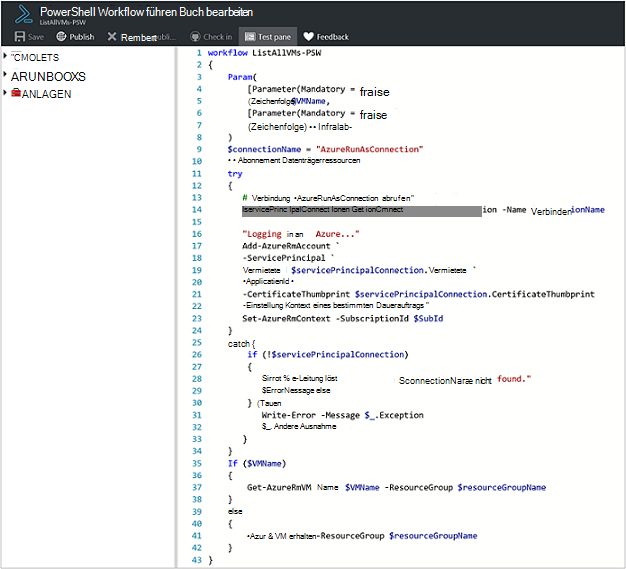
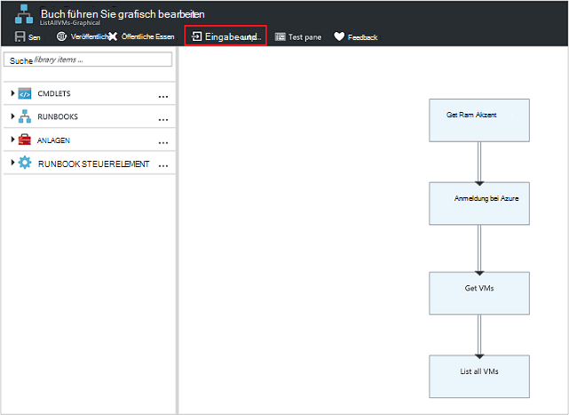
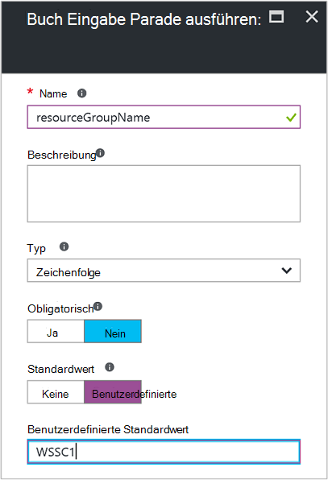
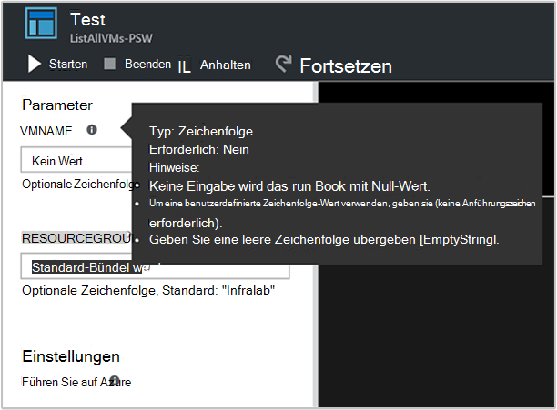
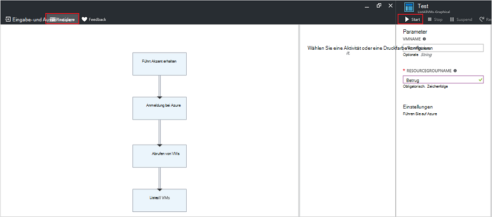
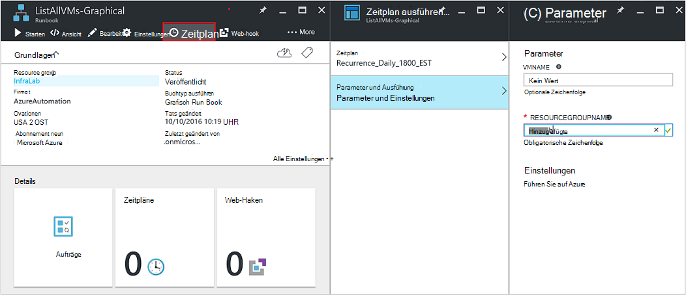
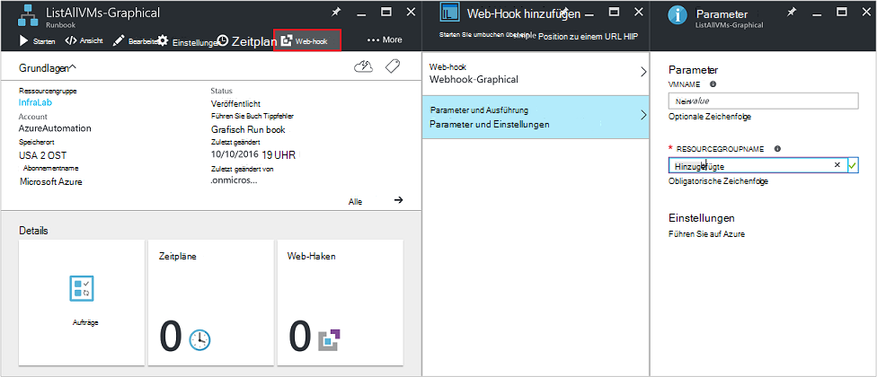
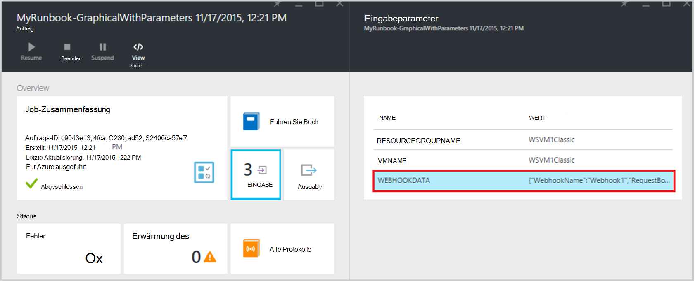

<properties
   pageTitle="Runbook Eingabeparameter | Microsoft Azure"
   description="Eingabeparameter Runbook erhöhen die Flexibilität von Runbooks, sodass Sie Daten an ein Runbook übergeben, wenn es gestartet wird. Dieser Artikel beschreibt verschiedene Szenarios in Runbooks Eingabeparameter verwendet werden."
   services="automation"
   documentationCenter=""
   authors="MGoedtel"
   manager="jwhit"
   editor="tysonn" />
<tags
   ms.service="automation"
   ms.devlang="na"
   ms.topic="article"
   ms.tgt_pltfrm="na"
   ms.workload="infrastructure-services"
   ms.date="10/11/2016"
   ms.author="sngun"/>

# <a name="runbook-input-parameters"></a>Runbook Eingabeparameter

Eingabeparameter Runbook erhöhen die Flexibilität von Runbooks, sodass Sie Daten übergeben, wenn es gestartet wird. Die Parameter können Runbook Aktionen für bestimmte Szenarien und abgestimmt werden. In diesem Artikel werden wir schrittweise Szenarien, Eingabeparameter Runbooks werden.

## <a name="configure-input-parameters"></a>Parameter konfigurieren

Parameter können in PowerShell PowerShell Workflow und grafisch Runbooks konfiguriert werden. Ein Runbook kann mehrere Parameter mit unterschiedlichen Datentypen oder keine Parameter haben. Eingabeparameter können obligatorisch oder optional sein und für die optionalen Parameter einen Standardwert zuweisen. Sie können die Parameter für ein Runbook Werte zuweisen, beim Starten mit einer der verfügbaren Methoden. Dazu gehören das Portal oder einen Webdienst ein Runbook ab. Sie können auch als untergeordnete Runbook starten, die Inline in einem anderen Runbook aufgerufen wird.

## <a name="configure-input-parameters-in-powershell-and-powershell-workflow-runbooks"></a>Konfigurieren Sie Eingabeparameter in PowerShell und PowerShell Workflow runbooks

PowerShell und [PowerShell Workflow Runbooks](automation-first-runbook-textual.md) in Azure Automation unterstützt Eingabeparameter, die durch die folgenden Attribute definiert sind.  

| **Eigenschaft** | **Beschreibung** |
|:--- |:---|
| Typ | Erforderlich. Der Datentyp des Parameterwerts erwartet. Beliebiger gilt. |
| Name | Erforderlich. Der Name des Parameters. Dies muss eindeutig innerhalb der Runbook kann enthalten nur Buchstaben, Zahlen und Unterstriche. Sie müssen mit einem Buchstaben beginnen. |
| Obligatorisch | Optional. Gibt an, ob ein Wert für den Parameter angegeben werden muss. Wenn Sie auf **$true**festgelegt, muss ein Wert angegeben Runbooks begann. Wenn Sie auf **$false**festgelegt, ist ein Wert optional. |
| Standardwert | Optional.  Gibt einen Wert für den Parameter verwendet wird, wenn ein Wert beim Starten von Runbooks übergeben wird. Standardwert wird für einen Parameter festgelegt werden und automatisch den Parameter optional unabhängig von der Einstellung erforderlich. |

Windows PowerShell unterstützt weitere Attribute der Eingabeparameter die hier, wie bei der Validierung Aliasnamen als Parameter festgelegt. Azure Automation unterstützt zurzeit nur die oben aufgeführten Parameter.

Eine Parameterdefinition in PowerShell Workflow Runbooks hat die folgende allgemeine Form, wobei mehrere Parameter durch Semikolons getrennt sind.

   ```
     Param
     (
         [Parameter (Mandatory= $true/$false)]
         [Type] Name1 = <Default value>,

         [Parameter (Mandatory= $true/$false)]
         [Type] Name2 = <Default value>
     )
   ```

>[AZURE.NOTE] Wenn Sie Parameter definieren, wenn Sie das **erforderliche** Attribut angeben, wird standardmäßig der Parameter optional gilt. Auch wenn Sie einen Standardwert für einen Parameter in PowerShell Workflow Runbooks festlegen, wird es von PowerShell optionalen Parameter unabhängig vom **obligatorische** Attribut gleichgestellt.

Beispielsweise konfigurieren wir die Eingabeparameter für ein Runbook PowerShell Workflow, die Details einer einzelnen VM oder VMs innerhalb einer Ressourcengruppe VMs ausgibt. Diese Runbooks verfügt über zwei Parameter, wie im folgenden Screenshot gezeigt: der Name des virtuellen Computers und den Namen der Ressourcengruppe.



Definition der Parameter **$VMName** und **$resourceGroupName** sind in diesem Parameter Parameter vom Typ String. PowerShell und PowerShell Workflow Runbooks unterstützen jedoch alle einfachen und komplexen Typen **PSCredential** für Eingabeparameter oder **Objekt** .

Wenn Ihr Runbook Eingabeparameter ein Objekt verfügt, verwenden Sie PowerShell Hashtable mit (Name, Wert) Paare Wert übergeben. Beispielsweise haben Sie den folgenden Parameter in ein Runbook:

     [Parameter (Mandatory = $true)]
     [object] $FullName

Anschließend können Sie den folgenden Wert an den Parameter übergeben:

    @{"FirstName"="Joe";"MiddleName"="Bob";"LastName"="Smith"}


## <a name="configure-input-parameters-in-graphical-runbooks"></a>Eingabeparameter in grafisch Runbooks konfigurieren

Mit Eingabeparametern [grafisch Runbook konfigurieren](automation-first-runbook-graphical.md) Erstellen eines grafischen Runbooks, das Details einer einzelnen VM oder VMs innerhalb einer Ressourcengruppe VMs ausgibt. Konfigurieren ein Runbook besteht aus zwei Hauptaktivitäten wie unten beschrieben.

[**Runbooks mit Azure ausführen als Konto authentifizieren**](automation-sec-configure-azure-runas-account.md) Authentifizierung mit Azure.

[**Get-AzureRmVm**](https://msdn.microsoft.com/library/mt603718.aspx) zum Abrufen der Eigenschaften von virtuellen Computern.

[**Write-Output**](https://technet.microsoft.com/library/hh849921.aspx) -Aktivität können Sie die Namen der virtuellen Computer ausgegeben. Aktivität **Abrufen AzureRmVm** akzeptiert zwei Parameter, der **Name des virtuellen Computers** und dem **Namen**. Da diese Parameter unterschiedliche Werte jedes Mal Runbooks starten erforderlich konnte, können Sie Ihr Runbook Eingabeparameter hinzufügen. Hier werden die Schritte zum Hinzufügen von Parametern:

1. Blade **Runbooks** grafische Runbook auswählen und dann auf [**Bearbeiten**](automation-graphical-authoring-intro.md) ihn.

2. Runbook Editor klicken Sie auf **Eingabe und Ausgabe** Blade **ein- und Ausgabe** zu öffnen.

    

3. Blade **Eingabe und Ausgabe** zeigt eine Liste von Eingabeparametern für das Runbook definiert sind. Auf dieses Blatt einen neuen Eingabeparameter hinzufügen oder Bearbeiten der Konfiguration der vorhandenen Eingabeparameter. Klicken Sie einen neuen Parameter für das Runbook öffnen **Runbook Eingabeparameter** Blade **Eingabe hinzufügen** . Dort können Sie die folgenden Parameter konfigurieren:

  	| **Eigenschaft** | **Beschreibung** |
  	|:--- |:---|
  	| Name | Erforderlich.  Der Name des Parameters. Dies muss eindeutig innerhalb der Runbook kann enthalten nur Buchstaben, Zahlen und Unterstriche. Sie müssen mit einem Buchstaben beginnen. |
  	| Beschreibung | Optional. Beschreibung über den Zweck der Eingabeparameter. |
  	| Typ | Optional. Der Datentyp des Parameterwerts erwartet wird. Unterstützte Parametertypen sind **Zeichenfolge**, **Int32**, **Int64**, **Decimal**, **Boolean**, **DateTime**und **Object**. Wenn ein Datentyp nicht aktiviert ist, wird standardmäßig **Zeichenfolge**. |
  	| Obligatorisch | Optional. Gibt an, ob ein Wert für den Parameter angegeben werden muss. Wenn Sie **Ja**wählen, muss ein Wert angegeben werden Wenn Runbook gestartet wird. Wenn **keine**Auswahl muss dann ein Wert nicht Runbook gestartet, als Standardwert festgelegt werden kann. |
  	| Standardwert | Optional. Gibt einen Wert für den Parameter verwendet wird, wenn ein Wert beim Starten von Runbooks übergeben wird. Ein Standardwert kann für einen Parameter festgelegt werden, die nicht obligatorisch ist. Wählen Sie **Benutzerdefiniert**, um einen Standardwert festlegen. Dieser Wert wird verwendet, sofern ein anderer Wert ist Runbooks begann. Wählen Sie **keine** , wenn Sie alle Standardwert angeben möchten. |  

    

4. Erstellen Sie zwei Parameter mit den folgenden Eigenschaften, die von der **Get-AzureRmVm** -Aktivität verwendet werden:

    - **1. Parameter:**
      - Namen - VMName
      - Typ - Zeichenfolge
      - Obligatorisch - Nr.

    - **2. Parameter:**
      - Namen - resourceGroupName
      - Typ - Zeichenfolge
      - Obligatorisch - Nr.
      - Standardwert - Custom
      - Benutzerdefinierte Standardwert - \<Name der Ressourcengruppe, die virtuellen Computer enthält >

5. Nachdem Sie die Parameter hinzugefügt haben, klicken Sie auf **OK**.  Jetzt können sie die **Eingabe und Ausgabe**. Klicken Sie erneut auf **OK** , und klicken Sie auf **Speichern** und **Veröffentlichen** der Runbook.

## <a name="assign-values-to-input-parameters-in-runbooks"></a>Weisen Sie Werte in Runbooks Eingabeparameter zu

Sie können Werte in Runbooks in den folgenden Szenarien Eingabeparameter übergeben.

### <a name="start-a-runbook-and-assign-parameters"></a>Starten Sie ein Runbook und weisen Parameter zu

Ein Runbook kann viele Arten gestartet werden: durch Azure-Portal mit einem Webhook, mit PowerShell-Cmdlets, die REST-API oder SDK. Im folgenden Diskutieren wir verschiedene Methoden zum Starten ein Runbook und Parameter zuweisen.

#### <a name="start-a-published-runbook-by-using-the-azure-portal-and-assign-parameters"></a>Starten eines veröffentlichten Runbooks mit Azure-Portal und Parameter zuweisen

Wenn [Runbooks starten](automation-starting-a-runbook.md#starting-a-runbook-with-the-azure-portal) **Start Runbook** Blade öffnet und können Werte für die Parameter, die Sie gerade erstellt haben.


Die Bezeichnung unter Feld sehen Sie die Attribute, die für die Parameter festgelegt wurden. Attribute sind obligatorisch oder optional, Typ und Standardwert. In der Sprechblase des Hilfe neben den Parameternamen finden Sie alle benötigten Parameter Eingabewerte Entscheidungen wichtige Informationen. Diese Informationen umfassen, ob Parameter obligatorisch oder optional ist. Es enthält auch den Typ und Standardwert (falls vorhanden) und andere hilfreiche Hinweise.



>[AZURE.NOTE] Type-Parameter unterstützt **leere** Zeichenfolgenwerte.  **[Fehler]** im Eingabeparameter eingeben, wird eine leere Zeichenfolge an den Parameter übergeben. Auch unterstützen Typ-Parameter nicht **Null** -Werte übergeben. Wenn Sie einen beliebigen Wert der String-Parameter übergeben, dann interpretiert PowerShell es als null.

#### <a name="start-a-published-runbook-by-using-powershell-cmdlets-and-assign-parameters"></a>Starten eines veröffentlichten Runbooks mit PowerShell-Cmdlets und Parameter zuweisen

  - **Ressourcenmanager Azure Cmdlets:** Starten Sie ein Runbook Automatisierung, die in einer Ressourcengruppe mit [Start-AzureRmAutomationRunbook](https://msdn.microsoft.com/library/mt603661.aspx)erstellt wurde.

    **Beispiel:**

   ```
    $params = @{“VMName”=”WSVMClassic”;”resourceGroupeName”=”WSVMClassicSG”}
 
    Start-AzureRmAutomationRunbook -AutomationAccountName “TestAutomation” -Name “Get-AzureVMGraphical” –ResourceGroupName $resourceGroupName -Parameters $params
   ```

  - **Azure Service Management Cmdlets:** Starten Sie ein Runbook Automatisierung, die in einer Ressourcengruppe Standard mit [Start-AzureAutomationRunbook](https://msdn.microsoft.com/library/dn690259.aspx)erstellt wurde.

    **Beispiel:**

   ```
    $params = @{“VMName”=”WSVMClassic”; ”ServiceName”=”WSVMClassicSG”}

    Start-AzureAutomationRunbook -AutomationAccountName “TestAutomation” -Name “Get-AzureVMGraphical” -Parameters $params
   ```

>[AZURE.NOTE] Beim Starten eines Runbooks mit PowerShell-Cmdlets einen Standardparameter ist **MicrosoftApplicationManagementStartedBy** mit **PowerShell**erstellt. Sie können diesen Parameter **Auftragsdetails** Blatt anzeigen.  

#### <a name="start-a-runbook-by-using-an-sdk-and-assign-parameters"></a>Starten eines Runbooks mit SDK und Parameter zuweisen

  - **-Methode Azure-Ressourcen-Manager:** Sie können ein Runbook starten, mit dem SDK eine Programmiersprache. Es folgt ein C#-Codeausschnitt für ein Runbook in Ihrem Konto Automatisierung gestartet. Sie können den Code an unserer [GitHub Repository](https://github.com/Azure/azure-sdk-for-net/blob/master/src/ResourceManagement/Automation/Automation.Tests/TestSupport/AutomationTestBase.cs)anzeigen.  

   ```
     public Job StartRunbook(string runbookName, IDictionary<string, string> parameters = null)
        {
          var response = AutomationClient.Jobs.Create(resourceGroupName, automationAccount, new JobCreateParameters
           {
              Properties = new JobCreateProperties
               {
                  Runbook = new RunbookAssociationProperty
                   {
                     Name = runbookName
                   },
                     Parameters = parameters
               }
           });
        return response.Job;
        }
   ```

  - **Methode Azure Service:** Sie können ein Runbook starten, mit dem SDK eine Programmiersprache. Es folgt ein C#-Codeausschnitt für ein Runbook in Ihrem Konto Automatisierung gestartet. Sie können den Code an unserer [GitHub Repository](https://github.com/Azure/azure-sdk-for-net/blob/master/src/ServiceManagement/Automation/Automation.Tests/TestSupport/AutomationTestBase.cs)anzeigen.

   ```      
    public Job StartRunbook(string runbookName, IDictionary<string, string> parameters = null)
      {
        var response = AutomationClient.Jobs.Create(automationAccount, new JobCreateParameters
      {
        Properties = new JobCreateProperties
           {
             Runbook = new RunbookAssociationProperty
           {
             Name = runbookName
                },
                  Parameters = parameters
                }
         });
        return response.Job;
      }
   ```

  Um diese Methode zu starten, erstellen Sie ein Wörterbuch zum Speichern von Parametern Runbook, **VMName** und **ResourceGroupName**und deren Werte Starten Sie Runbooks. Der C#-Codeausschnitt zum Aufrufen der oben definierten Methode folgt.

   ```
    IDictionary<string, string> RunbookParameters = new Dictionary<string, string>();

    // Add parameters to the dictionary.
    RunbookParameters.Add("VMName", "WSVMClassic");
    RunbookParameters.Add("resourceGroupName", "WSSC1");

    //Call the StartRunbook method with parameters
    StartRunbook(“Get-AzureVMGraphical”, RunbookParameters);
   ```

#### <a name="start-a-runbook-by-using-the-rest-api-and-assign-parameters"></a>Starten Sie ein Runbook mithilfe der REST-API und weisen Parameter zu

Ein Runbook Auftrag kann erstellt und mit Azure Automation REST API folgende URI-Anforderung mit der **PUT** -Methode gestartet.

    https://management.core.windows.net/<subscription-id>/cloudServices/<cloud-service-name>/resources/automation/~/automationAccounts/<automation-account-name>/jobs/<job-id>?api-version=2014-12-08`

Anfrage-URI ersetzen Sie die folgenden Parameter:

  - **Abonnement-Id:** Ihre Azure-Abonnement-ID.  
  - **Cloud-Dienst-Name:** Der Name des Cloud-Dienst, den die Anforderung gesendet werden soll.  
  - **Automatisierung Kontoname:** Der Name des Kontos Automatisierung in einem angegebenen Cloud-Dienst gehostet wird.  
  - **Job-Id:** Die GUID für das Projekt. GUIDs in PowerShell entstehen mit **[GUID]::NewGuid(). ToString()** Befehl.

Verwenden des Anforderungstexts Runbook Auftrag Parameter übergeben. Die folgenden zwei Eigenschaften im JSON-Format benötigt:

  - **Runbook Name:** Erforderlich. Der Name der Runbook für den Auftrag zu starten.  
  - **Runbook Parameter:** Optional. Ein Wörterbuch der Parameterliste (Name, Wert) formatieren, Name sollte vom Typ Zeichenfolge und kann einen beliebigen gültigen JSON-Wert.

Runbook **Get-AzureVMTextual** starten, das zuvor mit **VMName** und **ResourceGroupName** als Parameter erstellt wurde, verwenden Sie folgende JSON-Format für den Hauptteil der Anforderung.

   ```
    {
      "properties":{
        "runbook":{
        "name":"Get-AzureVMTextual"},
      "parameters":{
         "VMName":"WSVMClassic",
         "resourceGroupName":”WSCS1”}
        }
    }
   ```

Ein HTTP-Statuscode 201 wird zurückgegeben, wenn das Projekt erfolgreich erstellt wurde. Weitere Informationen über Antwortheader und den Hauptteil einer Antwort finden Sie im Artikel über das [mithilfe der REST-API einen Runbook Auftrag.](https://msdn.microsoft.com/library/azure/mt163849.aspx)

### <a name="test-a-runbook-and-assign-parameters"></a>Ein Runbook testen und Parameter zuweisen

Wenn Sie [Ihr Runbook Entwurf testen](automation-testing-runbook.md) mit der Testoption **Testen** Blade öffnet und können Werte für die Parameter, die Sie gerade erstellt haben.



### <a name="link-a-schedule-to-a-runbook-and-assign-parameters"></a>Verknüpfen Sie einen Zeitplan, ein Runbook und weisen Parameter zu

Sie können [Verknüpfen Zeitplan](automation-schedules.md) zu Ihrem Runbook sodass Runbooks zu einem bestimmten Zeitpunkt beginnt. Eingabeparameter wird beim Erstellen des Zeitplans Runbook verwendet diese Werte Beginn durch den Zeitplan zuweisen. Speichern Sie den Zeitplan müssen alle obligatorischen Werte angegeben werden.



### <a name="create-a-webhook-for-a-runbook-and-assign-parameters"></a>Erstellen Sie einer Webhook für ein Runbook und weisen Parameter zu

Sie können eine [Webhook](automation-webhooks.md) für Ihre Runbook erstellen und konfigurieren Runbook Eingabeparameter. Die Webhook kann nicht gespeichert werden, bis alle obligatorischen Werte angegeben werden.



Beim Ausführen einer Runbook mithilfe einer Webhook den vordefinierten Eingabeparameter, die **[Webhookdata](automation-webhooks.md#details-of-a-webhook)** zusammen mit den Eingabeparametern gesendet wird, die Sie definiert. Sie können den **WebhookData** -Parameter auf Weitere Details erweitern klicken.




## <a name="next-steps"></a>Nächste Schritte

- Weitere Informationen zu Runbook ein- und Ausgabe finden Sie unter [Azure Automation: Runbook Eingabe-, Ausgabe- und geschachtelte Runbooks](https://azure.microsoft.com/blog/azure-automation-runbook-input-output-and-nested-runbooks/).
- Informationen zu verschiedenen Methoden zum Starten ein Runbook finden Sie unter [ein Runbook ab](automation-starting-a-runbook.md).
- Bearbeiten Sie Text Runbook finden Sie in [Textform Runbooks bearbeiten](automation-edit-textual-runbook.md).
- Bearbeiten Sie grafisch Runbook finden Sie unter [Graphical authoring in Azure Automation](automation-graphical-authoring-intro.md).
