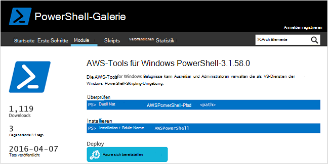
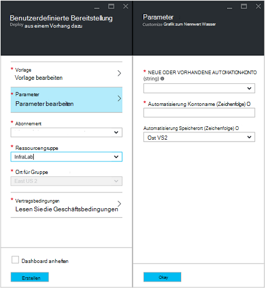
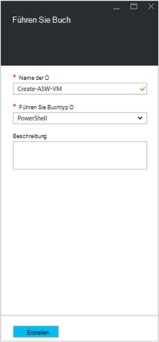
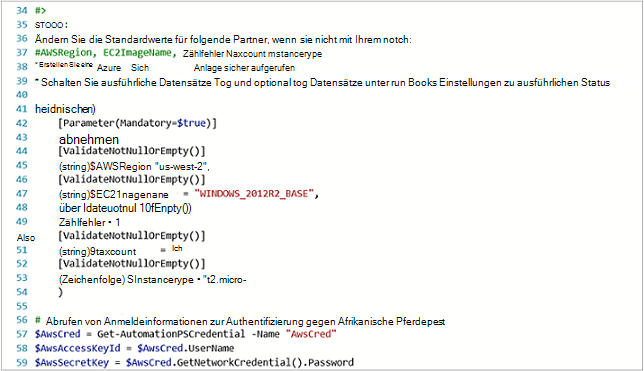
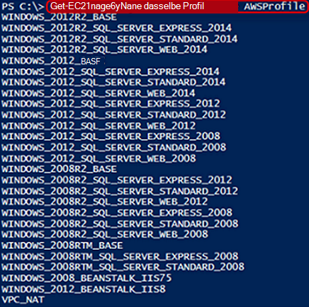
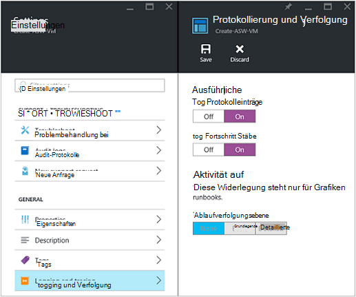
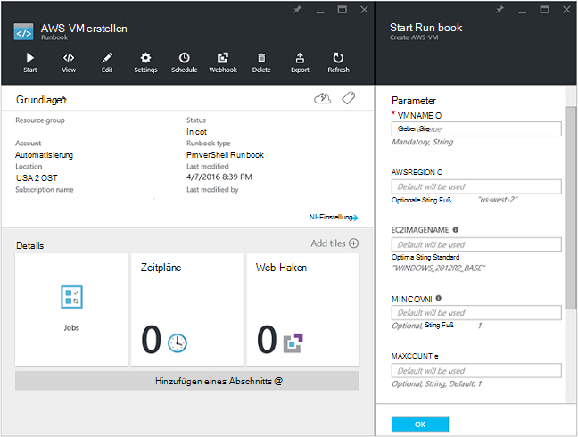
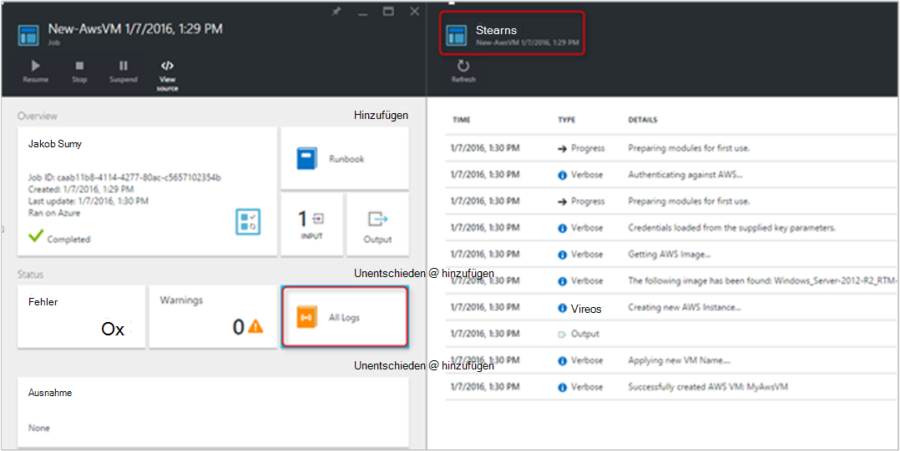
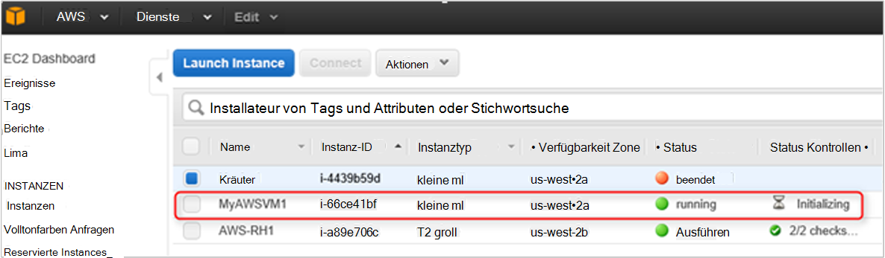

<properties
   pageTitle="Automatisierung der Bereitstellung eines virtuellen Computers in Amazon Web Services | Microsoft Azure"
   description="Dieser Artikel veranschaulicht, wie Azure Automatisierung zur Automatisierung der Erstellung einer VM Amazon Web Service"
   services="automation"
   documentationCenter=""
   authors="mgoedtel"
   manager="jwhit"
   editor="" />
<tags
   ms.service="automation"
   ms.devlang="na"
   ms.topic="article"
   ms.tgt_pltfrm="na"
   ms.workload="na"
   ms.date="08/17/2016"
   ms.author="tiandert; bwren" />

# <a name="azure-automation-scenario---provision-an-aws-virtual-machine"></a>Szenarium für Azure - Bereitstellung einer virtuellen Maschine AWS 

In diesem Artikel zeigen wir, wie Sie Azure Automatisierung zum Bereitstellen eines virtuellen Computers in Ihrem Abonnement Amazon Web Service (AWS) und benennen Sie diesen virtuellen Computer bestimmte – bezeichnet AWS als "tagging" VM nutzen können.

## <a name="prerequisites"></a>Erforderliche Komponenten

Für die Zwecke dieses Artikels müssen Sie ein Azure Automation-Konto und ein Abonnement AWS. Finden Sie weitere Informationen Azure Automation-Konto und mit Ihrem Abonnement AWS konfigurieren [Authentifizierung mit Amazon Web Services konfigurieren](../automation/automation-sec-configure-aws-account.md).  Dieses Konto sollte erstellt oder aktualisiert mit Ihrem Abonnement AWS vor, wie wir dieses Konto in den folgenden Schritten verweisen.


## <a name="deploy-amazon-web-services-powershell-module"></a>Bereitstellen von Amazon Web Services PowerShell-Modul

Unser provisioning Runbook VM wird AWS PowerShell-Modul, um arbeiten nutzen. Die folgenden Schritte mit Ihrem Abonnement AWS konfiguriert Ihr Konto Automatisierung des Moduls hinzugefügt.  

1. Öffnen Sie Ihren Browser und [PowerShell Galerie](http://www.powershellgallery.com/packages/AWSPowerShell/) navigieren Sie und auf **Azure Automation Schaltfläche bereitstellen**.<br> 

2. Azure Anmeldeseite und nach der Authentifizierung aufgerufen, Azure-Portal weitergeleitet und werden mit folgenden angezeigt.<br> 

3. Wählen Sie die Ressourcengruppe aus der Dropdownliste **Ressourcengruppe** und auf die Parameter, Informationen Sie die folgenden:
   * Wählen Sie aus der Dropdown-Liste **neu oder Konto Automatisierung (Zeichenfolge)** **vorhanden**.  
   * Geben Sie im **Automatisierung Kontoname (Zeichenfolge)** in den genauen Namen des Automation-Konto, das die Anmeldeinformationen für Ihr Abonnement AWS beinhaltet.  Beispielsweise ist erstellt ein Benutzerkonto mit dem Namen **AWSAutomation**, die Sie in das Feld eingeben.
   * Wählen Sie die entsprechende Region aus Dropdown- **Automatisierung Speicherort** .

4. Wenn Sie die erforderlichen Informationen eingegeben haben, klicken Sie auf **Erstellen**.

    >[AZURE.NOTE]Azure Automation PowerShell-Modul importieren, es wird auch extrahieren die Cmdlets und diese Aktivitäten werden nicht angezeigt, bis das Modul importieren und extrahieren die Cmdlets vollständig abgeschlossen hat. Dieser Vorgang kann einige Minuten dauern.  
<br>
5. Öffnen Sie in Azure-Verwaltungsportal Kontos Automatisierung in Schritt 3 erwähnten.
6. Auf **Anlagen** Kachel und Blade- **Anlagen** , wählen Sie die Kachel **Module** .
7. Auf die **Module** wird das **AWSPowerShell** -Modul in der Liste angezeigt.

## <a name="create-aws-deploy-vm-runbook"></a>Erstellen Sie AWS VM Runbook bereitstellen

Nach der Bereitstellung des PowerShell-Moduls AWS können wir jetzt ein Runbook zum Automatisieren der Bereitstellung eines virtuellen Computers in AWS mithilfe eines PowerShell-Skripts erstellen. Die folgenden Schritte zeigen wie systemeigene PowerShell-Skript in Azure Automation.  

>[AZURE.NOTE] Weitere Optionen und Informationen zu diesem Skript finden Sie auf der [PowerShell-Galerie](https://www.powershellgallery.com/packages/New-AwsVM/DisplayScript).


1. Herunterladen des PowerShell-Skripts neu AwsVM PowerShell Gallery PowerShell-Sitzung öffnen und Folgendes eingeben:<br>
   ```
   Save-Script -Name New-AwsVM -Path \<path\>
   ```
<br>
2. Azure-Verwaltungsportal automatisierungskonto eröffnen und **Runbooks** klicken.  
3. Wählen Sie das Blade **Runbooks** **Hinzufügen ein Runbook**aus.
4. Blatt **Hinzufügen ein Runbook** wählen Sie (Erstellen einer neuen Runbook) **Schnell erstellen** .
5. Eigenschaften **für ein Runbook** -Blade einen Namen im Feld Name der Runbook und **Runbook Typ** Dropdownliste **PowerShell**auswählen und dann auf **Erstellen**.<br> 
6. Wenn das Blade PowerShell Runbook bearbeiten angezeigt wird, kopieren und authoring Leinwand Runbook PowerShell-Skript einfügen.<br> <br>

    >[AZURE.NOTE] Beachten Sie beim Arbeiten mit Beispiel PowerShell-Skript Folgendes:
    >
    > - Runbooks enthält eine Reihe von Standard-Parameterwerten. Alle Standardwerte bewerten und gegebenenfalls zu aktualisieren.
    > - Wenn die AWS-Anmeldeinformationen als Vermögenswert Anmeldeinformationen mit dem Namen anders als **AWScred**gespeichert haben, müssen Sie das Skript in Zeile 57 entsprechend entsprechend aktualisieren.  
    > - Beim Arbeiten mit AWS CLI-Befehle in PowerShell, insbesondere bei diesem Runbook Beispiel geben Sie AWS-Region. Andernfalls schlägt die Cmdlets fehl.  Hilfethema AWS [AWS Region angeben](http://docs.aws.amazon.com/powershell/latest/userguide/pstools-installing-specifying-region.html) AWS Tools für PowerShell Dokument für weitere Details.  
<br>
7. Rufen Sie eine Liste der Namen aus Ihrem Abonnement AWS PowerShell ISE starten und AWS PowerShell-Modul importieren.  Authentifizierung AWS ersetzen Sie **Get-AutomationPSCredential** in Ihrer Umgebung ISE mit **AWScred = Get-Credential**.  Diese Anmeldeinformationen aufgefordert und können Sie Ihre **Access-Schlüssel-ID** für den Benutzernamen und den **Geheimschlüssel** für das Kennwort.  Siehe folgendes Beispiel:

        #Sample to get the AWS VM available images
        #Please provide the path where you have downloaded the AWS PowerShell module
        Import-Module AWSPowerShell
        $AwsRegion = "us-west-2"
        $AwsCred = Get-Credential
        $AwsAccessKeyId = $AwsCred.UserName
        $AwsSecretKey = $AwsCred.GetNetworkCredential().Password

        # Set up the environment to access AWS
        Set-AwsCredentials -AccessKey $AwsAccessKeyId -SecretKey $AwsSecretKey -StoreAs AWSProfile
        Set-DefaultAWSRegion -Region $AwsRegion

        Get-EC2ImageByName -ProfileName AWSProfile
   Die folgende Ausgabe zurückgegeben:<br>
     
8. Kopieren und Einfügen eines Bilds Namen in Automation-Variable in der Runbook als **$InstanceType**. Da in diesem Beispiel werden mit freien AWS tiered-Abonnement, verwenden wir für unser Beispiel Runbook **t2.micro** .
9. Speichern Sie Runbook und dann auf **Veröffentlichen** Runbook veröffentlichen und dann auf **Ja** .


### <a name="testing-the-aws-vm-runbook"></a>Runbook AWS VM testen
Bevor wir testen Runbooks, müssen wir einige Dinge zu überprüfen. Insbesondere:

   -  Anlage für das Authentifizieren anhand AWS wurde als **AWScred** oder das Skript wurde aktualisiert, um den Namen Ihrer Anmeldeinformationen Ressource.  
   -  AWS PowerShell-Modul wurde in Azure Automation importiert
   -  Eine neue Runbook erstellt wurde und Parameterwerte überprüft und gegebenenfalls aktualisiert wurden
   -  **Ausführliche Datensätze** und optional **Fortschritt Datensätze** unter **Protokollierung und Verfolgung** festlegen Runbook wurden **auf**festgelegt.<br> 

1. Wir möchten Runbooks starten, klicken Sie auf **Start** , und klicken Sie auf **OK** , wenn das Blade starten Runbook öffnet.
2. Blade starten Runbook bieten Sie **VMname**.  Übernehmen Sie die Standardwerte für die Parameter, die Sie zuvor im Skript vorkonfiguriert.  Klicken Sie auf **OK** um Runbook Auftrag zu starten.<br> 
3. Eine im Auftrag wird Runbook Auftrag geöffnet, die wir gerade erstellt haben. Schließen Sie dieses Fenster.
4. Wir können Fortschritt des Auftrags und **Ansicht Ausgabedatenströmen Runbook Auftrag Blade Kachel **Alle Protokolle** auswählen** .<br> 
5. Um sicherzustellen, dass die VM bereitgestellt wird, melden Sie sich bei AWS Management Console Wenn Sie nicht angemeldet sind.<br> 

## <a name="next-steps"></a>Nächste Schritte
-   Zunächst mit grafisch Runbooks sehen Sie [Meine erste grafisch runbook](automation-first-runbook-graphical.md)
-   Zunächst mit PowerShell Workflow Runbooks finden Sie [meinen ersten PowerShell Workflow runbook](automation-first-runbook-textual.md)
-   Über Runbook Typen, deren vor- und Nachteile finden Sie unter [Azure Runbook Automatisierungstypen](automation-runbook-types.md)
-   Weitere Informationen zu PowerShell-Skript Feature unterstützt, finden Sie [in Azure Automation unterstützt Native PowerShell-Skript](https://azure.microsoft.com/blog/announcing-powershell-script-support-azure-automation-2/)
