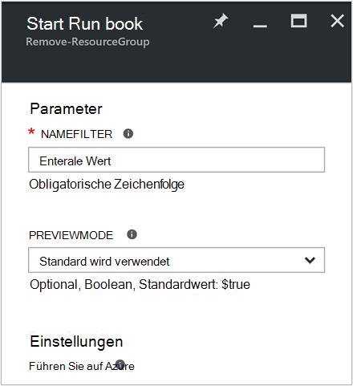
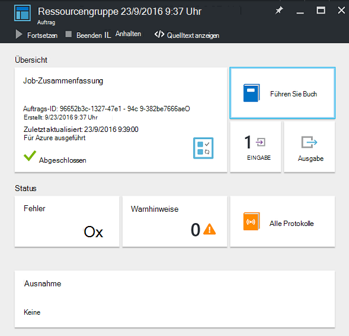
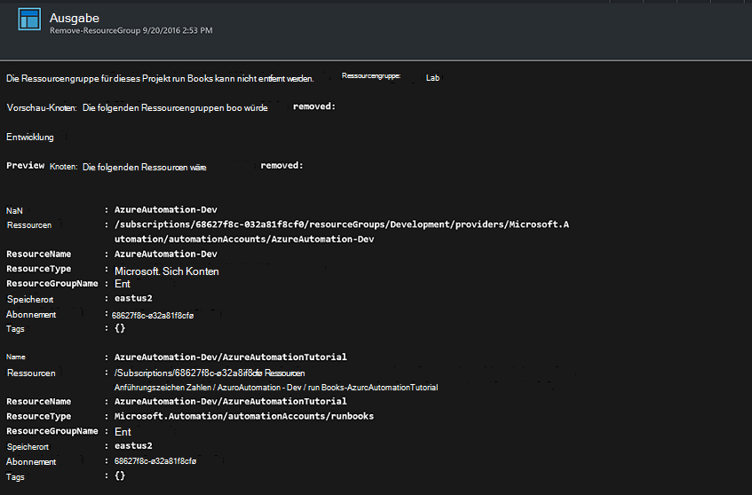

<properties
    pageTitle="Automatisieren von Ressourcengruppen entfernen | Microsoft Azure"
    description="PowerShell Workflowversion ein Azure Automation Szenarios einschließlich Runbooks alle Ressourcengruppen in Ihrem Abonnement entfernen."
    services="automation"
    documentationCenter=""
    authors="MGoedtel"
    manager="jwhit"
    editor=""
    />
<tags
    ms.service="automation"
    ms.workload="tbd"
    ms.tgt_pltfrm="na"
    ms.devlang="na"
    ms.topic="get-started-article"
    ms.date="09/26/2016"
    ms.author="magoedte"/>

# Szenarium für Azure - Automatisierung Entfernen von Ressourcengruppen

Viele Kunden erstellen mehr als eine Ressourcengruppe. Einige für die Verwaltung von Produktion verwendet werden können, und andere als Entwicklungs-, Test- und Stagingumgebungen verwendet werden können. Automatisieren der Bereitstellung dieser Ressourcen ist eine Sache, aber Außerbetriebnahme eine Ressourcengruppe auf der Schaltfläche ist eine andere. Sie können diese managementaufgabe durch Azure Automatisierung optimieren. Dies ist hilfreich, wenn Sie mit einem Azure-Abonnement, das Ausgabenlimit durch einen Member Angebot MSDN oder Microsoft Partner Network Cloud Essentials-Programm arbeiten.

Dieses Szenario basiert auf ein Runbook PowerShell und eine oder mehrere Ressourcengruppen entfernen, die Sie aus Ihrem Abonnement angeben soll. Die Standardeinstellung des Runbooks ist jetzt testen. Dadurch, dass Sie versehentlich Ressourcengruppe nicht löschen, bevor Sie dieses Verfahren ausführen möchten.   

## Abrufen des Szenarios

Dieses Szenario besteht ein Runbook PowerShell, die von [PowerShell Gallery](https://www.powershellgallery.com/packages/Remove-ResourceGroup/1.0/DisplayScript)herunterladen können. Sie können auch direkt aus der [Galerie Runbook](automation-runbook-gallery.md) in Azure-Portal importieren.  

Runbook | Beschreibung|
----------|------------|
ResourceGroup entfernen | Azure Ressourcengruppen und zugehörige Ressourcen entfernt aus dem Abonnement.  
 
Die folgenden Parameter sind für diese Runbooks definiert:

Parameter | Beschreibung|
----------|------------|
NameFilter (erforderlich) | Gibt einen Namensfilter um Ressourcengruppen zu beschränken, die Sie zum löschen möchten. Sie können mehrere Werte mithilfe einer kommagetrennten Liste übergeben. Der Filter wird nicht beachtet und jede Ressourcengruppe mit der Zeichenfolge entspricht.|
PreviewMode (Optional) | Um anzuzeigen welche Ressourcengruppen gelöscht würden Runbook führt jedoch keine Aktion. Der Standardwert ist **true,** um das versehentliche Löschen von einer oder mehreren Ressourcengruppen Runbooks übergeben zu vermeiden.  

## Installieren Sie und konfigurieren Sie dieses Szenario

### Erforderliche Komponenten

Diese Runbooks authentifiziert mit [Azure ausführen als Konto](automation-sec-configure-azure-runas-account.md).    

### Installieren und die Runbooks veröffentlichen

Nach dem Herunterladen des Runbooks können Sie es mithilfe des Verfahrens in [Importieren Runbook Verfahren](automation-creating-importing-runbook.md#importing-a-runbook-from-a-file-into-Azure-Automation)importieren. Nach erfolgreichen berücksichtigt Automatisierung Import veröffentlichen Sie Runbooks.

## Mithilfe des Runbooks

Die folgenden Schritte führen Sie durch die Ausführung dieses Runbook und Sie mit deren Funktionsweise vertraut. Sie nur testet Runbook in diesem Beispiel die Ressourcengruppe nicht löschen.  

1. Azure-Portal eröffnen Sie automatisierungskonto und **Runbooks**auf.
2. Wählen Sie Runbook **ResourceGroup entfernen** , und klicken Sie auf **Start**.
3. Beim Starten des Runbooks Blade **Starten Runbook** öffnet, und konfigurieren Sie die Parameter. Geben Sie die Namen von Ressourcengruppen in Ihrem Abonnement können zum Testen verwenden und keinen Schaden verursachen, wenn versehentlich gelöscht.  

    >[AZURE.NOTE] Stellen Sie sicher, dass **Previewmode** auf **true** festgelegt ist, um zu vermeiden, löschen die ausgewählten Ressourcengruppen.  **Hinweis** Diese Runbooks Ressourcengruppe nicht entfernt, die automatisierungskonto enthält, das diese Runbooks ausgeführt wird.  

4. Nach dem Konfigurieren des Parameters Werte, klicken Sie auf **OK**und Runbooks Ausführung Warteschlange.  

Um die Details des Auftrags Runbook **Entfernen ResourceGroup** im Azure-Portal anzuzeigen, wählen Sie **Aufträge** im Runbook. Job summary zeigt die Eingabeparameter und den Ausgabestream neben allgemeinen Informationen über das Projekt und alle Ausnahmen, die aufgetreten sind.  .

**Job-Zusammenfassung** enthält Nachrichten Ausgabe, Warnung und Fehlerstreams. Wählen Sie **Ausgabe** detaillierte Ergebnisse Runbook Ausführung anzeigen.  

## Nächste Schritte

- Zunächst erstellen eigene Runbook finden Sie unter [Erstellen oder importieren ein Runbook in Azure Automation](automation-creating-importing-runbook.md).
- Zunächst mit PowerShell Workflow Runbooks anzeigen Sie [Meine erste PowerShell Workflow runbook](automation-first-runbook-textual.md)
