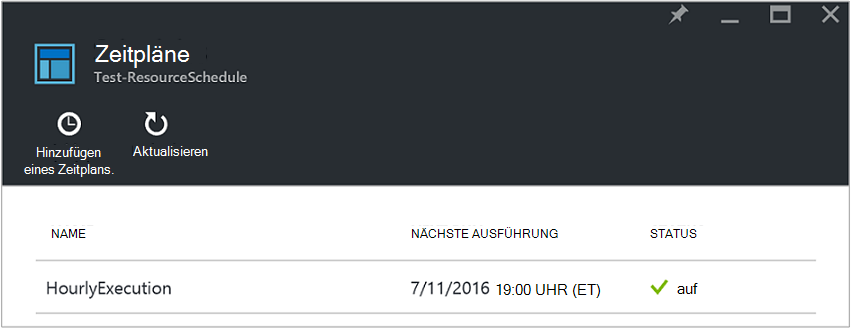
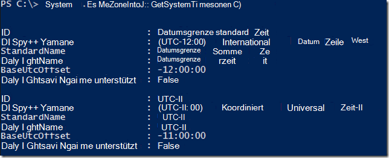
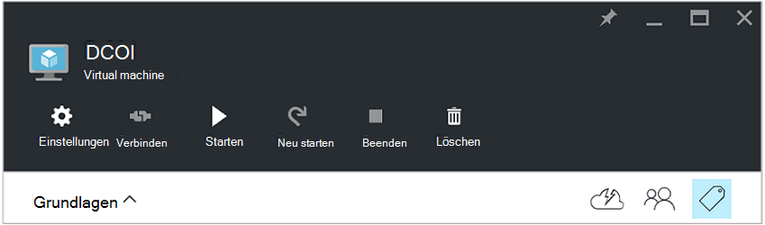
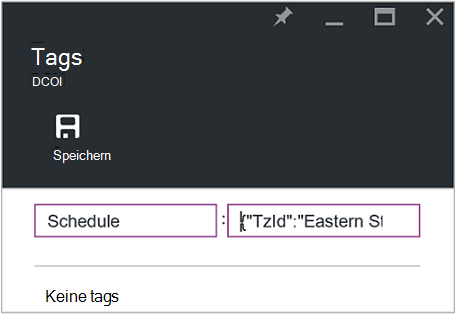
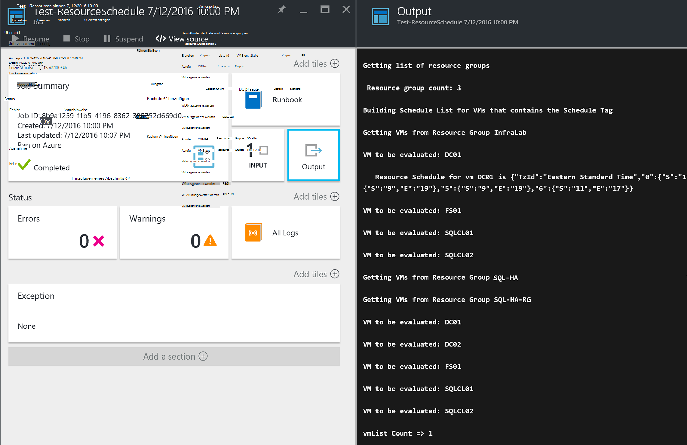

<properties
   pageTitle="Mit JSON-formatierte Tags zum Erstellen eines Zeitplans für Azure VM starten und Herunterfahren | Microsoft Azure"
   description="Dieser Artikel veranschaulicht, wie JSON-Zeichenfolgen in Tags zur Automatisierung der Planung von VM starten und Herunterfahren."
   services="automation"
   documentationCenter=""
   authors="MGoedtel"
   manager="jwhit"
   editor="tysonn" />
<tags
   ms.service="automation"
   ms.devlang="na"
   ms.topic="article"
   ms.tgt_pltfrm="na"
   ms.workload="infrastructure-services"
   ms.date="07/18/2016"
   ms.author="magoedte;paulomarquesc" />

# Szenarium für Azure: mit Tags JSON-Format zum Erstellen eines Zeitplans für Azure VM starten und Herunterfahren

Kunden möchten häufig planen, starten und Herunterfahren von virtuellen Maschinen zur Kostensenkung Abonnement oder geschäftlichen und technischen support.  

Das folgende Szenario ermöglicht automatisierte starten und Herunterfahren der VMs mit einem-Tag aufgerufen bei Ressource Gruppenebene oder auf Ebene der virtuellen Maschinen in Azure einrichten. Dieser Zeitplan kann mit einer Startzeit und Endzeit von Sonntag bis Samstag konfiguriert werden.  

Wir haben einige Optionen. Dazu gehören:
-  Mit skalieren, mit denen Sie skalieren oder [virtuellen Maßstab legt fest](../virtual-machine-scale-sets/virtual-machine-scale-sets-overview.md) .
- [DevTest Labs](../devtest-lab/devtest-lab-overview.md) Service die integrierte Funktion starten und Herunterfahren Vorgänge planen.

Diese Optionen unterstützen jedoch nur bestimmte Szenarien und kann auf VMs Infrastructure-as-a-Service (IaaS) angewendet werden.   

Wenn Tag Planen einer Ressourcengruppe angewendet wird, wird es auch alle virtuellen Computer in der Gruppe angewendet. Wenn ein Zeitplan einer VM auch direkt angewendet wird, Vorrang letzte Zeitplan in der folgenden Reihenfolge:

1.  Planen einer Ressourcengruppe zugewiesen
2.  Planen einer Ressourcengruppe und die virtuellen Computer in der Ressourcengruppe zugewiesen
3.  Planen einer virtuellen Maschine angewendet

Dieses Szenario im Wesentlichen nimmt eine JSON-Zeichenfolge mit einem angegebenen Format und fügt es als Wert für einen Zeitplan aufgerufen. Ein Runbook Listet alle Ressourcengruppen und virtuellen Maschinen und die Zeitpläne für jeden VM basierend auf den oben aufgeführten Szenarien identifiziert. Anschließend durchläuft VMs, die Zeitpläne zugeordnet und ausgewertet wird, welche Aktion ausgeführt werden soll. Beispielsweise bestimmt die VMs angehalten, beendet oder ignoriert.

Diese Runbooks authentifizieren mit [Azure ausführen als Konto](../automation/automation-sec-configure-azure-runas-account.md).

## Herunterladen der Runbooks Szenario

Dieses Szenario besteht aus vier PowerShell Workflow Runbooks, die [TechNet Gallery](https://gallery.technet.microsoft.com/Azure-Automation-Runbooks-84f0efc7) oder [GitHub](https://github.com/paulomarquesdacosta/azure-automation-scheduled-shutdown-and-startup) Repository für dieses Projekt herunterladen können.

Runbook | Beschreibung
----------|----------
Test-ResourceSchedule | Überprüft jeden virtuellen Computer planen und führt Herunterfahren oder starten je nach Zeitplan.
Hinzufügen ResourceSchedule | Ein virtueller Computer oder eine Ressourcengruppe aus hinzugefügt Tag Zeitplan.
ResourceSchedule aktualisieren | Ändert das vorhandene Zeitplan Tag durch eine neue ersetzen.
ResourceSchedule entfernen | Entfernt das Zeitplan-Tag von VM oder Ressource.

## Installieren Sie und konfigurieren Sie dieses Szenario

### Installieren und die Runbooks veröffentlichen

Nach dem Herunterladen der Runbooks, können Sie sie mithilfe des Verfahrens in [Erstellen oder importieren ein Runbook in Azure Automation](automation-creating-importing-runbook.md#importing-a-runbook-from-a-file-into-Azure-Automation)importieren.  Veröffentlichen Sie jedes Runbook nach erfolgreichen berücksichtigt Automatisierung Import.

### Der Test ResourceSchedule Runbook Zeitplan hinzufügen

Gehen des Zeitplans für die Tests ResourceSchedule Runbook aktivieren. Dies ist Runbooks, mit dem überprüft wird, welche virtuellen Computer sollten gestartet, beendet oder unverändert.

1. Azure-Portal öffnen Sie Kontos Automatisierung und klicken Sie auf die Kachel **Runbooks** .
2. Klicken Sie auf **Test-ResourceSchedule** Blade **Zeitpläne** .
3. Das Blade **Zeitpläne** klicken Sie auf **Zeitplan hinzufügen**.
4. Klicken Sie auf dem Blatt **Zeitpläne** **Ihre Runbook geplant**. Wählen Sie **einen neuen Zeitplan erstellen**.
5.  Auf den **Terminplan** , geben Sie diesen Zeitplan z. B.: *HourlyExecution*.
6. Legen Sie für die Planung **Starten**den Zeitpunkt auf eine Stunde.
7. Wählen Sie **Wiederholung**, und wählen Sie für **jedes Intervall wiederholt**, **1 Stunde**.
8. Überprüfen Sie **festgelegtes Ablaufdatum** auf **Nein**festgelegt ist, und klicken Sie auf **Erstellen** , um Ihrem Terminplan speichern.
9. Wählen Sie Optionen **Zeitplan Runbook** -Blade **Parameter und Ausführung**. Das Blade Test ResourceSchedule **Parameter** Geben Sie den Namen Ihres Abonnements im Feld **SubscriptionName** .  Dies ist der einzige Parameter für Runbooks erforderlich ist.  Wenn Sie fertig sind, klicken Sie auf **OK**.  

Runbook Zeitplan sollte nach Abschluss wie folgt aussehen:

 

## Die JSON-Zeichenfolge formatieren

Diese Lösung bezeichnet grundsätzlich nimmt eine JSON Zeichenfolge mit einem angegebenen Format und fügt sie als Wert für einen Zeitplan Ein Runbook Listet alle Ressourcengruppen und virtuellen Maschinen und die Zeitpläne für jeden virtuellen Computer identifiziert.

Runbooks durchläuft den virtuellen Computern, die Zeitpläne zugeordnet und prüft, welche Maßnahmen ergriffen werden. Folgendes ist ein Beispiel für die Formatierung der Lösung:

    {
       "TzId": "Eastern Standard Time",
        "0": {  
           "S": "11",
           "E": "17"
        },
        "1": {
           "S": "9",
           "E": "19"
        },
        "2": {
           "S": "9",
           "E": "19"
        },
    }

Hier finden einige Informationen über diese Struktur:

1. Das Format dieser Struktur JSON optimiert 256 Zeichen maximal einen einzigen Tagwert in Azure umgehen.

2. *TZID-Wert* ist die Zeitzone des virtuellen Computers. Diese ID erhalten .NET TimeZoneInfo-Klasse in einem PowerShell-Sitzung mit**[System.TimeZoneInfo]: GetSystemTimeZones()**.

    

    - Wochentage werden mit einem numerischen Wert 0 auf 6 dargestellt. Der Wert 0 entspricht Sonntag.
    - Die Startzeit wird mit dem **S** -Attribut und sein Wert ist im 24-Stunden-Format.
    - Uhrzeit Ende oder Herunterfahren wird mit dem Attribut **E** und sein Wert ist im 24-Stunden-Format.

    Verfügt über die Attribute **S** und **E** Wert NULL (0), den virtuellen Computer in seinem gegenwärtigen Zustand zum Zeitpunkt der Bewertung bleibt.   

3. Wenn Sie Bewertung für einen bestimmten Tag der Woche überspringen möchten, fügen Sie keinen Abschnitt für den Tag der Woche hinzu. Im folgenden Beispiel nur Montag ausgewertet, und die anderen Wochentage werden ignoriert:

        {
          "TzId": "Eastern Standard Time",
           "1": {
             "S": "11",
             "E": "17"
           }
        }

## Tag-Ressourcengruppen oder VMs

Zum Herunterfahren der VMs müssen Sie tag VMs oder Ressourcengruppen, in denen sie sich befinden. Virtuelle Computer, die ein Zeitplan Tag werden nicht ausgewertet. Sie sind nicht deshalb gestartet oder heruntergefahren.

Zweierlei Tag Ressourcengruppen oder VMs mit dieser Lösung. Sie können dies direkt vom Portal aus tun. Oder Sie können ResourceSchedule hinzufügen, ResourceSchedule aktualisieren und entfernen ResourceSchedule Runbooks.

### Über das Portal Tag

Gehen einer virtuellen Maschine oder Ressource im Portal tag

1. Reduzieren die JSON-Zeichenfolge, und stellen Sie sicher, dass sich keine Leerzeichen.  Eine JSON-Zeichenfolge sollte wie folgt aussehen:

        {"TzId":"Eastern Standard Time","0":{"S":"11","E":"17"},"1":{"S":"9","E":"19"},"2": {"S":"9","E":"19"},"3":{"S":"9","E":"19"},"4":{"S":"9","E":"19"},"5":{"S":"9","E":"19"},"6":{"S":"11","E":"17"}}

2. Wählen Sie das **Tag** -Symbol für eine VM oder Ressource diesen Zeitplan angewendet.

    
3. Tags werden folgende Schlüssel-Wert-Paar definiert. Geben Sie im **Feld** **Plan** und fügen Sie die JSON-Zeichenfolge in das Feld **Wert** . Klicken Sie auf **Speichern**. Neue Tag erscheint jetzt in der Liste der Tags für die Ressource.

### Tag von PowerShell

Alle importierten Runbooks enthalten Hilfeinformationen zu Beginn des Skripts, das beschreibt, wie die Runbooks direkt von PowerShell ausgeführt. Sie können Runbooks hinzufügen ScheduleResource und Update-ScheduleResource von PowerShell aufrufen. Dazu übergeben erforderliche Parameter, mit denen Sie beim Erstellen oder Aktualisieren des Zeitplan Tags auf einen virtuellen Computer oder eine Ressource außerhalb des Portals.  

Erstellen, hinzufügen und Löschen von Tags über PowerShell, müssen Sie zunächst [die PowerShell-Umgebung für Azure einrichten](../powershell-install-configure.md). Nach Abschluss die Installation können Sie mit den folgenden Schritten fortfahren.

### Erstellen Sie ein Tag Zeitplan mit PowerShell

1. Öffnen Sie eine PowerShell-Sitzung. Verwenden Sie im folgende Beispiel dann mit Ausführen als Konto authentifiziert und ein Abonnement:   

        Conn = Get-AutomationConnection -Name AzureRunAsConnection
        Add-AzureRMAccount -ServicePrincipal -Tenant $Conn.TenantID `
        -ApplicationId $Conn.ApplicationID -CertificateThumbprint $Conn.CertificateThumbprint
        Select-AzureRmSubscription -SubscriptionName "MySubscription"

2. Definieren einer Hashtabelle planen. Hier ist ein Beispiel, wie diese erstellt werden soll:

        $schedule= @{ "TzId"="Eastern Standard Time"; "0"= @{"S"="11";"E"="17"};"1"= @{"S"="9";"E"="19"};"2"= @{"S"="9";"E"="19"};"3"= @{"S"="9";"E"="19"};"4"= @{"S"="9";"E"="19"};"5"= @{"S"="9";"E"="19"};"6"= @{"S"="11";"E"="17"}}

3. Definieren Sie die Parameter, die Runbooks erforderlich sind. Im folgenden Beispiel Zielen wir einen virtuellen Computer:

        $params = @{"SubscriptionName"="MySubscription";"ResourceGroupName"="ResourceGroup01"; `
        "VmName"="VM01";"Schedule"=$schedule}

    Wenn Sie eine Ressourcengruppe tagging, entfernen Sie *VMName* Parameter $params Hash-Tabelle wie folgt:

        $params = @{"SubscriptionName"="MySubscription";"ResourceGroupName"="ResourceGroup01"; `
        "Schedule"=$schedule}

4. Führen Sie Runbook hinzufügen ResourceSchedule mit den folgenden Parametern Tag Zeitplan erstellen:

        Start-AzureRmAutomationRunbook -Name "Add-ResourceSchedule" -Parameters $params `
        -AutomationAccountName "AutomationAccount" -ResourceGroupName "ResourceGroup01"

5. Führen Sie zum Aktualisieren einer Ressourcengruppe oder virtuellen Tag Runbook **Update-ResourceSchedule** mit den folgenden Parametern:

        Start-AzureRmAutomationRunbook -Name "Update-ResourceSchedule" -Parameters $params `
        -AutomationAccountName "AutomationAccount" -ResourceGroupName "ResourceGroup01"

### Ein Zeitplan Tag mit PowerShell entfernen

1. PowerShell-Sitzung öffnen und Folgendes ausführen als Konto authentifiziert und wählen und geben Sie ein Abonnement ausführen:

        Conn = Get-AutomationConnection -Name AzureRunAsConnection
        Add-AzureRMAccount -ServicePrincipal -Tenant $Conn.TenantID `
        -ApplicationId $Conn.ApplicationID -CertificateThumbprint $Conn.CertificateThumbprint
        Select-AzureRmSubscription -SubscriptionName "MySubscription"

2. Definieren Sie die Parameter, die Runbooks erforderlich sind. Im folgenden Beispiel Zielen wir einen virtuellen Computer:

        $params = @{"SubscriptionName"="MySubscription";"ResourceGroupName"="ResourceGroup01" `
        ;"VmName"="VM01"}

    Wenn Sie einen Tag aus einer Ressourcengruppe entfernen möchten, entfernen Sie den *VMName* Parameter aus der Hashtabelle $params wie folgt:

        $params = @{"SubscriptionName"="MySubscription";"ResourceGroupName"="ResourceGroup01"}

3. Führen Sie ResourceSchedule entfernen Runbook um Ablaufplan Tag zu entfernen:

        Start-AzureRmAutomationRunbook -Name "Remove-ResourceSchedule" -Parameters $params `
        -AutomationAccountName "AutomationAccount" -ResourceGroupName "ResourceGroup01"

4. Um eine Ressourcengruppe oder virtuellen Tag aktualisieren, führen Sie Runbook entfernen ResourceSchedule mit den folgenden Parametern:

        Start-AzureRmAutomationRunbook -Name "Remove-ResourceSchedule" -Parameters $params `
        -AutomationAccountName "AutomationAccount" -ResourceGroupName "ResourceGroup01"

>[AZURE.NOTE] Wir empfehlen Sie proaktiv diese Runbooks (und den Zuständen), um sicherzustellen, dass die virtuellen Computer heruntergefahren werden Sie überwachen und entsprechend.  

Um die Details des Auftrags Runbook Test ResourceSchedule im Azure-Portal anzuzeigen, wählen Sie **Aufträge** Kachel des Runbooks. Job summary zeigt Eingabeparameter und Ausgabestreams neben allgemeinen Informationen über das Projekt und alle Ausnahmen Wenn sie aufgetreten ist.  

**Job-Zusammenfassung** enthält Nachrichten Ausgabe, Warnung und Fehlerstreams. Wählen Sie **die Ausgabekachel detaillierte Ergebnisse Runbook Ausführung anzeigen** .

  

## Nächste Schritte

-  Zunächst mit PowerShell Workflow Runbooks anzeigen Sie [Meine erste PowerShell Workflow runbook](automation-first-runbook-textual.md)
-  Erfahren Sie mehr über Runbook-Typen und ihre vor- und Nachteile finden Sie unter [Azure Runbook Automatisierungstypen](automation-runbook-types.md).
-  Weitere Informationen zu PowerShell-Skript Features unterstützt, finden Sie [in Azure Automation unterstützt Native PowerShell-Skript](https://azure.microsoft.com/blog/announcing-powershell-script-support-azure-automation-2/).
-  Erfahren Sie mehr über Runbook Protokollierung und Ausgabe finden Sie unter [Runbook Ausgabe und Nachrichten in Azure Automation](automation-runbook-output-and-messages.md).
-  Erfahren Sie mehr über Azure ausführen als Konto und Ihre Runbooks mit Authentifizierung anzeigen Sie [authentifizieren Runbooks mit Azure ausführen als Konto](../automation/automation-sec-configure-azure-runas-account.md)
