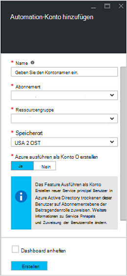
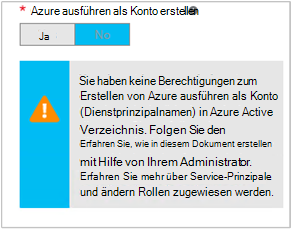

<properties
   pageTitle="Azure AD-Benutzerkonto konfigurieren | Microsoft Azure"
   description="Dieser Artikel beschreibt das Konfigurieren von Azure AD-Benutzer Anmeldeinformationen für Runbooks in Azure Automation ARM und ASM authentifizieren."
   services="automation"
   documentationCenter=""
   authors="MGoedtel"
   manager="jwhit"
   editor="tysonn"
   keywords="Azure active Directory Benutzer Azure Service Management, Azure Ad-Benutzerkonto" />
<tags
   ms.service="automation"
   ms.devlang="na"
   ms.topic="get-started-article"
   ms.tgt_pltfrm="na"
   ms.workload="infrastructure-services"
   ms.date="09/12/2016"
   ms.author="magoedte" />

# Authentifizieren von Runbooks Azure Servicemanagement und Ressourcenmanager

Dieser Artikel beschreibt die Schritte, die Sie ausführen müssen, um ein Azure AD-Benutzerkonto für Azure Automatisierung Runbooks gegen Azure Service Management (ASM) oder Azure Resource Manager (ARM) Ressourcen konfigurieren.  Dies ist eine unterstützte Authentifizierungsidentität für Ihre ARM Runbooks basierend weiterhin die empfohlene Methode neue Azure ausführen als Konto verwendet.       

## Erstellen eines neuen Azure Active Directory

1. Melden Sie sich Azure-Verwaltungsportal als Dienstadministrator für Azure-Abonnement zu verwalten.
2. Wählen Sie **Active Directory**, und wählen Sie den Namen des Verzeichnisses Organisation.
3. Wählen Sie die Registerkarte **Benutzer** , und wählen Sie dann im Feld Befehl **Benutzer hinzufügen**.
4. Wählen Sie auf der Seite **Erzählen über diese Benutzer** unter **Benutzer** **neue Benutzer in Ihrer Organisation**.
5. Geben Sie einen Benutzernamen ein.  
6. Wählen Sie den Verzeichnisnamen der Azure-Abonnement auf Active Directory zugeordnet ist.
7. Bieten Sie auf der Seite **Benutzerprofil** einen ersten und letzten Namen einen benutzerfreundlichen Namen und Benutzer aus der Liste **Rollen** .  Führen Sie keine **mehrstufige Authentifizierung zu aktivieren**.
8. Beachten Sie vollständigen Namen des Benutzers und dem temporären Kennwort.
9. Wählen Sie **Settings > Administratoren > Hinzufügen**.
10. Geben Sie den vollständigen Benutzernamen des Benutzers, den Sie erstellt haben.
11. Wählen Sie das Abonnement den Benutzer verwalten.
12. Azure melden Sie, und melden Sie sich mit dem Konto, das Sie gerade erstellt haben. Sie werden aufgefordert, das Kennwort des Benutzers ändern.

## Erstellen eines Kontos Automatisierung in Azure-Verwaltungsportal
In diesem Abschnitt führen Sie die folgenden Schritte aus, um ein neues Konto Azure Automation in Azure-Portal erstellen, die mit der Verwaltung von Ressourcen im ASM und ARM Runbooks.  

>[AZURE.NOTE] Erstellte automatisierungskonten mit den Azure-Verwaltungsportal verwaltet Sie Azure klassischen Azure-Portal und eine Reihe von Cmdlets. Sobald das Konto erstellt wurde, macht es keinen Unterschied wie erstellen und Verwalten des Kontos. Wenn Sie den Azure-Verwaltungsportal verwenden, sollten Sie es statt der Azure-Portal verwenden automatisierungskonten erstellen.

1. Melden Sie sich Azure-Verwaltungsportal als Dienstadministrator für Azure-Abonnement zu verwalten.
2. Aktivieren Sie **Automatisierung**.
3. Wählen Sie auf der Seite **Automatisierung** **Automatisierungskonto erstellen**.
4. Geben Sie im Feld **Konto Automatisierung erstellen** einen Namen für das neue Konto Automatisierung und wählen Sie eine **Region** aus der Dropdown-Liste.  
5. Klicken Sie auf **OK** , um Ihre übernehmen und das Konto zu erstellen.
6. Nach der Erstellung wird es auf **Automatisierung** aufgeführt.
7. Klicken Sie auf das Konto, und sie gelangen Sie zu der Seite Dashboard.  
8. Wählen Sie auf der Seite Automatisierung Dashboard **Anlagen**.
9. Wählen Sie auf der Seite **Ressourcen** unten auf der Seite **Einstellungen hinzufügen** .
10. Wählen Sie auf der Seite **Einstellungen hinzufügen** **Anmeldeinformationen hinzufügen**.
11. Wählen Sie auf der Seite **Anmeldeinformationen definieren** aus der Dropdownliste **Anmeldeinformationstyp** **Windows PowerShell Anmeldeinformationen** , und geben Sie einen Namen für die Anmeldeinformationen.
12. Der folgende **Definieren** Seite Anmeldeinformationstyp in der Benutzername des AD-Benutzerkontos erstellt in das Feld **Benutzername** und das Kennwort in den Feldern **Kennwort** und **Kennwort bestätigen** . Klicken Sie auf **OK** , um die Änderungen zu speichern.

## Automatisierung im Azure-Portal registrieren

In diesem Abschnitt führen Sie die folgenden Schritte aus, um ein neues Azure Automation Konto in Azure-Portal erstellen, die mit Ihren Runbooks Verwalten von Ressourcen im ARM-Modus verwendet werden.  

1. Melden Sie sich zum Azure-Portal als Dienstadministrator für Azure-Abonnement zu verwalten.
2. **Automation-Konten**auswählen
3. Blade-Automatisierungskonten klicken Sie auf **Hinzufügen**. 
2. Blatt **Automatisierungskonto hinzufügen** im Feld **Name** einen Namen für das neue Konto Automatisierung.
5. Haben Sie mehrere Abonnements Geben Sie für das neue Konto und einer neuen oder vorhandenen **Ressourcengruppe** sowie eine Azure-Rechenzentrum **Speicherort an**
3. Wählen Sie den Wert **Nein** für die Option **Erstellen Azure ausführen als Konto** , und klicken Sie auf die Schaltfläche **Erstellen** .  

    >[AZURE.NOTE] Wenn Sie nicht das Konto ausführen als die Option **Nein**erstellen möchten, wird eine Warnung im Blade- **Automatisierung-Konto hinzufügen** angezeigt.  Während das Konto erstellt und **der Beitragendenrolle im Abonnement** zugewiesen, muss sie keinen entsprechenden Authentifizierungsidentität Verzeichnisdienst Abonnements und daher keinen Zugriff auf Ressourcen in Ihrem Abonnement.  Dadurch werden alle Runbooks auf dieses Konto zu authentifizieren und Aufgaben mit ARM-Ressourcen.

    

4. Azure Automation-Konto erstellt, können Sie den Fortschritt unter **Benachrichtigungen** Menü verfolgen.

Nach Abschluss die Erstellung der Anmeldeinformationen müssen Sie dann erstellen Sie eine Anlage Anmeldeinformationen zuvor erstellten AD-Benutzerkontos Automation-Konto zuordnen.  Beachten Sie, dass wir nur das Automation-Konto erstellt und keine Authentifizierungsidentität zugeordnet ist.  [Anmeldeinformationen Anlagen in Azure Automation-Artikel](../automation/automation-credentials.md#creating-a-new-credential) beschriebenen Schritte führen Sie aus, und geben Sie den Wert für **Benutzernamen** im Format **Domäne\Benutzer**.

## Verwenden Sie die Anmeldeinformationen in ein runbook

Sie können die Anmeldeinformationen in ein Runbook mithilfe der [Get-AutomationPSCredential](http://msdn.microsoft.com/library/dn940015.aspx) -Aktivität abrufen und mit [Add-AzureAccount](http://msdn.microsoft.com/library/azure/dn722528.aspx) für die Verbindung zu Ihrem Azure-Abonnement verwenden. Wenn [Select AzureSubscription](http://msdn.microsoft.com/library/dn495203.aspx) verwenden werden soll, an der die Anmeldeinformationen Administrator mehrere Azure-Abonnements ist. Das Beispiel unten Windows PowerShell zeigt, der normalerweise am Anfang der meisten Azure Automatisierung Runbooks angezeigt wird.

    $cred = Get-AutomationPSCredential –Name "myuseraccount.onmicrosoft.com"
    Add-AzureAccount –Credential $cred
    Select-AzureSubscription –SubscriptionName "My Subscription"

Sie sollten diese Zeilen in Ihr Runbook nach alle [Prüfpunkte](http://technet.microsoft.com/library/dn469257.aspx#bk_Checkpoints) wiederholen. Runbook angehalten wird, wird auf einer anderen Arbeitskraft müssen sie die Authentifizierung durchführen.

## Nächste Schritte
* Die verschiedenen Runbook Typen und Schritte zum Erstellen eigener Runbooks aus folgendem Artikel [Azure Runbook Automatisierungstypen](../automation/automation-runbook-types.md)
