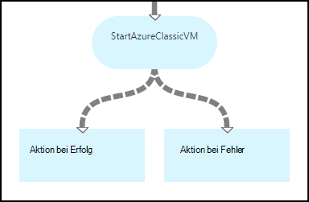
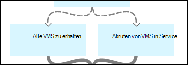
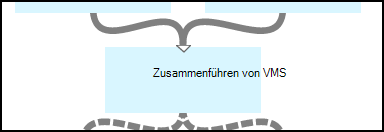
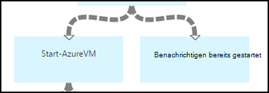
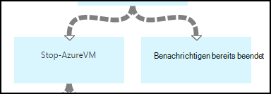
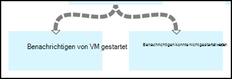
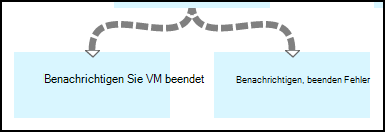

<properties 
    pageTitle="Starten und Beenden von virtuellen Maschinen - Diagramm | Microsoft Azure"
    description="PowerShell Workflowversion Azure Automation Szenarios einschließlich Runbooks starten und stoppen classic virtuelle Computer."
    services="automation"
    documentationCenter=""
    authors="mgoedtel"
    manager="jwhit"
    editor="tysonn" />
<tags 
    ms.service="automation"
    ms.devlang="na"
    ms.topic="article"
    ms.tgt_pltfrm="na"
    ms.workload="infrastructure-services"
    ms.date="07/06/2016"
    ms.author="bwren" />

# Azure Szenarium - starten und Beenden von virtuellen Maschinen

Dieses Szenarium Azure enthält Runbooks starten und stoppen classic virtuelle Computer.  Dieses Szenario können Sie für Folgendes:  

- Verwenden Sie die Runbooks unverändert in Ihrer eigenen Umgebung. 
- Ändern Sie Runbooks benutzerdefinierte Funktionen ausführen.  
- Rufen Sie die Runbooks anderen Runbook als Teil einer Lösung. 
- Die Runbooks als Lernprogramme Runbook authoring Konzepte zu verwenden. 

> [AZURE.SELECTOR]
- [Grafik](automation-solution-startstopvm-graphical.md)
- [PowerShell-Workflow](automation-solution-startstopvm-psworkflow.md)

Dies ist die Grafik Runbook Version dieses Szenarios. Es ist auch über [PowerShell Workflow Runbooks](automation-solution-startstopvm-psworkflow.md).

## Abrufen des Szenarios

Dieses Szenario besteht aus zwei grafisch Runbooks, die Sie unter den folgenden Links downloaden.  [PowerShell Workflow Version](automation-solution-startstopvm-psworkflow.md) dieses Szenarios Links zu PowerShell Workflow Runbooks angezeigt.

| Runbook | Link | Typ | Beschreibung |
|:---|:---|:---|:---|
| StartAzureClassicVM | [Grafisch Runbook Azure klassische VM starten](https://gallery.technet.microsoft.com/scriptcenter/Start-Azure-Classic-VM-c6067b3d) | Grafik | Startet alle klassischen virtuellen Computer in Azure-Abonnement oder alle virtuellen Computer mit einem bestimmten Namen. |
| StopAzureClassicVM | [Azure klassische VM grafisch Runbook beenden](https://gallery.technet.microsoft.com/scriptcenter/Stop-Azure-Classic-VM-397819bd) | Grafik | Beendet alle virtuellen Computer in Automation-Konto oder alle virtuellen Computer mit einem bestimmten Namen.  |

## Installieren und Konfigurieren des Szenarios

### 1. installieren Sie 1. die runbooks

Nach dem Herunterladen der Runbooks, können Sie mit dem Verfahren [grafisch Runbook](automation-graphical-authoring-intro.md#graphical-runbook-procedures)Verfahren importieren.

### 2. Überprüfen Sie die Beschreibung und
Die Runbooks enthalten eine Aktivität namens **Infodatei** , die Beschreibung und erforderlichen Ressourcen enthält.  Indem die **Read Me** -Aktivität und **Workflow** Skriptparameter können Sie diese Informationen anzeigen.  Sie können auch Informationen aus diesem Artikel abrufen. 

### 3. konfigurieren Sie Anlagen
Die Runbooks erfordern die folgenden Ressourcen, die Sie erstellen und mit den entsprechenden Werten füllen.  Die Namen sind.  Sie können Assets mit unterschiedlichen Namen beim start Runbooks Namen [Eingabeparameter](#using-the-runbooks) angeben.

| Asset-Typ | Standardnamen | Beschreibung |
|:---|:---|:---|:---|
| [Anmeldeinformationen](automation-credentials.md) | AzureCredential | Enthält die Anmeldeinformationen für ein Konto mit Berechtigungen zum Starten und Beenden der virtuellen Computer in der Azure-Abonnement.  |
| [Variable](automation-variables.md) | AzureSubscriptionId | Enthält die Abonnement-ID der Azure-Abonnement. |

## Verwenden des Szenarios

### Parameter

Die Runbooks haben die folgenden [Parameter](automation-starting-a-runbook.md#runbook-parameters).  Sie können müssen Werte für alle erforderlichen Parameter angeben und optional Werte für die anderen Parameter je nach Bedarf.

| Parameter | Typ | Obligatorisch | Beschreibung |
|:---|:---|:---|:---|
| ServiceName | Zeichenfolge | Nein | Wenn ein Wert angegeben ist, werden alle virtuellen Computer mit diesem Dienstnamen gestartet oder angehalten.  Wenn kein Wert angegeben ist, werden alle klassischen virtuellen Computer in der Azure-Abonnement gestartet oder angehalten. |
| AzureSubscriptionIdAssetName | Zeichenfolge | Nein | Enthält den Namen der [Variable Anlage](#installing-and-configuring-the-scenario) mit der Abonnement-ID Ihres Azure-Abonnements.  Wenn Sie keinen Wert angeben, wird *AzureSubscriptionId* verwendet.  |
| AzureCredentialAssetName | Zeichenfolge | Nein | Enthält den Namen der [Anlage Anmeldeinformationen](#installing-and-configuring-the-scenario) , die Anmeldeinformationen für das Runbook verwendet enthält.  Wenn Sie keinen Wert angeben, wird *AzureCredential* verwendet.  |

### Die Runbooks starten

Eine der Methoden können starten [ein Runbook in Azure Automation](automation-starting-a-runbook.md) Sie entweder die Runbooks in diesem Artikel starten.

Die folgenden Beispielbefehle verwendet Windows PowerShell ausführen **StartAzureClassicVM** starten Sie alle virtuellen Computer mit den Namen *MyVMService*.

    $params = @{"ServiceName"="MyVMService"}
    Start-AzureAutomationRunbook –AutomationAccountName "MyAutomationAccount" –Name "StartAzureClassicVM" –Parameters $params

### Ausgabe

Die Runbooks wird [eine Meldung](automation-runbook-output-and-messages.md) für jeden virtuellen Computer, der angibt, ob die Start oder Stop-Anweisung erfolgreich gesendet wurde.  Sie können nach einer bestimmten Zeichenfolge in die Ausgabe das Ergebnis für jedes Runbook bestimmen suchen.  Ausgabe-Zeichenfolgen werden in der folgenden Tabelle aufgeführt.

| Runbook | Bedingung | Nachricht |
|:---|:---|:---|
| StartAzureClassicVM | Virtuelle Computer wird bereits ausgeführt.  | MyVM wird bereits ausgeführt. |
| StartAzureClassicVM | Start-Anforderung für den virtuellen Computer erfolgreich gesendet | "MyVM" wurde gestartet |
| StartAzureClassicVM | Fehler bei Anforderung für den virtuellen Computer starten  | "MyVM" konnte nicht gestartet werden |
| StopAzureClassicVM | Virtuelle Computer wird bereits ausgeführt.  | "MyVM" wurde bereits beendet. |
| StopAzureClassicVM | Start-Anforderung für den virtuellen Computer erfolgreich gesendet | "MyVM" wurde gestartet |
| StopAzureClassicVM | Fehler bei Anforderung für den virtuellen Computer starten  | "MyVM" konnte nicht gestartet werden |

Folgendes ist ein Bild mit **StartAzureClassicVM** als eine [untergeordnete Runbook](automation-child-runbooks.md) in ein Beispiel grafisch Runbook.  Der bedingte Hyperlinks wird in der folgenden Tabelle verwendet.

| Link | Kriterien |
|:---|:---|
| Erfolgreiche Verbindung | $ActivityOutput [StartAzureClassicVM]-wie "\* wurde gestartet"    |
| Fehler beim Verknüpfen   | $ActivityOutput [StartAzureClassicVM]-ganzanders "\* wurde gestartet" |

## Detaillierte Aufschlüsselung

Es folgt eine detaillierte Aufschlüsselung der Runbooks in diesem Szenario.  Diese Informationen können Sie die Runbooks anpassen oder nur von ihnen Informationen zum Erstellen eigener Szenarios für die Automatisierung.
 

### Authentifizierung

Runbooks beginnt mit den [Anmeldeinformationen](automation-configuring.md#configuring-authentication-to-azure-resources) und Azure-Abonnement für den Rest des Runbooks verwendet werden.

Die ersten beiden Aktivitäten **Abonnement-Id erhalten** und **Azure-Anmeldeinformationen zu erhalten**, rufen [Vermögenswerte](#installing-the-runbook) , die von den beiden Aktivitäten verwendet werden.  Aktivitäten können die Anlagen direkt angeben, aber sie brauchen die Elementnamen.  Da wir den Benutzer an die Namen der [Eingabeparameter](#using-the-runbooks)ermöglichen, benötigen wir diese Aktivitäten Vermögenswerte mit einem Eingabeparameter angegebenen Namen abzurufen.

**Hinzufügen AzureAccount** legt die Anmeldeinformationen für den Rest des Runbooks.  Anmeldeinformationen-Anlage, die von **Azure-Anmeldeinformationen erhalten** abruft benötigen Zugriff zum Starten und Beenden der virtuellen Computer in der Azure-Abonnement.  Die Abonnement-Id von **Get Abonnement**verwendet wird **Wählen AzureSubscription** das Abonnement verwendet wird ausgewählt.

### Abrufen von virtuellen Maschinen

Das Runbook muss bestimmen, welche virtuellen Computer mit arbeitet und bereits gestartet oder (je nach Runbook gestoppt).   Zwei Aktivitäten werden die VMs abgerufen.  **Get VMs im Dienst** wird ausgeführt, wenn der *ServiceName* Eingabeparameter für Runbooks einen Wert enthält.  **Alle VMs** wird ausgeführt, wenn der *Dienstname* Eingabeparameter für Runbooks keinen Wert enthalten.  Diese Logik wird von bedingten Links vor jeder Aktivität ausgeführt.

Beides verwenden Sie das Cmdlet " **Get-AzureVM** ".  **Alle VMs** verwendet den **ListAllVMs** -Parameter festgelegt, dass alle virtuellen Computer zurückgegeben.  **Erhalten VMs in Service** verwendet die **GetVMByServiceAndVMName** Parameter und Parameter **ServiceName** **ServiceName** Eingabeparameter bereit.  

### Zusammenführen von VMs

Die **VMs Zusammenführen** Aktivität ist verpflichtet zu **Beginn AzureVM** Eingabe der Namen und Dienstnamen Unterbrechung zu.  Diese Eingabe ist **Alle VMs** oder **VMs in Service erhalten**, aber **Start-AzureVM** können nur eine Aktivität für die Eingabe.   

Das Szenario ist die Erstellung von **VMs Zusammenführen** führt das Cmdlet " **Write-Output** ".  Der **Eingabeobjekt** Parameter für dieses Cmdlet ist ein PowerShell-Ausdruck, der die Eingabe der vorherigen zwei Aktivitäten kombiniert.  Nur eine dieser Aktivitäten wird ausgeführt, nur eine Ausgabe erwartet wird.  **Start-AzureVM** können für seine Eingabeparameter Ausgabe. 

### Virtuelle Maschinen starten/beenden

 

Je nach Runbook versuchen die nächsten Aktivitäten starten oder Beenden von Runbooks mit **AzureVM Start** oder **Stop-AzureVM**.  Da die Aktivität eine pipelineverknüpfung steht, wird für jedes **Zusammenführen VMs**zurückgegebenes Objekt einmal ausgeführt.  Die Verknüpfung ist bedingte Aktivität nur ausgeführt wird, ist die *RunningState* des virtuellen Computers *beendet* für **AzureVM starten** und *Schritte* für **Stop AzureVM**. Wenn diese Bedingung nicht erfüllt, ist **Bereits benachrichtigen** oder **Benachrichtigen bereits beendet** führen zum Senden einer Nachricht mithilfe von **Write-Output**.

### Ausgabe

 

Der letzte Schritt im Runbook wird zur Ausgabe, ob die Anforderung starten oder beenden, für jeden virtuellen Computer erfolgreich gesendet wurde. Gibt es eine Separate Aktivität **Write-Output** , und wir einen bedingten Links führen.  **Benachrichtigen VM gestartet** oder **Benachrichtigen VM angehalten** wird ausgeführt, wenn *OperationStatus* *erfolgreich*ist.  Wenn *OperationStatus* ein anderer Wert ist, wird **Benachrichtigt starten Fehler** oder **Stop nicht benachrichtigen** ausgeführt.

## Nächste Schritte

- [Grafisch in Azure Automation erstellen](automation-graphical-authoring-intro.md)
- [Untergeordnete Runbooks in Azure Automation](automation-child-runbooks.md) 
- [Runbook Ausgabe und Nachrichten in Azure Automation](automation-runbook-output-and-messages.md)