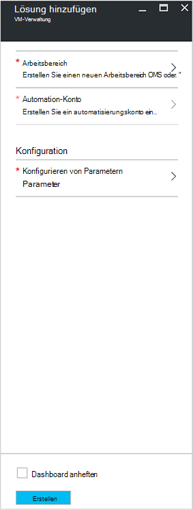
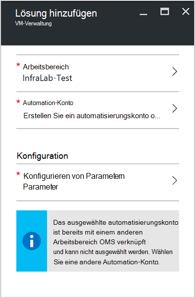
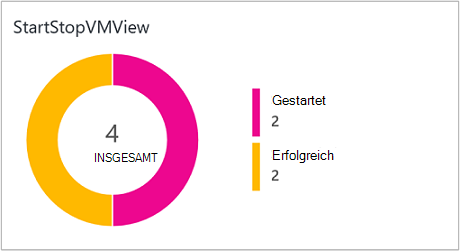
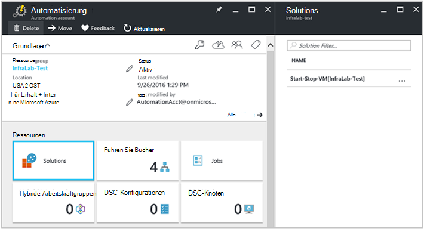
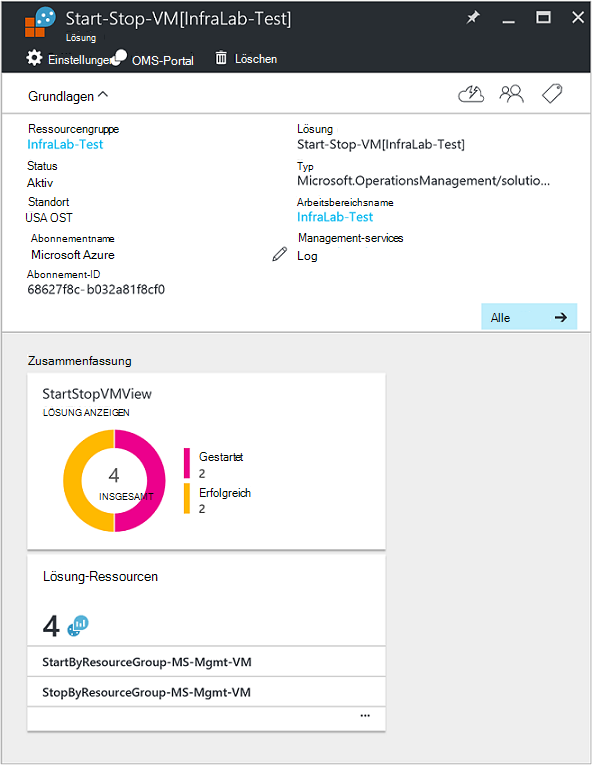

<properties
    pageTitle="Start/Stopp-VMs während der Stoßzeiten [Vorschau] Lösung | Microsoft Azure"
    description="VM-Management-Lösungen startet und beendet die Azure Ressourcenmanager virtuellen Computer nach einem Zeitplan und proaktive Überwachung von Protokollanalyse."
    services="automation"
    documentationCenter=""
    authors="MGoedtel"
    manager="jwhit"
    editor=""
    />
<tags
    ms.service="automation"
    ms.workload="tbd"
    ms.tgt_pltfrm="na"
    ms.devlang="na"
    ms.topic="get-started-article"
    ms.date="10/07/2016"
    ms.author="magoedte"/>

# Start/Stopp-VMs während der Stoßzeiten [Vorschau] Lösung bei der Automatisierung

Start/Stopp VMs während der Stoßzeiten [Vorschau] Lösung beginnt und beendet die Ressourcenmanager Azure virtuellen Computer nach einem benutzerdefinierten Zeitplan und Einblick in den Erfolg der Automatisierung Aufträge, die starten und Beenden der virtuellen Maschinen mit OMS-Protokollanalyse.  

## Erforderliche Komponenten

- Die Runbooks arbeiten mit [Azure ausführen als Konto](automation-sec-configure-azure-runas-account.md).  Das Konto ausführen als ist die bevorzugte Authentifizierungsmethode Zertifikatauthentifizierung anstelle eines Kennworts verwendet wird, die ablaufen oder häufig ändern.  

- Diese Lösung kann nur VMs verwalten die gleichen Abonnements und Ressourcengruppe als Automation-Konto Speicherort.  

- Diese Lösung stellt nur auf die folgenden Azure Regionen - Australien Südost, USA Osten Südostasien und Europa.  Runbooks, die VM-Zeitplan verwalten können VMs in jeder Region abzielen.  

- Um e-Mail-Benachrichtigungen senden Abschluss Runbooks VM starten und beenden, ist ein Unternehmen Office 365-Abonnement erforderlich.  

## Lösungskomponenten

Diese Lösung besteht aus den folgenden Ressourcen, die importiert und Automation-Konto hinzugefügt.

### Runbooks

Runbook | Beschreibung|
--------|------------|
CleanSolution MS Management virtueller Computer | Diese Runbooks werden alle enthaltenen Ressourcen und Zeitplänen beim Löschen der Lösung aus dem Abonnement entfernt.|  
SendMailO365-MS-Mgmt | Diese Runbooks sendet eine e-Mail durch Office 365.|
StartByResourceGroup MS Management virtueller Computer | Diese Runbooks VMs beginnen soll (sowohl klassische und ARM VMs), die in einer bestimmten Liste von Azure Ressource Gruppen befindet.
StopByResourceGroup MS Management virtueller Computer | Diese Runbooks VMs beenden soll (sowohl klassische und ARM VMs), die in einer bestimmten Liste von Azure Ressource Gruppen befindet.|
 

### Variablen

Variable | Beschreibung|
---------|------------|
**SendMailO365-MS-Mgmt** Runbook ||
SendMailO365 IsSendEmail MS-Mgmt | Gibt an, ob StartByResourceGroup MS Management virtueller Computer und StopByResourceGroup MS-Mgmt VM Runbooks Benachrichtigung nach Abschluss senden können.  Wählen Sie **True** aktiviert und **False** e-Mail-Warnung deaktivieren. Standardwert ist **False**.| 
**StartByResourceGroup MS Management virtueller Computer** Runbook ||
StartByResourceGroup-ExcludeList-MS-Management-VM | Geben Sie VM Namen Vorgang ausgeschlossen. Trennen Sie Namen durch semi-colon(;). Werte sind Groß- und Platzhalter (Sternchen) unterstützt.|
StartByResourceGroup-SendMailO365-EmailBodyPreFix-MS-Mgmt | Text, der am Anfang der e-Mail-Nachrichtentext angehängt werden kann.|
StartByResourceGroup-SendMailO365-EmailRunBookAccount-MS-Mgmt | Gibt den Namen des Kontos Automatisierung, Runbook E-Mail enthält.  **Ändern Sie diese Variable nicht.**|
StartByResourceGroup-SendMailO365-EmailRunbookName-MS-Mgmt | Gibt den Namen des e-Mail-Runbooks.  Dies wird von StartByResourceGroup MS Management virtueller Computer und StopByResourceGroup MS-Mgmt VM Runbooks e-Mail verwendet.  **Ändern Sie diese Variable nicht.**|
StartByResourceGroup-SendMailO365-EmailRunbookResourceGroup-MS-Mgmt | Gibt den Namen der Ressource, die e-Mail-Runbook enthält.  **Ändern Sie diese Variable nicht.**|
StartByResourceGroup-SendMailO365-EmailSubject-MS-Mgmt | Gibt den Text für die Betreffzeile der e-Mail.|  
StartByResourceGroup-SendMailO365-EmailToAddress-MS-Mgmt | Gibt die Empfänger der e-Mail.  Geben Sie verschiedene Namen in semi-colon(;).|
StartByResourceGroup-TargetResourceGroups-MS-Management-VM | Geben Sie VM Namen Vorgang ausgeschlossen. Trennen Sie Namen durch semi-colon(;). Werte sind Groß- und Platzhalter (Sternchen) unterstützt.  Standardwert (Sternchen) werden alle im Abonnement enthalten.|
StartByResourceGroup-TargetSubscriptionID-MS-Management-VM | Gibt das Abonnement, das diese Lösung verwalteten VMs enthält.  Dies muss das gleiche Abonnement Wo befindet sich das Konto Automatisierung dieser Lösung.|
**StopByResourceGroup MS Management virtueller Computer** Runbook ||
StopByResourceGroup-ExcludeList-MS-Management-VM | Geben Sie VM Namen Vorgang ausgeschlossen. Trennen Sie Namen durch semi-colon(;). Werte sind Groß- und Platzhalter (Sternchen) unterstützt.|
StopByResourceGroup-SendMailO365-EmailBodyPreFix-MS-Mgmt | Text, der am Anfang der e-Mail-Nachrichtentext angehängt werden kann.|
StopByResourceGroup-SendMailO365-EmailRunBookAccount-MS-Mgmt | Gibt den Namen des Kontos Automatisierung, Runbook E-Mail enthält.  **Ändern Sie diese Variable nicht.**|
StopByResourceGroup-SendMailO365-EmailRunbookResourceGroup-MS-Mgmt | Gibt den Namen der Ressource, die e-Mail-Runbook enthält.  **Ändern Sie diese Variable nicht.**|
StopByResourceGroup-SendMailO365-EmailSubject-MS-Mgmt | Gibt den Text für die Betreffzeile der e-Mail.|  
StopByResourceGroup-SendMailO365-EmailToAddress-MS-Mgmt | Gibt die Empfänger der e-Mail.  Geben Sie verschiedene Namen in semi-colon(;).|
StopByResourceGroup-TargetResourceGroups-MS-Management-VM | Geben Sie VM Namen Vorgang ausgeschlossen. Trennen Sie Namen durch semi-colon(;). Werte sind Groß- und Platzhalter (Sternchen) unterstützt.  Standardwert (Sternchen) werden alle im Abonnement enthalten.|
StopByResourceGroup-TargetSubscriptionID-MS-Management-VM | Gibt das Abonnement, das diese Lösung verwalteten VMs enthält.  Dies muss das gleiche Abonnement Wo befindet sich das Konto Automatisierung dieser Lösung.|  
 

### Zeitpläne

Zeitplan | Beschreibung|
---------|------------|
StartByResourceGroup Zeitplan MS-Mgmt | Zeitplan für StartByResourceGroup Runbook das Starten von dieser Lösung verwaltet VMs ausführt.|
StopByResourceGroup Zeitplan MS-Mgmt | Zeitplan für StopByResourceGroup Runbook, die das Herunterfahren der VMs verwaltet diese Lösung ausführt.|

### Anmeldeinformationen

Anmeldeinformationen | Beschreibung|
-----------|------------|
O365Credential | Gibt einem gültigen Office 365-Konto zum Senden von e-Mails an.  Nur erforderlich, wenn Variablen SendMailO365-IsSendEmail-MS-Management auf **True**festgelegt ist.

## Konfiguration

Die folgenden Schritte Kontos Automatisierung die Start/Stop-VMs während der Stoßzeiten [Vorschau] Lösung hinzu, und konfigurieren Sie die Variablen um die Lösung.

1. Die Startseite in Azure-Portal wählen Sie die Kachel **Marketplace aus**  Wenn die Kachel nicht auf der Startseite im linken Navigationsbereich fixiert die Option **neu**.  
2. Blatt Marketplace Geben Sie **VM starten** in das Suchfeld ein, und wählen Sie die Lösung **Starten/stoppen VMs tagsüber [Vorschau]** aus den Suchergebnissen aus.  
3. **Start/Stopp-VMs tagsüber [Vorschau]** Blatt für die ausgewählte Lösung lesen Sie die Zusammenfassung und dann auf **Erstellen**.  
4. Das Blade **Lösung hinzufügen** wird angezeigt, in dem Sie aufgefordert werden, die Lösung zu konfigurieren, bevor Sie in Ihr Abonnement Automatisierung importieren können.     
5.  Auf der **Lösung hinzufügen** **Arbeitsbereich** und hier einen OMS-Arbeitsbereich, der mit der gleichen Azure Abonnement automatisierungskonto in verknüpft ist oder einen neuen OMS-Arbeitsbereich erstellen.  Wenn Sie keinen Arbeitsbereich ein OMS können **Neuen Arbeitsbereich erstellen** wählen und auf die **OMS-Arbeitsbereich** folgendermaßen: 
   - Geben Sie einen Namen für den neuen **OMS-Arbeitsbereich**.
   - Wählen Sie ein **Abonnement** zum Verknüpfen der Dropdown Liste auswählen, wenn die Standardeinstellung nicht geeignet ist.
   - **Ressourcengruppe**kann eine neue Ressourcengruppe erstellen oder eine vorhandene Ressourcengruppe auswählen.  
   - Wählen Sie einen **Speicherort**.  Zurzeit sind die einzigen Orte Auswahl vorgesehenen **Australien Südost**, **USA Osten** **Südostasien**und **Europa**.
   - Wählen Sie eine **Preisstufe**.  Die Lösung wird in zwei Stufen angeboten: frei und OMS Tier gezahlt.  Freie Tier ist begrenzt auf die Daten täglich Aufbewahrungszeitraum und Runbook Auftrag Runtime Minuten.  Bezahlt OMS-Ebene eine Beschränkung auf die Daten täglich keinen.  

        > [AZURE.NOTE]
        > Während der eigenständigen Tier gezahlt als Option angezeigt wird, ist sie nicht anwendbar.  Wenn Sie auswählen, fahren Sie bei der Erstellung dieser Lösung in Ihrem Abonnement fehl.  Dieses Problem wird behoben werden bei dieser Lösung veröffentlicht. Bei Verwendung dieser Lösung wird nur Automatisierung Auftrag Minuten und Aufnahme anmelden.  Die Lösung ist für Ihre Umgebung nicht Weitere OMS Knoten hinzufügen.  

6. Klicken Sie nach Angabe der erforderlichen Informationen auf den **OMS-Arbeitsbereich** auf **Erstellen**.  Während die Informationen überprüft und Arbeitsbereich erstellt wird, können Sie den Fortschritt unter **Benachrichtigungen** Menü nachverfolgen.  Sie kehrt zum Blade **Lösung hinzufügen** .  
7. Wählen Sie auf der **Lösung hinzufügen** **Automatisierungskonto**.  Wenn Sie einen neuen OMS-Arbeitsbereich erstellen, werden Sie auch ein neues automatisierungskonto erstellen, das mit der neuen OMS angegebene Arbeitsbereich, einschließlich Azure-Abonnement, Ressourcengruppe und Region verknüpft werden.  Wählen **automatisierungskonto erstellen** und auf dem Blatt **Automatisierung hinzufügen Konto** Folgendes an: 
  - Geben Sie im Feld **Name** den Namen des Kontos Automatisierung.

    Alle anderen Optionen werden automatisch aufgefüllt basierend auf den OMS-Arbeitsbereich ausgewählt und diese Optionen nicht geändert werden.  Ein Azure ausführen als Konto ist die Standardauthentifizierungsmethode für die in dieser Lösung enthaltenen Runbooks.  Nach Anklicken von **OK**Konfigurationsoptionen überprüft und Automation-Konto erstellt.  Sie können den Fortschritt unter **Benachrichtigungen** aus verfolgen. 

    Andernfalls können Sie ein vorhandenes Automatisierung ausführen als Konto auswählen.  Beachten Sie, dass das ausgewählte Konto bereits einem anderen OMS Arbeitsbereich andernfalls eine Nachricht verknüpft werden präsentiert auf dem Blatt, Sie zu informieren.  Wenn bereits verknüpft ist, müssen Sie ein anderes Automatisierung ausführen als Konto auswählen oder einen neuen erstellen.    

8. **Schließlich auf die **Lösung hinzufügen** , konfiguriert** und Blade **Parameter** angezeigt.  Auf die **Parameter** werden Sie aufgefordert zum:  
   - Geben Sie die **Zielnamen ResourceGroup**die ist eine Ressource, die diese Lösung verwalteten VMs enthält.  Sie können mehrere Namen und mit einem Semikolon (Werte sind Groß-/Kleinschreibung) trennen.  Mithilfe eines Platzhalters werden ggf. auf VMs in alle Ressourcengruppen im Abonnement.
   - Wählen Sie einen **Zeitplan** wiederkehrende Datum und Uhrzeit für das Starten und Beenden des virtuellen Computers in dem Zielgruppe(n) Ressource.  

10. Wählen Sie nach dem Konfigurieren der ersten für die Lösung erforderlichen **Erstellen**.  Alle Einstellungen überprüft, und es wird versucht, die Lösung im Rahmen Ihres Abonnements.  Dieser Vorgang kann einige Sekunden dauern und verfolgen den Fortschritt unter **Benachrichtigung** aus. 

## Häufigkeit der Collection

Automatisierung Protokoll- und Auftrag Stream Auftragsdaten werden alle fünf Minuten OMS-Repository aufgenommen.  

## Die Lösung

Beim Hinzufügen der VM-Management-Lösung wird im Arbeitsbereich OMS **StartStopVM Ansicht** nebeneinander OMS Dashboard hinzugefügt werden.  Diese Kachel zeigt die Anzahl und grafisch Runbooks Einzelvorgänge für die Lösung, die erfolgreich abgeschlossen haben.     

In Ihrem Konto Automatisierung können zugreifen und Verwaltung der Lösung **Solutions** Kachel auswählen und dann vom Blade- **Lösung** Lösung **Start-Stop-VM [Workspace]** aus der Liste auswählen.     

Die Lösung wird Blade-Lösung **Start-Stop-VM [Workspace]** angezeigt, wo Sie wichtige Details wie die Kachel **StartStopVM** wie im Arbeitsbereich OMS sehen angezeigt Anzahl und grafisch Runbooks Einzelvorgänge für die Lösung, die erfolgreich abgeschlossen haben.     

Hier können auch OMS Arbeitsbereich zu öffnen und weitere Analyse Stellendatensätze ausführen.  Nur klicken Sie auf **Alle** **Einstellungen** -Blades **Schnellstart** und im wählen Sie im **Schnellstart** -Blade **OMS-Portal**.   Eine neue Registerkarte oder neue Browsersitzung öffnen wird und Ihr Automation-Konto und Ihr Abonnement zugeordneten OMS Arbeitsbereich vorhanden.  

### E-Mail-Benachrichtigung konfigurieren

E-Mail-Benachrichtigung aktivieren die Start- und Beendigungszeit VM-Runbooks auf, die abgeschlossen ist, müssen Sie die **O365Credential** Ändern von Anmeldeinformationen und mindestens die folgenden Variablen:

 - SendMailO365 IsSendEmail MS-Mgmt
 - StartByResourceGroup-SendMailO365-EmailToAddress-MS-Mgmt
 - StopByResourceGroup-SendMailO365-EmailToAddress-MS-Mgmt

Konfigurieren Sie die **O365Credential** -Anmeldeinformationen die folgenden Schritte:

1. Klicken Sie auf **Alle** am oberen Fensterrand Automation-Konto. 
2. Wählen Sie Blatt **Einstellungen** im Abschnitt **Automatisierung Ressourcen** **Ressourcen**. 
3. Wählen Sie auf die **Anlagen** das Musterelement **Anmeldeinformationen** und Blade **Anmeldeinformationen** auf **O365Credential**.  
4. Geben Sie eine gültige Office 365-Benutzernamen und Kennwort ein, und klicken Sie auf **Speichern** , um die Änderung zu speichern.  

Konfigurieren Sie die Variablen bereits hervorgehoben Schritte:

1. Klicken Sie auf **Alle** am oberen Fensterrand Automation-Konto. 
2. Wählen Sie Blatt **Einstellungen** im Abschnitt **Automatisierung Ressourcen** **Ressourcen**. 
3. Wählen Sie das Musterelement **Variablen** -Blade **Ressourcen** wählen Sie Blatt **Variablen** aufgeführte Variable und ändern Sie dessen Wert folgende Beschreibung Sie weiter oben im Abschnitt [Variable](##variables) angegeben.  
4. Klicken Sie auf **Speichern** , um der Variablen speichern.   

### Ändern den Zeitplan starten und Herunterfahren

Verwalten von starten und Herunterfahren Zeitplan in dieser Lösung folgt den gleichen Schritten wie bei der [Planung ein Runbook in Azure Automation](automation-scheduling-a-runbook.md).  Beachten Sie, dass die Konfiguration Zeitplans ändern können.  Sie müssen den vorhandenen Zeitplan deaktivieren und erstellen Sie eine neue und Verknüpfen mit **StartByResourceGroup MS Management virtueller Computer** oder Runbook **StopByResourceGroup MS Management virtueller Computer** , die den Zeitplan zuweisen möchten.   

## Analytics-Datensätze

Automatisierung erstellt zwei Arten von Datensätzen in die OMS-Repository.

### Aufträge

Eigenschaft | Beschreibung|
----------|----------|
Anrufer |  Der den Vorgang initiiert hat.  Mögliche Werte sind eine e-Mail-Adresse oder System für geplante Aufträge.|
Kategorie | Klassifikation von Daten.  Für die Automatisierung ist der Wert JobLogs.|
CorrelationId | GUID, die die Korrelations-ID des Auftrags Runbook.|
Auftrags | GUID, die die Id des Auftrags Runbook ist.|
operationName | Gibt den Typ der Operation, die in Azure ausgeführt.  Automatisierung werden der Wert Job.|
resourceId | Gibt an, welche Ressourcen in Azure.  Für die Automatisierung Wert zugeordnete Runbooks Automation-Konto.|
ResourceGroup | Gibt den Gruppennamen Ressource Runbook Auftrags an.|
ResourceProvider | Gibt den Azure Dienst, der die Ressourcen bereitstellt, bereitstellen und verwalten.  Für die Automatisierung Wert Azure Automation.|
ResourceType | Gibt an, welche Ressourcen in Azure.  Für die Automatisierung Wert zugeordnete Runbooks Automation-Konto.|
resultType | Der Status des Auftrags Runbook.  Mögliche Werte sind: -Gestartet -Beendet -Angehalten -Fehler -Erfolgreich|
resultDescription | Beschreibt den Ergebnis Runbook Auftragsstatus.  Mögliche Werte sind: -Auftrag wird gestartet -Job fehlgeschlagen -Job abgeschlossen|
RunbookName | Gibt den Namen des Runbooks.|
SourceSystem | Gibt das Quellsystem übermittelten Daten.  Automatisierung der Wert werden: OpsManager|
StreamType | Gibt den Typ des Ereignisses an. Mögliche Werte sind: -Ausführliche -Ausgabe -Fehler -Warnung|
SubscriptionId | Gibt die Abonnement-ID des Auftrags.
Zeit | Datum und Uhrzeit Runbook Auftrag ausgeführt.|

### Job-streams

Eigenschaft | Beschreibung|
----------|----------|
Anrufer |  Der den Vorgang initiiert hat.  Mögliche Werte sind eine e-Mail-Adresse oder System für geplante Aufträge.|
Kategorie | Klassifikation von Daten.  Für die Automatisierung ist der Wert JobStreams.|
Auftrags | GUID, die die Id des Auftrags Runbook ist.|
operationName | Gibt den Typ der Operation, die in Azure ausgeführt.  Automatisierung werden der Wert Job.|
ResourceGroup | Gibt den Gruppennamen Ressource Runbook Auftrags an.|
resourceId | Gibt die Ressource-Id in Azure.  Für die Automatisierung Wert zugeordnete Runbooks Automation-Konto.|
ResourceProvider | Gibt den Azure Dienst, der die Ressourcen bereitstellt, bereitstellen und verwalten.  Für die Automatisierung Wert Azure Automation.|
ResourceType | Gibt an, welche Ressourcen in Azure.  Für die Automatisierung Wert zugeordnete Runbooks Automation-Konto.|
resultType | Das Ergebnis des Auftrags Runbook Zeitpunkt das Ereignis generiert wurde.  Mögliche Werte sind: -In Bearbeitung|
resultDescription | Enthält den Ausgangsdatenstrom Runbooks.|
RunbookName | Der Name des Runbooks.|
SourceSystem | Gibt das Quellsystem übermittelten Daten.  Automatisierung werden der Wert OpsManager|
StreamType | Der Typ des Auftrags Stream. Mögliche Werte sind: -Status -Ausgabe -Warnung -Fehler -Debuggen -Ausführliche|
Zeit | Datum und Uhrzeit Runbook Auftrag ausgeführt.|

Beim Ausführen alle Protokolldateien suchen, die Datensätze der Kategorie **JobLogs** oder **JobStreams**zurückgibt, können Sie **JobLogs** oder **JobStreams** anzeigen auswählen, Zusammenfassen von Updates von der Suche zurückgegebenen Kacheln angezeigt.

## Beispiel-Protokoll suchen

Die folgende Tabelle enthält Beispiel Protokoll sucht Stellendatensätze Lösung gesammelt. 

Abfrage | Beschreibung|
----------|----------|
Suchen Sie Aufträge Runbook StartVM, die erfolgreich abgeschlossen wurden | Kategorie = JobLogs RunbookName_s = "StartByResourceGroup-MS-Management-VM" ResultType = erfolgreich & #124; Measure count() von JobId_g|
Suchen Sie Aufträge Runbook StopVM, die erfolgreich abgeschlossen wurden | Kategorie = JobLogs RunbookName_s = "StartByResourceGroup-MS-Management-VM" ResultType = Fehler & #124; Measure count() von JobId_g
Bei StartVM und StopVM Runbooks zeigen Sie Auftragsstatus | Kategorie = JobLogs RunbookName_s = "StartByResourceGroup-MS-Management-VM" oder "StopByResourceGroup-MS-Management-VM" NOT(ResultType="started") | Messen Sie Count() ResultType Intervall 1 Tag|

## Nächste Schritte

- Weitere Informationen zu verschiedenen Abfragen Automatisierung Auftragsprotokolle mit Protokollanalyse finden Sie unter [Log durchsucht Protokollanalyse](../log-analytics/log-analytics-log-searches.md)
- Mehr über Runbook Ausführung wie Aufträge Runbook überwachen und andere technische Details finden Sie unter [Nachverfolgen eines Auftrags runbook](automation-runbook-execution.md)
- OMS-Protokollanalyse und Auflistung von Datenquellen finden Sie unter [Erfassen von Azure Speicherdaten Protokollanalyse-Übersicht](../log-analytics/log-analytics-azure-storage.md)

   

