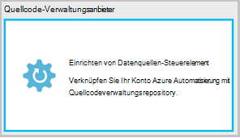
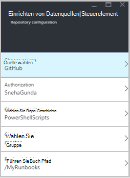
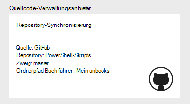
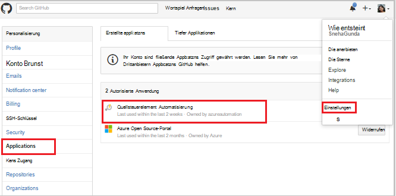
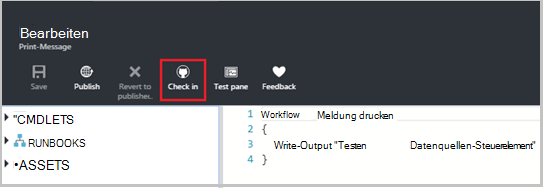
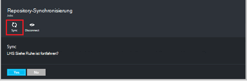
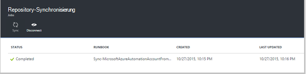
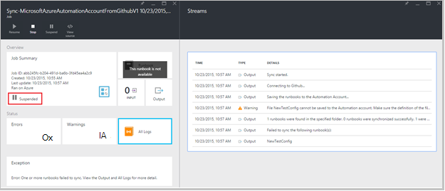
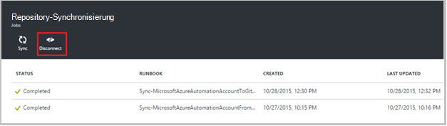

<properties 
    pageTitle=" Quellcode-Verwaltungsanbieter in Azure Automatisierung | Microsoft Azure"
    description="Quellcode-Verwaltungsanbieter mit GitHub in Azure Automation beschrieben."
    services="automation"
    documentationCenter=""
    authors="mgoedtel"
    manager="jwhit"
    editor="tysonn" />    
<tags 
    ms.service="automation"
    ms.devlang="na"
    ms.topic="article"
    ms.tgt_pltfrm="na"
    ms.workload="infrastructure-services"
    ms.date="09/12/2016"
    ms.author="magoedte;sngun" />

# Quellcode-Verwaltungsanbieter in Azure Automation

Quellcode-Verwaltungsanbieter kann Runbooks in Ihrem Konto Automatisierung ein Quellcodeverwaltungsrepository GitHub zuordnen. Datenquellen-Steuerelement können Sie problemlos mit Ihrem Team zusammenarbeiten, Überarbeitungen und Wiederherstellen früherer Versionen von Ihrem Runbooks. Beispielsweise können mit Quellsteuerelement synchronisieren Branchen im Datenquellen-Steuerelement die Entwicklung, Tests oder Produktion automatisierungskonten zu Umgebung zur Produktions-automatisierungskonto getestet wurde Code vereinfachen.

Datenquellen-Steuerelement können Sie Code von Azure Automation an push oder pull Ihre Runbooks Quellsteuerelement Azure Automatisierung. Dieser Artikel beschreibt das Quellsteuerelement in Azure Automation-Umgebung einrichten. Wir beginnen mit der Konfiguration von Azure Automatisierung GitHub Repository zugreifen und durch unterschiedliche Vorgänge, bei denen mit Quellcode-Verwaltungsanbieter. 

>[AZURE.NOTE]Datenquellen-Steuerelement unterstützt ziehen und [PowerShell Workflow Runbooks](automation-runbook-types.md#powershell-workflow-runbooks) sowie [PowerShell Runbooks](automation-runbook-types.md#powershell-runbooks)schieben. [Grafisch Runbooks](automation-runbook-types.md#graphical-runbooks) werden noch nicht unterstützt.  

Es gibt zwei einfache Schritte Versionskontrolle für Ihr Konto Automatisierung und nur konfigurieren, wenn bereits ein Konto GitHub. Sie sind:
## Schritt 1: erstellen ein GitHub repository

Wenn Sie bereits ein Konto GitHub und ein Repository zu Azure Automation und Anmeldung an Ihr Konto verknüpfen und beginnen Sie mit Schritt 2 unten. Navigieren Sie andernfalls zu [GitHub](https://github.com/)Zeichen für ein neues Konto und [Erstellen Sie ein neues Repository](https://help.github.com/articles/create-a-repo/).

## Schritt 2: Einrichten von Versionskontrolle in Azure Automation

1. Klicken Sie auf Blatt Automatisierungskonto in Azure-Portal **Datenquellen-Steuerelement.** 
 
    

2. **Source Control** Blade öffnet, Angaben zu Ihrem Konto GitHub konfigurieren können. Es folgt die Liste der Parameter konfigurieren:  

  	|**Parameter**            |**Beschreibung** |
  	|:---|:---| 
  	|Quelle wählen   | Wählen Sie die Quelle. Derzeit wird nur **GitHub** unterstützt. |
  	|Autorisierung | Klicken Sie auf **Autorisieren** , um Azure Automation GitHub Repository gewähren. Wenn Sie bei Ihrem GitHub Konto in ein anderes Fenster bereits angemeldet sind, werden die Anmeldeinformationen des Kontos verwendet. Nach der Autorisierung erfolgreich ist, zeigt das Blade Benutzername GitHub **Autorisierung**Property. |
  	|Repository auswählen | Wählen Sie ein GitHub Repository aus der Liste der verfügbaren Repositorys. |
  	|Zweig auswählen | Wählen Sie einen Zweig aus der Liste der verfügbaren Zweige. **Master** Branch wird angezeigt, wenn Sie alle Zweige erstellt haben. |
  	|Runbook Pfad | Der Runbook Pfad Gibt den Pfad im GitHub Repository oder Code abrufen soll. Es muss im Format **/foldername/subfoldername**eingegeben. Nur Runbooks Ordnerpfad Runbook werden Ihrem Konto Automatisierung synchronisiert. Runbooks in Unterordnern des Runbook Ordner Pfad wird **nicht** synchronisiert. Mit **/** alle Runbooks im Repository synchronisiert. |

3. Beispielsweise haben Sie ein Repository mit dem Namen **PowerShellScripts** , die Ordner **RootFolder**enthält, enthält einen Ordner namens **Unterordner**. Die folgenden Zeichenfolgen können Sie jede Ordnerebene synchronisieren:

    1. Zum Synchronisieren von Runbooks aus **Repository**ist Runbook Ordnerpfad*/*
    2. Zum Synchronisieren von **RootFolder**Runbooks ist Runbook Pfad */RootFolder*
    3. Zum Synchronisieren von **Unterordner**Runbooks ist Runbook Ordnerpfad */RootFolder/SubFolder*.
  

4. Nach dem Konfigurieren der Parameter erscheinen sie in der **Source-Control Blade.**  
 
    

5. Nach Anklicken von OK Quellcode-Verwaltungsanbieter ist jetzt für die automatisierungskonto konfiguriert und sollte mit der GitHub aktualisiert werden. Sie können nun auf diese alle Ihre Quelle Steuerelement Sync Auftragsverlauf anzeigen klicken.  

    

6. Nach dem Einrichten der Versionskontrolle werden Folgendes Automatisierung in Ihrem Konto Automatisierung erstellt:  
 Zwei [Variablen Elemente](automation-variables.md) werden erstellt.  
      
    * Die Variable **Microsoft.Azure.Automation.SourceControl.Connection** enthält die Werte der Verbindungszeichenfolge, wie unten dargestellt.  

  	|**Parameter**            |**Wert** |
  	|:---|:---|
  	| Name  | Microsoft.Azure.Automation.SourceControl.Connection |
  	| Typ | Zeichenfolge |
  	| Wert  | {"Zweigstelle":\<*der Zweigstelle*>, "RunbookFolderPath":\<*Runbook Pfad*>, "ProviderType":\<*hat den Wert 1 für GitHub*>, "Repository":\<*Name des Repositorys*>, "Username":\<*Ihr GitHub-Benutzername*>} |   

    * Variable **Microsoft.Azure.Automation.SourceControl.OAuthToken**enthält den sicheren verschlüsselten Wert der OAuthToken.  

  	|**Parameter**            |**Wert** |
  	|:---|:---|
  	| Name  | Microsoft.Azure.Automation.SourceControl.OAuthToken |
  	| Typ | Unknown(Encrypted) |
  	| Wert | <*Verschlüsselte OAuthToken*> |  

      

    * **Automatisierung Quellsteuerelement** wird als autorisierte Anwendung GitHub-Konto hinzugefügt. Zum Anzeigen der Anwendung: von der GitHub-Homepage navigieren Sie zu Ihrem **Profil** > **Settings** > **Anwendung**. Diese Anwendung ermöglicht Azure Automatisierung das GitHub Repository Automation-Konto synchronisiert.  

    

## Mithilfe von Datenquellen-Steuerelement in der Automatisierung

### Ein Runbook Azure Automatisierung zur Versionskontrolle einchecken

Einchecken Runbook kann an ein Runbook in Azure Automation in Quellcodeverwaltungsrepository vorgenommenen Änderungen drücken. Im folgenden sind die Schritte ein Runbook einchecken:

1. Automation-Konto, [Erstellen Sie einen neuen Text Runbook](automation-first-runbook-textual.md), oder [Bearbeiten Sie einen vorhandenen Text für ein Runbook](automation-edit-textual-runbook.md). Diese Runbooks kann einen PowerShell Workflow oder ein Runbook PowerShell-Skript.  

2. Nachdem Sie Ihr Runbook bearbeiten, speichern Sie und **Einchecken** aus dem Blade **Bearbeiten** .  

    

     >[AZURE.NOTE] Einchecken von Azure Automation wird den Code überschrieben, der derzeit in der Versionskontrolle vorhanden ist. Der Git entsprechende Befehlszeile Einchecken ist **Git hinzufügen + Git Commit + Git push**  

3. Wenn Sie **Einchecken**klicken, Bestätigung aufgefordert werden, klicken Sie auf Ja, um fortzufahren.  

    

4. Einchecken beginnt Runbook Control Source: **MicrosoftAzureAutomationAccountToGitHubV1 synchronisieren**. Diese Runbooks GitHub her und legt Änderungen von Azure Automatisierung zum Repository. Zum Einchecken Auftragsverlauf anzeigen, gehen Sie zurück zur Registerkarte **Quellcode-Verwaltungsanbieter** und Repository-Synchronisierung Blatt öffnen klicken. Dieses Blatt enthält Source Control Aufträge.  Wählen Sie den Auftrag anzeigen möchten, und klicken Sie auf, um die Details anzuzeigen.  

    

    >[AZURE.NOTE] Source Control Runbooks sind spezielle Automatisierung Runbooks, die Sie anzeigen oder bearbeiten können. Während sie sich in Ihrer Liste Runbook nicht angezeigt werden, sehen Sie Sync Jobs auf der Projektliste.
 
5. Der Name der geänderten Runbook wird als Eingabeparameter an Runbook Einchecken gesendet. Sie können [die Auftragsdetails anzeigen](automation-runbook-execution.md#viewing-job-status-using-the-azure-management-portal) Runbook in **Repository-Synchronisierung** Blade erweitern.  

    

6. Aktualisieren Sie GitHub Repository, sobald der Auftrag abgeschlossen ist, um die Änderung anzuzeigen.  Es sollte ein Commit in Ihrem Repository mit einer Nachricht: * *Aktualisierte *Runbook Namen* in Azure Automation.* *  

### Sync Runbooks aus Versionskontrolle Azure Automatisierung 

Die Sync-Taste auf die Repository-Synchronisierung können Sie alle Runbooks Runbook Ordnerpfad des Repositorys Automation-Konto abrufen. Dasselbe Repository kann mehrere Automation-Konto synchronisiert. Im folgenden sind die Schritte ein Runbook synchronisieren:

1. Automatisierung, Konto, Datenquellen-Steuerelement einrichten, **Source Control Integration-Repository Synchronisierung Blade** öffnen und klicken Sie auf **Synchronisieren** , und Sie mit einer Meldung zur Bestätigung aufgefordert werden, klicken Sie auf **Ja,** um fortzufahren.  

    

2. Synchronisierung startet Runbooks: **Sync-MicrosoftAzureAutomationAccountFromGitHubV1**. Diese Runbooks GitHub her und zieht die Änderungen aus dem Repository Azure Automation. Ein neues Projekt sollte auf die **Repository-Synchronisierung** für diese Aktion angezeigt werden. Einzelheiten zu den Synchronisierungsvorgang Job Details Blade öffnen klicken.  
 
    

 
    >[AZURE.NOTE] Eine Synchronisierung vom Datenquellen-Steuerelement überschreibt die Entwurfsversion der Runbooks, die derzeit in Ihrem Konto Automatisierung für **Alle** Runbooks vorhanden, die derzeit im Datenquellen-Steuerelement. Der Git entsprechende Befehlszeile synchronisieren ist **Git pull**

## Steuerelement Problembehandlung

Sind Fehler mit einem Projekt einchecken oder synchronisieren, sollte der Status ausgesetzt, und Sie können weitere Details zum Fehler Blatt Auftrag anzeigen.  **Alle Protokolle** Teil wird aller mit diesem Auftrag assoziierten PowerShell Streams angezeigt. Diese bieten Einzelheiten können Probleme mit dem Einchecken oder Synchronisieren der Lösung. Es werden auch die Sequenz von Aktionen angezeigt, die beim Synchronisieren oder Einchecken ein Runbook aufgetreten ist.  

## Trennen von Datenquellen-Steuerelement

Zum Trennen von Ihrem GitHub öffnen Sie Repository-Synchronisierung Blade, und klicken Sie auf **Trennen**. Nach Trennen der Versionskontrolle zuvor synchronisiert wurden Runbooks bleibt in Ihrem Konto Automatisierung jedoch Blade Repository-Synchronisierung nicht aktiviert.  

  

## Nächste Schritte

Weitere Informationen zum Quellcode-Verwaltungsanbieter finden Sie in folgenden Ressourcen:  
- [Azure Automatisierung: Quellcode-Verwaltungsanbieter in Azure Automatisierung](https://azure.microsoft.com/blog/azure-automation-source-control-13/)  
- [Stimmen Sie für Ihre bevorzugten Versionsverwaltungssystem](https://www.surveymonkey.com/r/?sm=2dVjdcrCPFdT0dFFI8nUdQ%3d%3d)  
- [Azure Automatisierung: Integration Runbook Datenquellen-Steuerelement mit Visual Studio Team Services](https://azure.microsoft.com/blog/azure-automation-integrating-runbook-source-control-using-visual-studio-online/)  
