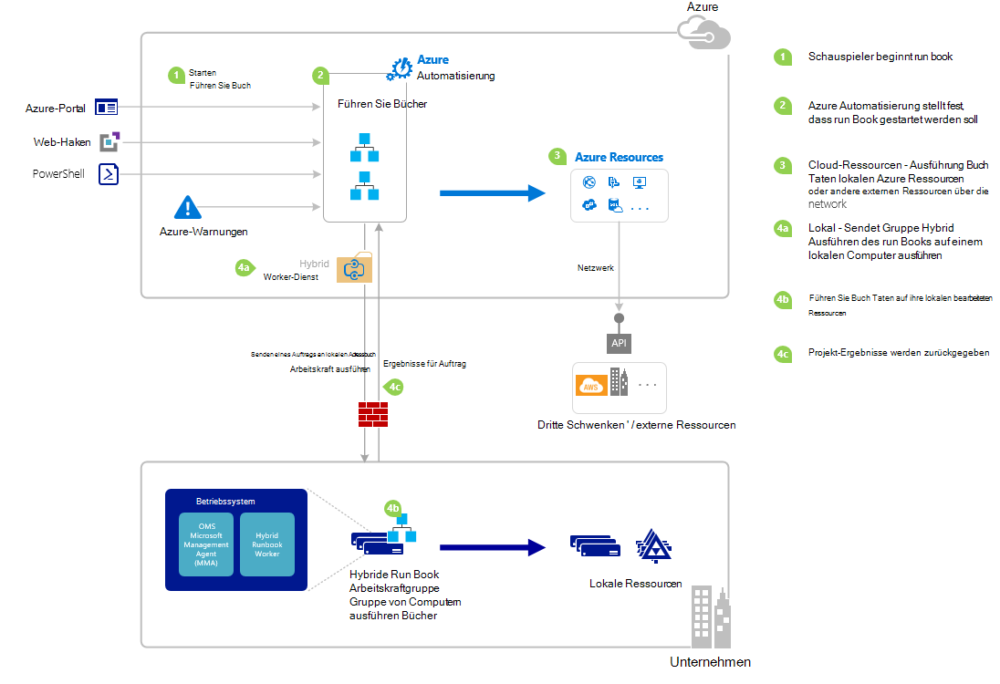

<properties
   pageTitle="Ein Runbook in Azure Automation starten | Microsoft Azure"
   description="Die verschiedenen Methoden, die verwendet werden, um ein Runbook in Azure-Automatisierung zu starten und enthält Informationen zur Verwendung der Azure-Portal und Windows PowerShell zusammengefasst."
   services="automation"
   documentationCenter=""
   authors="mgoedtel"
   manager="jwhit"
   editor="tysonn" />
<tags
   ms.service="automation"
   ms.devlang="na"
   ms.topic="article"
   ms.tgt_pltfrm="na"
   ms.workload="infrastructure-services"
   ms.date="10/08/2016"
   ms.author="magoedte;bwren"/>

# <a name="starting-a-runbook-in-azure-automation"></a>Starten Sie ein Runbook in Azure Automation

In der folgenden Tabelle können Sie bestimmen, ein Runbook in Azure Automation starten, die für das spezifische Szenario am besten geeignet ist. Dieser Artikel enthält Informationen zum Starten eines Runbooks Azure-Portal und Windows PowerShell. Andere Methoden in andere Dokumentation Angaben, die Sie über die Links zugreifen können.

| **-METHODE**                                                                    | **MERKMALE**                                                                                                                                                                                                                                                                                                                                                |
|-------------------------------------------------------------------------------|--------------------------------------------------------------------------------------------------------------------------------------------------------------------------------------------------------------------------------------------------------------------------------------------------------------------------------------------------------------------|
| [Azure-Portal](#starting-a-runbook-with-the-azure-portal)                     | <li>Einfachste Methode mit interaktiven Benutzeroberfläche.<br> <li>Einfache Parameterwerte zu bilden.<br> <li>Verfolgen Sie Job-Status.<br> <li>Zugriff mit Azure Anmeldung authentifiziert.                                                                                                                                                                               |
| [Windows PowerShell](https://msdn.microsoft.com/library/dn690259.aspx)        | <li>Rufen Sie aus Befehlszeile mit Windows PowerShell-Cmdlets auf.<br> <li>Können in automatisierte Lösung mit mehreren Schritten enthalten.<br> <li>Anforderung authentifiziert, Zertifikat oder OAuth Benutzer principal-Service principal.<br> <li>Bereitstellen Sie einfache und komplexe Werte.<br> <li>Verfolgen Sie Job-Status.<br> <li>Client für die Unterstützung von PowerShell-Cmdlets erforderlich. |
| [Azure Automation API](https://msdn.microsoft.com/library/azure/mt662285.aspx) | <li>Flexibelste Methode aber auch komplexer.<br> <li>Rufen Sie benutzerdefinierten Code, der HTTP-Anfragen stellen kann.<br> <li>Anforderung authentifiziert Zertifikat oder Oauth User principal-Service principal.<br> <li>Bereitstellen Sie einfache und komplexe Werte.<br> <li>Verfolgen Sie Job-Status.                                                                          |
| [Webhooks](automation-webhooks.md)                                            | <li>Starten Sie Runbook von HTTP-Anforderung.<br> <li>Authentifiziert Sicherheitstoken in URL.<br> <li>Client kann beim angegeben Webhook Parameterwerte nicht überschreiben. Runbook kann einzelnen Parameter definieren, der HTTP-Anforderungsdetails enthält.<br> <li>Keine Möglichkeit zur Auftragsstatus über Webhook URL verfolgen.                                      |
| [Reagieren auf Azure Warnung](../log-analytics/log-analytics-alerts.md)               | <li>Startet ein Runbook Azure Warnung.<br> <li>Konfigurieren Sie Webhook Runbook und Link zu warnen.<br> <li>Authentifiziert Sicherheitstoken in URL.<br> <li>Derzeit unterstützt nur Warnung Kennzahlen.                                                                                                                                                       |
| [Zeitplan](automation-schedules.md)                                | <li>Runbook Zeitplan stündlich, täglich oder wöchentlich automatisch gestartet.<br> <li>Bearbeiten Sie Zeitplan Azure-Portal, PowerShell-Cmdlets und Azure-API.<br> <li>Geben Sie Parameterwerte mit verwendet werden.                                                                                                                                               |
| [Aus einem anderen Runbook](automation-child-runbooks.md)                          | <li>Verwenden Sie ein Runbook als Aktivität in anderen Runbook.<br> <li>Nützlich für die Funktionalität von mehreren Runbooks verwendet.<br> <li>Bereitstellen Sie Parameterwerte untergeordneten Runbook und Ausgabe im übergeordneten Runbook.                                                                                                                                                               |

Das folgende Bild zeigt detaillierte Schritt im Lebenszyklus eines Runbooks. Es enthält ein Runbook in Azure Automation Komponenten erforderlich für Hybrid Runbook Worker gestartet wird Azure Automatisierung Runbooks und Interaktionen zwischen verschiedenen Komponenten unterschiedlich. Zum Ausführen von Runbooks Automatisierung im Rechenzentrum finden Sie [Hybrid Runbook](automation-hybrid-runbook-worker.md) Arbeitnehmer



## <a name="starting-a-runbook-with-the-azure-portal"></a>Azure-Portal ein Runbook ausgehend

1.  Aktivieren Sie in Azure-Portal **Automatisierung** , und klicken Sie auf den Namen eines Kontos Automatisierung.
2.  Wählen Sie die Registerkarte **Runbooks** .
3.  Wählen Sie ein Runbook und klicken Sie dann auf **Starten**.
4.  Wenn Runbooks Parameter verfügt, werden Sie aufgefordert, Werte für jeden Parameter ein Textfeld bereitzustellen. Weitere Informationen zu Parametern finden Sie unter [Runbook Parameter](#Runbook-parameters) unten.
5.  **Einzelvorgang anzeigen** **ab** Runbook Nachricht wählen oder die Registerkarte **Aufträge** für Runbook Runbook Job Status anzeigen.

## <a name="starting-a-runbook-with-the-azure-portal"></a>Azure-Portal ein Runbook ausgehend

1.  Automation-Konto klicken Sie auf die **Runbooks** **Runbooks** Blade öffnen.
2.  Klicken Sie auf ein Runbook **Runbook** Messer öffnen.
3.  Klicken Sie auf **Start**.
4.  Wenn das Runbook keine Parameter hat, werden Sie aufgefordert zu bestätigen, dass Sie starten möchten. Wenn Runbooks Parameter verfügt, öffnet Blade **Starten Runbook** Parameterwerte bieten zu können. Weitere Informationen zu Parametern finden Sie unter [Runbook Parameter](#Runbook-parameters) unten.
5.  **Job** -Blade wird geöffnet, damit Sie den Status nachverfolgen können.

## <a name="starting-a-runbook-with-windows-powershell"></a>Windows PowerShell ein Runbook ausgehend

[Start-AzureRmAutomationRunbook](https://msdn.microsoft.com/library/mt603661.aspx) können Sie ein Runbook mit Windows PowerShell starten. Der folgende Code startet ein Runbook Test Runbook aufgerufen.

```
Start-AzureRmAutomationRunbook -AutomationAccountName "MyAutomationAccount" -Name "Test-Runbook" -ResourceGroupName "ResourceGroup01"
```

Start AzureRmAutomationRunbook gibt ein Auftragsobjekt, mit denen Sie ihren Status verfolgen, sobald Runbook gestartet wird. Dieser Job-Objekts können mit [Get-AzureRmAutomationJob](https://msdn.microsoft.com/library/mt619440.aspx) Sie um den Status des Auftrags und [Get-AzureRmAutomationJobOutput](https://msdn.microsoft.com/library/mt603476.aspx) die Ausgabe zu bestimmen. Der folgende Code startet ein Runbook Test Runbook, wartet, bis er abgeschlossen hat, und die Ausgabe zeigt bezeichnet.

```
$runbookName = "Test-Runbook"
$ResourceGroup = "ResourceGroup01"
$AutomationAcct = "MyAutomationAccount"

$job = Start-AzureRmAutomationRunbook –AutomationAccountName $AutomationAcct -Name $runbookName -ResourceGroupName $ResourceGroup

$doLoop = $true
While ($doLoop) {
   $job = Get-AzureRmAutomationJob –AutomationAccountName $AutomationAcct -Id $job.JobId -ResourceGroupName $ResourceGroup
   $status = $job.Status
   $doLoop = (($status -ne "Completed") -and ($status -ne "Failed") -and ($status -ne "Suspended") -and ($status -ne "Stopped"))
}

Get-AzureRmAutomationJobOutput –AutomationAccountName $AutomationAcct -Id $job.JobId -ResourceGroupName $ResourceGroup –Stream Output
```

Wenn das Runbook Parameter erfordert, müssen Sie angeben werden [Hashtable](http://technet.microsoft.com/library/hh847780.aspx) , der Schlüssel der Hashtabelle entspricht der Parametername und des Werts der Parameterwert. Im folgenden Beispiel wird veranschaulicht, wie ein Runbook mit zwei Parameter FirstName und LastName, Integer namens RepeatCount und booleschen Parameter anzeigen zu. Weitere Informationen zu Parametern finden Sie unter folgenden [Runbook Parameter](#Runbook-parameters) .

```
$params = @{"FirstName"="Joe";"LastName"="Smith";"RepeatCount"=2;"Show"=$true}
Start-AzureRmAutomationRunbook –AutomationAccountName "MyAutomationAccount" –Name "Test-Runbook" -ResourceGroupName "ResourceGroup01" –Parameters $params
```

## <a name="runbook-parameters"></a>Runbook Parameter

Beim Starten ein Runbook von Azure-Portal oder Windows PowerShell ist die Anweisung über Azure Automation-Webdienst gesendet. Dieser Dienst unterstützt keine Parameter mit komplexen Datentypen. Benötigen Sie einen Wert für einen komplexen Parameter angeben, müssen Sie es Inline aus anderen Runbook aufrufen wie [untergeordnete Runbooks in Azure Automation](automation-child-runbooks.md).

Azure Automation-Webdienst bietet spezielle Funktionen für Parameter bestimmte Datentypen wie in den folgenden Abschnitten beschrieben.

### <a name="named-values"></a>Benannte Werte

Wenn des Parameters Datentyp [Object], können Sie eine Liste benannter Werte senden JSON-Format: *{Name1: "Wert1", Name2: "Wert2", Name3: 'Wert3'}*. Diese Werte müssen einfache Typen sein. Runbooks erhalten den Parameter als ein [PSCustomObject](https://msdn.microsoft.com/library/system.management.automation.pscustomobject%28v=vs.85%29.aspx) mit Eigenschaften, die jeder benannten Wert entsprechen.

Betrachten Sie folgenden Test Runbooks, die einen Parameter mit der Bezeichnung Benutzer akzeptiert.

```
Workflow Test-Parameters
{
   param (
      [Parameter(Mandatory=$true)][object]$user
   )
    $userObject = $user | ConvertFrom-JSON
    if ($userObject.Show) {
        foreach ($i in 1..$userObject.RepeatCount) {
            $userObject.FirstName
            $userObject.LastName
        }
    }
}
```

Der folgende Text konnte für den Benutzerparameter verwendet werden.

```
{FirstName:'Joe',LastName:'Smith',RepeatCount:'2',Show:'True'}
```

Dies ergibt die folgende Ausgabe.

```
Joe
Smith
Joe
Smith
```

### <a name="arrays"></a>Arrays

Wenn der Parameter ein Array beispielsweise in [] oder [string []] dann JSON-Format können Sie eine Liste der Werte senden: *[Wert1, Wert2 Wert3]*. Diese Werte müssen einfache Typen sein.

Betrachten Sie folgenden Test Runbooks, die einen Parameter mit der Bezeichnung *Benutzer*akzeptiert.

```
Workflow Test-Parameters
{
   param (
      [Parameter(Mandatory=$true)][array]$user
   )
    if ($user[3]) {
        foreach ($i in 1..$user[2]) {
            $ user[0]
            $ user[1]
        }
    }
}
```

Der folgende Text konnte für den Benutzerparameter verwendet werden.

```
["Joe","Smith",2,true]
```

Dies ergibt die folgende Ausgabe.

```
Joe
Smith
Joe
Smith
```

### <a name="credentials"></a>Anmeldeinformationen

Wenn der Parameter **PSCredential**-Datentyp ist, können Sie den Namen eines Azure Automation [Anmeldeinformationen Anlage](automation-credentials.md)bereitstellen. Runbooks werden die Anmeldeinformationen mit dem Namen abrufen, die Sie angeben.

Betrachten Sie folgenden Test Runbooks, die einen Parameter namens Anmeldeinformationen akzeptiert.

```
Workflow Test-Parameters
{
   param (
      [Parameter(Mandatory=$true)][PSCredential]$credential
   )
   $credential.UserName
}
```

Der folgende Text konnte für den Benutzerparameter angenommen, gab es eine Anmeldeinformationen Anlage namens *Meine Anmeldeinformationen*verwendet werden.

```
My Credential
```

Wenn der Benutzername in den Anmeldeinformationen *Jsmith*wurde, ergibt die folgende Ausgabe.

```
jsmith
```

## <a name="next-steps"></a>Nächste Schritte

-   Die Architektur Runbook in Artikel bietet eine Übersicht Runbooks in Azure und lokale Hybrid Runbook Arbeitskraft verwalten.  Zum Ausführen von Runbooks Automatisierung im Rechenzentrum finden Sie [Hybrid Runbook](automation-hybrid-runbook-worker.md)Arbeitskräften.
-   Finden Sie in [Untergeordneten Runbooks](automation-child-runbooks.md), um weitere Informationen zum Erstellen von modularen Runbooks durch andere Runbooks für spezifische oder allgemeine Funktionen verwendet werden.
