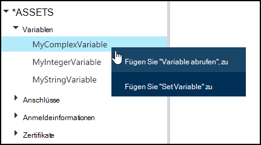
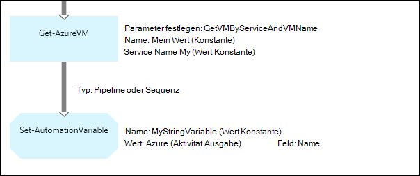
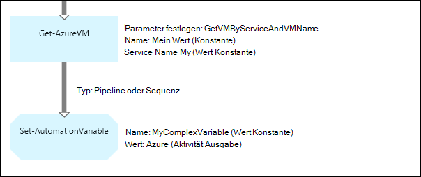
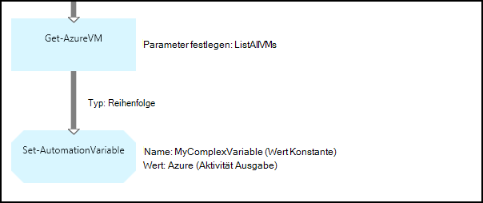
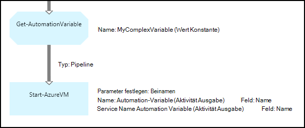
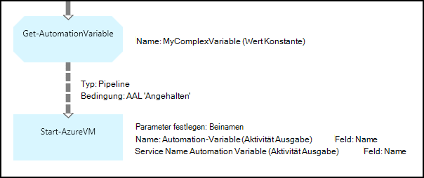

<properties 
   pageTitle="Variable Elemente in Azure Automatisierung | Microsoft Azure"
   description="Variable Elemente sind Werte für alle Runbooks und DSC-Konfigurationen in Azure Automation.  Dieser Artikel erläutert die Details der Variablen und zum Verfassen von Text und Grafiken arbeiten."
   services="automation"
   documentationCenter=""
   authors="mgoedtel"
   manager="jwhit"
   editor="tysonn" />
<tags 
   ms.service="automation"
   ms.devlang="na"
   ms.topic="article"
   ms.tgt_pltfrm="na"
   ms.workload="infrastructure-services"
   ms.date="05/24/2016"
   ms.author="magoedte;bwren" />

# Variable Elemente in Azure Automation

Variable Elemente sind Werte für alle Runbooks und DSC-Konfigurationen in Ihrem automatisierungskonto. Sie können erstellt, geändert und abgerufen Azure-Portal Windows PowerShell und ein Runbook oder DSC-Konfiguration. Automatisierung Variablen eignen sich für die folgenden Szenarien:

- Freigeben Sie zwischen mehreren Runbooks oder DSC-Konfigurationen.

- Freigeben Sie zwischen mehrere Einzelvorgänge aus demselben Runbook oder DSC-Konfiguration.

- Verwalten Sie einen Wert aus dem Portal oder über die Windows PowerShell-Befehlszeile die von Runbooks oder DSC-Konfigurationen verwendet.

Automatisierung Variablen beibehalten werden, damit sie weiterhin Ausfall Runbook oder DSC-Konfiguration.  Dadurch können einen Wert durch eine Runbook, der dann von anderen verwendet oder ist vom gleichen Runbook oder DSC-Konfiguration das nächste Mal ausgeführt wird.

Wenn eine Variable erstellt wird, können Sie angeben, dass gespeichert werden verschlüsselt.  Beim Verschlüsseln einer Variablen sicher in Azure Automation gespeichert wird und der Wert kann nicht aus dem [Get-AzureAutomationVariable](http://msdn.microsoft.com/library/dn913772.aspx) -Cmdlet Azure PowerShell-Modul ist im Lieferumfang enthalten abgerufen werden.  **Get-AutomationVariable** -Aktivität im ein Runbook oder DSC-Konfiguration ist die einzige Möglichkeit, verschlüsselter Wert abgerufen werden kann.

>[AZURE.NOTE]Sichere Anlagen in Azure Automation gehören Anmeldeinformationen, Zertifikate, Anschlüsse und verschlüsselte Variablen. Diese Ressourcen werden verschlüsselt und in Azure Automation mit einem eindeutigen Schlüssel wird für jedes automatisierungskonto gespeichert. Dieser Schlüssel ist ein master Zertifikat verschlüsselt und in Azure Automation gespeichert. Vor dem Speichern einer sicheren Anlage, der Schlüssel für die Automation-Konto wird mit master Zertifikat entschlüsselt und anschließend zum Verschlüsseln der Anlage.

## Variablentypen

Beim Erstellen einer Variablen mit der Azure-Portal müssen Sie einen Datentyp aus der Dropdownliste das Portal das entsprechende Steuerelement für den Variablenwert eingeben anzeigen angeben. Die Variable ist nicht auf diesem Datentyp legen Sie die Variable mit Windows PowerShell, wenn der Wert einen anderen Typ angeben möchten. Wenn Sie **nicht definiert**angeben, dann wird der Wert der Variablen auf **$null**festgelegt und legen Sie den Wert mit der [Set-AzureAutomationVariable](http://msdn.microsoft.com/library/dn913767.aspx) -Cmdlet oder **Set-AutomationVariable** -Aktivität.  Nicht erstellen oder ändern Sie den Wert für einen komplexen Variable im Portal, jedoch können Sie einen Wert beliebigen Typs mithilfe von Windows PowerShell. Komplexe Typen werden als [PSCustomObject](http://msdn.microsoft.com/library/system.management.automation.pscustomobject.aspx)zurückgegeben.

Sie können mehrere Werte einer Variablen ein Array oder eine Hashtabelle erstellt und der Variablen speichern Speichern.

## Cmdlets und Workflowaktivitäten

Die Cmdlets in der folgenden Tabelle werden zum Erstellen und Verwalten von Automatisierung mit Windows PowerShell-Variablen. Sie liefern als Teil des [Azure PowerShell-Modul](../powershell-install-configure.md) für Automatisierung Runbooks und DSC-Konfiguration verfügbar ist.

|Cmdlets|Beschreibung|
|:---|:---|
|[AzureAutomationVariable abrufen](http://msdn.microsoft.com/library/dn913772.aspx)|Ruft den Wert einer vorhandenen Variablen.|
|[Neue AzureAutomationVariable](http://msdn.microsoft.com/library/dn913771.aspx)|Erstellt eine neue Variable und ihren Wert.|
|[AzureAutomationVariable entfernen](http://msdn.microsoft.com/library/dn913775.aspx)|Entfernt eine vorhandene Variable.|
|[AzureAutomationVariable festlegen](http://msdn.microsoft.com/library/dn913767.aspx)|Legt den Wert für eine vorhandene Variable.|

Workflowaktivitäten in der folgenden Tabelle wird ein Runbook Automatisierung Variablen zugreifen. Sie stehen für ein Runbook oder DSC-Konfiguration und werden nicht als Teil der Azure PowerShell-Modul geliefert.

|Workflow-Aktivitäten|Beschreibung|
|:---|:---|
|AutomationVariable abrufen|Ruft den Wert einer vorhandenen Variablen.|
|AutomationVariable festlegen|Legt den Wert für eine vorhandene Variable.|

>[AZURE.NOTE] Vermeiden Sie die Verwendung von Variablen in-Parameter Name der **Get-AutomationVariable** in einem Runbook oder DSC-Konfiguration, da diese entdecken Abhängigkeiten Runbooks oder DSC-Konfiguration und Automatisierung Variablen zur Entwurfszeit komplizieren kann.

## Erstellen einer neuen Automation-variable

### Erstellt eine neue Variable mit dem Azure-portal

1. Klicken Sie auf **Anlagen** am oberen Fensterrand Automation-Konto.
1. Klicken Sie am unteren Rand des Fensters auf **Hinzufügen**.
1. Klicken Sie auf **Variable hinzufügen**.
1. Führen Sie den Assistenten, und klicken Sie auf das Kontrollkästchen, um die neue Variable speichern.

### Erstellt eine neue Variable mit dem Azure-portal

1. Automation-Konto klicken Sie auf die **Vermögenswerte** Blade **Anlagen** öffnen.
1. Klicken Sie auf das Öffnen das **Variablen** Blade **Variablen** .
1. Klicken Sie auf **Hinzufügen einer Variablen** am Anfang des Blades.
1. Füllen Sie das Formular, und klicken Sie auf **Erstellen** , um die neue Variable speichern.

### Erstellen Sie eine neue Variable mit Windows PowerShell

[Neu-AzureAutomationVariable](http://msdn.microsoft.com/library/dn913771.aspx) -Cmdlet erstellt eine neue Variable und legt den Anfangswert. Sie können den Wert mit [Get-AzureAutomationVariable](http://msdn.microsoft.com/library/dn913772.aspx)abrufen. Wenn der Wert eines einfachen Typs wird desselben Typs zurückgegeben. Wenn sie einen komplexen Typ handelt, wird ein **PSCustomObject** zurückgegeben.

Die folgenden Beispielbefehle zeigen, wie eine Variable vom Typzeichenfolge erstellen und dann den Wert zurückgeben.

    New-AzureAutomationVariable –AutomationAccountName "MyAutomationAccount" –Name 'MyStringVariable' –Encrypted $false –Value 'My String'
    $string = (Get-AzureAutomationVariable –AutomationAccountName "MyAutomationAccount" –Name 'MyStringVariable').Value

Die folgenden Beispielbefehle zeigen, wie erstellen Sie eine Variable mit einem komplexen Typ und dessen Eigenschaften zurückgegeben. In diesem Fall wird ein Objekt VM aus **Get-AzureVM** verwendet.

    $vm = Get-AzureVM –ServiceName "MyVM" –Name "MyVM"
    New-AzureAutomationVariable –AutomationAccountName "MyAutomationAccount" –Name "MyComplexVariable" –Encrypted $false –Value $vm
    
    $vmValue = (Get-AzureAutomationVariable –AutomationAccountName "MyAutomationAccount" –Name "MyComplexVariable").Value
    $vmName = $vmValue.Name
    $vmIpAddress = $vmValue.IpAddress

## Eine Variable in einem Runbook oder DSC-Konfiguration

Verwenden Sie **Set-AutomationVariable** -Aktivität, um Wert Automation-Variable in ein Runbook DSC-Konfiguration und **Get-AutomationVariable** abrufen.  Verwenden Sie nicht **AzureAutomationVariable Set** oder **Get-AzureAutomationVariable** -Cmdlets in ein Runbook oder DSC-Konfiguration sind weniger effizient als die Workflowaktivitäten.  Der Wert der sicheren Variablen mit **Get-AzureAutomationVariable**kann nicht auch abgerufen werden.  Die einzige Möglichkeit, eine neue Variable in einem Runbook oder DSC-Konfiguration erstellen wird das [New-AzureAutomationVariable](http://msdn.microsoft.com/library/dn913771.aspx) -Cmdlet verwenden.

### Text für ein Runbook-Beispiele

#### Festlegen und Abrufen von einfachen Wert aus einer Variablen

Die folgenden Beispielbefehle veranschaulicht das Festlegen und Abrufen von Variablen in Textform Runbook. In diesem Beispiel wird davon ausgegangen, dass Variablen vom Typ Integer namens *NumberOfIterations* und *NumberOfRunnings* und eine Variable vom Typzeichenfolge benannte *SampleMessage* bereits erstellt wurden.

    $NumberOfIterations = Get-AutomationVariable -Name 'NumberOfIterations'
    $NumberOfRunnings = Get-AutomationVariable -Name 'NumberOfRunnings'
    $SampleMessage = Get-AutomationVariable -Name 'SampleMessage'
    
    Write-Output "Runbook has been run $NumberOfRunnings times."
    
    for ($i = 1; $i -le $NumberOfIterations; $i++) {
       Write-Output "$i`: $SampleMessage"
    }
    Set-AutomationVariable –Name NumberOfRunnings –Value ($NumberOfRunnings += 1)

#### Festlegen und Abrufen eines komplexen Objekts in einer Variablen

Der folgende Code zeigt eine Variable mit einem komplexen Text Runbook aktualisieren. In diesem Beispiel Azure VM mit **Get-AzureVM** abgerufen und in eine vorhandene Automation-Variable gespeichert.  Wie in [Variablentypen](#variable-types), wird dies als ein PSCustomObject gespeichert.

    $vm = Get-AzureVM -ServiceName "MyVM" -Name "MyVM"
    Set-AutomationVariable -Name "MyComplexVariable" -Value $vm

Im folgenden Code wird der Wert aus der Variablen abgerufen und verwendet, um den virtuellen Computer starten.

    $vmObject = Get-AutomationVariable -Name "MyComplexVariable"
    if ($vmObject.PowerState -eq 'Stopped') {
       Start-AzureVM -ServiceName $vmObject.ServiceName -Name $vmObject.Name
    }

#### Festlegen und Abrufen einer Auflistung in einer Variablen

Der folgende Code veranschaulicht eine Variable mit komplexe Werte in Textform Runbook verwenden. In diesem Beispiel werden mehrere Azure virtuelle Maschinen mit **Get-AzureVM** abgerufen und in eine vorhandene Automation-Variable gespeichert.  Wie in [Variablentypen](#variable-types), wird dies als eine Auflistung von PSCustomObjects gespeichert.

    $vms = Get-AzureVM | Where -FilterScript {$_.Name -match "my"}     
    Set-AutomationVariable -Name 'MyComplexVariable' -Value $vms

Im folgenden Code wird die Auflistung von Variablen abgerufen und verwendet, um jeden virtuellen Computer starten.

    $vmValues = Get-AutomationVariable -Name "MyComplexVariable"
    ForEach ($vmValue in $vmValues)
    {
       if ($vmValue.PowerState -eq 'Stopped') {
          Start-AzureVM -ServiceName $vmValue.ServiceName -Name $vmValue.Name
       }
    }

### Grafisch Runbook-Beispiele

In grafisch Runbook fügen Sie **Get-AutomationVariable** oder **Set-AutomationVariable** mit der rechten Maustaste auf die Variable im Bibliotheksfenster des Grafik-Editors auswählen die gewünschte Aktivität.

#### Werte in einer Variablen

Das folgende Bild zeigt Beispielaktivitäten eine Variable mit einem einfachen grafisch Runbook aktualisieren. In diesem Beispiel eine einzelne Azure virtuellen Maschine mit **Get-AzureVM** abgerufen werden und der Computernamen in einer vorhandenen Automation-Variable mit dem Typ Zeichenfolge gespeichert wird.  Es spielt keine Rolle, ob der [Link ist eine Pipeline oder eine Sequenz](automation-graphical-authoring-intro.md#links-and-workflow) , da wir nur ein einzelnes Objekt in der Ausgabe erwarten.

Die folgende Abbildung zeigt die Aktivitäten verwendet, um eine Variable mit einem komplexen Grafiken Runbook aktualisieren. Die einzige Änderung aus dem vorherigen Beispiel ist **Feldpfad** nicht für die **Leistungsabgabe** **Set-AutomationVariable** -Aktivität angeben, damit das Objekt statt nur eine Eigenschaft des Objekts gespeichert wird.  Wie in [Variablentypen](#variable-types), wird dies als ein PSCustomObject gespeichert.

Die folgende Abbildung zeigt ähnliche Funktionen wie das vorherige Beispiel mit mehreren virtuellen Computern in der Variablen gespeichert.  Eine [Sequenz Link](automation-graphical-authoring-intro.md#links-and-workflow) muss hier verwendet werden, damit Aktivität **Set AutomationVariable** den gesamten Satz von virtuellen Computern eine empfängt.  Wenn eine [Pipeline Link](automation-graphical-authoring-intro.md#links-and-workflow) verwendet wurde, dann führen **Set AutomationVariable** Aktivität separat für jedes Objekt mit dem Ergebnis, dass nur die letzten virtuellen Computer in der Auflistung gespeichert werden.  Wie in [Variablentypen](#variable-types), wird dies als eine Auflistung von PSCustomObjects gespeichert.

#### Abrufen von Werten aus einer Variablen

Die folgende Abbildung zeigt Beispielaktivitäten, die abrufen und verwenden Sie eine Variable in einem grafisch Runbook.  Die erste Aktivität Ruft die virtuellen Computer, die im vorherigen Beispiel Variablen gespeichert wurden.  Der Link muss eine [Pipeline](automation-graphical-authoring-intro.md#links-and-workflow) , damit die **Start-AzureVM** Aktivität einmal für jedes Objekt aus dem **Get-AutomationVariable** gesendet wird.  Dies funktioniert identisch, ob ein ein einzelnes Objekt oder mehrere Objekte in der Variablen gespeichert.  **Start AzureVM** -Aktivität werden Eigenschaften der PSCustomObject, die jede virtuelle Maschine darstellt. 

Die folgende Abbildung zeigt die Objekte filtern, die einer Variablen in einem grafisch Runbook gespeichert sind.  Eine [Bedingung](automation-graphical-authoring-intro.md#links-and-workflow) ist der Link im vorherigen Beispiel nur diese virtuellen Computer filtern, die beendet wurden, wenn die Variable festgelegt wurde hinzugefügt.

## Nächste Schritte

- Weitere Informationen zum Verbinden von Aktivitäten in Grafiken erstellen, finden Sie unter [Links grafisch erstellen](automation-graphical-authoring-intro.md#links-and-workflow)
- Zunächst mit grafisch Runbooks sehen Sie [Meine erste grafisch runbook](automation-first-runbook-graphical.md) 
