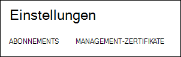
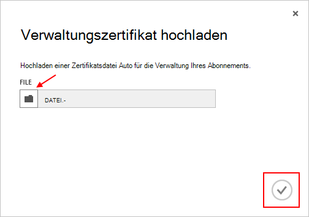

<properties 
    pageTitle="Hochladen eines Zertifikats Azure Management API | Microsoft Azure" 
    description="Erfahren Sie, wie eine Management-API Zertifikat für Azure-Verwaltungsportal hochladen." 
    services="cloud-services" 
    documentationCenter=".net" 
    authors="Thraka" 
    manager="timlt" 
    editor=""/>

<tags 
    ms.service="na" 
    ms.workload="tbd" 
    ms.tgt_pltfrm="na" 
    ms.devlang="na" 
    ms.topic="article" 
    ms.date="04/18/2016"
    ms.author="adegeo"/>

# Hochladen einer Zeugnisse Azure Management-API

Verwaltungszertifikate können die Service Management API von Azure authentifizieren. Viele Programme und Tools (wie Visual Studio oder Azure SDK) verwendet diese Zertifikate Vorlagen, Konfiguration und Bereitstellung von verschiedenen Azure Services automatisieren. **Dies gilt nur für klassischen Azure-Portal**. 

>[AZURE.WARNING] Sei vorsichtig! Diese Zertifikate können wer authentifiziert, damit das Abonnement verwalten, denen, dem Sie zugeordnet sind. 

Weitere Informationen zu Azure Zertifikate (einschließlich ein selbstsigniertes Zertifikat erstellen) ist bei Bedarf [verfügbar](cloud-services/cloud-services-certs-create.md#what-are-management-certificates) .

[Azure Active Directory](/services/active-directory/) können Sie Clientcode für Automatisierung authentifizieren.

## Verwaltungszertifikat hochladen

Haben Sie eine Management-Zertifikat erstellt, (CER-Datei mit dem öffentlichen Schlüssel) können Sie es in das Portal hochladen. Wenn das Zertifikat im Portal verfügbar ist, jeder mit einem entsprechenden Certficiate (privater Schlüssel) über die Management-API verbinden und Zugriff auf die Ressourcen für das Abonnement zugeordnet.

1. [Klassische Azure-Portal](http://manage.windowsazure.com)anmelden.

2. Stellen Sie sicher das richtige Abonnement auswählen, dem Sie ein Zertifikat zuordnen möchten. Drücken Sie den **Abonnements** Text oben rechts im Portal.

    

3. Nachdem Sie das richtige Abonnement ausgewählt haben, drücken Sie auf der linken Seite des Portals (möglicherweise müssen scrollen) **Settings** . 
    
    

4. Drücken Sie auf **Verwaltungszertifikate** .

    
    
5. Die Schaltfläche **Hochladen** .

    
    
6. Füllen Sie das Dialogfeld Informationen ein, und drücken Sie Fertig **Häkchen**.

    

## Nächste Schritte

Jetzt haben Sie eine Management-Zertifikat ein Abonnement zugeordneten können (nachdem Sie das entsprechende Zertifikat lokal installiert haben) programmgesteuert [Service Management REST API](https://msdn.microsoft.com/library/azure/mt420159.aspx) verbinden und automatisieren die verschiedenen Azure Ressourcen auch dieses Abonnement zugeordnet. 