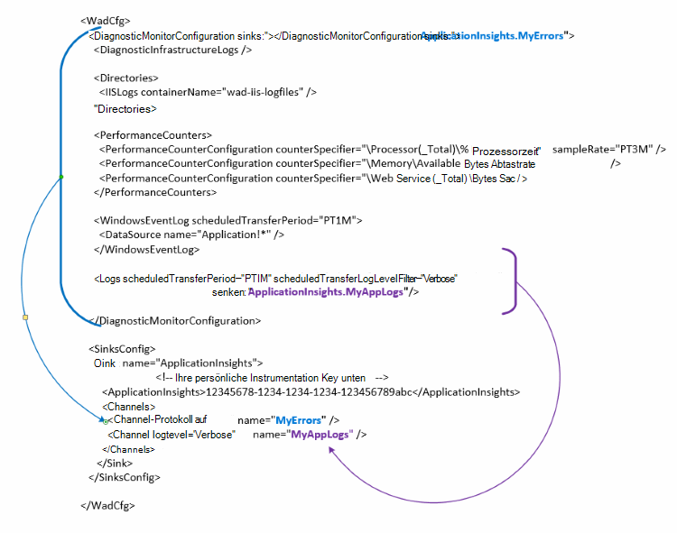

<properties
   pageTitle="Azure-Diagnose zum Senden von Daten an Application Insights konfigurieren | Microsoft Azure"
   description="Aktualisieren der öffentlichen Azure-Diagnose-Konfigurations zum Senden von Daten an Application Insights."
   services="multiple"
   documentationCenter=".net"
   authors="sbtron"
   manager="douge"
   editor="" />
<tags
   ms.service="application-insights"
   ms.devlang="na"
   ms.topic="article"
   ms.tgt_pltfrm="na"
   ms.workload="na"
   ms.date="12/15/2015"
   ms.author="saurabh" />

# Konfigurieren von Azure Diagnostics Daten an Application Insights senden

Azure-Diagnose speichert Daten in Azure Tabellen.  Allerdings können Sie auch alle Pipe oder eine Teilmenge der Daten Anwendung Einblicke "senken" und "Kanäle" in Ihrer Konfiguration konfigurieren, bei Azure Diagnostics Erweiterung 1.5 oder höher.

Dieser Artikel beschreibt, wie die öffentliche Konfiguration für die Erweiterung der Azure-Diagnose, die konfigurierte Anwendung Einblicke Daten an.

## Konfigurieren von Anwendung Einblicke als Senke

Die Erweiterung Azure Diagnostics 1.5 führt die **<SinksConfig>** Element der öffentlichen Konfiguration. Definiert zusätzliche *Senke* , Azure Diagnostics Daten gesendet werden können. Geben Sie die Details der Anwendung Einblicke Ressource zum Senden von Azure Diagnostics Daten als Teil soll **<SinksConfig>**.
Ein Beispiel sieht **SinksConfig** -  

    <SinksConfig>
        <Sink name="ApplicationInsights">
          <ApplicationInsights>{Insert InstrumentationKey}</ApplicationInsights>
          <Channels>
            <Channel logLevel="Error" name="MyTopDiagData"  />
            <Channel logLevel="Verbose" name="MyLogData"  />
          </Channels>
        </Sink>
      </SinksConfig>

Für das Element **Senke** gibt *das Namensattribut* einen Zeichenfolgenwert, der den Empfänger eindeutig auf verwendet wird.
Das Element **ApplicationInsights** gibt instrumentationsschlüssel der Anwendung Einblicke Ressource wohin Azure Diagnosedaten. Haben Sie eine vorhandene Anwendung Einblicke Ressource, finden Sie unter [Erstellen einer neuen Anwendung Einblicke Ressource](./application-insights/app-insights-create-new-resource.md) Weitere Informationen zum Erstellen einer Ressource und der Instrumentation Schlüssel.

Entwickeln eines Cloud-Dienst in Azure SDK 2.8 wird dieser instrumentationsschlüssel in öffentlichen Konfiguration anhand der Einstellung **APPINSIGHTS_INSTRUMENTATIONKEY** Service Verpackung Cloud-Dienstprojekt automatisch ausgefüllt. Siehe [Anwendung Einblicke Azure-Diagnose von Problemen Cloud-Dienst verwenden](./cloud-services/cloud-services-dotnet-diagnostics-applicationinsights.md).

**Kanäle** -Element können Sie ein oder mehrere **Channel** -Elemente für die Daten definieren, die an den Empfänger gesendet werden. Der Kanal fungiert als Filter und ermöglicht es Ihnen, bestimmte Protokollstufen auswählen, die Sie an den Empfänger senden möchten. Angenommen Sie ausführliche Protokolle zu sammeln und an Speicher konnte aber Sie definieren einen Kanal mit einem Protokoll Fehler und senden Protokolle über Channel nur Fehlerprotokolle, Senke weitergeleitet werden können.
Für einen **Kanal** wird das *Name* -Attribut eindeutig auf diesem Kanal verwendet.
*Loglevel* -Attribut können Sie die Protokollierungsstufe angeben, die der Kanal ermöglicht. Die verfügbaren Protokollebenen am wenigsten Informationen sind
 - Ausführliche
 - Informationen
 - Warnung
 - Fehler
 - Wichtige

## Senden von Daten an die Senke Anwendung Einblicke
Nachdem die Anwendung Einblicke Senke definiert wurde können Sie Daten an diese Empfänger senden, Elemente unter dem Knoten **DiagnosticMonitorConfiguration** *Senke* -Attribut hinzugefügt. Jeder Knoten *Ereignissenken* Element hinzufügen gibt an, dass Sie Daten, und jeder Knoten wird an den angegebenen Empfänger gesendet werden.

Beispielsweise möchten Sie die Daten senden, die von Azure Diagnostics werden können Sie *Empfänger* -Attribut direkt **DiagnosticMonitorConfiguration** Knoten hinzufügen. Legen Sie den Wert von *Ereignissenken* Sink-Namen, die in der **SinkConfig**angegeben wurde.

    <DiagnosticMonitorConfiguration overallQuotaInMB="4096" sinks="ApplicationInsights">

Wenn Sie senden nur Fehlerprotokolle Anwendung Erkenntnisse auffangen können Sie *Ereignissenken* Wert Senke gefolgt von den Kanalnamen durch einen Punkt getrennt festlegen ("."). Verwenden Sie beispielsweise Application Insights nur Fehlerprotokolle an Senke MyTopDiagdata Kanal im obigen SinksConfig definiert.  

    <DiagnosticMonitorConfiguration overallQuotaInMB="4096" sinks="ApplicationInsights.MyTopDiagdata">

Wenn Sie nur Anwendung Einblicke ausführliche Anwendungsprotokolle an würden Sie den Knoten **Protokolle** *sinkt* Attribut hinzufügen.

    <Logs scheduledTransferPeriod="PT1M" scheduledTransferLogLevelFilter="Verbose" sinks="ApplicationInsights.MyLogData"/>

In der Konfiguration auf verschiedenen Ebenen in der Hierarchie können Sie Spülbecken auch. In diesem Fall fungiert die Senke auf der obersten Ebene der Hierarchie angegeben als globale Einstellung einzelnes Element Element wirkt wie überschreibt diese globale Einstellung angegeben.    

Hier ist ein vollständiges Beispiel öffentliche Datei, die alle Fehler in Anwendung Einblicke (angegeben in der **DiagnosticMonitorConfiguration** -Knoten) und außerdem ausführliche Ebene für Application Logs ( **Protokolle** Knoten angegeben) sendet.

    <WadCfg>
      <DiagnosticMonitorConfiguration overallQuotaInMB="4096"
           sinks="ApplicationInsights.MyTopDiagData"> <!-- All info below sent to this channel -->
        <DiagnosticInfrastructureLogs />
        <PerformanceCounters>
          <PerformanceCounterConfiguration counterSpecifier="\Processor(_Total)\% Processor Time" sampleRate="PT3M" sinks="ApplicationInsights.MyLogData/>
          <PerformanceCounterConfiguration counterSpecifier="\Memory\Available MBytes" sampleRate="PT3M" />
          <PerformanceCounterConfiguration counterSpecifier="\Web Service(_Total)\Bytes Total/Sec" sampleRate="PT3M" />
        </PerformanceCounters>
        <WindowsEventLog scheduledTransferPeriod="PT1M">
          <DataSource name="Application!*" />
        </WindowsEventLog>
        <Logs scheduledTransferPeriod="PT1M" scheduledTransferLogLevelFilter="Verbose"
                sinks="ApplicationInsights.MyLogData"/> <!-- This specific info sent to this channel -->
      </DiagnosticMonitorConfiguration>

    <SinksConfig>
        <Sink name="ApplicationInsights">
          <ApplicationInsights>{Insert InstrumentationKey}</ApplicationInsights>
          <Channels>
            <Channel logLevel="Error" name="MyTopDiagData"  />
            <Channel logLevel="Verbose" name="MyLogData"  />
          </Channels>
        </Sink>
      </SinksConfig>
    </WadCfg>

Es gibt einige Einschränkungen über diese Funktionen

- Kanäle dienen lediglich als Protokolltyp und keine Leistungsindikatoren arbeiten. Wenn Sie einen Kanal mit einem Leistungsindikatorelement angeben werden ignoriert.
- Die Protokollebene für einen Kanal darf nicht überschreiten die Protokollebene für von Azure Diagnostics gesammelt werden. Beispiel: nicht Anwendungsprotokoll Fehler im Element Protokolle sammeln und Verbose senden möchten Protokolle Application Insight-Senke. Das *ScheduledTransferLogLevelFilter* -Attribut muss immer gleich sammeln oder weitere Protokolle als Protokolle soll an einen Empfänger senden.
- BLOB-Daten können nicht an Application Insights von Azure Diagnostics Erweiterung senden. Zum Beispiel etwas unter dem Knoten *Verzeichnisse* angegeben. Für Absturzabbildern tatsächliche Absturzabbild weiterhin erhalten BLOB-Speicher und nur eine Benachrichtigung, dass das Speicherabbild erzeugt wurde an Application Insights gesendet.

## Nächste Schritte

- Mithilfe von [PowerShell](./cloud-services/cloud-services-diagnostics-powershell.md) Azure Diagnostics Erweiterung für Ihre Anwendung aktivieren. 
- Verwenden Sie [Visual Studio](vs-azure-tools-diagnostics-for-cloud-services-and-virtual-machines.md) Azure Diagnostics Erweiterung für Ihre Anwendung aktivieren
