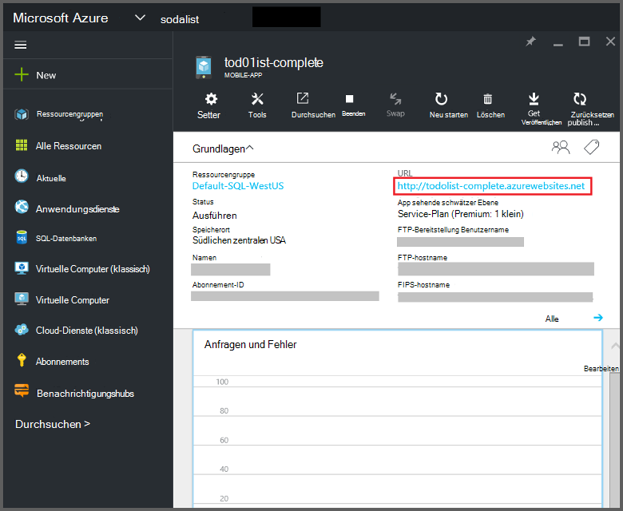
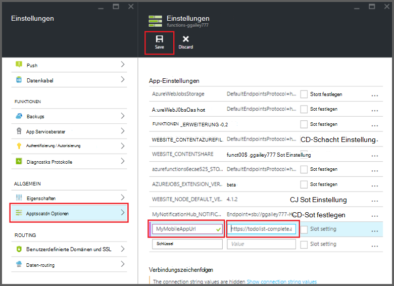

<properties
    pageTitle="Azure Funktionen Mobile Apps Bindings | Microsoft Azure"
    description="Verstehen Sie, wie Azure Mobile Apps Bindings in Azure-Funktionen verwenden."
    services="functions"
    documentationCenter="na"
    authors="ggailey777"
    manager="erikre"
    editor=""
    tags=""
    keywords="Azure Funktionen, Funktionen, Verarbeitung von Ereignissen, dynamische Compute serverlose Architektur"/>

<tags
    ms.service="functions"
    ms.devlang="multiple"
    ms.topic="reference"
    ms.tgt_pltfrm="multiple"
    ms.workload="na"
    ms.date="08/30/2016"
    ms.author="glenga"/>

# Azure Funktionen Mobile Apps Bindungen

[AZURE.INCLUDE [functions-selector-bindings](../../includes/functions-selector-bindings.md)]

Dieser Artikel beschreibt das Konfigurieren und Code Azure Mobile Apps Bindings in Azure-Funktionen. 

[AZURE.INCLUDE [intro](../../includes/functions-bindings-intro.md)] 

Azure App Service Mobile Apps können Sie die Daten auf mobilen Clients Endpunkt verfügbar machen. Diese tabellarischen Daten mit beiden verwendet werden können und Bindungen in Azure Funktionen ausgegeben. Da dynamische Schema unterstützt wird, eignet sich eine app Node.js Back-End zum Offenlegen von Tabellendaten mit Funktionen. Dynamische Schema ist standardmäßig aktiviert und sollten in eine Produktions-app deaktiviert. Weitere Informationen über Endpunkte in Node.js Backend-Tabelle finden Sie unter [Übersicht: Tabelle Operations](../app-service-mobile/app-service-mobile-node-backend-how-to-use-server-sdk.md#TableOperations). Mobile Apps unterstützt Node.js-Back-End-Portal durchsuchen und Bearbeiten von Tabellen. Weitere Informationen finden Sie im Thema Node.js SDK [im Portal bearbeiten](../app-service-mobile/app-service-mobile-node-backend-how-to-use-server-sdk.md#in-portal-editing) . Bei Verwendung eine .NET Backend-app mit Azure müssen Sie das Datenmodell gemäß Ihrer Funktion manuell aktualisieren. Weitere Informationen über Endpunkte in eine app .NET Backend-Tabelle finden Sie [wie: definieren einen Tabelle Controller](../app-service-mobile/app-service-mobile-dotnet-backend-how-to-use-server-sdk.md#define-table-controller) in .NET Backend-SDK-Thema. 

## Erstellen Sie eine Umgebungsvariable für die mobile Anwendung Backend-URL

Mobile Apps Bindungen müssen eine Umgebungsvariable zu erstellen, die die URL der mobilen Anwendung Backend selbst zurückgibt. Diese URL in [Azure-Portal](https://portal.azure.com) finden der mobilen Anwendung finden und das Blade.

Diese URL als Umgebungsvariable in Ihrer Funktion Anwendung festlegen:

1. In Ihrer Funktion Anwendung in [Azure Funktionen Portal](https://functions.azure.com/signin)klicken Sie **Funktion app** > **App Service Einstellungen**. 

    

2. Klicken Sie auf **Alle**in Ihrer app Funktion Scrollen Sie **ApplicationSettings**, dann unter **App-Einstellungen** geben einen neuen **Namen** für die Umgebungsvariable, fügen Sie **Wert**dafür HTTPS-Schema verwenden, klicken Sie auf **Speichern** und schließen Funktion app Blade Portal Funktionen wieder den URL ein.   

    

Sie können jetzt dieses neue Umgebungsvariable als Feld *Verbindung* in Bindung festlegen.

## Verwenden Sie einen API-Schlüssel sicherer Zugriff auf Mobile Apps Tabelle Endpunkte.

In Azure Funktionen können mobile Tabelle Bindings Angabe ein API-Schlüssels die gemeinsamen geheimen Schlüssel mit unerwünschten apps als Funktionen verhindern. Integrierte Unterstützung für die Authentifizierung der API-Schlüssel keinen Mobile Apps. Allerdings können Sie anhand der Beispiele in [Azure App Service Mobile Apps Back-End-Implementierung eines API-Schlüssels](https://github.com/Azure/azure-mobile-apps-node/tree/master/samples/api-key)ein API-Schlüssels in der mobilen Node.js-Backend-Anwendung implementieren. Sie können ebenso einen API-Schlüssel in einer [mobilen .NET Back-End-Anwendung](https://github.com/Azure/azure-mobile-apps-net-server/wiki/Implementing-Application-Key)implementieren.

>[AZURE.IMPORTANT] Diesen API-Schlüssel muss nicht mit der mobilen Anwendung Clients verteilt werden, es sollten nur verteilt werden sicher dienstseitigen Kunden wie Azure-Funktionen. 

## Azure Mobile Apps Eingabe Bindung

Eingabebindungen können einen Datensatz von einem Endpunkt mobile Tabelle laden und direkt an die Bindung übergeben. Datensatz ID bestimmt basierend auf dem Auslöser, der die Funktion aufgerufen. In einem C#-Funktion sind Änderungen an den Datensatz zur Tabelle automatisch gesendet, wenn die Funktion erfolgreich beendet wird.

#### Function.JSON für Mobile Apps input Bindung

Die *function.json* -Datei unterstützt die folgenden Eigenschaften:

- `name`: Variablenname in den Code für den neuen Datensatz.
- `type`: Bieten Typ muss auf *MobileTable*festgelegt.
- `tableName`: Die Tabelle, in der neue Datensatz erstellt werden.
- `id`Die ID des Datensatzes abrufen. Diese Eigenschaft unterstützt die Bindung wie `{queueTrigger}`, die verwendet des Zeichenfolgenwert der warteschlangennachricht als Datensatz-ID
- `apiKey`: Zeichenfolge, die die Anwendung festlegen, gibt den optionalen API-Schlüssel für die app. Dies ist erforderlich, wenn der mobilen Anwendung ein API-Schlüssels zum Client Zugriff verwendet.
- `connection`: Zeichenfolge, die den Namen der Umgebungsvariablen in Einstellungen mit der URL der mobilen Anwendung Backend.
- `direction`: Bindung Richtung, die *in*festgelegt werden muss.

Beispiel *function.json* -Datei:

    {
      "bindings": [
        {
          "name": "record",
          "type": "mobileTable",
          "tableName": "MyTable",
          "id" : "{queueTrigger}",
          "connection": "My_MobileApp_Url",
          "apiKey": "My_MobileApp_Key",
          "direction": "in"
        }
      ],
      "disabled": false
    }

#### Azure Mobile Apps Codebeispiel für C# Warteschlange trigger

Basierend auf den oben für das function.json von Beispiel input Bindung ruft Datensatz von Mobile Apps Tabelle Endpunkt mit der ID, die die Zeichenfolge der Warteschlange und *Datensatz* -Parameter übergibt. Wenn der Datensatz nicht gefunden wird, ist der Parameter null. Der Datensatz wird mit *dem neuen Textwert* dann aktualisiert, wenn die Funktion beendet wird.

    #r "Newtonsoft.Json"    
    using Newtonsoft.Json.Linq;
    
    public static void Run(string myQueueItem, JObject record)
    {
        if (record != null)
        {
            record["Text"] = "This has changed.";
        }    
    }

#### Azure Mobile Apps Codebeispiel Node.js Warteschlange Trigger

Basierend auf den oben für das function.json von Beispiel input Bindung ruft Datensatz von Mobile Apps Tabelle Endpunkt mit der ID, die die Zeichenfolge der Warteschlange und *Datensatz* -Parameter übergibt. Node.js-Funktionen sind nicht aktualisierten Datensätze zur Tabelle gesendet. Dieses Codebeispiel schreibt abgerufenen Datensatz in das Protokoll.

    module.exports = function (context, input) {    
        context.log(context.bindings.record);
        context.done();
    };

## Azure Mobile Apps Ausgabe Bindung

Die Funktion kann einen Datensatz in eine Mobile Apps Tabelle Endpunkt eine Ausgabe binden schreiben. 

#### Function.JSON für Mobile Apps Ausgabe Bindung

Die function.json-Datei unterstützt die folgenden Eigenschaften:

- `name`: Variablenname in den Code für den neuen Datensatz.
- `type`: Bindung Typ, der auf *MobileTable*festgelegt sein muss.
- `tableName`: Die Tabelle, in der neue Datensatz erstellt wird.
- `apiKey`: Zeichenfolge, die die Anwendung festlegen, gibt den optionalen API-Schlüssel für die app. Dies ist erforderlich, wenn der mobilen Anwendung ein API-Schlüssels zum Client Zugriff verwendet.
- `connection`: Zeichenfolge, die den Namen der Umgebungsvariablen in Einstellungen mit der URL der mobilen Anwendung Backend.
- `direction`: Bindung Richtung *out*festgelegt werden muss.

Beispiel function.json:

    {
      "bindings": [
        {
          "name": "record",
          "type": "mobileTable",
          "tableName": "MyTable",
          "connection": "My_MobileApp_Url",
          "apiKey": "My_MobileApp_Key",
          "direction": "out"
        }
      ],
      "disabled": false
    }

#### Azure Mobile Apps Codebeispiel für C# Warteschlange trigger

In diesem C#-Codebeispiel fügt einen neuen Datensatz in einem Endpunkt Mobile Apps Tabelle mit *Text* -Eigenschaft in der Tabelle oben Bindung angegeben.

    public static void Run(string myQueueItem, out object record)
    {
        record = new {
            Text = $"I'm running in a C# function! {myQueueItem}"
        };
    }

#### Azure Mobile Apps Codebeispiel Node.js Warteschlange Trigger

Dieses Codebeispiel Node.js Fügt einen neuen Datensatz in einem Endpunkt Mobile Apps Tabelle mit *Text* -Eigenschaft in der Tabelle oben Bindung angegeben.

    module.exports = function (context, input) {
    
        context.bindings.record = {
            text : "I'm running in a Node function! Data: '" + input + "'"
        }   
    
        context.done();
    };

## Nächste Schritte

[AZURE.INCLUDE [next steps](../../includes/functions-bindings-next-steps.md)]
