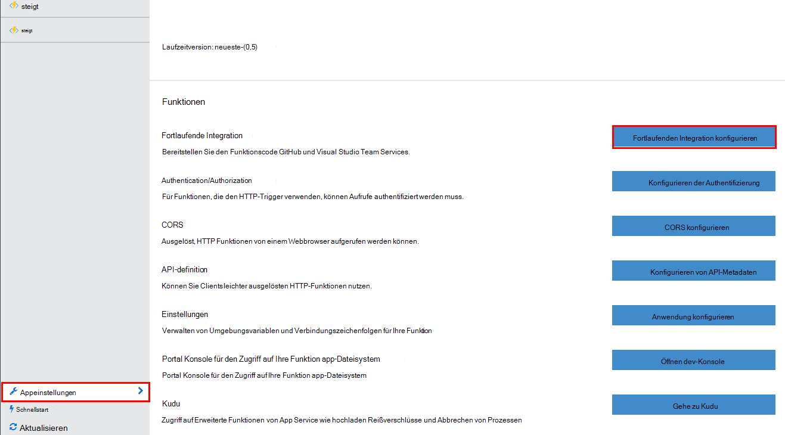
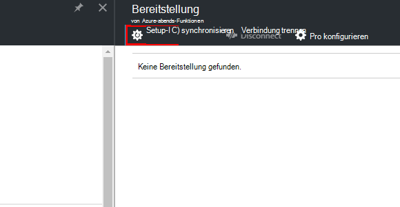
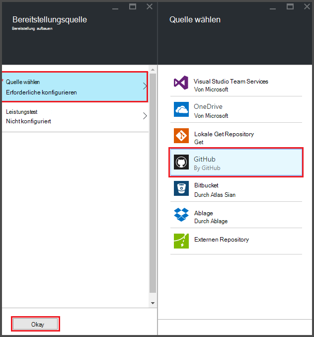
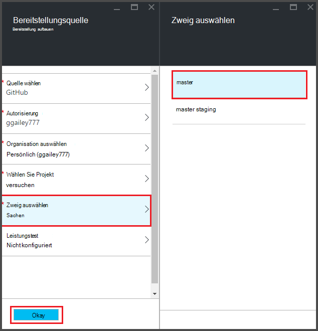
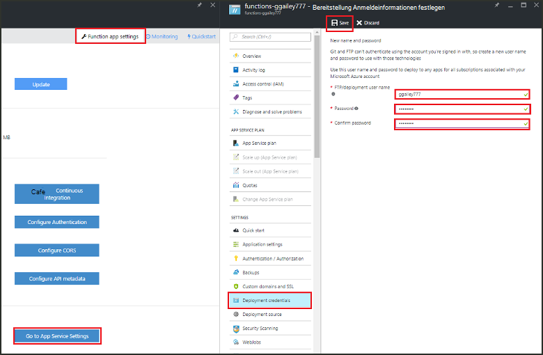
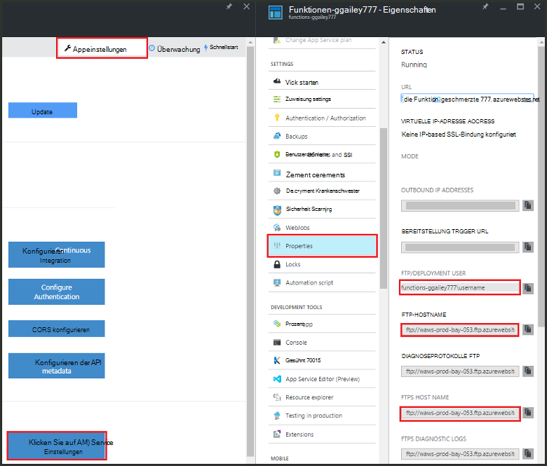
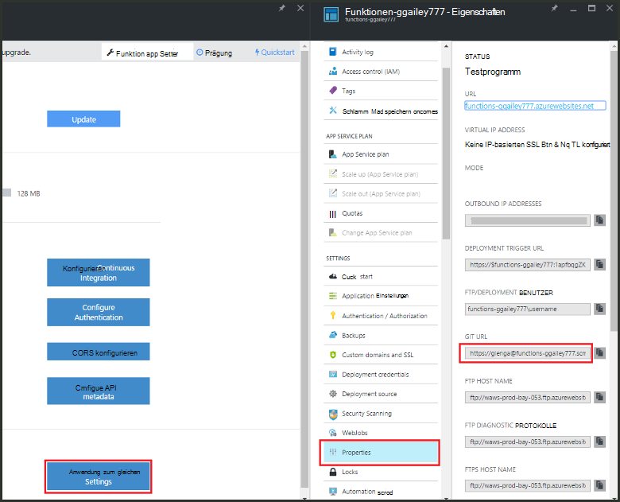

<properties
   pageTitle="Kontinuierliche Bereitstellung für Azure | Microsoft Azure"
   description="Verwenden Sie kontinuierliche Bereitstellung Funktionen von Azure App Service an Ihre Azure-Funktionen."
   services="functions"
   documentationCenter="na"
   authors="ggailey777"
   manager="erikre"
   editor=""
   tags=""
   />

<tags
   ms.service="functions"
   ms.devlang="multiple"
   ms.topic="article"
   ms.tgt_pltfrm="multiple"
   ms.workload="na"
   ms.date="09/25/2016"
   ms.author="glenga"/>

# Kontinuierliche Bereitstellung für Azure 

Azure Funktionen erleichtert die kontinuierliche Bereitstellung für Ihre Funktion zu konfigurieren. Funktionen nutzt Azure App Service Integration BitBucket Dropbox, GitHub und Visual Studio Team Services (VSTS) ermöglichen einen kontinuierliche Bereitstellungsworkflow, Azure zieht Updates Code Funktionen Wenn sie eines dieser Dienste veröffentlicht werden. Wenn Sie Azure-Funktionen sind, beginnen Sie mit [Azure Funktionen (Übersicht)](functions-overview.md).

Kontinuierliche Bereitstellung ist eine hervorragende Option für Projekte, in denen mehrere und regelmäßige Beiträge sind. Sie können auch Datenquellen-Steuerelement auf Ihre Funktionen verwalten. Bereitstellung Quellen werden unterstützt:

+ [Bitbucket](https://bitbucket.org/)
+ [Ablage](https://bitbucket.org/)
+ [Lokale Repo Git](../app-service-web/app-service-deploy-local-git.md)
+ Externe Repo Git
+ [GitHub]
+ Weshalb externe repo
+ [OneDrive](https://onedrive.live.com/)
+ Visual Studio Team Services

Installationen werden pro Funktion app konfiguriert. Nach der Aktivierung der kontinuierlichen Bereitstellung Zugriff auf das Portal Funktion soll *schreibgeschützt*.

## Kontinuierliche Bereitstellung

Ihre bereitstellungsquelle konfiguriert und Code Funktionen müssen in der bereitstellungsquelle bevor Sie Setup kontinuierliche Bereitstellung. In einer Funktion app Bereitstellung jeder Funktion befindet sich in einem Unterverzeichnis, der Verzeichnisname ist es der Name der Funktion. Diese Ordnerstruktur wird im Wesentlichen den Standortcode. 

[AZURE.INCLUDE [functions-folder-structure](../../includes/functions-folder-structure.md)]

## Kontinuierliche Bereitstellung einrichten

Gehen Sie um kontinuierliche Bereitstellung für eine vorhandene Funktion app zu konfigurieren:

1. In Ihrer Funktion Anwendung in [Azure Funktionen Portal](https://functions.azure.com/signin)klicken Sie **Funktion app** > **fortlaufende Integration konfigurieren** > **Einrichten**.

    
    
    
    
    Sie können aus Funktionen Schnellstart Bereitstellung Blatt abrufen, auf **Start vom Datenquellen-Steuerelement**.

2. Blatt Bereitstellungen auf **Quelle auswählen**, füllen Sie die Informationen für die ausgewählte Bereitstellung Datenquelle und klicken Sie auf **OK**.

    

Nach der kontinuierlichen Bereitstellung konfiguriert ist, werden alle Änderungen im Quellcode Bereitstellung Funktion App kopiert und eine vollständige websitebereitstellung ausgelöst. Die Website wird bereitgestellt, wenn Dateien in der Quelle aktualisiert werden.

##Bereitstellungsoptionen

Im folgenden werden einige Szenarien typischerweise:

+ 

###Erstellen einer Stagingdatenbank Bereitstellung

Funktion Apps unterstützen nicht noch Bereitstellung Steckplätze. Allerdings können Sie separate Staging- und Bereitstellung mit kontinuierlicher Integration weiterhin verwalten.

Der Prozess konfigurieren und staging-Bereitstellung sieht in der Regel:

1. Erstellen Sie zwei Funktion apps in Ihr Abonnement für Produktionscode und Staging. 

2. Erstellen Sie eine bereitstellungsquelle, wenn Sie noch keines haben. [GitHub]werden.
 
3. Für Ihre Funktion Produktion die obigen Schritte **kontinuierliche Bereitstellung einrichten** und die Bereitstellung Verzweigung auf master Teil der GitHub Repo festgelegt.

    

4. Wiederholen Sie diesen Schritt für die Stagingdatenbank Funktion app, aber diesmal wählen staging Zweig in Ihrem GitHub Repo. Wenn Ihre bereitstellungsquelle Verzweigen unterstützt, verwenden Sie einen anderen Ordner.
 
5. Updates auf den Code in die Stagingdatenbank Zweigstelle oder Ordner und dann überprüfen Sie, ob die Änderungen in der Stagingdatenbank Bereitstellung erscheinen.

6. Nach dem Testen wandelt Seriendruck aus der Stagingdatenbank master Verzweigung. Dadurch wird die Bereitstellung für die Produktion Funktion app ausgelöst. Wenn Ihre bereitstellungsquelle Zweige unterstützt, überschreiben Sie Dateien in den Ordner Production mit den Dateien aus dem Stagingordner.

###Verschieben Sie vorhandene Funktionen für kontinuierliche Bereitstellung

Wenn Sie vorhandene Funktionen, die Sie erstellt und verwaltet das Portal müssen Sie die vorhandene Funktionsdateien über FTP Herunterladen oder lokale Git Repository vor können kontinuierliche Bereitstellung wie oben beschrieben einrichten. Sie können in der App Einstellungen für Ihre Funktion dazu. Nachdem die Dateien heruntergeladen wurden, können Sie diese bereitstellungsquelle ausgewählten kontinuierliche hochladen.

>[AZURE.NOTE]Nach dem Konfigurieren der fortlaufenden Integration können mehr Quelldateien im Portal Funktionen bearbeiten Sie.

####Gewusst wie: Bereitstellung Anmeldeinformationen konfigurieren
Vor dem Herunterladen von Dateien aus der Funktion app müssen Sie Ihre Anmeldeinformationen für die Website zugreifen, Sie aus dem Portal konfigurieren. Anmeldeinformationen werden auf Ebene der Anwendung festgelegt.

1. In Ihrer Funktion Anwendung in [Azure Funktionen Portal](https://functions.azure.com/signin)klicken Sie **Funktion app** > **App Service Einstellungen** > **Bereitstellung Anmeldeinformationen**.

    

2. Geben Sie Benutzernamen und Kennwort, und klicken Sie auf **Speichern**. Diese Anmeldeinformationen können nun FTP oder integrierte Git Repo app Funktion zugreifen.

####Gewusst wie: Downloaden von Dateien mit FTP

1. In Ihrer Funktion Anwendung in [Azure Funktionen Portal](https://functions.azure.com/signin)klicken Sie **Funktion app** > **App Service Einstellungen** > **Eigenschaften** und Werte für **FTP-Deployment User** **FTP-Hostname**und **FTPS Hostnamen**.  
**FTP-Bereitstellung Benutzer** muss eingegeben werden, wie im Portal, einschließlich der Anwendungsname Kontext für den FTP-Server bereitzustellen.

    
    
2. Vom FTP-Client, verwenden Sie die Verbindungsinformationen für Ihre Anwendung und die Quelldateien für die Funktionen herunterladen gesammelt.

####Gewusst wie: Downloaden von Dateien mit lokalen Git Repository

1. In Ihrer Funktion Anwendung in [Azure Funktionen Portal](https://functions.azure.com/signin)klicken Sie **Funktion app** > **fortlaufende Integration konfigurieren** > **Einrichten**.

2. **Blatt Bereitstellung **Wählen Sie Quelle**und **lokalen Git Repository**klicken.**
 
3. Klicken Sie auf **Anwendung Einstellungen** > **Eigenschaften** und beachten Sie den Wert der Git URL. 
    
    

4. Klonen Sie auf dem lokalen Computer mit Git bewusst Befehlszeile oder Ihrem bevorzugten Git Repo. Der Befehl Git Clone sieht folgendermaßen aus:

        git clone https://username@my-function-app.scm.azurewebsites.net:443/my-function-app.git

5. FETCH Dateien aus Ihrer app Funktion der Klon auf dem lokalen Computer, wie im folgenden Beispiel:

        git pull origin master

    Angefordert, geben Sie den Benutzernamen und das Kennwort für Ihre Bereitstellung Funktion.  

[GitHub]: https://github.com/
