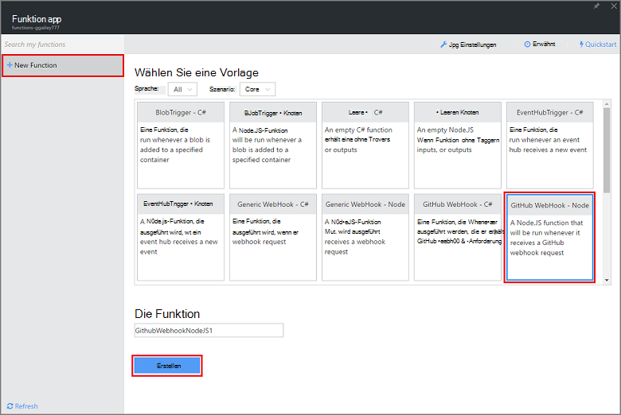
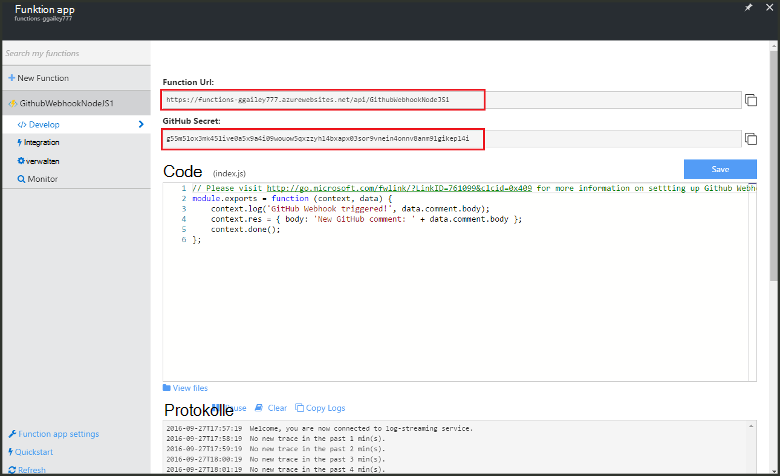
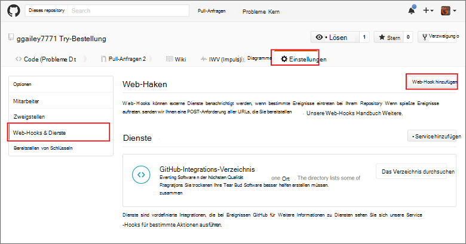
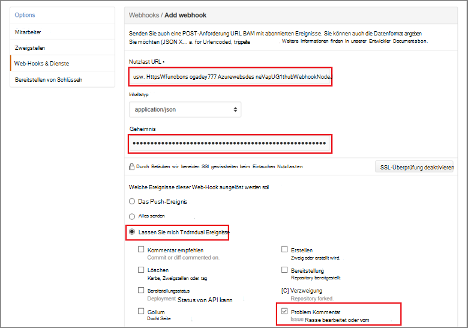

<properties
   pageTitle="Erstellen einer Web-Hook oder API-Funktion Azure | Microsoft Azure"
   description="Mit Azure eine Funktion erstellen, die durch ein WebHook oder eine API aufgerufen aufrufen."
   services="azure-functions"
   documentationCenter="na"
   authors="ggailey777"
   manager="erikre"
   editor=""
   tags=""
   />

<tags
   ms.service="functions"
   ms.devlang="multiple"
   ms.topic="get-started-article"
   ms.tgt_pltfrm="multiple"
   ms.workload="na"
   ms.date="08/30/2016"
   ms.author="glenga"/>
   
# Erstellen eines Webhook oder API-Azure-Funktion

Azure-Funktionen ist ein ereignisgesteuertes, Compute bei Bedarf, die in verschiedenen Programmiersprachen ermöglicht das Erstellen oder die Einheiten von Code ausgelöst implementiert. Azure-Funktionen finden Sie unter [Übersicht über Azure-Funktionen](functions-overview.md).

In diesem Thema veranschaulicht die neue Node.js-Funktion erstellen, die von GitHub Webhook aufgerufen. Die neue Funktion auf Basis einer vordefinierten Vorlage in Azure Funktionen Portal erstellt. Sie können auch einen kurzen Video sehen, wie diese Schritte im Portal ausgeführt werden.

## Video abspielen

Das folgende Video veranschaulicht die grundlegenden Schritte in diesem Lernprogramm 

[AZURE.VIDEO create-a-web-hook-or-api-azure-function]

##Erstellen Sie eine Funktion Webhook ausgelöst von der Vorlage

Eine Funktion Anwendung hostet die Ausführung Ihrer Funktionen in Azure. Vor dem Erstellen einer Funktion müssen Sie ein aktives Azure-Konto. Haben Sie bereits ein Azure-Konto [stehen kostenlose Konten](https://azure.microsoft.com/free/). 

1. Zum [Portal Azure Funktionen](https://functions.azure.com/signin) und mit Ihrem Azure-Konto anmelden.

2. Sie haben eine vorhandene Funktion app, verwenden Sie **die Funktion apps** auswählen klicken Sie auf **Öffnen**. Zum Erstellen einer neuen Funktion, geben Sie einen eindeutigen **Namen** für Ihre neue Funktion oder akzeptieren die generierte, wählen Ihre bevorzugte **Region**dann auf **Erstellen + Einstieg**. 

3. Klicken Sie in Ihrer Anwendung Funktion auf **+ neue Funktion** > **GitHub Webhook - Knoten** > **Erstellen**. Dies erstellt eine Funktion mit einem Standardnamen auf der angegebenen Formularvorlage basiert. 

     

4. Beachten Sie **entwickeln**express.js Beispielfunktion in **das Codefenster** . Diese Funktion ein Problem Kommentar Webhook GitHub-Anforderung empfängt, protokolliert den problemtext und sendet eine Antwort an den Webhook als `New GitHub comment: <Your issue comment text>`.

     

5. Kopieren Sie die **Funktion URL** und **GitHub Schlüssel** Werte Sie benötigen diese beim Erstellen der Webhook in GitHub. 

6. Bildlauf **Ausführen**, beachten Sie vordefinierten JSON-Text eines Kommentars Problem im Hauptteil Anforderung und dann auf **Ausführen**. 
 
    Sie können eine neue Vorlage basierende Funktion überprüfen in der Registerkarte **Erstellen** mit einem erwarteten Körper JSON-Daten und auf die Schaltfläche **Ausführen** . In diesem Fall hat die Vorlage eine vordefinierte Stelle ein Problem Kommentar. 
 
Anschließend erstellen Sie die tatsächlichen Webhook im GitHub Repository.

##Konfigurieren der webhook

1. Navigieren Sie im GitHub ein Repository, das Sie besitzen; Dies schließt alle Repositories gespalten haben.
 
2. **Klicken Sie** > **Webhooks & Services** > **Hinzufügen Webhook**.

       

3. Fügen Sie der Funktion URL und Schlüssel **Nutzlast URL** und **Schlüssel ein**auf **mich auswählen einzelner Ereignisse**, wählen Sie **Problem Kommentar aus** und auf **Hinzufügen Webhook**.

     

GitHub Webhook sieht jetzt die Funktion ausgelöst wird, wenn ein neues Problem Kommentar hinzugefügt wurde.  
Jetzt ist es Zeit zu testen.

##Testen Sie die Funktion

1. Öffnen Sie in Ihrem Repo GitHub Registerkarte **Probleme** in einem neuen Browserfenster, **Neues Problem**, geben Sie einen Titel klicken Sie auf **Neues Problem senden**. Sie können auch ein vorhandenes Problem öffnen.

2. Geben Sie in der Ausgabe einen Kommentar ein und auf **Kommentar**. An diesem Punkt kann man wieder Ihre neue Webhook GitHub unter **Aktuelle Lieferung** Siehe, die eine webhookanforderung gesendet wurde und, die Antwort `New GitHub comment: <Your issue comment text>`.

3. Im Portal Funktionen Scrollen Protokolle und sehen, dass die Funktion ausgelöst wurde und der Wert `New GitHub comment: <Your issue comment text>` , Streaming-Protokolle geschrieben.

##Nächste Schritte

Weitere Informationen zu Azure Funktionen anzeigen

+ [Azure Funktionen-Entwicklerreferenz](functions-reference.md)  
Programmierer Verweis zum Codieren von Funktionen.
+ [Testen der Azure-Funktionen](functions-test-a-function.md)  
Beschreibt die verschiedenen Tools und Techniken zum Testen der Funktionen.
+ [Wie Azure Funktionen](functions-scale.md)  
Beschreibt Servicepläne mit Azure-Funktionen, einschließlich dynamische Service-Plan und den richtigen Plan auswählen.  

[AZURE.INCLUDE [Getting Started Note](../../includes/functions-get-help.md)]
