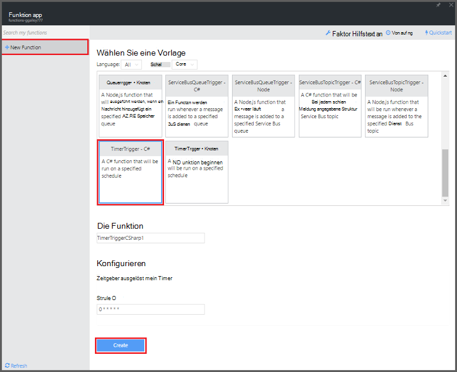
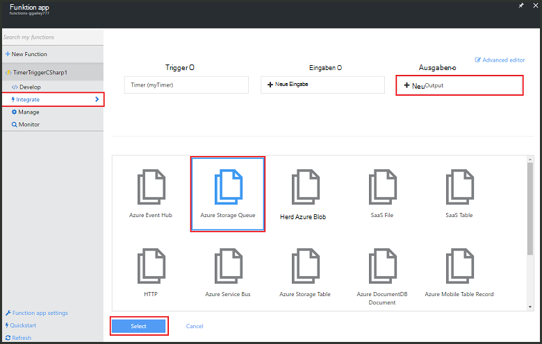
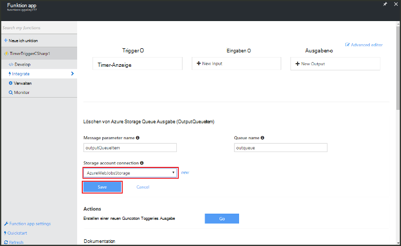

<properties
   pageTitle="Erstellen Sie eine Ereignisverarbeitungsregel Funktion | Microsoft Azure"
   description="Azure Funktionen erstellen Sie eine C#-Funktion, die basierend auf einem Ereignis-Zeitgeber."
   services="functions"
   documentationCenter="na"
   authors="ggailey777"
   manager="erikre"
   editor=""
   tags=""
   />

<tags
   ms.service="functions"
   ms.devlang="multiple"
   ms.topic="get-started-article"
   ms.tgt_pltfrm="multiple"
   ms.workload="na"
   ms.date="09/25/2016"
   ms.author="glenga"/>
   
# Erstellen Sie eine Ereignisverarbeitungsregel Azure-Funktion

Azure-Funktionen ist ein ereignisgesteuertes, Compute bei Bedarf, die in verschiedenen Programmiersprachen ermöglicht das Erstellen oder die Einheiten von Code ausgelöst implementiert. Azure-Funktionen finden Sie unter [Übersicht über Azure-Funktionen](functions-overview.md).

In diesem Thema wird veranschaulicht, wie erstellen Sie eine neue Funktion in C#, die führt basierend auf einem Zeitgeber Nachrichten an eine Speicherwarteschlange hinzufügen. 

## Erforderliche Komponenten 

Vor dem Erstellen einer Funktion müssen Sie ein aktives Azure-Konto. Haben Sie bereits ein Azure-Konto [stehen kostenlose Konten](https://azure.microsoft.com/free/).

## Erstellen Sie eine Funktion Zeitgeber ausgelöst von der Vorlage

Eine Funktion Anwendung hostet die Ausführung Ihrer Funktionen in Azure. Vor dem Erstellen einer Funktion müssen Sie ein aktives Azure-Konto. Haben Sie bereits ein Azure-Konto [stehen kostenlose Konten](https://azure.microsoft.com/free/). 

1. Zum [Portal Azure Funktionen](https://functions.azure.com/signin) und mit Ihrem Azure-Konto anmelden.

2. Sie haben eine vorhandene Funktion app, verwenden Sie **die Funktion apps** auswählen klicken Sie auf **Öffnen**. Zum Erstellen einer neuen Funktion, geben Sie einen eindeutigen **Namen** für Ihre neue Funktion oder akzeptieren die generierte, wählen Ihre bevorzugte **Region**dann auf **Erstellen + Einstieg**. 

3. Klicken Sie in Ihrer Anwendung Funktion auf **+ neue Funktion** > **TimerTrigger C# -** > **Erstellen**. Dies erstellt eine Funktion mit einem Standardnamen termingerecht standardmäßig einmal pro Minute ausgeführt wird. 

    

4. In der neuen Funktion klicken Sie auf der Registerkarte **Integration** > **Neue Ausgabe** > **Azure Storage Queue** > **Wählen**.

    

5. In **Azure Storage Queue Ausgabe**einer vorhandenen **Speicher Kontoverbindung**oder erstellen Sie eine neue zu, klicken Sie auf **Speichern**. 

    

6. Registerkarte **entwickeln** ersetzen Sie das vorhandene C#-Skript im Fenster **Code** durch den folgenden Code:

        using System;
        
        public static void Run(TimerInfo myTimer, out string outputQueueItem, TraceWriter log)
        {
            // Add a new scheduled message to the queue.
            outputQueueItem = $"Ping message added to the queue at: {DateTime.Now}.";
            
            // Also write the message to the logs.
            log.Info(outputQueueItem);
        }

    Dieser Code Fügt eine neue Nachricht mit dem aktuellen Datum und Uhrzeit bei der Ausführung in der Warteschlange.

7. Klicken Sie auf **Speichern** , und beobachten Sie Windows **Protokolle** für die Ausführung der nächsten Funktion.

8. (Optional) Das Speicherkonto navigieren Sie und überprüfen Sie, ob Nachrichten in der Warteschlange hinzugefügt werden.

9. Zurück zu Registerkarte **integrieren** und ändern Sie den Zeitplan auf `0 0 * * * *`. Jetzt einmal pro Stunde ausgeführt. 

Dies ist ein stark vereinfachtes Beispiel Timer Trigger und eine Speicherwarteschlange Ausgabe Bindung. Weitere Informationen finden Sie in der [Azure-Funktionen Timer Trigger](functions-bindings-timer.md) und [Azure Funktionen Trigger und Bindungen für Azure Storage](functions-bindings-storage.md) -Themen.

##Nächste Schritte

Weitere Informationen zu Azure Funktionen anzeigen

+ [Azure Funktionen-Entwicklerreferenz](functions-reference.md)  
Programmierer Referenz für Codierung Funktionen und Trigger und Bindung definieren.
+ [Testen der Azure-Funktionen](functions-test-a-function.md)  
Beschreibt die verschiedenen Tools und Techniken zum Testen der Funktionen.
+ [Wie Azure Funktionen](functions-scale.md)  
Beschreibt Servicepläne mit Azure-Funktionen, einschließlich dynamische Service-Plan und den richtigen Plan auswählen.  

[AZURE.INCLUDE [Getting Started Note](../../includes/functions-get-help.md)]
