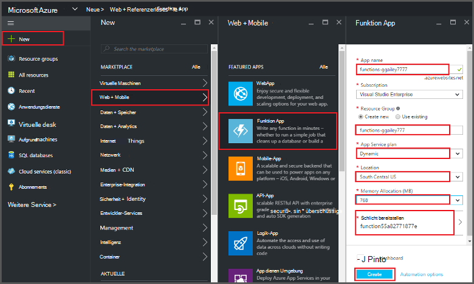
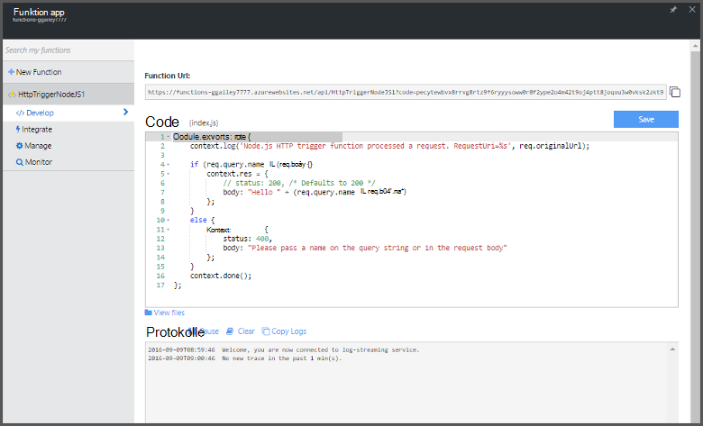

<properties
   pageTitle="Erstellen Sie eine Funktion aus dem Azure-Portal | Microsoft Azure"
   description="Erstellen Sie Ihre erste Azure-Funktion eine serverlose Anwendung in weniger als zwei Minuten."
   services="functions"
   documentationCenter="na"
   authors="ggailey777"
   manager="erikre"
   editor=""
   tags=""
/>

<tags
   ms.service="functions"
   ms.devlang="multiple"
   ms.topic="article"
   ms.tgt_pltfrm="multiple"
   ms.workload="na"
   ms.date="09/08/2016"
   ms.author="glenga"/>

#Erstellen Sie eine Funktion aus der Azure-portal

##Übersicht
Azure Funktionen ist eine ereignisgesteuerte, Compute bei Bedarf, die erweitert vorhandene Azure Anwendungsplattform mit Code ausgelöste Ereignisse in anderen Azure Services SaaS-Produkte sowie auf lokale Systeme implementiert. Azure-Funktionen Ihrer Anwendung nach Bedarf skalieren und Sie bezahlen nur für Ressourcen, die Sie nutzen. Azure Funktionen ermöglicht erstellen oder die Einheiten von Code in verschiedenen Programmiersprachen implementiert ausgelöst. Azure-Funktionen finden Sie unter [Übersicht über Azure-Funktionen](functions-overview.md).

In diesem Thema wird die Verwendung das Azure-Portal erstellen eine einfachen "Hello World" Node.js Azure-Funktion, die von einem HTTP-Trigger aufgerufen wird. Bevor Sie eine Funktion im Azure-Portal erstellen können, müssen Sie explizit eine Funktion app in Azure App Service erstellen. Um die Funktion app automatisch für Sie erstellt haben, [der Azure Funktionen Quickstart Tutorial](functions-create-first-azure-function.md), ist ein einfacher Quickstart umfasst eine Video anzeigen

##Erstellen einer Funktion

Eine Funktion Anwendung hostet die Ausführung Ihrer Funktionen in Azure. Gehen Sie eine Funktion Anwendung in Azure-Portal erstellen.

Vor dem Erstellen der ersten Funktion müssen Sie ein aktives Azure-Konto. Haben Sie bereits ein Azure-Konto [stehen kostenlose Konten](https://azure.microsoft.com/free/).

1. Zum [Azure-Portal](https://portal.azure.com) und mit Ihrem Azure-Konto anmelden.

2. Klicken Sie auf **+ neu** > **Web + Mobile** > **Funktion App**wählen Ihr **Abonnement**einen eindeutigen **Anwendungsname** , der Ihre app Funktion identifiziert und geben Sie dann Folgendes:

    + **[Gruppe](../azure-portal/resource-group-portal.md/)**: Wählen Sie **neu erstellen** , und geben Sie einen Namen für die neue Ressourcengruppe. Sie können auch eine vorhandene Ressourcengruppe, jedoch nicht zum Erstellen eines dynamischen App Service-Plans für Ihre Funktion möglicherweise.
    + **[App Service-Plan](../app-service/azure-web-sites-web-hosting-plans-in-depth-overview.md)**: Wählen Sie *dynamische* oder *classic*. 
        + **Dynamische**: Plan Standardtyp für Azure. Bei Auswahl einen dynamischen Plan müssen Sie auch den **Speicherort** und legen **Speicher belegen** (in MB). Informationen über den Einfluss der Speicher reservieren Kosten finden Sie unter [Azure Funktionen Preise](https://azure.microsoft.com/pricing/details/functions/). 
        + **Klassisch**: klassische App Service-Plan müssen Sie eine **App Plan/Speicherort** erstellen oder eine vorhandene auswählen. Diese Einstellungen bestimmen die [Features, Kosten und compute-Ressourcen](https://azure.microsoft.com/pricing/details/app-service/) Ihrer Anwendung zugeordnet.  
    + **Konto**: jede Funktion app erfordert ein Speicherkonto. Wählen Sie ein vorhandenes Speicherkonto oder erstellen. 

    

3. Klicken Sie auf **Erstellen** , bereitstellen und Bereitstellen Sie die neue Funktion app.  

Die Funktion app bereitgestellt wird, können Sie die erste Funktion erstellen.

## Erstellen einer Funktion

Diese Schritte erstellen Sie eine Funktion von Azure Funktionen Schnellstart.

1. Auf der Registerkarte **Schnellstart** **WebHook + API** und **JavaScript**klicken **Erstellen Sie eine Funktion**. Eine neue vordefinierte Node.js-Funktion erstellt. 

    

2. (Optional) Zu diesem Zeitpunkt im Schnellstart können Sie eine schnelle Azure Funktionen im Portal Tour Funktionen.   Sobald abgeschlossen oder übersprungen Tour können Sie die neue Funktion testen, mithilfe des HTTP-Triggers.

##Testen Sie die Funktion

Da Azure Funktionen Schnellstarts funktionalen Code enthalten, können Sie sofort die neue Funktion testen.

1. Überprüfen Sie auf der Registerkarte **Erstellen** **das Codefenster** und feststellen Sie, dass dieser Node.js-Code eine HTTP-Anforderung mit einem *Name* im Nachrichtentext oder in einer Abfragezeichenfolge übergeben erwartet. Wenn die Funktion ausgeführt wird, wird dieser Wert in der Antwortnachricht zurückgegeben.

    

2. Textfeld **Anforderungsinhalt** , ändern Sie den Wert der *Name* -Eigenschaft in Ihren Namen, und klicken Sie auf **Ausführen**. Sie sehen, dass die Ausführung durch einen Test HTTP-Anforderung ausgelöst wird, wird die Streaming-Protokolle Informationen geschrieben, und die Antwort "Hello" in der **Ausgabe**angezeigt. 

3. Um dieselbe Funktion in einem anderen Browserfenster oder Registerkarte auszulösen, kopieren **Funktion URL** -Wert auf der Registerkarte **Erstellen** in eine Webbrowser-Adressleiste einfügen und fügen den Wert der Abfragezeichenfolge `&name=yourname` und drücken Sie die EINGABETASTE. Die gleiche Informationen in die Protokolle geschrieben und der Browser zeigt die Reaktion "Hello" vor.

##Nächste Schritte

Dieser Schnellstart veranschaulicht eine sehr einfache Ausführung einer grundlegenden HTTP ausgelöst Funktion. Anzeigen Sie weitere Informationen über die Stärke von Azure Funktionen in Ihren apps

+ [Azure Funktionen-Entwicklerreferenz](functions-reference.md)  
Programmierer Referenz für Codierung Funktionen und Trigger und Bindung definieren.
+ [Testen der Azure-Funktionen](functions-test-a-function.md)  
Beschreibt die verschiedenen Tools und Techniken zum Testen der Funktionen.
+ [Wie Azure Funktionen](functions-scale.md)  
Beschreibt Servicepläne mit Azure-Funktionen, einschließlich dynamische Service-Plan und den richtigen Plan auswählen. 
+ [Was ist Azure App Service?](../app-service/app-service-value-prop-what-is.md)  
Azure Funktionen verwendet Azure App Service Plattform für Kernfunktionen wie Bereitstellung, Umgebungsvariablen und Diagnose. 

[AZURE.INCLUDE [Getting Started Note](../../includes/functions-get-help.md)]
