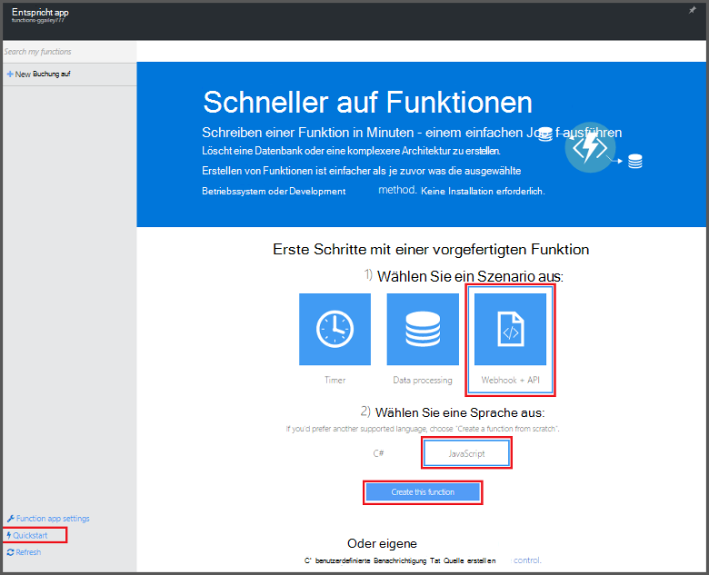

<properties
   pageTitle="Erstellen Sie Ihre erste Azure-Funktion | Microsoft Azure"
   description="Erstellen Sie Ihre erste Azure-Funktion eine serverlose Anwendung in weniger als zwei Minuten."
   services="functions"
   documentationCenter="na"
   authors="ggailey777"
   manager="erikre"
   editor=""
   tags=""
/>

<tags
   ms.service="functions"
   ms.devlang="multiple"
   ms.topic="hero-article"
   ms.tgt_pltfrm="multiple"
   ms.workload="na"
   ms.date="09/08/2016"
   ms.author="glenga"/>

#Erstellen Sie Ihre erste Azure-Funktion

##Übersicht
Azure Funktionen ist eine ereignisgesteuerte, Compute bei Bedarf, die erweitert vorhandene Azure Anwendungsplattform mit Code ausgelöste Ereignisse in anderen Azure Services SaaS-Produkte sowie auf lokale Systeme implementiert. Azure-Funktionen Ihrer Anwendung nach Bedarf skalieren und Sie bezahlen nur für Ressourcen, die Sie nutzen. Azure Funktionen ermöglicht erstellen oder die Einheiten von Code in einer Vielzahl von Programmiersprachen implementiert ausgelöst. Azure-Funktionen finden Sie unter [Übersicht über Azure-Funktionen](functions-overview.md).

In diesem Thema wird veranschaulicht, wie mit Schnellstart Azure Funktionen im Portal eine einfache "hello World" Node.js-Funktion erstellen, die von einem HTTP-Trigger aufgerufen wird. Sie können auch einen kurzen Video sehen, wie diese Schritte im Portal ausgeführt werden.

## Video abspielen

Das folgende Video zeigen, wie grundlegende Schritte in diesem Lernprogramm. 

[AZURE.VIDEO create-your-first-azure-function-simple]

##Erstellen Sie eine Funktion aus der Schnellstart

Eine Funktion Anwendung hostet die Ausführung Ihrer Funktionen in Azure. Führen Sie diese Schritte, um eine neue Funktion app sowie die neue Funktion. Die neue Funktion app wird mit einer Standardkonfiguration erstellt. Beispielsweise Ihre app Funktion explizit erstellen anzeigen Sie [der Azure Funktionen Quickstart tutorial](functions-create-first-azure-function-azure-portal.md)

Vor dem Erstellen der ersten Funktion müssen Sie ein aktives Azure-Konto. Haben Sie bereits ein Azure-Konto [stehen kostenlose Konten](https://azure.microsoft.com/free/).

1. Zum [Portal Azure Funktionen](https://functions.azure.com/signin) und mit Ihrem Azure-Konto anmelden.

2. Geben Sie einen eindeutigen **Namen** für Ihre neue Funktion oder akzeptieren Sie die generierte, bevorzugte **Region**auswählen und dann auf **Erstellen + Einstieg**. 

3. Auf der Registerkarte **Schnellstart** **WebHook + API** und **JavaScript**klicken **Erstellen Sie eine Funktion**. Eine neue vordefinierte Node.js-Funktion erstellt. 

    

4. (Optional) Zu diesem Zeitpunkt im Schnellstart können Sie eine schnelle Azure Funktionen im Portal Tour Funktionen.   Sobald abgeschlossen oder übersprungen Tour können Sie die neue Funktion testen, mithilfe des HTTP-Triggers.

##Testen Sie die Funktion

Da Azure Funktionen Schnellstarts funktionalen Code enthalten, können Sie sofort die neue Funktion testen.

1. Überprüfen Sie auf der Registerkarte **Erstellen** **das Codefenster** und feststellen Sie, dass dieser Node.js-Code eine HTTP-Anforderung mit einem *Name* im Nachrichtentext oder in einer Abfragezeichenfolge übergeben erwartet. Wenn die Funktion ausgeführt wird, wird dieser Wert in der Antwortnachricht zurückgegeben.

    

2. Textfeld **Anforderungsinhalt** , ändern Sie den Wert der *Name* -Eigenschaft in Ihren Namen, und klicken Sie auf **Ausführen**. Sehen Sie, dass Ausführung durch einen Test HTTP-Anforderung ausgelöst wird, wird die Streaming-Protokolle Informationen geschrieben, und die Antwort "Hello" in der **Ausgabe**angezeigt. 

3. Um dieselbe Funktion in einem anderen Browserfenster oder Registerkarte auszulösen, kopieren **Funktion URL** -Wert auf der Registerkarte **Erstellen** in eine Webbrowser-Adressleiste einfügen und fügen den Wert der Abfragezeichenfolge `&name=yourname` und drücken Sie die EINGABETASTE. Die gleiche Informationen in die Protokolle geschrieben und der Browser zeigt die Reaktion "Hello" vor.

##Nächste Schritte

Dieser Schnellstart veranschaulicht eine sehr einfache Ausführung einer grundlegenden HTTP ausgelöst Funktion. Anzeigen Sie weitere Informationen über die Nutzung der Azure-Funktionen in Ihren apps

+ [Azure Funktionen-Entwicklerreferenz](functions-reference.md)  
Programmierer Referenz für Codierung Funktionen und Trigger und Bindung definieren.
+ [Testen der Azure-Funktionen](functions-test-a-function.md)  
Beschreibt die verschiedenen Tools und Techniken zum Testen der Funktionen.
+ [Wie Azure Funktionen](functions-scale.md)  
Beschreibt Servicepläne mit Azure-Funktionen, einschließlich dynamische Service-Plan und den richtigen Plan auswählen. 
+ [Was ist Azure App Service?](../app-service/app-service-value-prop-what-is.md)  
Azure Funktionen nutzt Azure App Service Plattform für Kernfunktionen wie Bereitstellung, Umgebungsvariablen und Diagnose. 

[AZURE.INCLUDE [Getting Started Note](../../includes/functions-get-help.md)]
