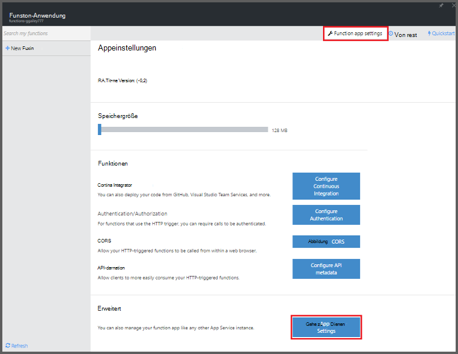
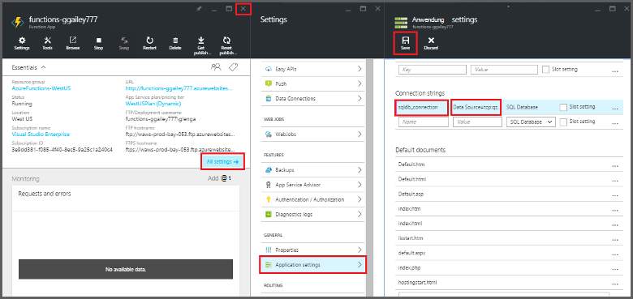

<properties
   pageTitle="Verwenden, um eine geplante Cleanup Aufgabe Azure Funktionen | Microsoft Azure"
   description="Azure Funktionen erstellen Sie eine C#-Funktion, die basierend auf einem Ereignis-Zeitgeber."
   services="functions"
   documentationCenter="na"
   authors="ggailey777"
   manager="erikre"
   editor=""
   tags=""
   />

<tags
   ms.service="functions"
   ms.devlang="multiple"
   ms.topic="article"
   ms.tgt_pltfrm="multiple"
   ms.workload="na"
   ms.date="09/26/2016"
   ms.author="glenga"/>
   
# Verwenden Sie Azure Funktionen, um eine geplante Cleanup Aufgabe

In diesem Thema veranschaulicht das Azure-Funktionen verwenden, um eine neue Funktion in C# erstellen, die basierend auf einem Zeitgeber zu bereinigen Zeilen in einer Datenbanktabelle. Die neue Funktion auf Basis einer vordefinierten Vorlage in Azure Funktionen Portal erstellt. Zur Unterstützung dieses Szenarios müssen Sie auch eine Datenbank-Verbindungszeichenfolge als App-Dienst festlegen in der app Funktion festlegen. 

## Erforderliche Komponenten 

Vor dem Erstellen einer Funktion müssen Sie ein aktives Azure-Konto. Haben Sie bereits ein Azure-Konto [stehen kostenlose Konten](https://azure.microsoft.com/free/).

Dieses Thema veranschaulicht einen Transact-SQL-Befehl, der einen Bereinigung Massenvorgang Tabelle *TodoItems* in einer SQL-Datenbank ausgeführt wird. Dieselbe TodoItems Tabelle wird erstellt, wenn [Azure App Service Mobile Apps Schnellstart-Lernprogramm](../app-service-mobile/app-service-mobile-ios-get-started.md)abgeschlossen. Sie können eine Datenbank eine andere Tabelle verwendet, müssen Sie den Befehl ändern.

Erhalten Sie die Verbindungszeichenfolge eine Mobile Anwendung Backend im Portal unter **Alle** > **ApplicationSettings** > **Verbindungszeichenfolgen** > **zeigen Werte der Verbindungszeichenfolge** > **MS_TableConnectionString**. Sie erhalten auch die Verbindungszeichenfolge direkt aus einer SQL-Datenbank im Portal unter **Alle** > **Eigenschaften** > **Anzeigen von Datenbank-Verbindungszeichenfolgen** > **ADO.NET (SQL-Authentifizierung)**.

Dieses Szenario verwendet einen Massenvorgang für die Datenbank. Um die Funktion Prozess einzelne Vorgänge in einer Tabelle Mobile Apps, verwenden Sie stattdessen Mobile Tabelle binden.

## Legen Sie eine SQL-Datenbank-Verbindungszeichenfolge in der Funktion app

Eine Funktion Anwendung hostet die Ausführung Ihrer Funktionen in Azure. Es wird empfohlen, Verbindungszeichenfolgen und anderen vertraulichen in Ihre Appeinstellungen speichern. Dies verhindert unbeabsichtigte Veröffentlichung, wenn der Funktionscode endet in einem Repo irgendwo oben. 

1. Zum [Portal Azure Funktionen](https://functions.azure.com/signin) und mit Ihrem Azure-Konto anmelden.

2. Sie haben eine vorhandene Funktion app, verwenden Sie **die Funktion apps** auswählen klicken Sie auf **Öffnen**. Zum Erstellen einer neuen Funktion, geben Sie einen eindeutigen **Namen** für Ihre neue Funktion oder akzeptieren die generierte, wählen Ihre bevorzugte **Region**dann auf **Erstellen + Einstieg**. 

3. Klicken Sie in Ihrer Anwendung Funktion **Appeinstellungen** > **App Service Einstellungen**. 

    

4. In Ihrer Anwendung Funktion **Alle**klicken, scrollen auf **Einstellungen**und unter **Verbindungszeichenfolgen** Typ `sqldb_connection` **Name**in **Wert**einfügen, klicken Sie auf **Speichern**und schließen Funktion app Blade Portal Funktionen wieder.

    

Jetzt können Sie den C#-Code-Funktion hinzufügen, der mit der SQL-Datenbank verbindet.

## Erstellen Sie eine Funktion Zeitgeber ausgelöst von der Vorlage

1. Klicken Sie in Ihrer Anwendung Funktion auf **+ neue Funktion** > **TimerTrigger C# -** > **Erstellen**. Dies erstellt eine Funktion mit einem Standardnamen termingerecht standardmäßig einmal pro Minute ausgeführt wird. 

    

2. Fügen Sie im **Code** **entwickeln** Registerkarte folgenden Assemblyverweise am Anfang des vorhandenen Codes der Funktion:

        #r "System.Configuration"
        #r "System.Data"

3. Fügen Sie den folgenden `using` Anweisung der Funktion:

        using System.Configuration;
        using System.Data.SqlClient;
        using System.Threading.Tasks; 

4. Ersetzen Sie die vorhandene Funktion **Run** durch folgenden Code:

        public static async Task Run(TimerInfo myTimer, TraceWriter log)
        {
            var str = ConfigurationManager.ConnectionStrings["sqldb_connection"].ConnectionString;
            using (SqlConnection conn = new SqlConnection(str))
            {
                conn.Open();
                var text = "DELETE from dbo.TodoItems WHERE Complete='True'";
                using (SqlCommand cmd = new SqlCommand(text, conn))
                {
                    // Execute the command and log the # rows deleted.
                    var rows = await cmd.ExecuteNonQueryAsync();
                    log.Info($"{rows} rows were deleted");
                }
            }
        }

5. Klicken Sie auf **Speichern**, sehen Sie Windows **Protokolle** für die Ausführung der nächsten Funktion und beachten Sie die Anzahl der Zeilen aus der TodoItems Tabelle gelöscht.

6. (Optional) Mit [Mobile Apps Schnellstart app](../app-service-mobile/app-service-mobile-ios-get-started.md)zusätzliche Elemente markieren Sie "abgeschlossen" kehren Sie zum Fenster **Protokolle** und überwachen die gleiche Anzahl von Zeilen bei der nächsten Ausführung der Funktion gelöscht. 

##Nächste Schritte

Weitere Informationen zu Azure Funktionen anzeigen

+ [Azure Funktionen-Entwicklerreferenz](functions-reference.md)  
Programmierer Referenz für Codierung Funktionen und Trigger und Bindung definieren.
+ [Testen der Azure-Funktionen](functions-test-a-function.md)  
Beschreibt die verschiedenen Tools und Techniken zum Testen der Funktionen.
+ [Wie Azure Funktionen](functions-scale.md)  
Beschreibt Servicepläne mit Azure-Funktionen, einschließlich dynamische Service-Plan und den richtigen Plan auswählen.  

[AZURE.INCLUDE [Getting Started Note](../../includes/functions-get-help.md)]