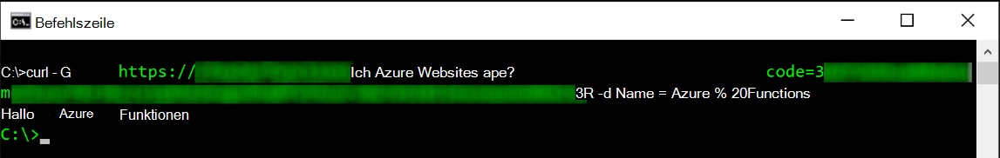
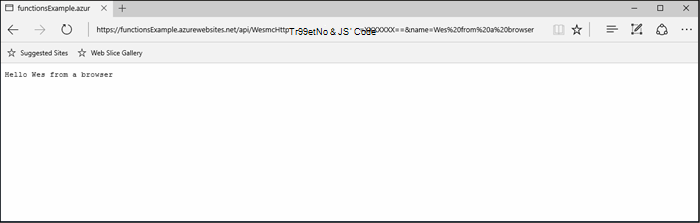
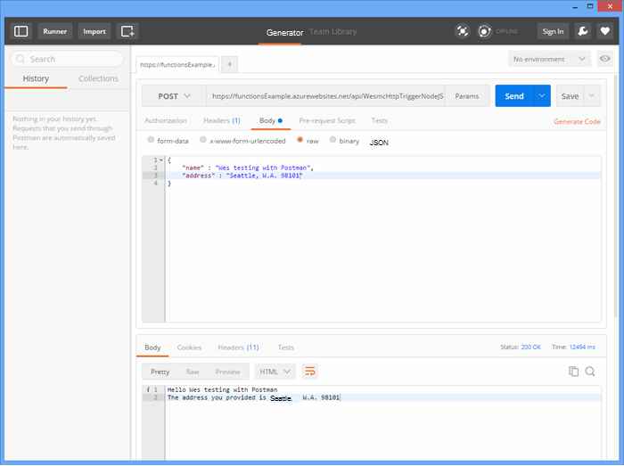
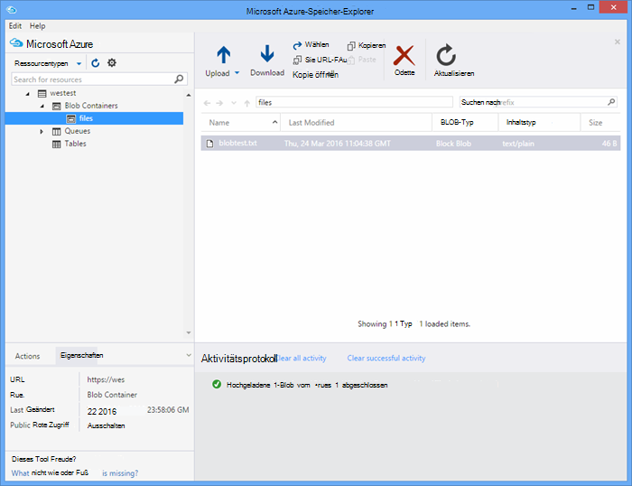

<properties
   pageTitle="Testen von Azure Funktionen | Microsoft Azure"
   description="Testen Sie Ihre Azure-Funktionen mit Postman, cURL, Node.js."
   services="functions"
   documentationCenter="na"
   authors="wesmc7777"
   manager="erikre"
   editor=""
   tags=""
   keywords="Azure Funktionen, Funktionen, Verarbeitung, Webhooks, dynamische Compute, serverlose Architektur testen"/>

<tags
   ms.service="functions"
   ms.devlang="multiple"
   ms.topic="article"
   ms.tgt_pltfrm="multiple"
   ms.workload="na"
   ms.date="08/19/2016"
   ms.author="wesmc"/>

# Testen der Azure-Funktionen

## Übersicht

In diesem Lernprogramm werden verschiedene Ansätze erläutert Funktionen testen. Es wird eine HTTP-Trigger-Funktion definieren, die Abfrageparameter oder Text der Anforderung akzeptiert. Der standardmäßige **HttpTrigger Node.js** Vorlage Funktionscode unterstützt eine `name` Zeichenfolgenparameter Abfragen. Es fügt auch Code unterstützt diesen Parameter zusammen mit `address` Informationen für den Benutzer im Hauptteil Anforderung.

## Erstellen Sie eine Funktion für das Testen

Für die meisten in diesem Lernprogramm verwenden wir eine leicht abgeänderte Version der Vorlage **HttpTrigger Nodejs-Funktion** , die beim Erstellen einer neuen Funktion verfügbar ist.  Sie können das [Erstellen Ihrer ersten Azure-Funktion](functions-create-first-azure-function.md) überprüfen, benötigen Sie Hilfe beim Erstellen einer neuen Funktion.  Wähle **HttpTrigger Nodejs** Funktionsvorlage beim Test-Funktion in [Azure-Portal]erstellen.

Die Standardvorlage für die Funktion ist im Grunde eine Hello World-Funktion, die als zurücksendet den Namen aus der Anforderung Körper oder Abfragezeichenfolgen-Parameters Echo, `name=<your name>`.  Wir aktualisieren den Code auch den Namen und eine Adresse als JSON-Inhalte im Hauptteil Anforderung bereitstellen können. Die Funktion wird dann diese zurück an den Client beim verfügbaren echo.   

Aktualisieren Sie die Funktion mit dem folgenden Code die zum Testen verwendet wird:

    module.exports = function(context, req) {
        context.log("Node.js HTTP trigger function processed a request. RequestUri=%s", req.originalUrl);
        context.log("Request Headers = " + JSON.stringify(req.headers));    
    
        if (req.query.name || (req.body && req.body.name)) {
            if (typeof req.query.name != "undefined") {
                context.log("Name was provided as a query string param..."); 
                ProcessNewUserInformation(context, req.query.name);
            }
            else {
                context.log("Processing user info from request body..."); 
                ProcessNewUserInformation(context, req.body.name, req.body.address);
            }
        }
        else {
            context.res = {
                status: 400,
                body: "Please pass a name on the query string or in the request body"
            };
        }
        context.done();
    };
    
    function ProcessNewUserInformation(context, name, address)
    {    
        context.log("Processing User Information...");            
        context.log("name = " + name);            
        echoString = "Hello " + name;
        
        if (typeof address != "undefined")
        {
            echoString += "\n" + "The address you provided is " + address;
            context.log("address = " + address);            
        }
        
        context.res = {
                // status: 200, /* Defaults to 200 */
                body: echoString
            };
    }

## Testen einer Funktion mit

### Testen mit Kringel

Oft beim Testen von Software ist nicht erforderlich, über die Befehlszeile zum Debuggen Ihrer Anwendung suchen, dies gilt mit.

Um die Funktion zu testen, kopieren Sie die **Funktion Url** vom Portal aus. Sie haben das folgende Format: 

    https://<Your Function App>.azurewebsites.net/api/<Your Function Name>?code=<your access code>
    
Dies ist die Url für Ihre Funktion auslösen, wir können test mit cURL-Befehl in der Befehlszeile ein stellen (`-G` oder `--get`) Anforderung Funktion:

    curl -G https://<Your Function App>.azurewebsites.net/api/<Your Function Name>?code=<your access code>
    
In diesem Beispiel oben erfordert einen Abfragezeichenfolgen-Parameter die Daten weitergegeben werden können (`-d`) in cURL-Befehl:

    curl -G https://<Your Function App>.azurewebsites.net/api/<Your Function Name>?code=<your access code> -d name=<Enter a name here>
    
Drücken Sie die EINGABETASTE, und erhalten Sie die Ausgabe der Funktion in der Befehlszeile.

Im Fenster Webportal **anmeldet** wird beim Ausführen der Funktion Ausgabe ähnlich der folgenden protokolliert:

    2016-04-05T21:55:09  Welcome, you are now connected to log-streaming service.
    2016-04-05T21:55:30.738 Function started (Id=ae6955da-29db-401a-b706-482fcd1b8f7a)
    2016-04-05T21:55:30.738 Node.js HTTP trigger function processed a request. RequestUri=https://functionsExample.azurewebsites.net/api/HttpTriggerNodeJS1?code=XXXXXXX&name=Azure Functions
    2016-04-05T21:55:30.738 Function completed (Success, Id=ae6955da-29db-401a-b706-482fcd1b8f7a)

### Testen Sie mit einem browser

Funktionen, die keine Parameter erforderlich, oder reicht Abfragezeichenfolgenparameter, können über einen Browser getestet werden.

Kopieren Sie zum Testen der Funktion oben definierte **Funktion Url** vom Portal aus. Sie haben das folgende Format:

    https://<Your Function App>.azurewebsites.net/api/<Your Function Name>?code=<your access code>

Anfügen der `name` : Abfrage Zeichenfolgenparameter mit Namen für die `<Enter a name here>` Platzhalter.

    https://<Your Function App>.azurewebsites.net/api/<Your Function Name>?code=<your access code>&name=<Enter a name here>

Fügen Sie die URL in Ihren Browser, und Sie erhalten eine Antwort ähnlich der folgenden.

Im Fenster Webportal **anmeldet** wird beim Ausführen der Funktion Ausgabe ähnlich der folgenden protokolliert:

    2016-03-23T07:34:59  Welcome, you are now connected to log-streaming service.
    2016-03-23T07:35:09.195 Function started (Id=61a8c5a9-5e44-4da0-909d-91d293f20445)
    2016-03-23T07:35:10.338 Node.js HTTP trigger function processed a request. RequestUri=https://functionsExample.azurewebsites.net/api/WesmcHttpTriggerNodeJS1?code=XXXXXXXXXX==&name=Wes from a browser
    2016-03-23T07:35:10.338 Request Headers = {"cache-control":"max-age=0","connection":"Keep-Alive","accept":"text/html","accept-encoding":"gzip","accept-language":"en-US"}
    2016-03-23T07:35:10.338 Name was provided as a query string param.
    2016-03-23T07:35:10.338 Processing User Information...
    2016-03-23T07:35:10.369 Function completed (Success, Id=61a8c5a9-5e44-4da0-909d-91d293f20445)

### Postbote testen

Das empfohlene Tool zum Testen der Funktionen ist Briefträger. Postbote finden Sie unter [Postbote zu erhalten](https://www.getpostman.com/). Postbote bietet Kontrolle über viele weitere Attribute einer HTTP-Anforderung.

> [AZURE.TIP] Verwenden der REST in der Sie vertraut sind. Hier sind einige Alternativen postboten:  
> 
> * [Fiddler](http://www.telerik.com/fiddler)  
> * [Kralle](https://luckymarmot.com/paw)  

So testen die Funktion einen Anforderungstext in Briefträger: 

1. Starten Sie Postbote von **Apps** auf linken oberen Fensterecke Chrome-Browser.
2. Die **Funktion Url** kopieren und Postbote einfügen. Sie enthält den Zugangscode Abfragezeichenfolgen-Parameter.
3. Ändern Sie die HTTP-Methode **POST**.
4. Klicken Sie auf **Körper** > **raw** und JSON Anforderungstext ähnlich der folgenden:

        {
            "name" : "Wes testing with Postman",
            "address" : "Seattle, W.A. 98101"
        }

5. Klicken Sie auf **Senden**.

Die folgende Abbildung zeigt die einfache Echo-Funktion wird in diesem Lernprogramm testen. 

Im Fenster Webportal **anmeldet** wird beim Ausführen der Funktion Ausgabe ähnlich der folgenden protokolliert:

    2016-03-23T08:04:51  Welcome, you are now connected to log-streaming service.
    2016-03-23T08:04:57.107 Function started (Id=dc5db8b1-6f1c-4117-b5c4-f6b602d538f7)
    2016-03-23T08:04:57.763 Node.js HTTP trigger function processed a request. RequestUri=https://functions841def78.azurewebsites.net/api/WesmcHttpTriggerNodeJS1?code=XXXXXXXXXX==
    2016-03-23T08:04:57.763 Request Headers = {"cache-control":"no-cache","connection":"Keep-Alive","accept":"*/*","accept-encoding":"gzip","accept-language":"en-US"}
    2016-03-23T08:04:57.763 Processing user info from request body...
    2016-03-23T08:04:57.763 Processing User Information...
    2016-03-23T08:04:57.763 name = Wes testing with Postman
    2016-03-23T08:04:57.763 address = Seattle, W.A. 98101
    2016-03-23T08:04:57.795 Function completed (Success, Id=dc5db8b1-6f1c-4117-b5c4-f6b602d538f7)
    
### Testen Sie mit Speicher-Explorer einen BLOB-trigger

Sie können eine BLOB-Trigger-Funktion mit [Microsoft Azure Storage Explorer](http://storageexplorer.com/)testen.

1. Erstellen Sie im [Azure-Portal] für Ihre Funktionen eine neue C#, F# oder Knoten Blob triggerfunktion. Legen Sie den Pfad auf den Namen des Containers Blob überwachen. Zum Beispiel:

        files

2. Klicken Sie auf die **+** Schaltfläche auswählen oder erstellen das Speicherkonto verwenden möchten. Klicken Sie auf **Erstellen**.

3. Eine Datei mit dem folgenden Text erstellen und speichern:

        A text file for blob trigger function testing.

4. Führen Sie [Microsoft Azure Storage Explorer](http://storageexplorer.com/) und BLOB-Container im Speicherkonto überwachten an.

5. Klicken Sie auf **Hochladen** und Hochladen der Datei.

    

    Der Standardcode BLOB-Trigger-Funktion meldet die Verarbeitung des BLOBs in den Protokollen:

        2016-03-24T11:30:10  Welcome, you are now connected to log-streaming service.
        2016-03-24T11:30:34.472 Function started (Id=739ebc07-ff9e-4ec4-a444-e479cec2e460)
        2016-03-24T11:30:34.472 C# Blob trigger function processed: A text file for blob trigger function testing.
        2016-03-24T11:30:34.472 Function completed (Success, Id=739ebc07-ff9e-4ec4-a444-e479cec2e460)

## Testen einer Funktion Funktionen

### Mit der Schaltfläche Ausführen Funktionen testen

Das Portal bietet eine Schaltfläche **führen** einige wenige Tests ermöglicht wird. Können Sie die Schaltfläche "ausführen" einen Anforderungstext jedoch nicht Abfragezeichenfolgenparameter bereitzustellen oder Anforderungsheader aktualisieren.

Testen Sie die HTTP-Trigger-Funktion, die wir zuvor erstellt, indem eine JSON-Zeichenfolge ähnlich der folgenden im Feld **Anforderungsinhalt** , und klicken Sie auf die Schaltfläche **Ausführen** .

    {
        "name" : "Wes testing Run button",
        "address" : "USA"
    } 

Im Fenster Webportal **anmeldet** wird beim Ausführen der Funktion Ausgabe ähnlich der folgenden protokolliert:

    2016-03-23T08:03:12  Welcome, you are now connected to log-streaming service.
    2016-03-23T08:03:17.357 Function started (Id=753a01b0-45a8-4125-a030-3ad543a89409)
    2016-03-23T08:03:18.697 Node.js HTTP trigger function processed a request. RequestUri=https://functions841def78.azurewebsites.net/api/wesmchttptriggernodejs1
    2016-03-23T08:03:18.697 Request Headers = {"connection":"Keep-Alive","accept":"*/*","accept-encoding":"gzip","accept-language":"en-US"}
    2016-03-23T08:03:18.697 Processing user info from request body...
    2016-03-23T08:03:18.697 Processing User Information...
    2016-03-23T08:03:18.697 name = Wes testing Run button
    2016-03-23T08:03:18.697 address = USA
    2016-03-23T08:03:18.744 Function completed (Success, Id=753a01b0-45a8-4125-a030-3ad543a89409)

### Timer Trigger testen

Einige Funktionen können nicht wirklich getestet werden mit den oben erwähnten Tools. Beispielsweise eine Warteschlange triggerfunktion, die ausgeführt wird, wenn eine Nachricht in [Azure Queue Storage](../storage/storage-dotnet-how-to-use-queues.md)abgelegt wird. Immer Schreiben Code, um eine Meldung in der Warteschlange abgelegt und ein Beispiel in einem Konsolenprojekt wird unten bereitgestellt. Es ist jedoch ein anderer Ansatz, mit Funktionen direkt testen.  

Sie können Timer Trigger einer Warteschlange konfiguriert Bindung ausgegeben. Timer Trigger-Code dann Testnachrichten in die Warteschlange schreiben. In diesem Abschnitt wird ein Beispiel durchgehen. 

Ausführliche Informationen zu Bindings in Azure-Funktionen finden Sie unter [Azure Funktionen Entwicklerreferenz](functions-reference.md). 

#### Warteschlange Trigger zu Testzwecken erstellen

Um dies zu demonstrieren, wir zuerst erstellen eine Warteschlange Trigger-Funktion, die getestet werden für eine Warteschlange mit dem Namen soll `queue-newusers`. Diese Funktion verarbeitet Informationen und Adresse für einen neuen Benutzer in Azure Warteschlangenspeicher abgelegt. 

> [AZURE.NOTE] Verwenden Sie einen anderen Warteschlangennamen unbedingt Regeln [Warteschlangen benennen und Metadaten](https://msdn.microsoft.com/library/dd179349.aspx) verwendete Name entspricht.  Andernfalls erhalten Sie einen HTTP-Statuscode 400: Ungültige Anforderung. 

1. Klicken Sie im [Azure-Portal] für Ihre Funktionen auf **Neue Funktion** > **QueueTrigger - C#**.
2. Geben Sie den Warteschlangennamen Funktion Warteschlange überwacht werden 

        queue-newusers 

3. Klicken Sie auf die **+** () hinzufügen oder erstellen Sie das Speicherkonto verwenden möchten. Klicken Sie auf **Erstellen**.
4. Lassen Sie dieses Portal Browserfenster geöffnet, damit Sie die Protokolleinträge für den Standardcode Warteschlange Funktion Vorlage überwachen können.

#### Erstellen Sie einen Timer Trigger um eine Meldung in der Warteschlange löschen

1. [Azure-Portal] in einem neuen Browserfenster zu öffnen Sie, und navigieren Sie zu Ihrer Funktion app.
2. Klicken Sie auf **neue Funktion** > **TimerTrigger - C#**. Geben Sie einen Cron-Ausdruck, um festzulegen, wie oft der Zeitgeber Code ausgeführt wird die Warteschlange Funktion. Klicken Sie auf **Erstellen**. Des Tests alle 30 Sekunden auf Wunsch können Sie die folgenden [CRON-Ausdruck](https://wikipedia.org/wiki/Cron#CRON_expression):

        */30 * * * * *

2. Klicken Sie auf der Registerkarte **Integration** für Ihre neue Timer Trigger.
3. Klicken Sie unter **Ausgabe**auf **+ neue Ausgabe** . Klicken Sie dann auf die Schaltfläche **auswählen** und **Warteschlange** .
4. Beachten Sie, dass der angegebene Name für das **Warteschlangenobjekt Nachricht** Sie dies im Code Zeitgeber verwenden.

        myQueue

4. Geben Sie den Warteschlangennamen ein, in dem die Nachricht gesendet werden: 

        queue-newusers 

3. Klicken Sie auf die **+** (hinzufügen) Taste, um das Speicherkonto zuvor mit Trigger Warteschlange verwendet. Klicken Sie auf **Speichern**.
4. Klicken Sie auf der Registerkarte **Entwicklung** den Timer Trigger.
5. Im folgenden Code können für die C#-timerfunktion denselben Message-Objekt Warteschlangennamen oben verwendet. Klicken Sie auf **Speichern**

        using System;
        
        public static void Run(TimerInfo myTimer, out String myQueue, TraceWriter log)
        {
            String newUser = 
            "{\"name\":\"User testing from C# timer function\",\"address\":\"XYZ\"}";
        
            log.Verbose($"C# Timer trigger function executed at: {DateTime.Now}");   
            log.Verbose($"{newUser}");   
            
            myQueue = newUser;
        }

C#-Timer-Funktion wird zu diesem Zeitpunkt alle 30 Sekunden ausgeführt, wenn Beispiel Cron-Ausdruck verwendet. Die Protokolle für die timerfunktion meldet jede Ausführung:

    2016-03-24T10:27:02  Welcome, you are now connected to log-streaming service.
    2016-03-24T10:27:30.004 Function started (Id=04061790-974f-4043-b851-48bd4ac424d1)
    2016-03-24T10:27:30.004 C# Timer trigger function executed at: 3/24/2016 10:27:30 AM
    2016-03-24T10:27:30.004 {"name":"User testing from C# timer function","address":"XYZ"}
    2016-03-24T10:27:30.004 Function completed (Success, Id=04061790-974f-4043-b851-48bd4ac424d1)

Im Browserfenster die Warteschlangen-Funktion wird jeder verarbeitete Nachricht angezeigt:

    2016-03-24T10:27:06  Welcome, you are now connected to log-streaming service.
    2016-03-24T10:27:30.607 Function started (Id=e304450c-ff48-44dc-ba2e-1df7209a9d22)
    2016-03-24T10:27:30.607 C# Queue trigger function processed: {"name":"User testing from C# timer function","address":"XYZ"}
    2016-03-24T10:27:30.607 Function completed (Success, Id=e304450c-ff48-44dc-ba2e-1df7209a9d22)
    
## Testen einer Funktion mit Code

### Testen eine HTTP-Trigger-Funktion mit Code: Node.js

Node.js-Code können Sie eine HTTP-Anforderung zum Testen der Azure-Funktion auszuführen. 

Stellen Sie sicher, dass:

- Die `host` in den Optionen Anforderung der Funktion app-Host
- Der Funktionsname in der `path`.
- Ihr Zugriffscode (`<your code>`) in der `path`.

Beispiel:

    var http = require("http");
    
    var nameQueryString = "name=Wes%20Query%20String%20Test%20From%20Node.js";
    
    var nameBodyJSON = {
        name : "Wes testing with Node.JS code",
        address : "Dallas, T.X. 75201"
    };
    
    var bodyString = JSON.stringify(nameBodyJSON);
    
    var options = {
      host: "functions841def78.azurewebsites.net",
      //path: "/api/HttpTriggerNodeJS2?code=sc1wt62opn7k9buhrm8jpds4ikxvvj42m5ojdt0p91lz5jnhfr2c74ipoujyq26wab3wk5gkfbt9&" + nameQueryString,
      path: "/api/HttpTriggerNodeJS2?code=sc1wt62opn7k9buhrm8jpds4ikxvvj42m5ojdt0p91lz5jnhfr2c74ipoujyq26wab3wk5gkfbt9",
      method: "POST",
      headers : {
          "Content-Type":"application/json",
          "Content-Length": Buffer.byteLength(bodyString)
        }    
    };
    
    callback = function(response) {
      var str = ""
      response.on("data", function (chunk) {
        str += chunk;
      });
    
      response.on("end", function () {
        console.log(str);
      });
    }
    
    var req = http.request(options, callback);
    console.log("*** Sending name and address in body ***");
    console.log(bodyString);
    req.end(bodyString);

Ausgabe:

    C:\Users\Wesley\testing\Node.js>node testHttpTriggerExample.js
    *** Sending name and address in body ***
    {"name" : "Wes testing with Node.JS code","address" : "Dallas, T.X. 75201"}
    Hello Wes testing with Node.JS code
    The address you provided is Dallas, T.X. 75201
        
Im Fenster Webportal **anmeldet** wird beim Ausführen der Funktion Ausgabe ähnlich der folgenden protokolliert:

    2016-03-23T08:08:55  Welcome, you are now connected to log-streaming service.
    2016-03-23T08:08:59.736 Function started (Id=607b891c-08a1-427f-910c-af64ae4f7f9c)
    2016-03-23T08:09:01.153 Node.js HTTP trigger function processed a request. RequestUri=http://functionsExample.azurewebsites.net/api/WesmcHttpTriggerNodeJS1/?code=XXXXXXXXXX==
    2016-03-23T08:09:01.153 Request Headers = {"connection":"Keep-Alive","host":"functionsExample.azurewebsites.net"}
    2016-03-23T08:09:01.153 Name not provided as query string param. Checking body...
    2016-03-23T08:09:01.153 Request Body Type = object
    2016-03-23T08:09:01.153 Request Body = [object Object]
    2016-03-23T08:09:01.153 Processing User Information...
    2016-03-23T08:09:01.215 Function completed (Success, Id=607b891c-08a1-427f-910c-af64ae4f7f9c)
    

### Eine Warteschlange Trigger Testfunktion mit Code: C# #

Wir erwähnt, dass einen Warteschlange Trigger getestet werden konnte, mithilfe von Code eine Meldung in der Warteschlange zu löschen. Der folgende Beispielcode basiert auf der C#-Code im Lernprogramm [Erste Schritte mit Azure-Warteschlange](../storage/storage-dotnet-how-to-use-queues.md) angezeigt. Code für andere Sprachen ist auch von diesem Link verfügbar.

So testen Sie diesen Code in einer Konsole app müssen Sie:

- [Konfigurieren der Storage-Verbindungszeichenfolge in der App.config.Datei](../storage/storage-dotnet-how-to-use-queues.md#setup-a-storage-connection-string).
- Dieser Code akzeptiert den Namen und die Adresse für einen neuen Benutzer als Befehlszeilenargumente während der Laufzeit. Übergeben Sie einen `name` und `address` als Parameter an die Anwendung. Zum Beispiel`C:\myQueueConsoleApp\test.exe "Wes testing queues" "in a console app"`

Wird C#-Code:

    static void Main(string[] args)
    {
        string name = null;
        string address = null;
        string queueName = "queue-newusers";
        string JSON = null;

        if (args.Length > 0)
        {
            name = args[0];
        }
        if (args.Length > 1)
        {
            address = args[1];
        }

        // Retrieve storage account from connection string
        CloudStorageAccount storageAccount = CloudStorageAccount.Parse(ConfigurationManager.AppSettings["StorageConnectionString"]);

        // Create the queue client
        CloudQueueClient queueClient = storageAccount.CreateCloudQueueClient();

        // Retrieve a reference to a queue
        CloudQueue queue = queueClient.GetQueueReference(queueName);

        // Create the queue if it doesn't already exist
        queue.CreateIfNotExists();

        // Create a message and add it to the queue.
        if (name != null)
        {
            if (address != null)
                JSON = String.Format("{{\"name\":\"{0}\",\"address\":\"{1}\"}}", name, address);
            else
                JSON = String.Format("{{\"name\":\"{0}\"}}", name);
        }

        Console.WriteLine("Adding message to " + queueName + "...");
        Console.WriteLine(JSON);

        CloudQueueMessage message = new CloudQueueMessage(JSON);
        queue.AddMessage(message);
    }

Im Browserfenster die Warteschlangen-Funktion wird jeder verarbeitete Nachricht angezeigt:

    2016-03-24T10:27:06  Welcome, you are now connected to log-streaming service.
    2016-03-24T10:27:30.607 Function started (Id=e304450c-ff48-44dc-ba2e-1df7209a9d22)
    2016-03-24T10:27:30.607 C# Queue trigger function processed: {"name":"Wes testing queues","address":"in a console app"}
    2016-03-24T10:27:30.607 Function completed (Success, Id=e304450c-ff48-44dc-ba2e-1df7209a9d22)

<!-- URLs. -->

[Azure-Portal]: https://portal.azure.com
