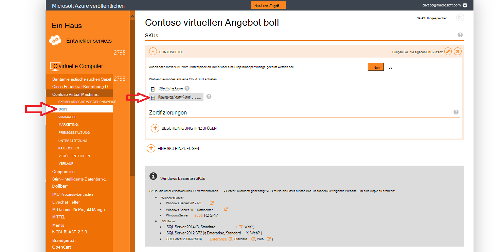
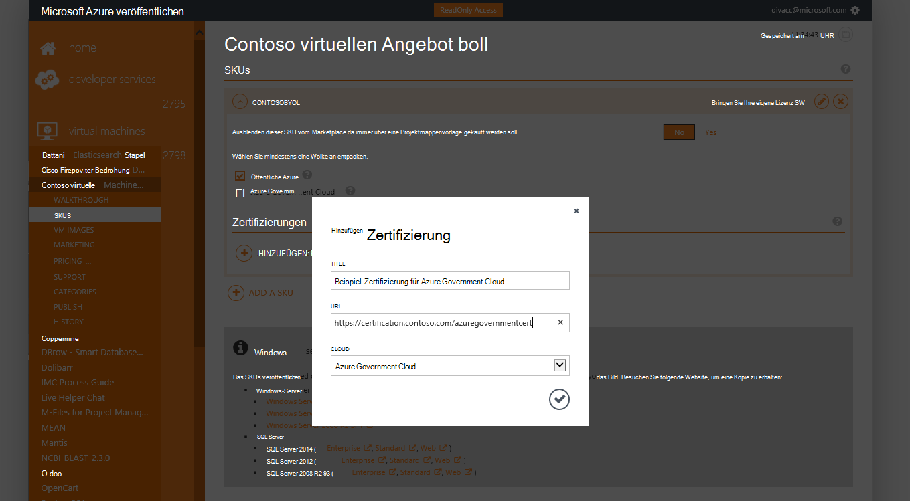
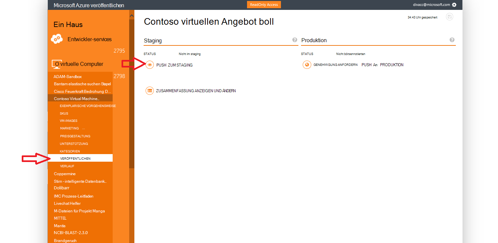
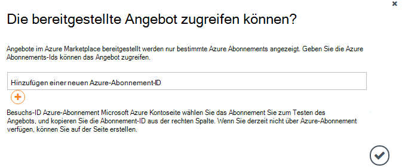
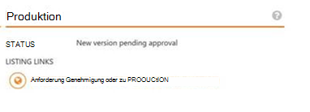

<properties
            pageTitle="Azure Regierung Dokumentation | Microsoft Azure"
            description="Dies bietet einen Vergleich der Features und Hinweise auf die Anwendungsentwicklung für Azure."
            services="Azure-Government"
            cloud="gov"
            documentationCenter=""
            authors="tsingh"
            manager="asimm"
            editor=""/>
 
<tags    ms.service="multiple"
            ms.devlang="na"
            ms.topic="article"
            ms.tgt_pltfrm="na"
            ms.workload="azure-government"
            ms.date="10/20/2016"
            ms.author="zakramer;tsingh;divacc"/> 

# Azure Government Marketplace
Partner Ihre Angebote Azure Marketplace Regierung veröffentlichen finden Sie nachfolgend.

## Veröffentlichen
>[AZURE.NOTE] Wenn Sie nicht bereits Azure Marketplace Certified Partner sind Schritte [hier](../marketplace-publishing/marketplace-publishing-getting-started.md) vor.

### Schritt 1  
[Https://publish.windowsazure.com](https://publish.windowsazure.com) melden

### Schritt 2
Klicken Sie auf das Angebot, das Sie veröffentlichen möchten

### Schritt 3
Klicken Sie auf **SKUS** und auf das Azure Government Cloud

>[AZURE.NOTE] Schalten Sie Ihre eigene Lizenz (BYOL)-SKUs werden unterstützt.  Diese Option ist nicht verfügbar für die nutzungsbasierte (PayG) SKUs.

### Schritt 4
Klicken Sie auf das + Zertifizierung Add Link Zertifizierungen für Ihr Angebot Links hinzufügen.

### Schritt 5
Anforderung für ein Testkonto in Microsoft Azure Government Cloud testen Sie Ihr Bild im Portal veröffentlichen können: [https://azuregov.microsoft.com/trial/azuregovtrial](https://azuregov.microsoft.com/trial/azuregovtrial)

Ihre Berechtigung als Partner US federal, State, lokale oder Stammes Entitäten überprüft und bestätigt e-Mail dient.  Ihr Testkonto stehen ist in 3 bis 5 Werktage.

### Schritt 6
Klicken Sie auf Veröffentlichen und zu Staging auf. 

Sie werden aufgefordert, die ein Abonnement auf der weißen Liste eingeben, die Zugriff auf das bereitgestellte bieten. Geben Sie die Abonnement-ID von Ihrem neu erworbenen Testversion Azure Regierung.

### Schritt 7
Sobald das Angebot erfolgreich bereitgestellt wird, können Sie das Bild [https://portal.azure.us](https://portal.azure.us) der Azure-Testversion an Regierung Konto anmelden testen.

### Schritt 8
Nach der Validierung mithilfe das Testabonnement können Sie das Angebot live auf veröffentlichen klicken und Anfordern einer Genehmigung zu Produktion zur Verfügung. 

## Nächste Schritte

Zusätzliche Informationen und Updates [Microsoft Azure Regierung Blog](https://blogs.msdn.microsoft.com/azuregov/)zu abonnieren.
