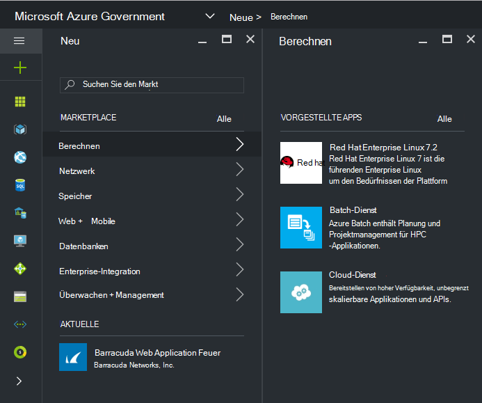
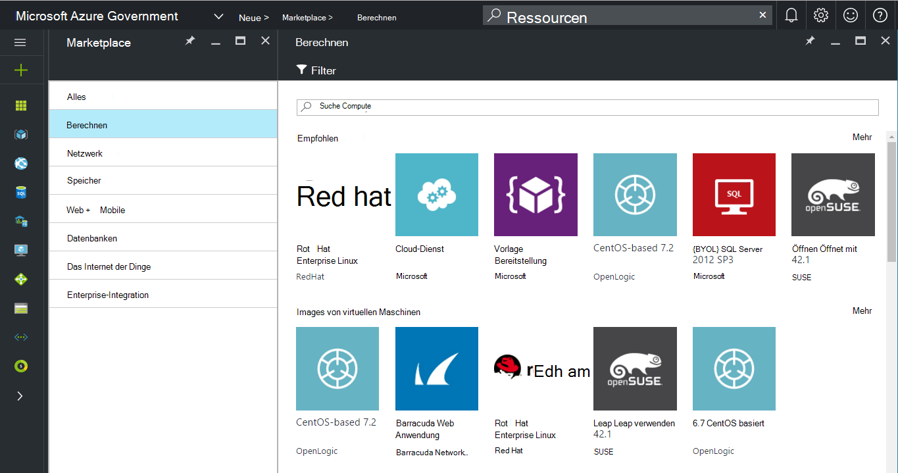
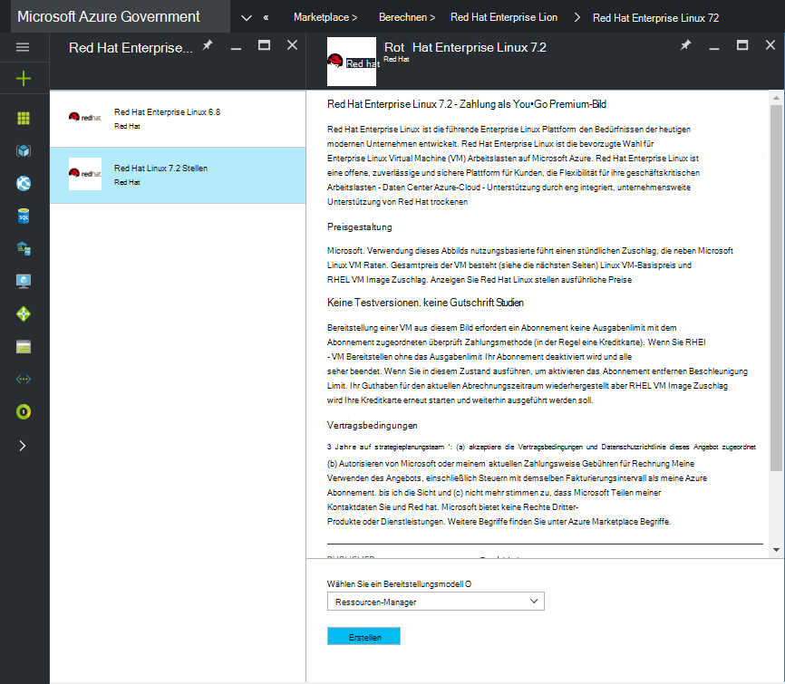
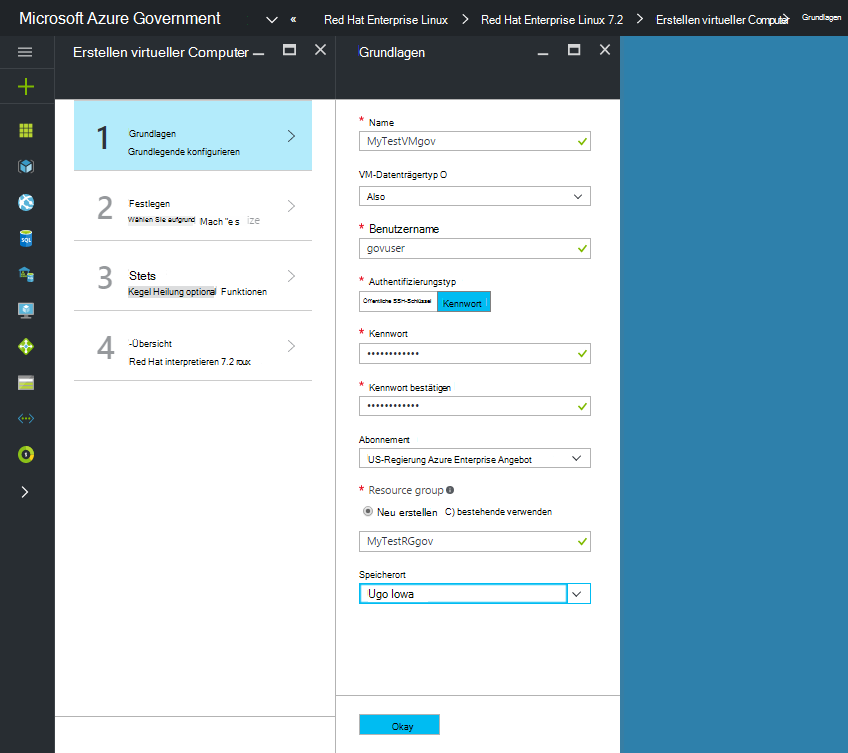
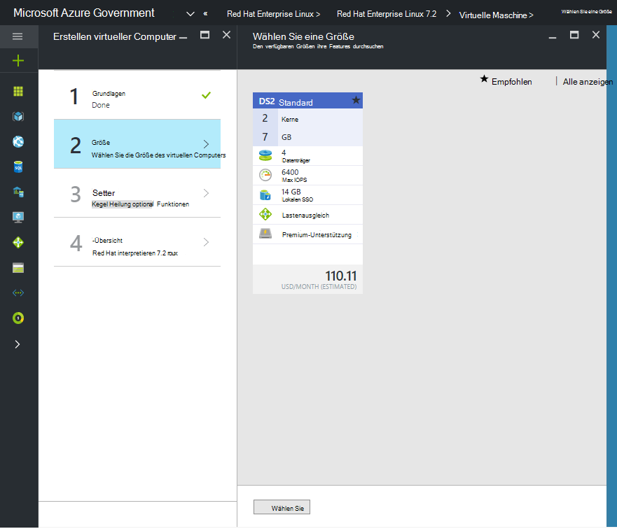

 <properties
    pageTitle="Azure Regierung Dokumentation | Microsoft Azure"
    description="Dies bietet einen Vergleich der Features und Hinweise auf die Anwendungsentwicklung für Azure."
    services="Azure-Government"
    cloud="gov"
    documentationCenter=""
    authors="VybavaRamadoss"
    manager="asimm"
    editor=""/>

<tags   ms.service="multiple"
    ms.devlang="na"
    ms.topic="article"
    ms.tgt_pltfrm="na"
    ms.workload="azure-government"
    ms.date="10/20/2016"
    ms.author="zakramer;vybavar"/>

# Azure Marketplace für Regierungsbehörden
Azure Marketplace steht für Azure mit einer aktualisierten Liste aus unseren Markt Herausgeber. 

## Variationen
Unten sind einige Aspekte beim Azure Marketplace für Regierung:

- Nur Bilder bringen Ihre eigene Lizenz (BYOL) sind verfügbar. Sie können keine Bilder zugreifen, die Einkaufstransaktion über Azure Marketplace erforderlich
- Nur eine Teilmenge der Bilder ist derzeit gegenüber dem öffentlichen Markt. Sie finden die Liste der verfügbaren Bilder [hier](../azure-government-image-gallery.md) 
- Bevor ein Bild bereitstellen, müssen der Unternehmensadministrator Marketplace Einkauf für Ihre Azure-Abonnement
  - Das Portal als Organisationsadministrator anmelden
  - Navigieren Sie *zu*
  - Klicken Sie unter *Registrierung Details* auf das Bleistiftsymbol neben den *Azure Marketplace* Artikel
  - *Aktiviert/deaktiviert* gegebenenfalls umschalten
  - Klicken Sie auf *Speichern*

>[AZURE.NOTE] Wenn Sie interessiert sind finden Sie Ihre Bilder in Azure Government [Partner Onboarding Richtlinien](documentation-government-manage-marketplace-partners.md) für Weitere Informationen.

### Schritt 1
Starten Sie den Markt

  

### Schritt 2
Verschiedene Produkte richtig zu durchsuchen.

Marketplace-Publisher enthält eine Liste der Zertifizierungen als Teil des Erzeugnisses bei der richtigen Entscheidung helfen. 

### Schritt 3
Wählen Sie eine product\image

### Schritt 4
Starten Sie den Datenfluss erstellen und geben Sie die erforderlichen Parameter für die Bereitstellung

>[AZURE.NOTE] In der Dropdownliste Speicherort sind nur Azure Government sichtbar

### Schritt 5
Beobachten Sie Preise

### Schritt 6
Alle Schritte, und klicken Sie auf Ok, um den Bereitstellungsprozess zu starten

## Nächste Schritte

Zusätzliche Informationen und Updates [Microsoft Azure Regierung Blog](https://blogs.msdn.microsoft.com/azuregov/)zu abonnieren.
