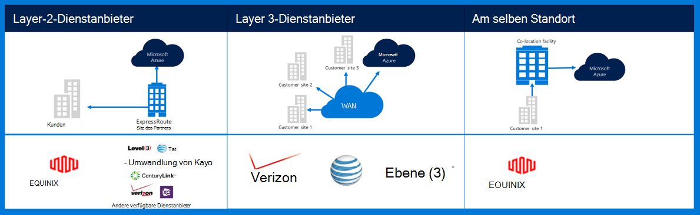
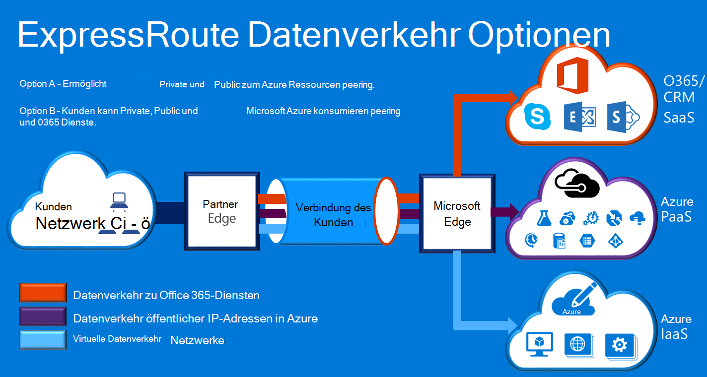

<properties
    pageTitle="Dokumentation zu Azure Governmenmt | Microsoft Azure"
    description="Dies bietet einen Vergleich der Funktionen und Hinweise für eine private Verbindung zu e-Government"
    services="Azure-Government"
    cloud="gov" 
    documentationCenter=""
    authors="ryansoc"
    manager="zakramer"
    editor=""/>

<tags
    ms.service="multiple"
    ms.devlang="na"
    ms.topic="article"
    ms.tgt_pltfrm="na"
    ms.workload="azure-government"
    ms.date="09/28/2016"
    ms.author="ryansoc"/>

#  Azure Government Netzwerk

##  ExpressRoute (Private Verbindung)

ExpressRoute steht in der Regel in Azure Regierung. Weitere Informationen (einschließlich Partner und Speicherorte peering) <a href="https://azure.microsoft.com/en-us/documentation/services/expressroute/">ExpressRoute öffentliche Dokumentation </a>anzeigen

###  Variationen

ExpressRoute ist in Azure Government allgemein verfügbar (GA). 

- Regierungskunden verbinden auf physisch über eine dedizierte Verbindung Azure Government (Gov) ExpressRoute (ER)

- Azure Gov bietet erhöhte Verfügbarkeit und Haltbarkeit durch Nutzung mehrerer Region Paare mindestens 500 Meilen auseinander 

- Standardmäßig alle Azure Gov ER Verbindungen konfigurierte aktive redundante dabei trennen und bietet eine Kapazität von bis zu 10 G Circuit (kleinste beträgt 50MB)

- Azure Gov ER Lagerorte bietet optimierte Wege (kürzeste Hops, niedrige Latenz, hohe Performance usw.) für Kunden und Azure Gov georedundanten Regionen

- Azure Gov ER private Verbindung nicht nutzen, durchsuchen oder Internet abhängig

- Azure Gov physischen und logischen Infrastruktur physisch vorgesehen und getrennt und Zugriff auf Personen beschränkt ist

- Microsoft besitzt und betreibt Glasfaser-Infrastruktur zwischen Azure Gov Regionen und Azure Gov ER erfüllen-Me Speicherorte

- Azure Gov ER stellt eine Verbindung zu Microsoft Azure, Office 365 und CRM Cloud-services

### Hinweise

Es gibt zwei grundlegende Dienste private Netzwerkkonnektivität in Azure: VPN (Standort-zu-Standort für eine normale Organisation) und ExpressRoute.

Azure ExpressRoute zum VPN-Verbindungen zwischen Azure Government Rechenzentren und der Infrastruktur vor Ort oder in einer Umgebung Colocation erstellen. ExpressRoute-Verbindung nicht über das öffentliche Internet gehen, mehr Zuverlässigkeit, beschleunigt und niedriger Latenz als normalen Internet-Verbindungen bieten. In einigen Fällen verwenden ExpressRoute-Verbindung zum Übertragen von Daten zwischen lokalen Systemen und Azure Erträge erhebliche Kostenvorteile.   

Mit ExpressRoute Verbindungen in Azure an einer ExpressRoute Stelle (wie ein Exchange-Provider) herstellen, oder Sie direkt verbinden in Azure vorhandenen WAN-Netzwerks (z. B. ein Multiprotocol label switching (MPLS) VPN von einem Netzwerkdienstanbieter bereitgestellt).

    

Netzwerkdienste Azure Government Kunden und unterstützen wird dringend empfohlen, ExpressRoute (private Verbindung) zum Herstellen von Azure Government implementiert wird. Bei VPN-Verbindungen Folgendes gilt:

- Kunden sollten ihre autorisieren Beamten/Agentur, ob private Verbindung oder einen anderen Mechanismus sichere Verbindung erforderlich ist und zusätzlichen Einschränkungen berücksichtigen zu kontaktieren.

- Kunden sollten entscheiden müssen die Standort-zu-Standort-VPN über eine private Verbindung Zone geroutet wird.

- Kunden erhalten eine MPLS-Verbindung oder VPN mit einem Internetdienstanbieter lizenzierte private Verbindung.

Alle Kunden, die eine private Verbindung Architektur nutzen sollte überprüft werden, dass eine geeignete Implementierung eingerichtet und Kunden Verbindung zum Gateway Netzwerk/Internet verwaltet (GN / I) edge-Router Abgrenzung Punkt für Azure. Ebenso muss Ihre Organisation Netzwerkkonnektivität zwischen lokalen Umgebung und Gateway Netzwerk/Debitor (GN/C) Edge-Router Abgrenzung Punkt für Azure herstellen.

## Nächste Schritte

Für zusätzliche Informationen zum Abonnieren der <a href="https://blogs.msdn.microsoft.com/azuregov/">Microsoft Azure Regierung Blog.</a>
