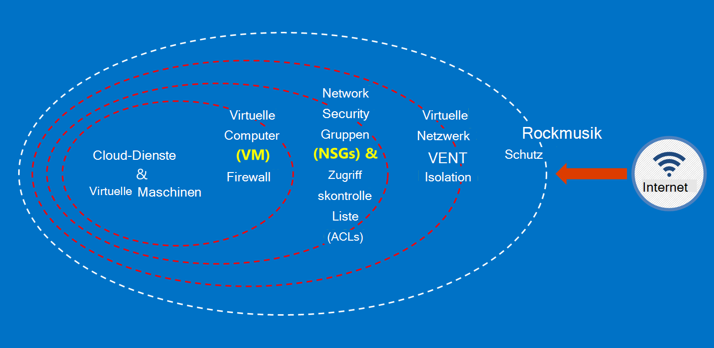

<properties
    pageTitle="Azure Government Services | Microsoft Azure"
    description="Bietet und Überblick über die verfügbaren Dienste in Azure Government"
    services="Azure-Government"
    cloud="gov"
    documentationCenter=""
    authors="zakramer"
    manager="liki"
    editor="" />

<tags
    ms.service="multiple"
    ms.devlang="na"
    ms.topic="article"
    ms.tgt_pltfrm="na"
    ms.workload="azure-government"
    ms.date="10/18/2016"
    ms.author="ryansoc" />

#  Sicherheit

##  Grundsätze für das Sichern von Kundendaten in Azure Government

Azure Government bietet eine Reihe von Features und Diensten, mit denen Sie Cloud Lösungen zu Ihren Bedürfnissen geregelt/gesteuert. Eine kompatible Lösung ist nichts anderes als die Umsetzung der vordefinierten Azure Government Funktionen gekoppelt mit solide Sicherheit.

Microsoft behandelt diese Anforderungen auf der Ebene der Cloud-Infrastruktur beim Hosten einer Lösung in Azure Regierung.

Das folgende Diagramm zeigt das Azure Verteidigung Modell. Microsoft bietet beispielsweise grundlegende Cloudinfrastruktur DDOS, mit Kunden Funktionen wie Sicherheits-Appliances für kundenspezifische Anwendung benötigten DDOS.

Diese Seite beschreibt die Grundprinzipien für die Services und Applikationen, die Leitfäden und bewährte Methoden, wie diese Grundsätze gelten; in anderen Worten, wie Kunden nutzen sollten smart Azure Regierung die Pflichten und Aufgaben, die für eine Lösung, die ITAR enthält.

 Die übergeordneten Prinzipien zum Sichern von Daten sind:

- Datenschutz mit Verschlüsselung
- Kennwörter verwalten
- Isolation Datenzugriff einschränken

###  Schutz von Kundendaten Verschlüsselung

Risikominderung und Einhaltung von gesetzlichen Vorschriften fahren die zunehmenden Fokus und Verschlüsselung. Eine effektive verschlüsselungsimplementierung aktuellen Netzwerk- und Sicherheitsmaßnahmen zu verwenden – und das Gesamtrisiko der Cloudumgebung.

#### Verschlüsselung ruhender
Die Verschlüsselung von Daten gilt für den Schutz der kundeninhalte im Speicher. Es gibt hierfür mehrere Arten:

#### Storage Service-Verschlüsselung

Azure Storage Service-Verschlüsselung ist auf Speicherebene Konto aktiviert Block-Blobs sowie Seitenblobs automatisch verschlüsselt werden, wenn in den Azure-Speicher geschrieben. Beim Lesen der Daten aus dem Azure-Speicher wird es vom Speicherdienst entschlüsselt vor. Hiermit sichern Sie Ihre Daten ohne ändern oder jede Anwendung Code hinzufügen.

#### Clientseitige Verschlüsselung
Clientseitige Verschlüsselung integriert die Java und .NET Speicher Clientbibliotheken, die damit einfach implementieren Azure Key Vault APIs nutzen können. Verwenden Sie Azure Key Vault den Zugriff auf vertrauliche Informationen in Azure Key Vault für Einzelpersonen mit Azure Active Directory.

#### Verschlüsselung in transit

Die einfache Verschlüsselung Konnektivität Azure Regierung unterstützt Transport Level Security (TLS) 1.2 Protokoll und x. 509-Zertifikate. Bundesrepublik Informationen Processing Standard (FIPS) 140-2 Level 1-Verschlüsselungsalgorithmen auch für Infrastruktur Netzwerkanschlüsse zwischen Azure Government Rechenzentren verwendet werden.  Windows Server 2012 R2 und Windows 8-plus VMs und Azure Dateifreigaben können SMB 3.0 für die Verschlüsselung zwischen der VM und Dateifreigabe. Verwenden Sie clientseitige Verschlüsselung zum Verschlüsseln der Daten erfolgt in Speicher in einer Clientanwendung und zum Entschlüsseln der Daten nach dem aus übertragen.

#### Best Practices für Verschlüsselung

- IaaS VMs: Verwenden Sie Azure Datenträgerverschlüsselung. Storage Service Verschlüsselung Verschlüsseln VHD-Dateien, mit denen die Festplatten in Azure-Speicher sichern einschalten, aber dies nur neu geschriebene Daten verschlüsselt. Dies bedeutet, dass Sie einen virtuellen Computer erstellen, aktivieren Sie Storage Service Verschlüsselung auf das Speicherkonto, das VHD-Datei enthält die Änderungen verschlüsselt werden, nicht die ursprüngliche VHD-Datei.
- Clientseitige Verschlüsselung: Dies ist die sicherste Methode zum Verschlüsseln von Daten vor der Übertragung verschlüsselt und verschlüsselt die Daten. Es erfordert, dass Sie Ihre Anwendung mit Speicher nicht möchten möglicherweise Code hinzufügen. In diesen Fällen können HTTPs für Ihre Daten bei der Übertragung und Verschlüsselung Storage Service Sie die Daten verschlüsseln. Clientseitige Verschlüsselung erfordert mehr Auslastung auf dem Client, müssen Sie diese in Ihre Pläne Skalierbarkeit berücksichtigt insbesondere dann, wenn Sie verschlüsseln und große Datenmengen übertragen.

###  Schutz von Kundendaten durch Kennwörter verwalten

Sichere Schlüsselmanagement ist unverzichtbar für Datenschutz in der Cloud. Kunden sollten versuchen, Key Management vereinfachen und Kontrolle von Cloudanwendungen und Dienste zum Verschlüsseln von Daten verwendet.

#### Best Practices für die Verwaltung von vertraulichen Daten

- Verwenden Sie Schlüssel Vault, um Risiken ausgesetzt durch hartcodierte Konfigurationsdateien, Skripts oder im Quellcode Geheimnisse. Azure Key Vault verschlüsselt (wie die Verschlüsselungsschlüssel für Azure Disk Encryption) und Schlüssel (z. B. Kennwörter), speichern sie im FIPS 140-2 Level 2 Hardwaresicherheitsmodule (HSMs) überprüft. Für zusätzliche Sicherheit importieren oder in diese HSMs Schlüssel generieren.
- Anwendungscode und Vorlagen sollten nur URI-Verweise auf Daten enthalten (d. h., der tatsächliche Schlüssel nicht im Code, Konfiguration oder Quellcode Repositories). Dadurch werden wichtige Phishing-Angriffe auf internen oder externen Repogeschäfte wie Ernte-Bots im GitHub.
- Verwenden Sie starke RBAC-Steuerelemente in Schlüssel Depot. Wenn vertrauenswürdige Mitarbeiter das Unternehmen oder die Übertragung zu einer neuen Gruppe innerhalb der Firma verlässt, sollte verhindert werden auf Daten zugreifen.

Weitere Informationen <a href="https://azure.microsoft.com/documentation/services/key-vault">Öffentliche Dokumentation Azure Key Vault.</a>

###  Isolation Datenzugriff einschränken

Isolation ist mit Grenzen, Segmentierung und Containern Datenzugriff nur autorisierte Benutzer, Dienste und Programme beschränken. Beispielsweise ist die Trennung zwischen einen wesentlichen Mechanismus für mandantenfähigen Cloudplattformen wie Microsoft Azure. Logischer Isolierung verhindert, dass ein Mandant beeinträchtigt den Betrieb der anderen Mandanten.

#### Isolierung der Umgebung
Azure Government ist eine physische Instanz getrennt vom Rest des Microsoft Netzwerk. Dies geschieht durch eine Reihe von physischen und logischen Steuerelemente, die Folgendes enthalten:

- Sichern der Hindernisse mit biometrischen Geräten und Kameras.
- Verwendung von bestimmten Anmeldeinformationen und die kombinierte Authentifizierung von Microsoft Personal logischen Zugriff auf Produktions-Umgebung.
- Alle Infrastruktur für Azure befindet sich in den USA.

#### Pro Kunde Isolation
Netzwerkzugriffsteuerung Azure implementiert und Trennung durch VLAN-Isolierung ACLs laden Balancers und IP-Filter

Kunden können ihre Ressourcen über Abonnements, Ressourcengruppen, virtuelle Netzwerke und Subnetze weiter eingrenzen.

## Prüfung

Kürzlich angekündigten FedRAMP hoch und Department of Defense (DoD) Schweregrad 4 Akkreditierung. Dies hat die Sicherheits- und Compliance-Leiste in Azure Government-Umgebung.

Wir sind jetzt unsere Mitarbeiter am nationalen Agentur überprüfen und Gutschrift (NACLC) Prüfung gemäß Abschnitt 5.6.2.2 des DoD Cloud Computing Security Requirements Guide (SRG):

>[AZURE.NOTE] Die minimale Hintergrund Untersuchung für CSP-Personal Zugang zu Stufe 4 und 5 Informationen über eine "nicht kritisch-Sensitive" (z. B. DoD ADP-2) ist eine nationale Agentur überprüfen und Gutschrift (NACLC) (für den Auftragnehmer "nicht kritische Sensitive") oder einem mittleren Risiko Hintergrund Untersuchung (MBI) für die Bezeichnung "mittlerem Risiko" Position.

Die folgende Tabelle zeigt unsere aktuellen Screening Azure Government Operatoren:

Azure Gov Screenings und Hintergrundinformationen | Beschreibung|
---|---|
U.S. citizenship |Überprüfung der U.S. Citizenship.
Microsoft Cloud Überprüfung (alle zwei Jahre)|Sozialversicherungsnummer suchen, strafrechtliche Geschichte Kontrollkästchen Liste Office of Foreign Assets Control (OFAC), Bureau of Industry und die Sicherheit (BIS) Office der Verteidigung Handel Steuerelemente ausgeschlossen Personenliste.
Nationalen Agentur Kontrollkästchen und Gutschrift (NACLC) (alle fünf Jahre) | Fügt Fingerabdruck Überprüfung FBI-Datenbanken. Weitere Informationen finden Sie im<a href="https://www.opm.gov/investigations/background-investigations/federal-investigations-notices/1997/fin97-02/"> Office Personal Management Website</a>. | 
<a href="https://www.microsoft.com/en-us/TrustCenter/Compliance/CJIS">Strafjustiz Informationsdienste (CJIS)</a> | CJIS Zustand, lokale und FBI staatliche Kontrolle der Prozesse Fingerabdruck Datensätze überprüft Kriminelle Geschichten Betriebspersonal, die Zugriff auf kritische Strafjustiz Daten (CJI) bereitgestellt werden.  Jeder Status wird ihre eigenen Hintergrund überprüfen und die nachträgliche Genehmigung alle möglichen Zugriff auf CJI.|

Für Azure Betriebspersonal gelten die folgenden Grundsätze Zugriff:

- Aufgaben werden mit separaten anfordern, genehmigen und Bereitstellen von Änderungen klar definiert.
- Der Zugriff erfolgt über Schnittstellen, die bestimmten Funktionen.
- Access ist Just-in-Time (JIT) und nur auf einen Einzelfall oder für einen speziellen Ereignis und immer für einen begrenzten Zeitraum erteilt.
- Access basiert, mit definierten Rollen nur zur Problembehandlung erforderlichen Berechtigungen zugewiesen werden.

Prüfung Standards umfassen die Überprüfung der U.S. Citizenship aller Microsoft Support und Mitarbeiter vor dem Zugriff auf Systeme Azure Government gehostet. Support-Mitarbeiter, die zur Datenübertragung verwenden sicheren Funktionen in Azure Regierung. Sichere Datenübertragung erfordert einen separaten Satz von Anmeldeinformationen zugreifen. Zugriff auf Dateisystem-Metadaten Betriebspersonal z. B. bestimmte interne webbasierten Tools, nur-Lese-APIs und JIT Höhe.

## Nächste Schritte

Für zusätzliche Informationen zum Abonnieren der <a href="https://blogs.msdn.microsoft.com/azuregov/">Microsoft Azure Regierung Blog.</a>
