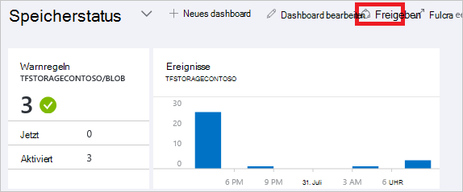
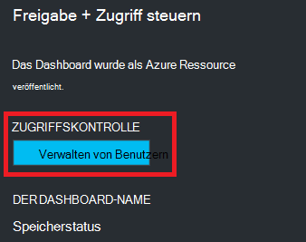
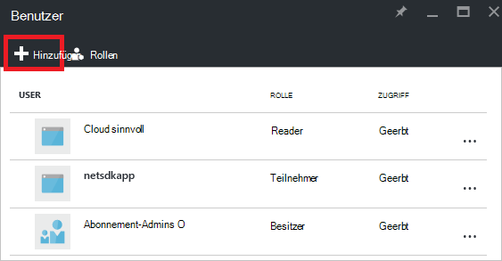
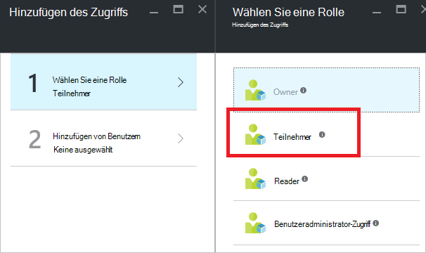
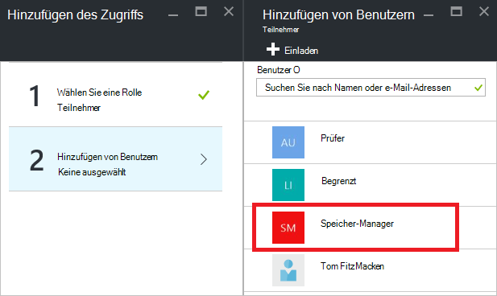
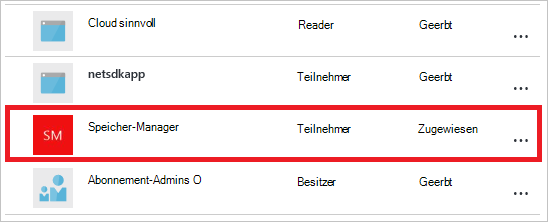

<properties
   pageTitle="Dashboard Azure-Portal Zugriff | Microsoft Azure"
   description="Erläutert, wie einem Dashboard im Azure-Portal zugreifen."
   services="azure-portal"
   documentationCenter=""
   authors="tfitzmac"
   manager="timlt"
   editor="tysonn"/>

<tags
   ms.service="multiple"
   ms.devlang="NA"
   ms.topic="article"
   ms.tgt_pltfrm="NA"
   ms.workload="na"
   ms.date="08/01/2016"
   ms.author="tomfitz"/>

# Freigeben von Azure dashboards

Nach dem Konfigurieren eines Dashboards können veröffentlichen und gemeinsam mit anderen Benutzern in Ihrer Organisation. Andere auf dem Dashboard mit Azure [Rolle Based Access Control](../active-directory/role-based-access-control-configure.md)zulassen. Sie einen Benutzer oder eine Gruppe von Benutzern eine Rolle zuweisen, und diese Rolle definiert, ob die Benutzer anzeigen oder veröffentlichte Dashboard ändern können. 

Alle veröffentlichten Dashboards werden als Azure Ressourcen implementiert die bedeutet, dass sie als verwaltbare Elemente in Ihrem Abonnement vorhanden und in einer Ressourcengruppe enthalten sind.  Aus Sicht Access Control sind Dashboards nicht anders als andere Ressourcen ein Speicherkonto oder einen virtuellen Computer.

> [AZURE.TIP] Einzelne Kacheln im Schaltpult erzwingen eigene zugriffsanforderungen basierend auf den Ressourcen anzeigen.  Daher können Sie ein Dashboard entwerfen, die Allgemein und gleichzeitig die Daten auf einzelnen freigegeben ist.

## Grundlegendes zur Zugriffskontrolle für dashboards

Mit rollenbasierter Zugriffskontrolle können Sie in drei verschiedenen Gültigkeitsbereichsebenen Rollen Benutzer zuweisen:

- Abonnement
- Ressourcengruppe
- Ressource

Abonnement Ressource werden die Ihnen zugewiesenen Berechtigungen geerbt. Veröffentlichte Dashboard ist eine Ressource. Daher bereits möglicherweise Benutzer mit Rollen, die für das Abonnement auch veröffentlichtes Dashboard arbeiten. 

Hier ist ein Beispiel.  Angenommen Sie Azure-Abonnement und verschiedene Teammitglieder die Rollen der **Besitzer**, **Teilnehmer**oder **Reader** für das Abonnement zugewiesen wurden. Benutzer Besitzer oder die Mitwirkenden können Listen, anzeigen, erstellen, ändern oder Löschen von Dashboards innerhalb des Abonnements.  Leser können Benutzer auflisten und Anzeigen von Dashboards, können jedoch nicht bearbeitet oder löschen.  Benutzer mit Lesezugriff können ein Dashboard lokale bearbeiten (z. B. Problembehandlung), jedoch nicht die Änderungen auf dem Server veröffentlichen.  Sie haben die Möglichkeit, eine private Kopie des Dashboards für sich

Allerdings können Sie auch Berechtigungen Ressourcengruppe, die mehrere Dashboards enthält, oder ein einzelnes Dashboard. Beispielsweise können Sie entscheiden, dass eine Gruppe von Benutzern Berechtigungen Abonnement aber Zugang zu einem bestimmten Dashboard haben sollte. Sie weisen die Benutzer eine Rolle für das Dashboard. 

## Dashboard veröffentlichen

Angenommen, Sie haben ein Dashboard mit einer Gruppe von Benutzern in Ihrem Abonnement teilen möchten konfigurieren. Schritte zeigen eine benutzerdefinierte Gruppe mit der Bezeichnung Speichermanagern, die jedoch können der Gruppe beliebig würde. Informationen zum Erstellen einer Active Directory-Gruppe und Hinzufügen von Benutzern zu dieser Gruppe finden Sie unter [Verwalten von Gruppen in Active Directory Azure](../active-directory/active-directory-accessmanagement-manage-groups.md).

1. Wählen Sie das Dashboard **Freigeben**.

     

2. Vor dem Zuweisen des Zugriffs, müssen Sie das Dashboard veröffentlichen. Standardmäßig erscheint das Dashboard eine Ressourcengruppe mit dem Namen **Dashboards**. Wählen Sie **Veröffentlichen**.

     

Das Dashboard ist jetzt veröffentlicht. Aus der geerbten Berechtigungen geeignet sind, brauchen Sie nichts weiter tun. Andere Benutzer in Ihrer Organisation werden Ihre Abonnements auf Grundlage Dashboard zu zugreifen. Jedoch für dieses Lernprogramm wir Zuweisen einer Benutzergruppe eine Rolle für das Dashboard.

## Ein Dashboard Zugriff zuweisen

1. Wählen Sie nach dem Dashboard veröffentlichen **Benutzer verwalten**.

     

2. Sie sehen eine Liste der vorhandenen Benutzer, die bereits für dieses Dashboard eine Rolle zugeordnet sind. Die Liste der vorhandenen Benutzer wird unten abweichen. Die Aufgaben werden wahrscheinlich das Abonnement geerbt. Um einen neuen Benutzer oder eine Gruppe hinzuzufügen, wählen Sie **Hinzufügen**.

     

3. Wählen Sie die Rolle Berechtigungen gewähren möchten. In diesem Beispiel wählen Sie **Teilnehmer**.

     

4. Wählen Sie den Benutzer oder die Gruppe, die Sie der Rolle zuweisen möchten. Wenn Sie den Benutzer oder die Gruppe in der Liste Suchen nicht angezeigt werden, verwenden Sie das Suchfeld. Die Liste der verfügbaren Gruppen hängt von Gruppen in Active Directory erstellten.

      

5. Wenn Sie Benutzer oder Gruppen hinzugefügt haben, wählen Sie **OK**. 

6. Neue Aufgabe wird zur Liste der Benutzer hinzugefügt. Beachten Sie, dass **Zugriff** als **zugewiesene** **geerbt**aufgeführt ist.

     

## Nächste Schritte

- Eine Liste der Rollen finden Sie unter [RBAC: integrierte Rollen](../active-directory/role-based-access-built-in-roles.md).
- Informationen zum Verwalten von Ressourcen finden Sie unter [Verwalten von Azure Ressourcen-Portal](resource-group-portal.md).