<properties
   pageTitle="Azure Portal Dashboards | Microsoft Azure"
   description="Erläutert das Erstellen und Bearbeiten von Dashboards in Azure-Portal."
   services="azure-portal"
   documentationCenter=""
   authors="sewatson"
   manager="timlt"
   editor="tysonn"/>

<tags
   ms.service="multiple"
   ms.devlang="NA"
   ms.topic="article"
   ms.tgt_pltfrm="NA"
   ms.workload="na"
   ms.date="09/06/2016"
   ms.author="sewatson"/>

# Erstellen und Freigeben von Dashboards in Azure-portal

Sie können mehrere Dashboards erstellen und freigeben, die Zugriff auf Ihre Azure-Abonnements.  Dieser Beitrag geht über die Grundlagen der erstellen/bearbeiten, veröffentlichen und Verwalten des Zugriffs auf Dashboards.

## Anpassen von Dashboards und blades

Seit Monaten starten Dashboards gab einen stetigen Blade angepasst und einem raschen Anstieg im Dashboard anpassen. Diese starke Verwendungstrends zeigt bevorzugen Anpassen von Dashboards über Blades. Zur Unterstützung dieser Trend entfernen wir die Möglichkeit, Blades anpassen und weisen unsere Maßnahmen zur Verbesserung der Dashboard-Funktion. Wenn Sie eine-Blade angepasst, wird die Anpassung schnell entfernt. Um diese Anpassung beizubehalten, pin angepassten Kacheln zu einem Dashboard. Dazu einfach auf die Kachel und wählen Sie **Pin Dashboard aus** , wie in der folgenden Abbildung dargestellt.

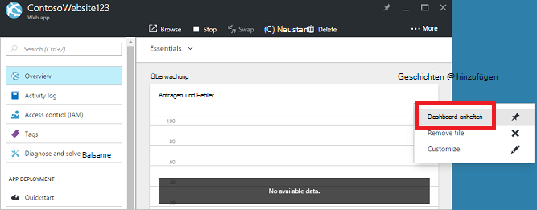

## Erstellen eines Dashboards

Um ein Dashboard zu erstellen, wählen Sie neben Name des Dashboards **Neues Dashboard** .  

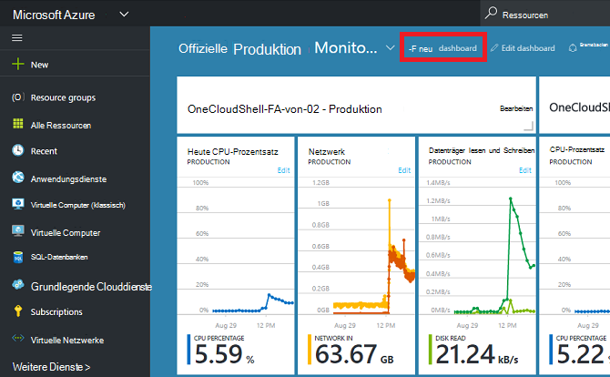

Diese Aktion erstellt ein neues, leeres, private Dashboard und versetzt Sie in Anpassungsmodus können Ihr Dashboard benennen und hinzufügen oder neu anordnen Kacheln.  In diesem Modus übernimmt reduzierbaren Kachel Gallery im linken Navigationsmenü.  Kachel-Gallery können Sie Kacheln für Azure Ressourcen unterschiedlich: finden Sie von [Ressourcengruppe](../azure-resource-manager/resource-group-overview.md#resource-groups), Ressourcentyp, [Tag](../resource-group-using-tags.md)oder die Ressource nach Namen suchen.  

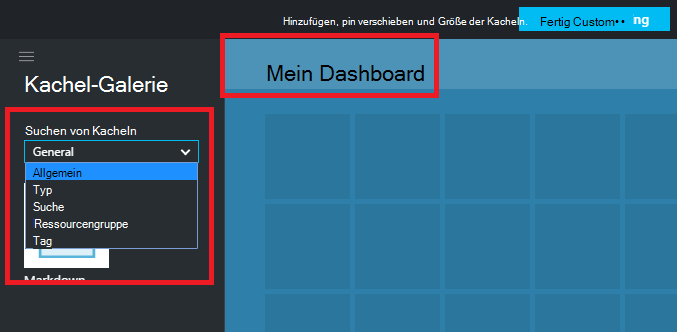

Fügen Sie durch Ziehen und Ablegen auf dem Dashboard überall Kacheln.

Es wird eine neue Kategorie **Allgemein** für Flächen, die keiner bestimmten Ressource zugeordnet sind.  In diesem Beispiel anheften wir Abzug Kachel.  Sie verwenden diese Kachel benutzerdefinierten Inhalt zu Ihrem Dashboard hinzugefügt.  Die Kachel unterstützt nur Text, [Abzug Syntax](https://daringfireball.net/projects/markdown/syntax)und eine begrenzte Anzahl von HTML.  (Aus Sicherheitsgründen nicht Dinge wie Einfügen `<script>` tags oder bestimmte Designelement des Portals beeinträchtigen CSS verwenden.) 

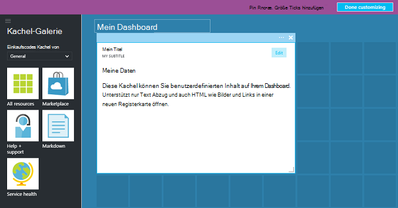

## Bearbeiten eines Dashboards

Nachdem das Dashboard erstellt haben, können Sie aus Galerie nebeneinander oder die Kachel Darstellung Blades anheften. Darstellung unserer Ressourcengruppe wir fixieren. Sie können entweder Pin beim Durchsuchen des Artikels oder die Ressource Blatt. Beide Ansätze führen festhalten Kachel Darstellung der Ressourcengruppe.

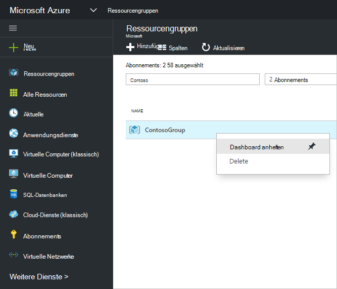

Nach dem Befestigen des Artikels, erscheint auf Ihrem Dashboard.

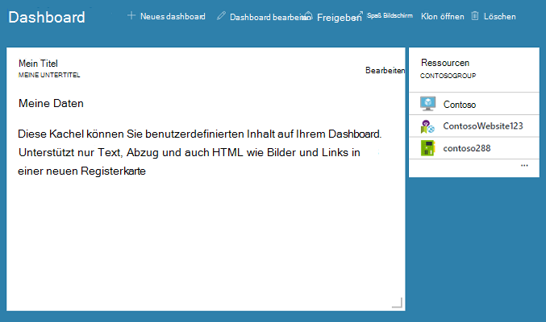

Abzug Kachel haben und eine Ressourcengruppe dem Dashboard fixiert, können wir Größe und Kacheln in ein geeignetes Layout ändern.

Indem bewegt und "..." mit der rechten Maustaste auf eine Kachel sehen Sie Kontextmenüs für diesen Spielstein. Standardmäßig sind zwei Elemente:

1. **Lösen von Dashboard** -entfernt Dashboard die Kachel
2.  **Anpassen** – gibt Modus anpassen

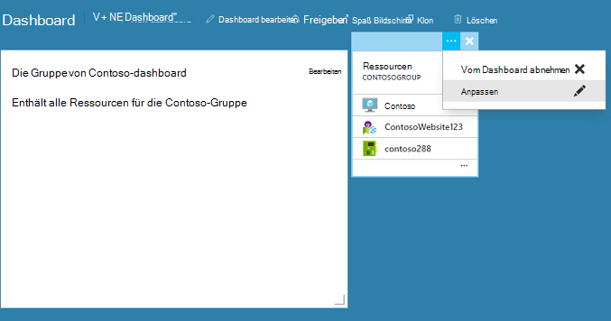

Auswahl anpassen, Größe und Kacheln neu anordnen. Zum Ändern der Größe einer Kachel wählen Sie die neue Größe im Kontextmenü wie in der folgenden Abbildung dargestellt aus.

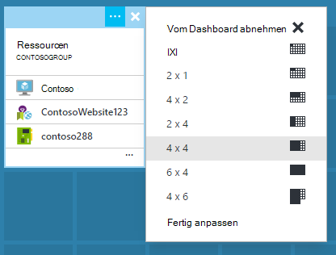

Oder wenn die Kachel beliebiger Größe unterstützt, können Sie unten rechts auf die gewünschte Größe ziehen.

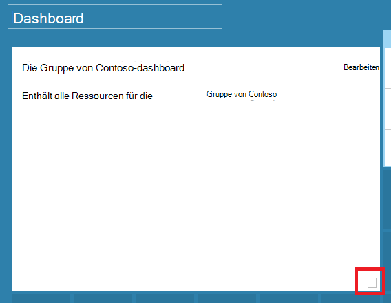

Zeigen Sie nachdem die Größe Kacheln das Dashboard an

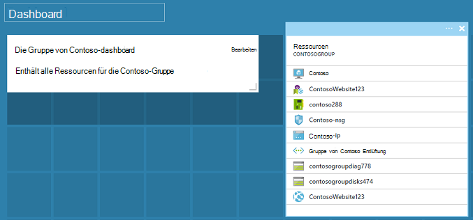

Sobald Sie anpassen Dashboard, wählen Sie einfach das **getan anpassen** beenden Modus anpassen mit der rechten Maustaste und wählen Sie aus dem Kontextmenü **Anpassen ausgeführt** .

## Ein Dashboard veröffentlichen und Verwalten von Zugriffskontrolle

Erstellen eines Dashboards wird privat in der Standardeinstellung sind Sie die einzige Person anzeigen.  Um es für andere Benutzer sichtbar Taste **Freigeben** , die neben anderen Dashboard-Befehle angezeigt.

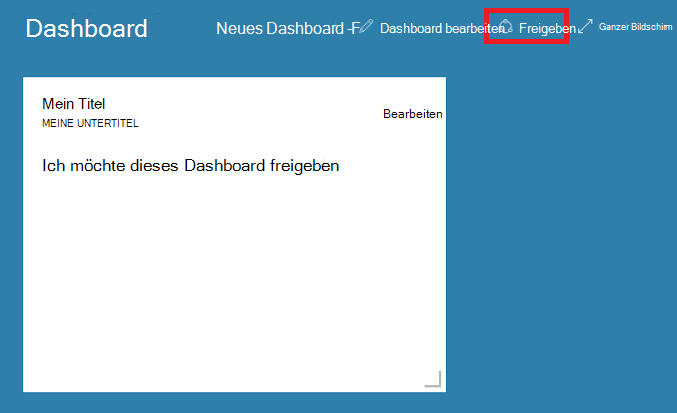

Sie müssen Abonnements und Ressourcengruppe für das Dashboard veröffentlicht werden soll. Um Dashboards in das Ökosystem nahtlos, haben wir implementiert freigegebenen Dashboards als Azure Ressourcen (freigeben kann nicht durch eine e-Mail-Adresse eingeben).  Zugriff auf die meisten Kacheln im Portal angezeigten Informationen unterliegen [Azure Rolle Based Access Control](../active-directory/role-based-access-control-configure.md ). Aus Sicht Access Control unterscheiden sich freigegebene Dashboards nicht von einem virtuellen Computer oder ein Speicherkonto.  

Angenommen Sie haben ein Azure-Abonnement und Teammitgliedern zugewiesenen Rollen **Besitzer**, **Teilnehmer**oder **Reader** des Abonnements.  Benutzer, die Eigentümer oder die Mitwirkenden können auflisten, anzeigen, erstellen, ändern oder Löschen von Dashboards innerhalb dieses Abonnement.  Leser können Benutzer auflisten und Anzeigen von Dashboards, können jedoch nicht bearbeitet oder löschen.  Benutzer mit Lesezugriff können gemeinsame Armaturenbrett lokale bearbeiten, jedoch nicht die Änderungen auf dem Server veröffentlichen.  Sie können jedoch eine private Kopie des Dashboards zur eigenen Verwendung.  Wie immer erzwingen einzelne Kacheln auf dem Dashboard eigene Zugriffsregeln basierend auf den Ressourcen zu entsprechen.  

Der Einfachheit halber führt das Portal publishing Erfahrung Sie Muster platzieren Sie Dashboards in einer Ressourcengruppe **Dashboards**aufgerufen.  

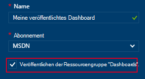

Sie können auch eine bestimmte Ressourcengruppe ein Dashboard veröffentlichen.  Die Zugriffskontrolle für das Dashboard entspricht der Zugriffskontrolle für die Ressourcengruppe.  Benutzer, die Ressourcen in dieser Ressourcengruppe verwalten können, haben auch Zugriff auf Dashboards.

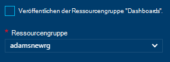

Veröffentlichung Dashboard wird **Freigabe + Access** Control Bereich aktualisieren und Anzeigen über veröffentlichtes Dashboard, mit einem Link zum Zugriff auf das Dashboard verwalten.  Hier wird das standardmäßige Rolle Based Access Control Blade verwendet, um Zugriff für Azure Ressourcen verwalten.  Sie können jederzeit zu dieser Ansicht zurückkehren **Freigabe**auswählen.

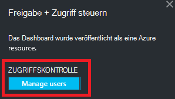

## Nächste Schritte

- Zur Verwaltung der Ressourcen finden Sie unter [Verwalten von Azure Ressourcen-Portal](resource-group-portal.md).
- Zum Bereitstellen von Ressourcen finden Sie unter [Ressourcen mit Ressourcen-Manager und Azure-Portal bereitstellen](../resource-group-template-deploy-portal.md).